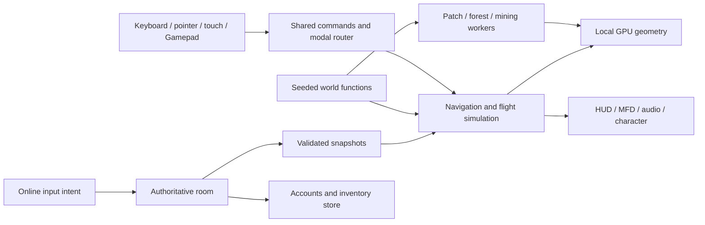

# Architecture and ownership boundaries

This describes the combined development branch, not every public release.
[Status](docs/development/status.md) and the [integration inventory](docs/local-development.md)
identify the difference. The runtime is JavaScript modules, Three.js/WebGL 2,
Vite and a Node/WebSocket multiplayer prototype. TypeScript, WebGPU, native/WASM
simulation and distributed world servers are future decisions, not assumed dependencies.

## Runtime flow

`src/main.js` wires systems. Prefer a module with a small state/command API and
agree its main-loop hook with the steward before editing overlapping lines.

## Source map

| Area | Start here | Preserve |
| --- | --- | --- |
| Aeon and seeds | [world](src/world.js), [terrain](src/terrain-v2.js) | One canonical surface for rendering, collision, placement and resources. |
| Celestial bodies | [moon](src/moon-world.js), [Pyre](src/pyre-world.js), [Miasma](src/miasma-world.js), [bodies](src/celestial.js) | Body-local samples, generator versions and shared precision conventions. |
| Streaming/materials | [planet](src/planet.js), [atmosphere](src/atmosphere.js) | Parent fallback, terrain skirts, local GPU coordinates and matching log depth. |
| Flight/navigation | [navigation](src/navigation.js), [flight model](src/flight-model.js), [travel](src/travel-model.js) | Continuous flight, gear limits and shared flight/drive policies. |
| Ship access | [boarding](src/boarding.js), [walkable ship](src/ship-walkable.js), [freighter](src/freighter.js) | Visible bounds, floors, doors/lifts and swept collision agree; boarding is physical. |
| Controls/UI | [gamepad](src/gamepad.js), [controller UI](src/controller-ui.js), [map](src/system-map.js) | One router, semantic actions, visible focus and neutral arming. |
| Cargo/equipment | [containers](src/inventory/containers.js), [loadout](src/inventory/loadout.js), [equipment](src/equipment.js) | Transactions, compatible slots, physical reach and actual hand/muzzle sockets. |
| Mining/building | [tool](src/mining/tool.js), [building](src/build/) | Geometry-based extraction, bounded edits and atomic material consumption. |
| Online play | [protocol](src/multiplayer/protocol.js), [client](src/multiplayer/client.js), [room](server/room.js) | Server owns limits, hangars, inventory, hits and damage; clients send bounded intent. |
| Accounts/storage | [auth](server/auth.js), [database](server/database.js), [server](server/index.js) | Callsigns, no real-name requirement, hashed credentials/tokens and isolated test databases. |
| Presentation | [character](src/character.js), [effects](src/effects/energy-effects.js), [audio](src/audio.js) | Presentation cannot grant damage/inventory; audio starts after a gesture. |
| Assets | [Blender](blender/), [production standard](docs/asset-production-standard.md) | Rebuildable source, provenance, named-node contracts, measured export and game review. |

## Precision and world changes

Positions are metres in JavaScript doubles relative to the planet centre.
Aeon's radius is 1,592,750 m; the sun is 25,000,000,000 m away. Subtract the
camera origin **before** writing Float32 positions, instance matrices or shader
data. Geometry remains local to its object or patch.

Seed equality alone is insufficient across generator changes. Persist/exchange
the seed and generator/protocol version. A changed generator must define how old
saves, resources, structures and authoritative collision remain compatible or
reject unsupported versions explicitly. Compare workers and server against the
same reference samples. Never replace deterministic world generation with ambient
randomness or browser-time-dependent state.

Custom geometry shaders include the Three.js log-depth chunks; atmosphere reads
that convention. A build cannot prove shader compilation, origin precision,
streaming continuity or physical clearance. Those require runtime evidence.

## Offline and online boundaries

Core exploration remains usable offline without accounts, keys or hosted services.
Local online play uses a 30 Hz authoritative room capped at ten players, with
authoritative Nomad and full-size Atlas cargo hulls. The separately configured
public multiplayer release retains its twenty-player cap. PostgreSQL with Prisma stores accounts and inventory;
the shared preview starts a dedicated persistent local PostgreSQL instance.
Memory storage is an explicit test option. Local building and the full offline
fleet are not automatically replicated.

Online inventory, economy, placement, mining and combat must validate identity,
reach, ownership, quantities and world version server-side. Define idempotency,
reconnects and durable failure handling before granting valuable state. Remote pose
interpolation must not become hit authority.

## Adding a system

Write its inputs, state owner, events, update cadence, disposal, worker format and
failure behavior in the brief. Identify overlap with existing modules/tests. Use a
[decision record](docs/templates/decision.md) for a changed contract. A narrow
inspection route helps production but does not replace the actual playable journey.
