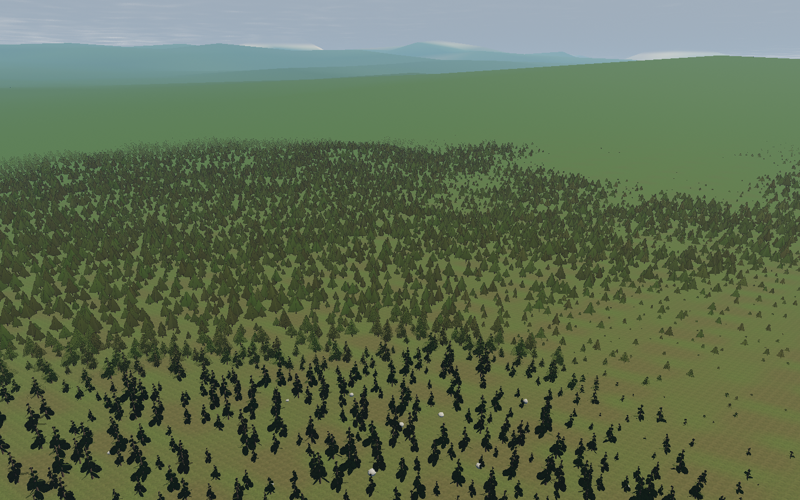
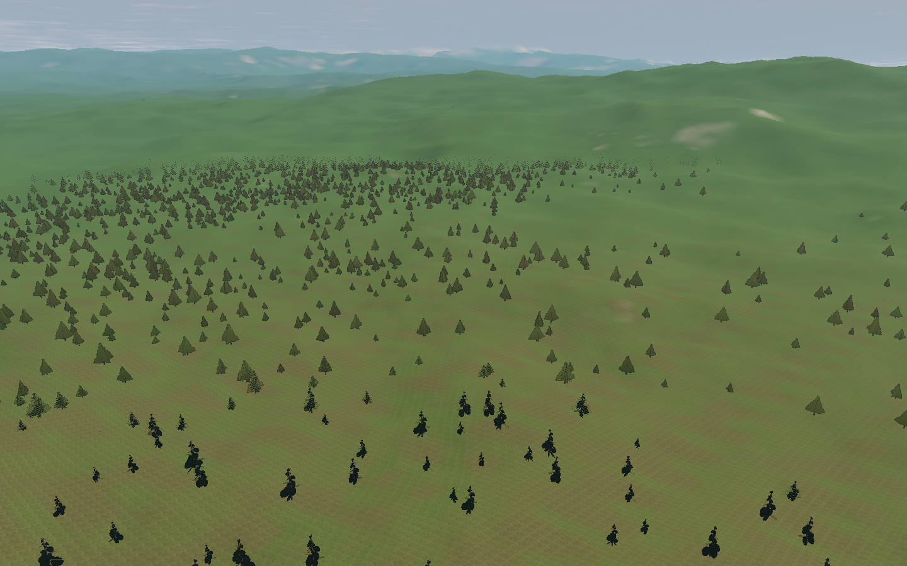
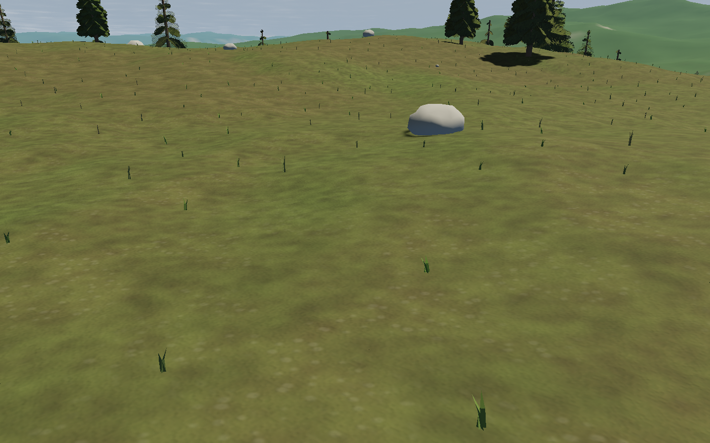

# Forest streaming and seeded groves

Branch `feat/forest-streaming` is based on `feat/hard-ground-crashes` (PR #2).
The source changes are limited to vegetation/tree LOD and three new forest modules;
controller, ship, navigation, water and terrain changes are separate branches.

The previous forest sample contained 40,998 trees and 8,993 grass tufts. At the same
seed 7291 aerial pose, this branch contains 7,381 trees and 3,056 grass tufts:
about 82% fewer trees and 66% fewer grass tufts. Counts are local candidates, not
pixel-visible trees or a global density guarantee. Overlapping LOD counts include
the same tree in two representations during a transition.

Forest layout version 2 places deterministic groves on 16 m cells. A worker generates
approximately 256 m tiles, one request at a time. Camera movement reprioritizes
queued tiles and retains resident content; stale transit replies are discarded.
The renderer adopts at most four tiles per frame and fades new trees and their
shadows over 0.8 seconds. Grass/rocks have separate cached terrain samples and
appearance/distance fades. GPU updates upload only the live portion of instance
buffers. Terrain generator version 2 and its collision floor are unchanged.

Validation passed: 57 unit tests, the production forest inspection and all four
standard browser cases. Commands: `npm test`, `npm run test:browser -- -c scripts/forest.config.js`,
and the standard `npm run test:browser` regression suite. The forest case checks
tile reuse over 150 m (16 additional tiles), all three tree representations, and
zero browser console/page errors. Images are inspected at native 1440×900;
Chromium 151 uses ANGLE/Vulkan SwiftShader. This is not a hardware FPS benchmark.
Detailed captured state and environment are in `/tmp/star-agent-forest`.

Before:

After:

Ground:

Local preview: http://localhost:5175/?seed=7291, run by the user service
`star-agent-forest-dev.service` from the isolated worktree. Click the forest
destination for a quick comparison, then fly around the groves. Regular flight
and seed sharing retain their existing behavior.

Remaining limits: distant trees are still crossed cards, tree range is still 1.4 km,
and terrain LOD changes are not morphed. Tile arrivals still rebuild the resident
instance lists; observed CPU rebuilds at the sampled settled poses were about
1–2 ms on this machine, not GPU frame timings. Releasing the ship clearing can
restore already-aged trees immediately, and an origin rebase can change wind
phase. Advanced ocean, tree-asset, terrain-material and cascade-shadow experiments
are not integrated by this branch. The images still fall short of the fidelity target.
