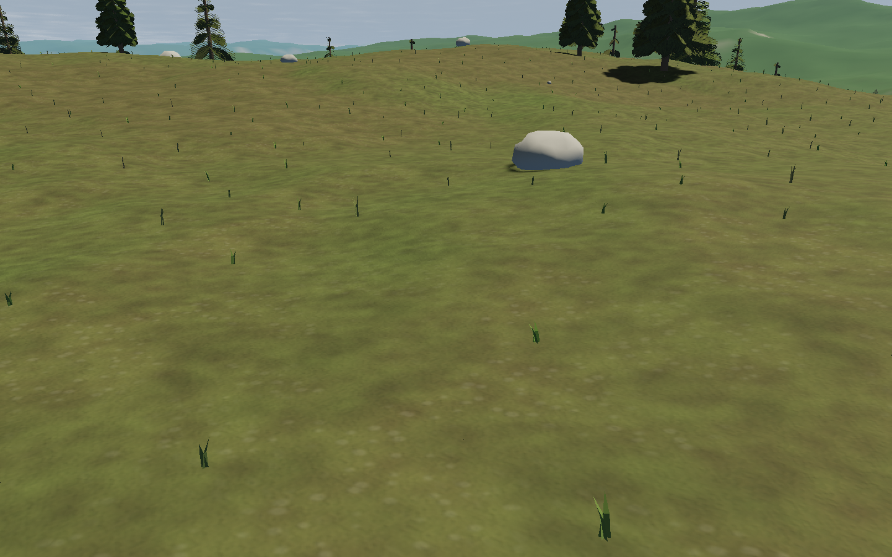
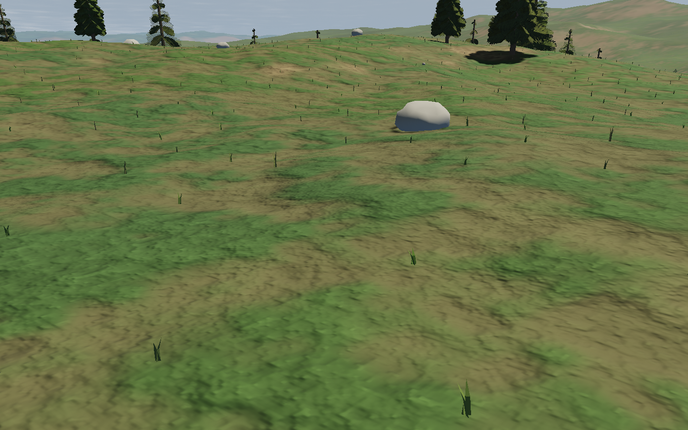
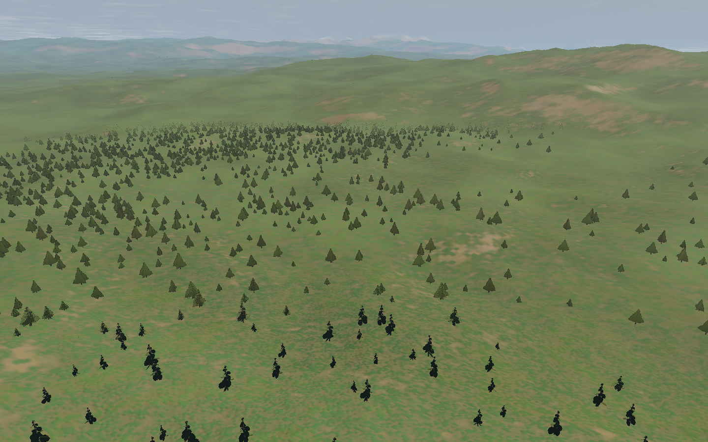
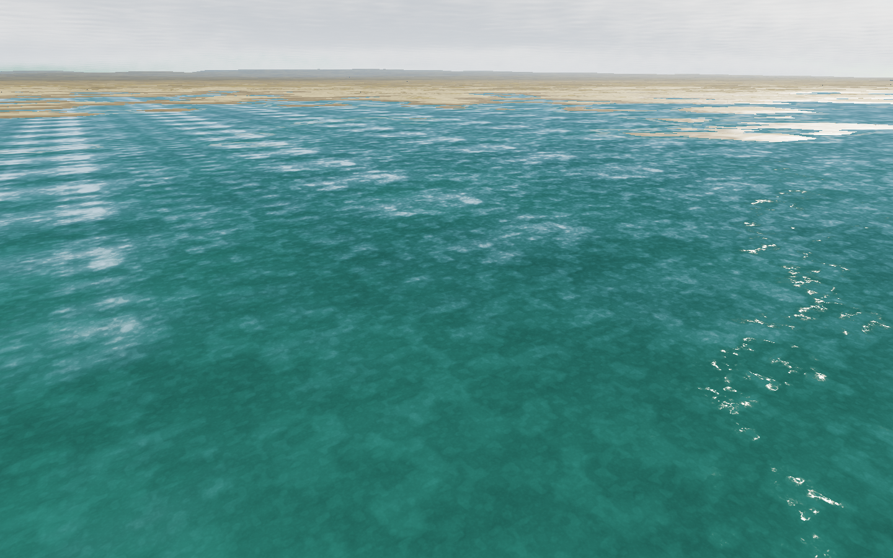

# Terrain transitions and ground detail

`feat/terrain-transitions` is stacked on forest PR #6. It preserves the seeded
groves and crash behavior from that branch; parallel controller/ship/re-entry
changes need their own integration. Shared source files were not edited.

The terrain quadtree previously replaced a parent with four finer meshes in one
frame. Children now start on the parent's actual triangles and ease into finer
geometry over 0.6 seconds of wall time. Retreat collapses descendants first,
reverses that interpolation, then restores the parent. Split uses 1.8 times patch
width and merge uses 2.3, avoiding oscillation at the threshold. The parent stays
until all four child meshes exist and have been resident for two update frames.
This residency gate is not an explicit GPU pre-upload pass.

`world.js` emits parent positions, normals, colours, heights and sea-level
positions alongside the original fine buffers. Targets reproduce the parent's
Float32 triangle vertices, including the b–c grid diagonal; interpolation and
origin subtraction happen in CPU doubles before child-local Float32 conversion.
Skirts remain. Land shading, water and terrain shadows use the same per-patch
morph value, and bounds include both endpoints. Water meshes remain present when
the parent contains water and the child resolves dry land. Terrain heights,
collision, destinations and terrain generator version 2 are unchanged.

The active land renderer now uses `terrain-material.js`: grass/soil patches,
stratified rock, shoreline sand, snow and ice with analytic relief gradients and
roughness. Noise cells wrap at 2²² before float upload; this fixes precision loss
in the 6 cm octave while keeping detail stable through origin movement. Two
descending shader masks were corrected to use defined GLSL smoothstep ranges.
The old packed ground texture module remains available, but Planet no longer
allocates or samples it. Water retains its previous optical material, with morph
support added to geometry and shore depth.

Patch materials share the planet albedo and detail uniforms. Do not clone the
configured template: Three's material clone serializes userData, which includes
the 1024×512 colour texture. A focused regression guards against this expensive
per-patch serialization.

Validation passed: 69 unit checks, the production terrain/ground inspection,
the focused shallow-water inspection and four standard Chromium browser cases.
A separate baseline run captured the same forest poses before the material change.
The original fine geometry buffers also match the forest branch byte-for-byte
across eight low/high-LOD fixtures. Commands:

```sh
npm test
npm run test:browser -- -c scripts/terrain.config.js
TERRAIN_SHORE_ONLY=1 npm run test:browser -- -c scripts/terrain.config.js
npm run test:browser
```

Unit tests cover independent parent-triangle reconstruction at coasts, cube-face
edges and high LOD; skirt coverage; worker transfer/seed agreement; hysteresis;
time-based morph/reversal; four-child fallback; recursive collapse; shader hooks
and resource sharing. The production browser inspection records active morphs,
checks land/water material wiring, descends to ground detail and visits shallow
water. Its comparison camera waits for rendered frames after moving before
checking the streaming state. Set `TERRAIN_BASELINE_URL` to compare an older build.
Images are native 1440×900 on Chromium 151 / ANGLE Vulkan SwiftShader; detailed
state and backend metadata are saved under `/tmp/star-agent-terrain`.

Ground before:



Ground after:



Aerial after:



Shoreline after:



Preview: http://localhost:5176/?seed=7291, served from the isolated worktree by
`star-agent-terrain-dev.service`. Choose the forest destination and fly down to
see the surface. Regular flight still crosses the atmosphere continuously.

Limits: transitions are temporal, not a globally stitched distance morph.
Adjacent LODs still rely on skirts; fast travel can outrun streaming and display
coarse fallback. During that refinement, objects placed at the exact terrain
height can briefly appear above/below the coarser rendered surface. The richer
near-ground shader costs more than the previous material; no hardware FPS claim
is made from software rendering. Tree silhouettes, broader shadows, reflected
scene water and higher quality vegetation assets remain separate fidelity work.
This is a working visual improvement, not the full Star Citizen fidelity target.
