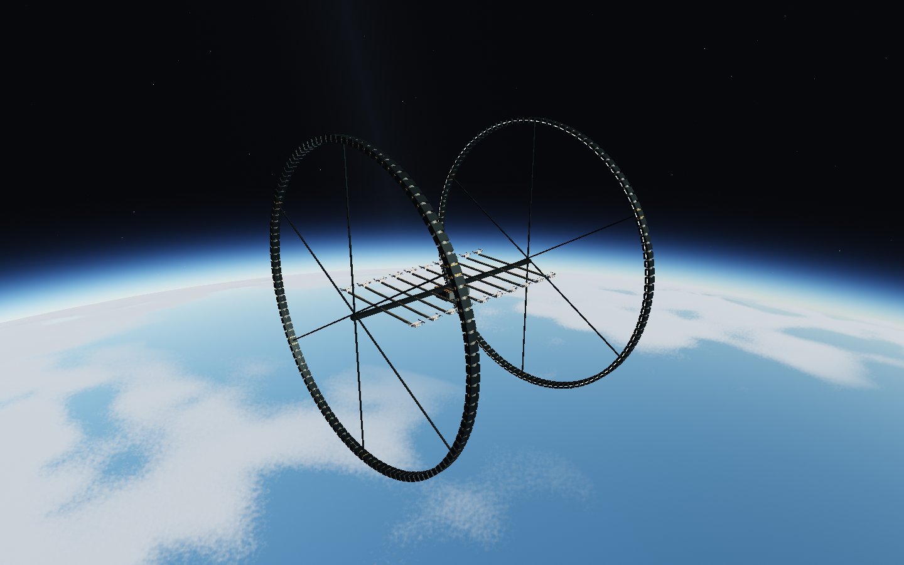
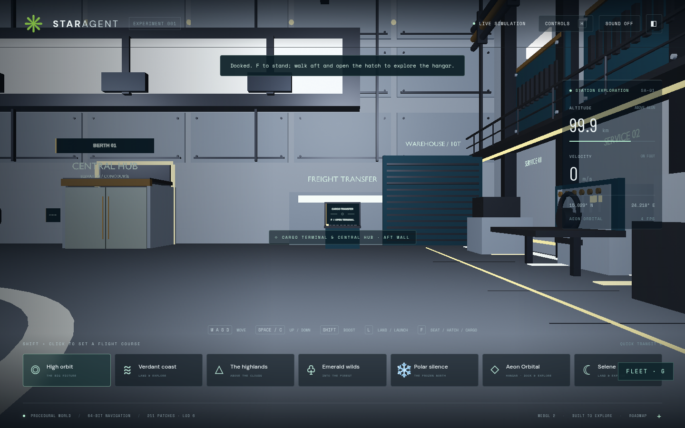
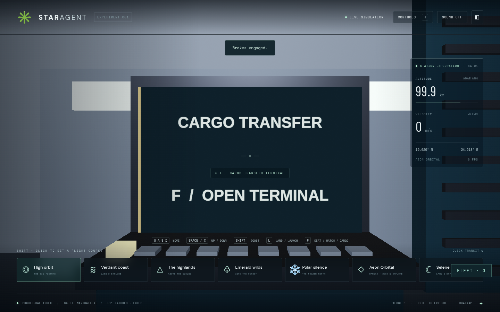
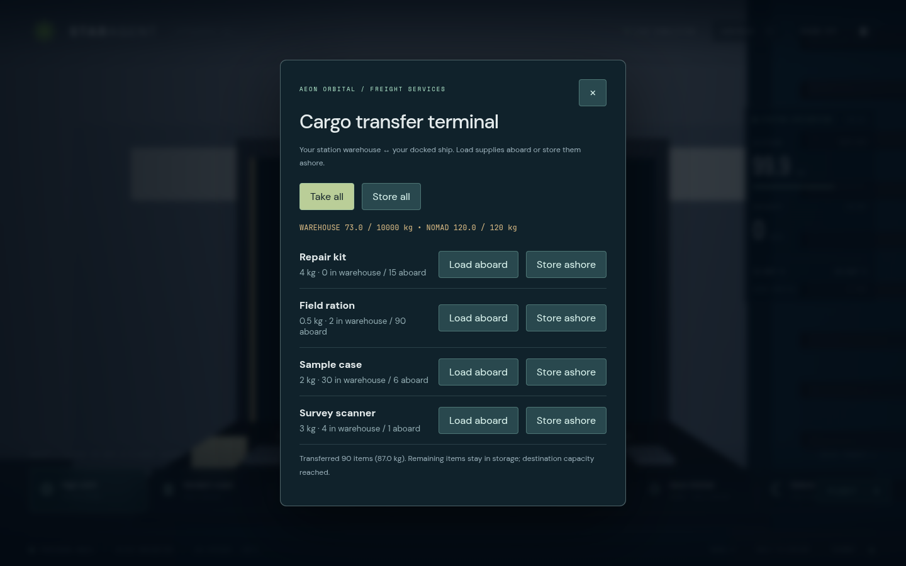
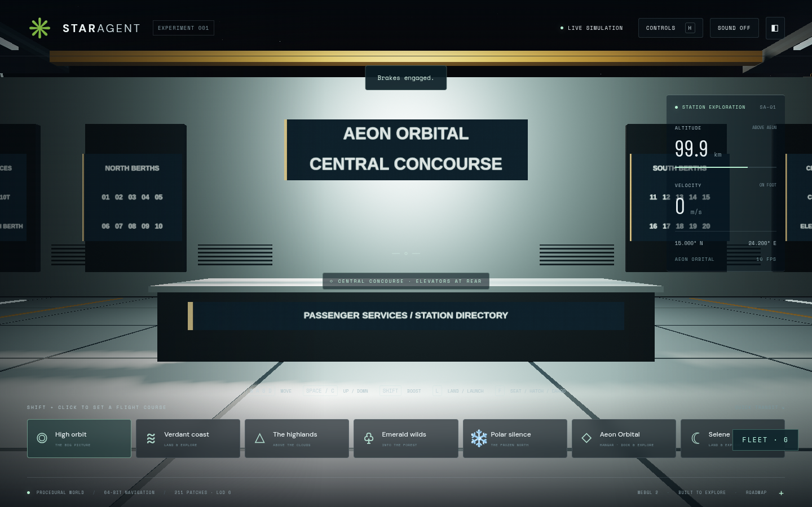
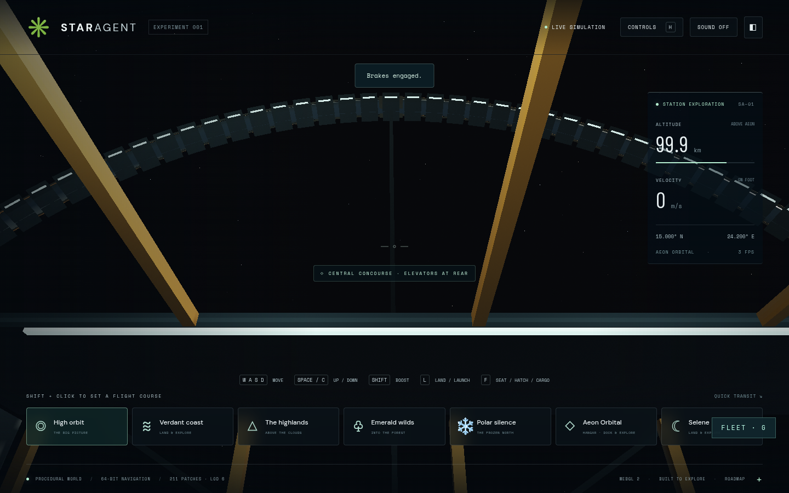

# Aeon Orbital: twenty berths and a central concourse

A Port Olisar-inspired industrial station built from original procedural geometry.
The revised Blender hangar adds layered wall and ceiling panels, overhead utility
pipes, service workbenches, wall hose reels, cargo shutters, a cargo terminal and
an elevator vestibule. The walking aisles stay clear of floor cables.

## Explore

1. Choose Aeon Orbital for the optional exterior approach, or Shift-click to set
   a course and fly there continuously. W enters the open hangar, X brakes and L
   docks over the pad.
2. F leaves the chair. Walk aft; use Nomad's hatch/ramp or Atlas's belly elevator
   to reach the hangar deck.
3. Follow the side aisle to the aft cargo terminal. F opens ship/warehouse
   transfers. Take all respects ship capacity and leaves excess stock ashore.
   The ship crate's Take all transfers to your backpack instead.
4. F calls the aft passenger elevator. Walk inside, press F and choose Central
   hub. Walk out into the concourse; the elevator can take you to any of the
   twenty numbered berths or back to the bay marked Your ship.
5. Your ship and its inventory remain parked. Return to the original berth,
   physically board, sit at the controls and launch with L.

## Implementation limits

The twenty berths share geometry, materials and one collision tree. Nearby bays
use the detailed Blender model; distant bays use shared instanced batches. Each
bay retains its own door animation and docking frame. Two 1,450 m radius rings
rotate in opposite directions at 0.00045 rad/s. Ring and hull sweeps use local
coordinates; renderer groups are rebased from double-precision world positions.

This provides reusable physical bays for future multiplayer work. It does not
implement networking, player reservations, an economy or authoritative inventory.
The warehouse is a local browser save with starting supplies. Ring interiors and
catwalks remain scenery. Passenger elevators are explicit teleport transitions;
regular flight and ship boarding retain their physical movement.

The source/rebuild and integration contracts are recorded in
[STATION-PIPELINE-MEMORY.md](../STATION-PIPELINE-MEMORY.md).

## Verified on this branch

81 unit tests passed. All seven production browser cases passed across the main
run and focused station rerun: Nomad/Atlas journeys and fallbacks, cargo bulk
transfer and persistence, hub/berth-20 elevator travel, ring rendering, and
station approach/dock/boarding/departure. The station test's old two-row phone
expectation was corrected for the existing seven-destination layout.

Images were inspected in Chromium 151.0.7922.173, ANGLE SwiftShader, 1440×900
with full render scale for capture. No page/shader errors were reported in the
successful graphics cases. This is correctness evidence, not a hardware FPS
benchmark. The local preview is `http://127.0.0.1:5220/`; deployment is separate.
