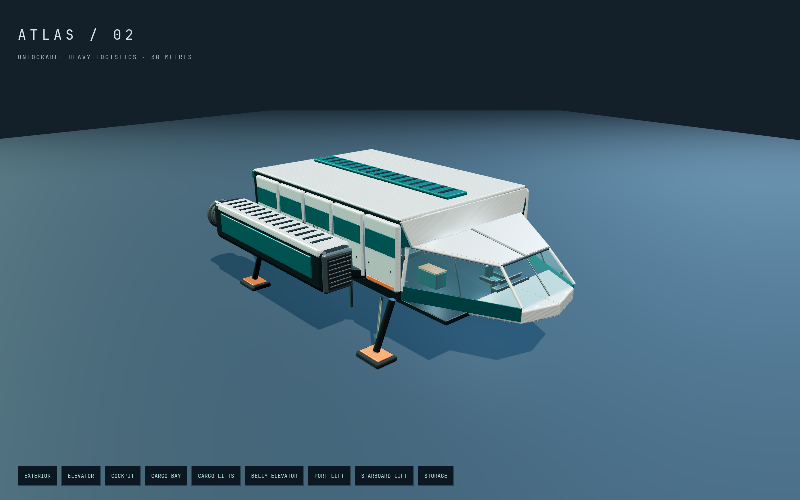
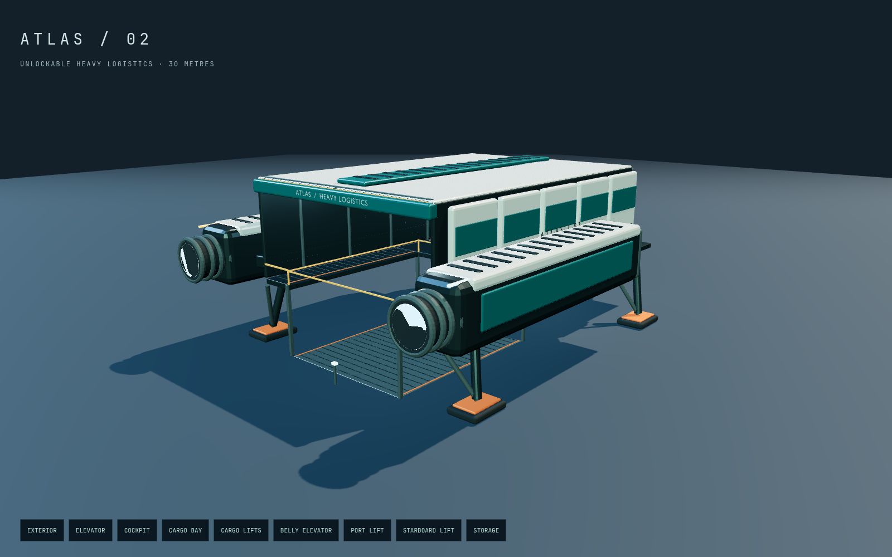
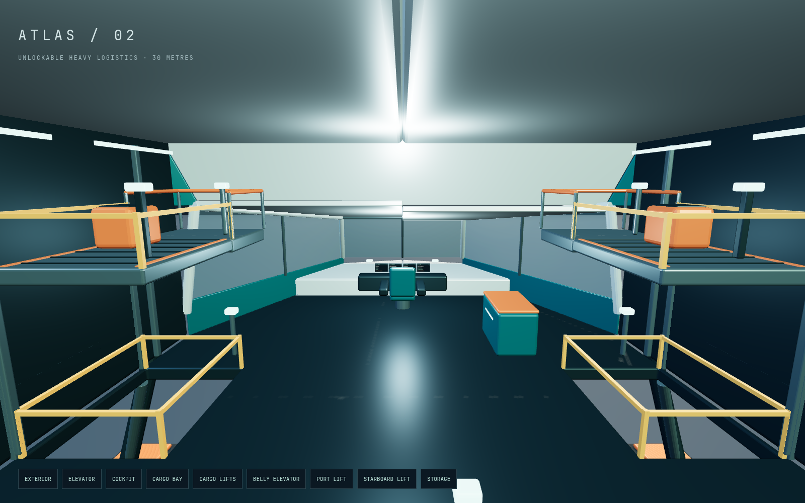

# Atlas heavy logistics

Atlas is a separate unlockable ship. New players begin in the Nomad. Land on
Aeon or Selene and then dock at Aeon Orbital to unlock Atlas. Quick transit to an
approach is allowed, but you still have to land and dock. Press **G** or select
**Fleet**, then choose Atlas while seated at the station. Unlock progress and
the selected ship persist in this browser. No account or external service is used.

Atlas has a 30 m collision envelope, 19 m beam, a cargo deck 4 m above the landing
plane, 2,400 kg of inventory capacity, and four live rectangular MFDs. The familiar
flight, landing, station docking, walking, inventory, controller and assist controls
remain available. Supplies transfer with you when changing ships. Switching to the
120 kg Nomad is refused if the current cargo exceeds its capacity.

## Cargo elevator and lifts

Stand with **F** and walk aft to the control pedestal near the front of the large
platform. **F** lowers the entire **8 × 10 m belly elevator** to ground level.
Stay on the platform while it moves, then walk off its rear edge. Return aboard
and use the same control to raise it. Fixed call stations are provided at the
upper front landing and behind the lowered platform. The rear segmented hatch
opens with the elevator. Raised guards block walking into an empty shaft.

Two **2.2 × 3 m cargo lifts** flank the forward cargo bay. Each carries a secured
freight case and a rider between the main deck and a 7 m upper landing. Use the
platform control with **F** to raise or lower it. The upper landing is reached
through the lift's forward edge; use the inner side of the platform to pass the
secured case. Call controls are available at both landings. A lift cannot start
while you straddle its edge or reverse midway through travel. Stow the main
elevator and lower both small lifts before launch.

The orange-lidded starboard chest ahead of the lifts opens the shared inventory
with **F**. Take/stow transfers preserve every item. The physical cases on the
small lifts are secured props; there is no loose-crate pickup, forklift, commodity
market, mission economy, item consumption or cargo-mass flight model in this change.
The initial unlock is an exploration milestone, not a paid purchase.

## Authoring and integration

- Builder: `assets/ship/build_freighter.py`.
- Editable source: `assets/ship/atlas.blend`; runtime asset: `public/models/atlas.glb`.
- Coordinates: ship-local metres, +Y up, -Z forward. No world coordinates enter the GLB.
- Required moving nodes: `MainLift`, `PortLift`, `StarboardLift`, `CargoLid`.
- `src/freighter-layout.js` owns lift travel, walk support, rider displacement,
  inventory collision and ship dimensions. Navigation uses `nav.layout`; the
  Nomad's original `SHIP_LAYOUT` remains the default.
- `src/freighter.js` renders the shared lift state. It never advances a separate
  lift clock. It retains matching fallback floors/platforms if the GLB fails.
- Station sweeps use separate Atlas hull, nacelle and gear bounds so the open
  underbody does not catch the raised landing-pad detail. Dock eligibility checks
  the whole ship's bounds. Centre the hull on the pad; its pilot sits far forward.
- `src/fleet.js` stores the exploration milestone and selected ship under
  `star-agent.fleet.v1`. The existing Nomad manifest key is retained for continuity.
  Invalid unlock saves cannot unlock Atlas; unavailable storage remains usable for
  the current session and is disclosed in Fleet/inventory.

Rebuild with:

```sh
env ALSOFT_DRIVERS=null blender --background --factory-startup -noaudio --python-exit-code 1 --python assets/ship/build_freighter.py
```

Run `npm run dev` and open `/dev/freighter.html` for an orbitable model viewer with
exterior, bridge, cargo bay and lift controls. `/dev/ship.html` includes the refined
Nomad seat and its unobstructed windscreen. Both are development routes.

## Verification

```sh
npm test
npm run build
npm run test:browser -- -c scripts/freighter.config.js
npm run test:browser -- -c scripts/freighter-studio.config.js
npm run test:browser -- -c scripts/nomad-refinement.config.js
```

Unit tests exercise unlock ordering, persistence, inventory conservation, all
three lift riders, shaft guards, ship assets and station docking/launch interlocks.
Production browser tests set reproducible landing/docking approach fixtures, then
use normal controls to unlock/select Atlas, ride all lifts, walk onto the hangar
deck and back aboard, transfer inventory, return to the chair and launch. They
also exercise missing assets and the original Nomad journey. These do not claim
an uninterrupted orbit-to-station voyage without fixtures.

The visual checks use Chromium with ANGLE/SwiftShader, 1600 × 1000 studio and
1440 × 900 game viewports. Game walking runs at 0.4 render scale and curated
screenshots at 1.0. These are render correctness checks, not hardware FPS claims.
Browser page errors and shader errors are collected. Generated reports remain in
`/tmp`. Verified 2026-09-06: 76 unit tests, build, four production browser checks and two studio checks passed. [PR #14](https://github.com/AvonMexicola/star-agent/pull/14) is submitted for manager review; it is not deployed.





The complete reusable workflow is in [Ship pipeline memory](../SHIP-PIPELINE-MEMORY.md).
