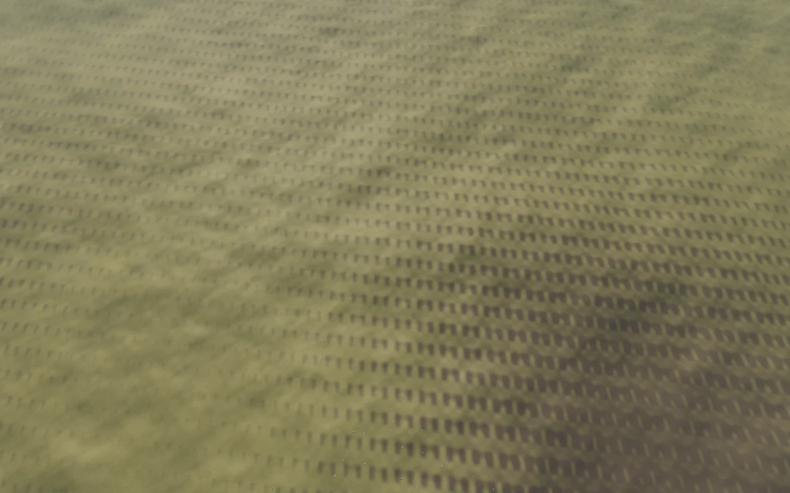
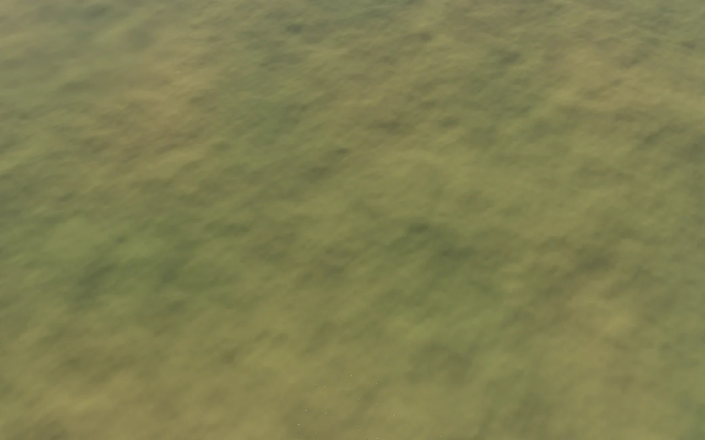
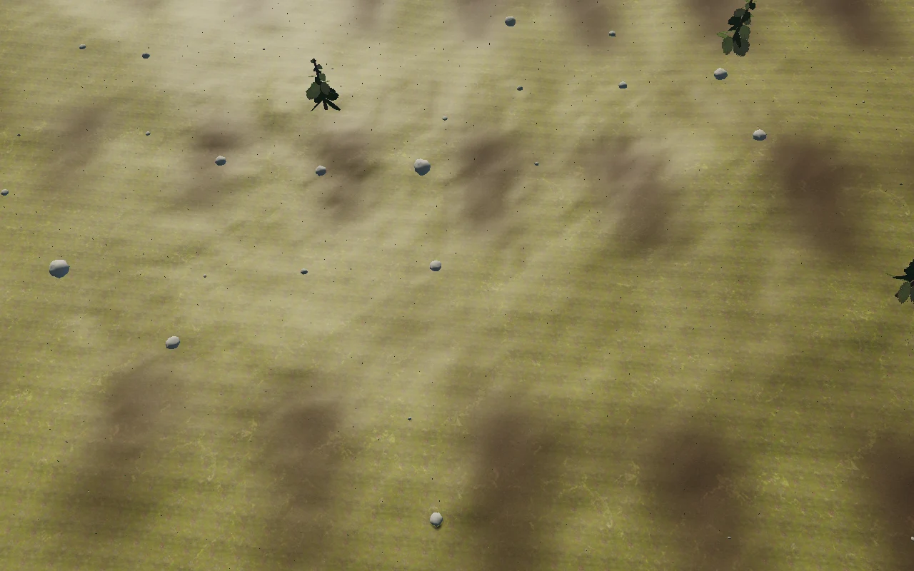
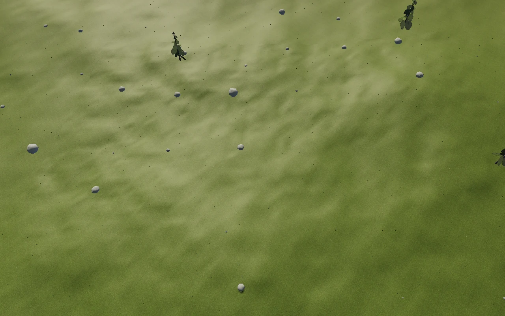
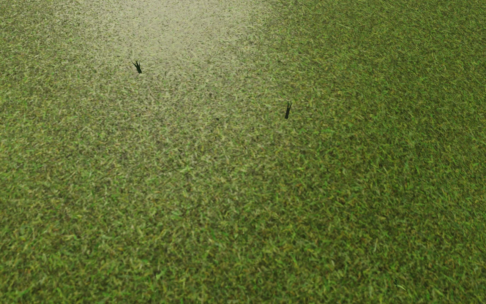
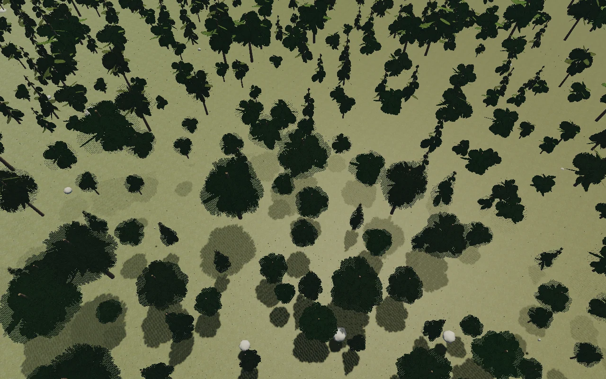
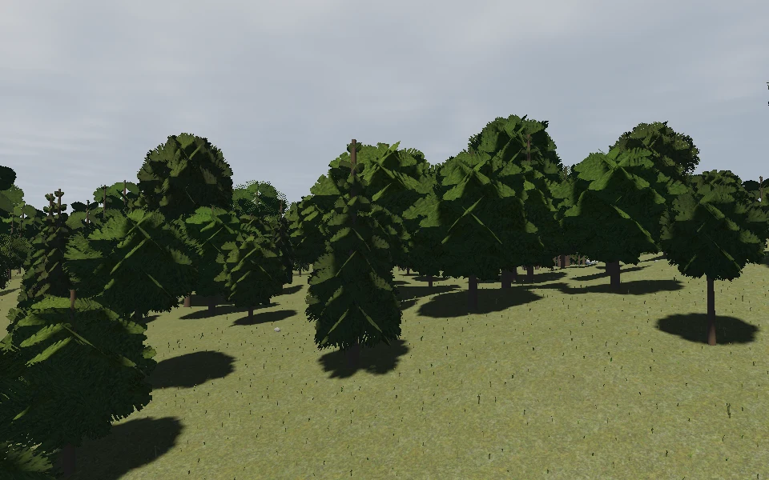
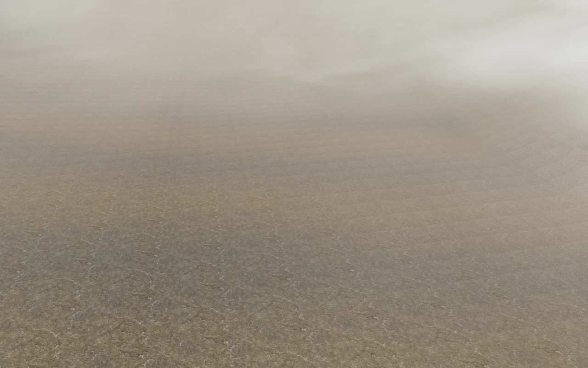

# Meadow materials and mixed tree stands

The reported meadow at 15.74° N, 22.44° E showed regular dark rows between 1.4 km
and 100 m. A 64 m rock texture modulated every ground material, including grass.
This pass removes that multiplier from Aeon and uses body-anchored, nonperiodic
vegetation patches for flight-scale variation. Fine material detail fades between
80 and 700 m instead of remaining prominent out to 4.5 km.

Four additional ambientCG CC0 materials supply meadow grass (Grass004), forest
leaf litter (Ground028), alpine scree (Gravel001) and snow (Snow010A). They join
soil, cliff rock, moss and shoreline sand in the existing shared texture arrays.
Height, slope, canonical biome colour and irregular cover fields blend the layers.
Forest litter is inferred from the darker canonical lowland colour; this is not
an exact tree-shadow or canopy-coverage map. No terrain or collision height changes.

Source links, hashes and packing details are in
[the material credits](../public/materials/terrain/CREDITS.md) and
[manifest](../public/materials/terrain/manifest.json). Gravel001 has no roughness
map, so its packed roughness uses a documented .94 matte scalar. The eight-layer
atlas pair downloads 8,690,219 bytes and uses approximately 21.33 MiB with mipmaps,
up from 4,547,913 bytes and 10.67 MiB. The original four layers remain pixel-identical,
including the maps Selene uses. Everything is bundled locally.

## Tree variety and approach

Temperate stands mix three procedural crown forms: narrow conifer, high-crowned
pine and rounded broadleaf. Each has near geometry, reduced middle geometry and
a distant silhouette generated from the same crown profile. Broadleaf cards use
elliptical leaves; conifers retain needles. Cell hashes keep species, height,
width, yaw and tint stable through rebuilds and origin rebasing. Cold and elevated
stands favour conifers.

The existing complementary distance fades remain at 95–140 m and 360–460 m, with
the outer tree fade at 1200–1400 m. The distant-only .55 instance tint multiplier
was removed and its crown shading brought closer to near-tree shading. This
reduces a source of brightness change during approach. Distant trees still use
crossed cards: parallax and silhouette changes can remain visible.

Species have separate instanced batches and silhouettes, increasing maximum tree
draw batches from five to fifteen. Instance buffers retain the previous per-batch
capacity so mixed or conifer-heavy stands do not lose trees to a smaller budget.
Actual placement density is unchanged. This adds allocation and draw-call cost;
software-rendered checks do not establish hardware FPS.

## Reproduction and evidence

Preview: <http://localhost:53740/>. Use seed 7291 and the reported coordinates, or
select the forest destination to inspect the mixed crowns.

```sh
npm test
npm run test:browser -- -c scripts/biome-surfaces.config.js --project=after
```

The material tour captures the reported meadow at 1400, 500, 100 and 5 m, followed
by forest, coast, mountain and polar destinations. A second test checks mixed
species from three approach positions. PNGs, exact camera state and browser
metadata are under `/tmp/star-agent-biomes/`. Biome captures use Chromium with ANGLE
Vulkan SwiftShader at 1280×800 and render scale 1; streaming uses .5. The final
tree approach check uses 960×600 at render scale 1.

The tree checks verify distinct crown profiles, consistent near/middle height,
reduced middle geometry, deterministic species selection and unchanged coverage
through the distance fades. Atlas prefix comparisons verify that none of the
original four source layers changed.

Verified on 6 September 2026: `npm test` and the production build pass. The eight
biome captures, three-position tree approach and corrupt-atlas fallback check
pass without browser errors. The first combined browser run completed the biome
tour but was interrupted before its last tree capture; the isolated tree rerun
completed in 4.1 minutes. Browser: Chromium 151.0.7922.173, ANGLE Vulkan SwiftShader.

| Meadow view | Before | After |
| --- | --- | --- |
| 1.4 km |  |  |
| 100 m |  |  |





