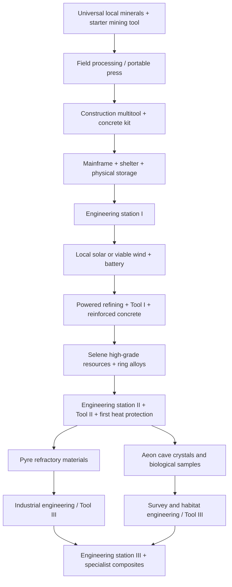

# Base building: shelter, mainframes and interplanetary engineering

Design plan · 2026-09-06 · requested by Cees. This specifies proposed gameplay,
not implemented construction, recipe balance, hazards or multiplayer enforcement.
It supersedes the starter-kit-only sequence in
[cargo and the base mainframe](cargo-and-base-mainframe.md) and the mandatory
wood → stone → metal ladder in the older roadmap. Existing inventory, equipment,
mining and controller contracts remain the foundation.

For the implemented first slice and exact current limits, see
[Field materials and base construction](../base-building.md). The roadmap below
still includes unimplemented engineering, power, survival and multiplayer work.

## The first experience

Land, scan nearby deposits, mine common minerals, process construction material,
place a mainframe, and build a small base with actual doors and usable stairs.
Store the remaining materials, leave in the ship, and return to the saved base.
The next objective is an engineering station and reliable electricity. Advanced
tools then give the player reasons to travel and bring valuable cargo home.

Every buildable world must support basic construction from local resources.
Worlds differ in abundance, processing efficiency and specialist resources.
High technology requires materials from multiple destinations, but concrete,
basic doors, storage and the initial mainframe must never require that travel.
This availability promise does not make a hazardous planet safe in a starter suit.
Aeon is the forgiving home-world start. Selene and Pyre may be substantially
harder: local self-sufficiency means a viable route with suitable equipment and
logistics, not equal effort, equal deposit density or equal safety on every world.

## First construction kit

Use a 4 m grid with 3 m storeys, aligned to local gravity at the site's origin.
These are prototype dimensions, to be verified against the character, door
interaction and ship scale before authoring the final kit.

| Piece | First version |
| --- | --- |
| Foundation | Square levelling foundation with bounded leg/height adjustment; triangle foundation |
| Floor / flat roof | Square and triangle floor panels; the same supported panel can cap a room |
| Wall | Full-height wall and half wall, with distinguishable inside/outside faces |
| Doorway | Wall with a standard opening; separate manually operated door and basic lock |
| Window | Wall opening plus separately fitted basic mineral-glass pane |
| Stairs | Straight staircase joining storeys, matching landing and railing; no jump required |
| Access / support | Entry ramp, support column and foundation skirt |
| Utility objects | Mainframe, storage crate and portable materials press |

Start with mineral-concrete construction. Wood panels become a local Aeon option,
not a mandatory universal tier. Later upgrades replace a piece in place: concrete
→ reinforced concrete → alloy → specialist composite. Keep compatible sockets and
door clearances so an upgrade does not require dismantling the whole base.

Placement shows the piece, sockets, cost, claim boundary and a written rejection
reason. Snap mode is the default; foundations can rotate before defining the grid.
Validate terrain support, span, overlap, door swing, stair headroom and the player's
capsule. A piece must not intersect a ship, protected landing area or another base.
Do not allow placement that traps the character inside its new collision.

Foundations anchor a support graph. Walls and columns carry upper floors; stairs
require supported endpoints. Use explicit maximum spans initially, not a complex
structural simulation. Removal previews dependent pieces and rejects leaving them
unsupported. A triangle is not automatically equivalent to a full support column.

The first shelter is walkable storage and cover. Airtight rooms, oxygen, thermal
protection and pressure doors require a later verified enclosure/habitat system;
four visible walls must not silently become a safe Pyre habitat.

## Mainframe: the tool cupboard equivalent

The mainframe is a physical, interactable object with three functions: building
authority, a site overview, and an explicitly selected construction-supply buffer.
It does not create unlimited base storage or let players withdraw distant cargo.

- Place the first core directly on valid ground to claim the site; requiring a
  foundation first would create a dependency loop. A later supported floor can
  host it. Prototype claim: 64 m surface radius and 32 m build height, configurable
  after scale tests. Test complete piece bounds, not only their pivot points.
- One core per claim. Reject overlapping claims and protected locations. Store a
  stable body ID, claim ID and local gravity frame. Expansion must revalidate the
  entire new boundary; upgrading cannot engulf a neighboring base.
- Owner manages the core, membership and site settings. Builder may place, repair
  and upgrade. Demolition is a separate grant. Visitor has no construction rights.
  Door access, storage access and engineering-station use are separate permissions.
- Construction consumes the backpack or the explicitly enabled mainframe buffer
  within the same claim. The preview names its sources. Filling that buffer is a
  real transfer from the backpack, nearby ship or local crate, with access/range
  checks. A network/storage upgrade can later connect additional physical crates.
- The core UI shows permissions, boundary, piece count, supply contents, connected
  storage and eventually power consumers/upkeep. Use tabs in the shared inventory
  dialog, with the same box and stack rules as ships and backpacks.
- The basic core retains ownership and ordinary lock records without grid power.
  Power loss pauses machines; it never makes the base ownerless. Core upgrades add
  monitoring, networks and larger validated sites, not a maintenance ransom.
- First release: no offline decay, raids or destructible mainframe. Only its owner
  can pack up an empty site. Later upkeep uses common local repair materials and
  visible reserves/grace time; define destruction, inheritance and recovery before
  enabling raids. A shield is a separate later technology, not a claim property.

The initial local-save implementation has one local owner. Preserve stable member
IDs and operation permissions in the design, but multiplayer rights must later be
checked by the authoritative server, including craft and storage transactions.

## Common materials on every world

Define a **universal construction resource family** in every buildable body's
geology. It is a deliberate world-generation requirement. A barren or icy world
still needs accessible mineral outcrops; the player must not need a rare drill to
reach the only feedstock needed to build that drill.

| Local feedstock | Processing / product | Basic uses |
| --- | --- | --- |
| Ordinary stone or mineral regolith | Crush and grade → aggregate and mineral fines | Concrete bulk, foundation fill |
| Binder-bearing mineral seams | Separate → dry mineral binder | Concrete bonds, repair compound |
| Common iron-bearing rock | Reduce / work → basic metal stock | Door hardware, reinforcement, tools |
| Common copper-bearing rock | Separate / refine → conductor stock | Mainframe, motors and basic wiring |
| Ordinary silica-bearing rock | Process → ceramic stock, basic glass and crude solar substrate | Insulation, windows, starter electronics and solar |

Common does not mean every rock contains every item. The scanner identifies
nearby construction-feedstock clusters independently of the rich resource colors.
One cluster can supply several common fractions; specialized outcrops produce
better yields. Universal trace copper does not diminish Selene's rich copper fields:
bulk conductor production should be much faster there.

**Concrete bootstrap:** use a fictional dry mineral-concrete process in a sealed
portable press. Proposed balance unit: 8 kg aggregate + 2 kg dry binder → 10 kg
construction mix, with no water consumed. This is a gameplay material abstraction,
not a claim about ordinary terrestrial concrete chemistry. Aeon's water-based
cement can become an efficient local alternative. Dry construction remains valid
in vacuum and on hot worlds; exposure limits still apply to the player and equipment.

Provide the starter mining tool with a slow, rechargeable field-processing mode
for the universal feedstocks. Basic plans and a simple construction multitool are
known at spawn. A portable press assembles from common stock and improves batch
throughput; it must not require the engineering station it helps construct. Its
low-output field operation uses the existing tool energy abstraction initially,
without introducing a hidden fuel or grid dependency. When finite tool batteries
arrive, provide a craftable local-material solar charger and a recoverable battery
before retiring that abstraction. Night changes charging, not ownership or doors.

Recipe graphs must prove that all first-base inputs, including crude control parts
for the core, can be made from this common family with field tools. Electronics
recipes are intentionally coarse at Tier 0. High-purity circuits remain advanced.
Publish ingredient mass, recoverable byproducts, power and throughput for each
recipe before implementation; do not award multiple fractions from the same mass.

**Availability acceptance:** designated Aeon starter sites have reachable,
Tier-0-mineable common feedstock within a proposed 300 m route. Selene construction
surveys may require up to roughly 1 km of travel between complementary deposits;
Pyre may spread supplies across several surveyed sites and require ship hauling.
These are initial pacing targets, not settled map-wide distance guarantees.
For every integrated world, demonstrate at least one repeatable local-material
route yielding a 2×2 single-storey shelter, core, crate, portable press, basic door
and window, plus a 25% material margin. No imported rare ingredient may be hidden
in that budget. Test many designated sites/seeds before expanding the availability
claim beyond verified routes. Recipe costs, finite node reserves and actual route
hazards must agree; straight-line proximity is insufficient. Elsewhere, scan locates
a viable construction site rather than promising deposits under every landing
point. Exhausted clusters direct players onward; returning, saving or moving the
mainframe never respawns their ore.

Do not price solid 4 m concrete slabs as a handful of backpack kilograms. Model
the initial kit as visibly ribbed/hollow panels and filled foundations, then tune
mass, yields and transport together. Building a room should involve understandable
cargo trips or a stocked local buffer. More crates add slots, not ship payload.

## Where travel becomes worthwhile

The entries below are proposed resource assignments. Current integrated mining
has basalt, copper and ice; new products and regional tables require implementation.
Pyre has a separate planet-development branch, whose canonical body/geology must
be used when integrated. Do not invent another surface sampler here.

| Destination | Locally self-sufficient basics | Export worth travelling for |
| --- | --- | --- |
| Aeon | Stone, binder minerals, common metals/silica; optional timber and water | Cave crystals for sensors; biological membranes for advanced filtration; efficient bulk settlement production |
| Selene | Mineral regolith, binder-bearing outcrops, common metals and silica | Rich copper provinces; high-grade optical minerals; concentrated ice for cooling and life support |
| Selene rings | Mineable rock feedstocks in eligible rocky bodies; infrastructure later | High-purity nickel/iron fractions and rare alloy catalysts; industrial EVA mining |
| Pyre | Dry mineral feedstocks and common metal outcrops at viable construction sites | Refractory minerals and fictional heliometal for heat-resistant cutters, machinery and high-output systems |
| Future buildable worlds | Must pass the universal construction test | At least one distinct specialist resource/use before adding another ore list |

Reserve high-grade optical material for selected Selene regions; Aeon cave crystals
remain a separate specialist resource. Avoid making a generic crystal item unlock
everything. Every exclusive material needs a named useful recipe and a readable
geological/scan signature. Exact rarity and exchange prices are not set here.

First Pyre protection must be manufacturable from Aeon/Selene common and expedition
materials. A short Pyre trip then returns better refractory material for longer
expeditions. Upgrades must not require the destination they are needed to enter.
Likewise, the basic EVA kit reaches ring deposits before ring alloys improve it.

### Different settlement difficulty

| World | What makes building different | Why establish a base there? |
| --- | --- | --- |
| Aeon · accessible start | Frequent common feedstocks, forgiving designated sites, optional timber/water processes, useful wind plus solar | Learn construction, run bulk fabrication and prepare expeditions |
| Selene · expedition settlement | Scattered complementary deposits, exposed slopes, vacuum, solar interruptions and no wind generation; storage and shipping matter | Refine rich copper and ice beside the source; support ring expeditions |
| Pyre · specialist outpost | Heat-limited work periods, protective suits, selected buildable terrain and separated supply sites; reliable cooling and power become essential for habitation | Process valuable refractory ore locally and reduce repeated hazardous trips |

Ordinary construction feedstocks remain harvestable with the basic cutter's
material capability, even where the operator needs advanced environmental gear.
Later machinery improves throughput. Do not label common stone a rare tool-tier
resource merely to make Pyre difficult. Different ore grades can require more
mining and produce more declared waste; the same recipe does not arbitrarily cost
extra solely because the player crossed to another planet.

A builder can choose between slowly establishing local processing or importing
prefabricated materials for a faster outpost. Keep the local path viable. A Pyre
shell provides storage first; a truly habitable base needs the later thermal and
enclosure systems. Do not require these unimplemented systems in the first basic
placement slice or pretend that its walls already provide their protection.

## Tools, engineering stations and the technology tree

Tool tiers control cutting capability, heat, precision and throughput. Engineering
station tiers control manufacturing processes. Neither is simply a character XP
level. Keep mining and construction tools in the existing tool slot; swapping
uses the equipment screen and explicitly cancels held firing/build actions.

| Tier | Mining / construction tools | Station and useful technology |
| --- | --- | --- |
| 0 · Field | Starter mining laser recovers every common feedstock; basic construction multitool places/repairs the first kit | Portable press; concrete, manual doors, basic windows, core and crates; no research gate |
| I · Settler | Better cooling and yield handling; construction tool upgrades to reinforced concrete | Engineering station I: manual assembly, basic electrical parts, solar/wind/battery, powered press and common refining |
| II · Expedition | Precision cutter for harder specialist seams; alloy welding head | Engineering station II: purified materials, alloy structures, improved batteries, survey equipment, first Pyre protection |
| III · Specialist | Refractory industrial cutter or precision survey head; composite construction head | Engineering station III with industrial or habitat modules: advanced solar cells, heat-resistant machines, sensor arrays and composite structures |

Upgrading mining gear must never multiply the fixed mineral mass remaining in a
rock. Improve speed, reach into tougher material, recovery efficiency within the
deposit's budget, or heat management. Specialized heads have costs in power,
weight and cooling rather than replacing every previous tool unconditionally.

Engineering station I is a workbench assembled from local stock and crude controls.
Its manual assembly recipes produce the first generator and battery. Only its
powered refining/automation modes need grid power: this avoids the circular
requirement of needing electricity to manufacture the first source of electricity.
Station II/III upgrade the existing bench and accept visible process modules.

Use practical research milestones: build and repair a room, deliver stable power,
refine a new material class, analyze a returned off-world sample. Show the recipe's
knowledge, workstation, material and power prerequisites separately. Basic shelter
plans are always known. Avoid paid rerolls, idle research timers and compulsory
craft/dismantle grinding. Preserve learned knowledge independently of lost cargo.

## Power stations and distribution

Build solar arrays and small wind turbines as physical objects, then connect them
to a battery/distribution box and named consumers. Start with explicit cable ports,
length limits and visible connections; no invisible planet-wide power network.

- **Solar:** common-material low-efficiency panels are available locally on every
  buildable world. Output follows incident sunlight, orientation, obstruction and
  eclipses. Darkness means no generation. Later purified cells improve output per
  area. Pyre needs verified heat handling, not a free bonus from brighter sunlight.
- **Wind:** basic turbines are useful on Aeon where the atmosphere/wind model gives
  sufficient density and speed. They produce nothing on airless Selene. A thin
  atmosphere must be evaluated; do not promise useful wind power everywhere merely
  because a body is not airless. Model site exposure before height bonuses.
- **Battery:** common local materials support a heavy starter battery. Rare
  chemistry improves energy density and durability; it does not gate first storage.
- **Loads:** show current generation in kW, stored energy in kWh, demand and
  estimated runtime. Time estimates use measured current conditions. Let players
  prioritize future life support, then essential equipment, then optional refining.
- **Failure:** insufficient power pauses work with reserved ingredients retained.
  Manual doors and ownership still function. Timed jobs need persisted progress;
  the first release should avoid unverifiable offline production or decay.

## Shared interface, controls and implementation boundaries

Add Build to the command menu. In explicit build mode, left/right sticks move/look,
RT places once, LT cycles available snap targets, LB/RB rotate, D-pad up/down adjusts
foundation height, X opens the piece palette, and B cancels/exits. A retains jump;
View/Menu retain their dialogs. These contextual bindings suppress mining, firing
and quick-item shortcuts, require neutral input on transitions, and show hints.
Initial construction is planetside; do not overwrite EVA thruster controls with
an unimplemented orbital building mode. Keyboard and touch use the same actions.

Mainframe and engineering station screens extend the shared storage dialog with
Build, Recipes, Research and Power views as appropriate. Show source containers,
cost, selected output container, job state and the precise reason an action is
unavailable. Presets must cover required naming/permission actions on controller;
custom text entry is optional until an on-screen keyboard exists.

Implement modular meshes and socket graphs rather than a planetary voxel rewrite.
Use a double-precision body/site origin and local piece transforms; rebase only
for GPU uploads. One piece definition owns render geometry, sockets, support and
collision dimensions. Extend navigation's ground/support queries to actually walk
on elevated floors and stairs instead of snapping back to the radial terrain.
Apply the same canonical terrain/building collision to mining and weapon queries.

Before construction economics, generalize the current three-mineral save without
dropping old cuts, ammo, gear or boxes. Current edited-rock limits are insufficient
as an unexamined building economy: establish a bounded persistent deposit-edit
budget/chunk store and collection strategy that supports the starter material
budget, without restoring depleted deposits when they leave memory.

Proposed modules: `src/build/` for definitions, sockets, validation, support and
preview; `src/crafting/` for recipes and transactions; `src/power/` for networks;
extend the existing item registry and save authority. Place/upgrade/repair/dismantle
must atomically update costs, piece state, storage and refunds. Preview is advisory;
commit rechecks ownership, support, source access and inventory. Loaded crates
cannot vanish through demolition. Failed writes and duplicate activation must
leave recoverable state without duplicating resources.

## Delivery order and completion tests

1. **Construction mechanics:** finite development kit; first piece set, core claim,
   door, window, stairs, support/collision and physical crate. This is the first
   implementation, not a complete material economy. Controller-build a two-storey
   test shelter, traverse its staircase/door, store cargo, fly away and reload it.
2. **Locally supplied base:** universal geology, field recipes, portable press,
   construction multitool and mass/capacity balancing. Replace the free kit in
   normal play. Mine and construct the complete 2×2 starter base on each integrated
   buildable world from local materials; test recipes for dependency cycles and
   deposits for sufficient finite recoverable yield. A Pyre fixture may supply the
   already-earned protective suit, but must disclose that survival prerequisite.
3. **Engineering and power:** station I, solar, viable wind, batteries, cable grid,
   powered common refining and Tool I. Craft the first power source without prior
   grid power; prove night, calm wind, outage, resume and exact energy accounting.
4. **Expedition technology:** station II, Tool II, distinct Selene/ring products and
   first heat-protection route. Mine, transport, refine, research and install a
   demonstrably useful upgrade with no duplication or circular travel gate.
5. **Specialist settlement:** Pyre/cave branches, station III, advanced structures
   and habitat simulation; multiplayer authority and raid/upkeep rules are separate
   explicitly tested milestones before enabling shared claims or destructive raids.

Every phase needs a complete controller journey plus keyboard/touch regressions,
held-action suppression across dialogs/focus/disconnect, meaningful invalid-action
feedback, save/reload/streaming and quota rollback. Sample geography at poles,
seams, extreme slopes and multiple world seeds; reject unsafe build sites rather
than promise terrain flattening. Inspect real GPU captures of placement, interiors
and stairs. Set a measured initial piece cap; the roadmap's 1,000-piece ambition
is not a performance guarantee. Physical Xbox testing is reported separately.

## First mining-skill and hauling slice

Mining progress is a saved player stat alongside cargo and edited rocks: only
successfully collected ore awards XP. The first implementation shows levels and
progress in the shared inventory, with 100 XP per collected kg and an increasing
threshold per level. It grants no automatic yield bonus or research bypass.
Later perks should improve deliberate choices such as scanning, cutting precision
and heat management; they must preserve the need for tools, stations and travel.

The starter backpack holds 48 kg of materials in eight slots, with 16 kg material
stacks. A second box doubles mass and slots. Typical whole rocks recover about
8–14 kg of concentrate, so even the starter can finish several before depositing.
The original large test rock is about 22.55 kg. Existing collected cargo keeps its
amounts when recovery balance changes; no retroactive skill credit is inferred.

Physical ship storage has a prominent **Deposit all resources** action, shared
across keyboard, controller and touch. Raw and processed materials move together;
equipment, ammo and medical supplies stay with the player. Capacity or save failure
retains the entire load. More ship boxes and physical base crates provide capacity
for longer expeditions; they do not grant remote access from the surface.

## Miasma: proposed biological and chemical materials

Miasma is Pyre's toxic moon in the separate `feat/pyre-toxic-moon` lane (PR39).
Its current survey palette identifies sulphur, silicate and copper across Vitriol
Basin, the Pale Eye, Verdigris Sea and Brimstone Crown. Those named seas are mineral
basins, not implemented liquid planes. Build on that chemical identity first;
fungal thickets, corrosive pools and biological caves are proposed future regions,
not existing creatures or harvest systems. Miasma itself is not integrated into
this construction branch. Keep basaltic or equivalent common stone available for
local aggregate, binder, basic metal and glass. Specialty materials improve later
technology; none is required to establish the first manual outpost elsewhere.

| Material | Where and how to obtain it | Useful progression |
| --- | --- | --- |
| Brimstone crystals | Mine sulphur-rich ridges around Brimstone Crown | Sealant chemistry, fertilizer for later habitat agriculture, filter reagents |
| Verdigris salts | Extract coloured mineral crust in copper-rich basins | High-grade conductors, catalysts and corrosion-resistant coatings |
| Sporeweave | Cut fibrous fungal trunks; seal harvested bundles | Replaceable toxin filters, light insulation, flexible suit armour |
| Caustic brine | Pump acid pools into corrosion-resistant canisters | Advanced metal refining, industrial batteries, chemical processing |
| Lumen resin | Tap glowing growths in shaded ravines and caves | Emergency lighting, optical components, energy weapon upgrades |
| Mycelium culture | Take living samples from intact colonies | Medicines, regenerative sealants, self-repairing construction composites |
| Void pearl | Recover rare nodules from deep caves or dangerous native creatures | High-sensitivity sensors and advanced scanning equipment |
| Blackglass | Mine dark mineral crust around chemical vents | Acid-resistant equipment linings and durable reactor ceramics |

Each harvest should play differently: cut fibres with the existing cutter, tap
resin without destroying its host, pump brine using a fluid tool, and preserve live
cultures in a powered sample box. Creature loot is an alternative source for rare
pearls; preserve a difficult exploration source so combat is not the only route.
Use visible fungal forms, pool colours and vent crusts to communicate likely yields
before landing, with scans confirming abundance. A coloured region increases the
chance of its corresponding deposits but does not award materials from ordinary
terrain or guarantee a safe landing.

Proposed equipment sequence: sealed sample containers → replaceable suit filters
→ acid-resistant outer layer → engineering-station containment → deep-cave field
kit. Filters consume crafted cartridges; improved filtration extends an expedition
without making the starter suit unusable everywhere. Brine remains dangerous when
stored: only rated tanks can hold it. Living cultures require containment capacity;
ordinary ore still uses the shared mass-and-slot inventory. Do not introduce hidden
per-item rules—show container requirements and remaining protection in the UI.

Miasma's export role is biological protection, chemistry and advanced sensing.
It imports high-temperature components from Pyre and precision/cryogenic parts
from Selene. This creates tradeoffs between building a small local extraction camp
and hauling raw materials to a developed Aeon base. Power, habitat seals, enemies,
biological hazards and specialty recipes need their own tested implementation.
