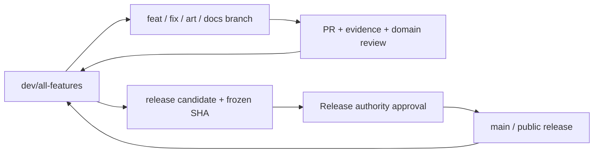

# Branch stewardship

The integration steward owns the **queue and combined result**, not every feature.
Cees retains product/release authority. See [governance](../../GOVERNANCE.md).
The [initial triage record](branch-triage.md) identifies existing stacked PRs and
active lanes; refresh its evidence before cleaning up a branch.

## Branch flow

The intended contributor default is `dev/all-features`: new clones see the current
handbook and PRs target the shared test build. `main` remains the release line.
Repository settings must be verified separately; a Markdown rule or CODEOWNERS file
cannot protect a branch by itself. See [settings and activation](repository-settings.md).

## Beginning a lane

1. Fetch current refs; inspect issues, PRs, `npm run branches` and HANDOFF.
2. Agree the player result, roadmap milestone and dependencies. For a small fix,
   the issue/PR can be the brief; larger changes use the feature template.
3. Claim exact paths/areas in HANDOFF. A structured entry in `project/tasks/` can
   make ownership discoverable to tooling. Existing lanes are not automatically
   reclaimed just because they predate the register or their agent is idle.
4. Create an isolated branch/worktree from the current integration head. Record
   the base SHA, worktree, preview port and any intentional stacked parent.
5. Read affected source/tests. Coordinate shared hooks before touching `main.js`,
   navigation, world generation, manifests, schemas or the main loop.

A claim is cooperative coordination, not a filesystem lock. Two clones can still
edit the same file; the steward resolves overlap before integration. Claims become
inactive when their status is `integrated`, `released`, `parked` or `cancelled`.
A stale timestamp is a prompt to contact the owner, never permission to steal work.

## Integrating a ready change

- Confirm the source commit and base/dependencies. Fetch before evaluating it.
  A studio asset may be ready for local inspection while its flight integration
  remains explicitly pending.
- Read the diff and evidence, including known failures, save/protocol changes,
  source provenance and whether the real controller journey was exercised.
- Merge into a temporary integration branch/worktree first when overlap is substantial.
  Reconcile contracts explicitly. Never take one older `main.js`/world module wholesale.
- Run checks for the combined result. If resolving a conflict changes behavior,
  rerun its relevant checks; source-branch tests alone no longer establish it.
- Integrate serially into `dev/all-features`, preserving commits and authorship.
  Prefer merge commits for substantial feature lanes and explicit back-merges;
  a documented squash is acceptable for a small self-contained change. Do not
  squash away the only retained asset source or provenance.
- Refresh the owned local preview, confirm its source/health and update the source
  table and handoff. Label unfinished art, offline-only features and inspection routes.

CI checks protect integration readiness; independent art acceptance remains a
release gate. Cees has authorized coherent feature checkpoints in the local build.
Do not interpret that as permission to expose broken paths without a flag or
pretend an unfinished journey is complete.

## Queue and branch hygiene

`npm run branches` is read-only. It reports local/remote refs, ancestry relative to
the selected integration branch, whether a branch is checked out and task claims.
Ahead/behind counts are commit counts, not proof of semantic equivalence. Squashed
or cherry-picked work may appear ahead after integration; confirm its actual diff.

Prioritize broken integration, security/data-integrity defects, ready dependencies
and contributor-blocking reviews before opening more large lanes. Keep risky
experiments isolated. A main hotfix must also be merged back into development.
No force-push on shared development/release refs; do not rebase another person's
published branch. Deletion is a separate, owner-coordinated action after verifying
retained work, closed/superseded PRs and no active worktree. The helper deletes nothing.

## A broken merge or an interrupted steward

Stop further integration, retain the failed commit/logs and identify the smallest
regression. A reviewed revert on development is preferable to resetting shared
history; consider dependent changes before reverting. For production use the
release runbook. Do not silently copy an old build over an unexplained new failure.

The departing steward records exact refs, active claims, conflicts, checks, running
services and next action. The incoming steward reads that record and current Git
state, then announces ownership. Never assume a stopped model is still monitoring
the queue, or that a roadmap owner name means a live agent has accepted a task.
