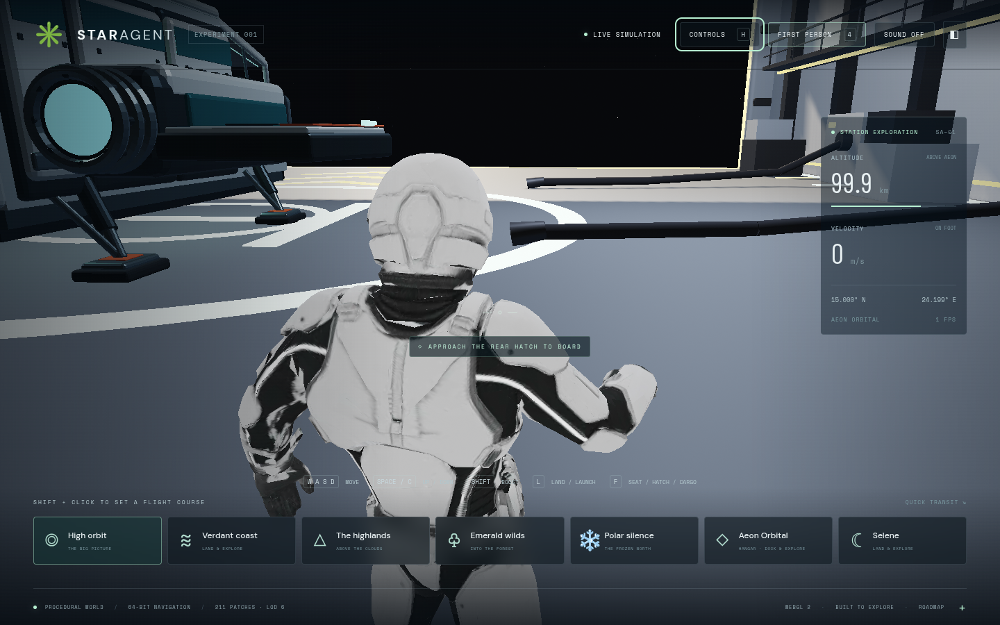

# External ship and player camera

Press **4**, **Numpad 4**, or the **EXTERNAL 4** header button to toggle external view. While seated, this shows the ship from above and behind; on foot, it shows the animated player over the shoulder. Press again for cockpit / first person. Walking and ship selections are independent and survive entering or leaving the seat. Normal movement, looking and jumping remain active. Shortcuts ignore typing, held repeats, modifier chords, dialogs and inventory.




`src/ship-camera.js` computes presentation-only position and orientation. Navigation keeps the physical eye position, velocity and orientation. The actual camera world position drives render origin, terrain/vegetation/moon LOD, lighting and atmosphere. World differences remain JS doubles before GPU upload.

Walking reuses the existing `Character` module and male Meshy pilot, aligned to the navigation support frame and animated from planar velocity and jump state. The model is hidden in first person and while seated. This adds no character selection, equipment controls or opening cinematic.

The boom samples the shared Aeon/Selene terrain and water surface at at most 1 m spacing, bisects obstruction and keeps 45 cm clearance. Hangar obstruction uses the existing walking-capsule sweep. Walking also clips against visible ship triangles with 25 cm clearance; hidden fallback meshes are ignored. Tight spaces temporarily return to first person / cockpit, then restore the selected external view when clear. Trees and loose props are not camera obstructions, and sub-metre terrain features between samples remain a sampling limitation.

Verification commands:

```sh
npm test
npm run test:browser -- -c scripts/ship-camera.config.js
```

Based on `feat/visual-fidelity` at f028a43, including controller support, Nomad and Selene. Keep the render origin in view-dependent systems during integration; physical station and flight logic still use navigation position. If re-entry is integrated, update its view-space uniforms after applying this camera pose.

Verified 2026-09-06: `npm test` passed all 11 test files (including nine camera cases and the existing character tests); production Vite build passed; both Chromium camera cases passed. The browser journey checks ship and player keyboard/button toggles, unchanged physical eye position, normal thrust, walking/jumping animation, typing guards, hangar/cabin views, independent seat transitions and a 390×844 header. No page or console errors. Desktop screenshots above were inspected at 1440×900 on Chromium 151.0.7922.173, ANGLE/Vulkan SwiftShader. Raw images and backend metadata: `/tmp/star-agent-camera`. No hardware FPS claim.
