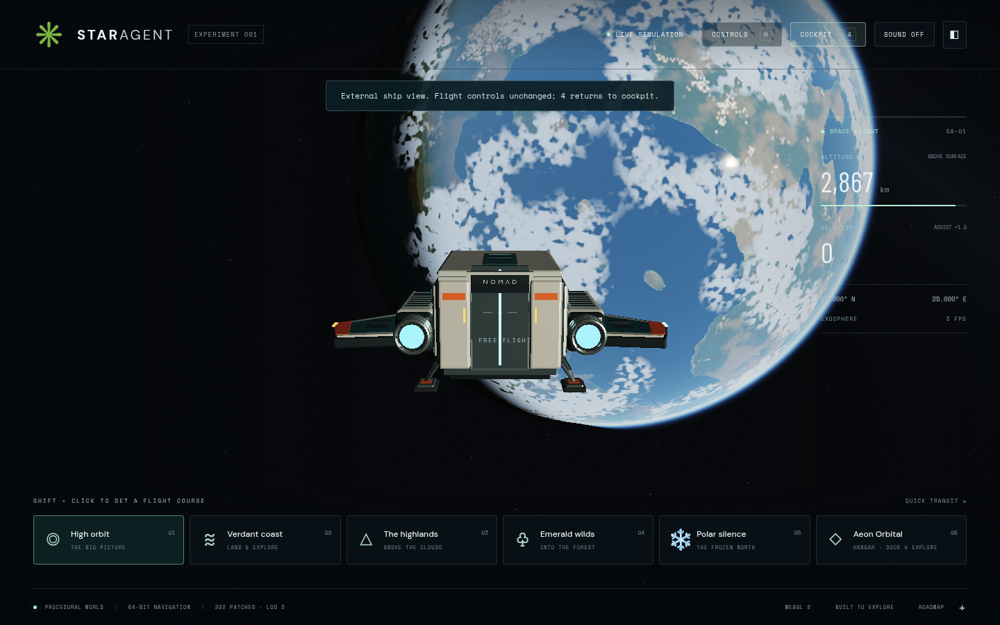

# External ship camera

Press **4**, **Numpad 4**, or the **EXTERNAL 4** header button to toggle a chase view above and behind the ship. The normal controls still fly the ship. Press again for cockpit view; the cockpit stays visible even without pointer lock once camera viewing has been activated. Leaving the pilot seat restores first person. Shortcuts ignore typing, held repeats, modifier chords, dialogs and inventory.



`src/ship-camera.js` owns camera selection and computes presentation-only world position and orientation. Navigation remains at the physical pilot eye, with unchanged velocity and ship orientation. The actual camera world position is used as the render origin and supplied to planet/vegetation LOD, local lighting and atmosphere/cloud rendering. Ship/station positions are rebased in JS doubles before GPU upload.

The boom samples the shared terrain/sea-level surface at at most 1 m spacing, bisects the first obstruction and keeps 45 cm clearance. Station obstruction uses the existing conservative walking-capsule sweep. A shortened boom temporarily falls back to cockpit if the camera would lie inside the authored ship envelope; the selected external view resumes when clear. This is a chase camera, not free orbit or a photo-camera controller. Tree/prop collision is not added, and sub-metre terrain features between samples remain a sampling limitation.

Validation: 52 unit cases including six camera cases; production Vite build; two production Chromium cases covering keyboard/button toggle, unchanged navigation position, flight thrust, numeric input, the new Nomad asset, surface viewing, hangar retraction, seat exit and a 390×844 header layout. No console/page errors. Screenshots and backend metadata are under `/tmp/star-agent-camera`; desktop evidence is 1440×900 Chromium 151 with ANGLE/Vulkan SwiftShader. No hardware FPS claim.

```sh
npm test
npm run test:browser -- -c scripts/ship-camera.config.js
```

This branch is based on the Blender Nomad ship PR. It excludes parallel controller/crash/forest/re-entry changes. During integration, preserve this change's use of the actual render origin in atmosphere and vegetation; continue passing navigation position to physical station/flight logic. If re-entry is merged, update its view-space uniforms after this camera pose is applied.
