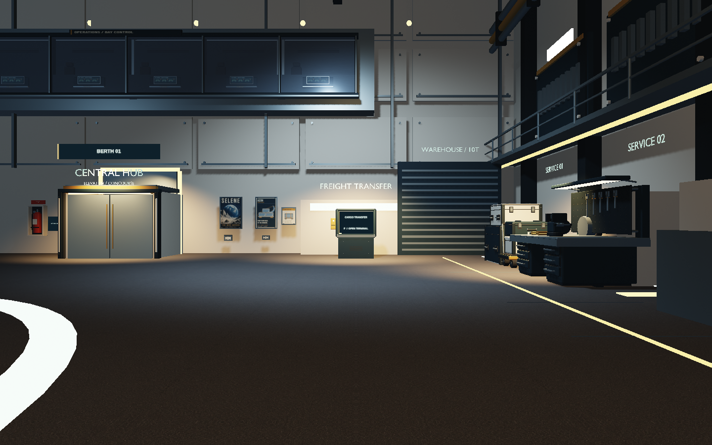
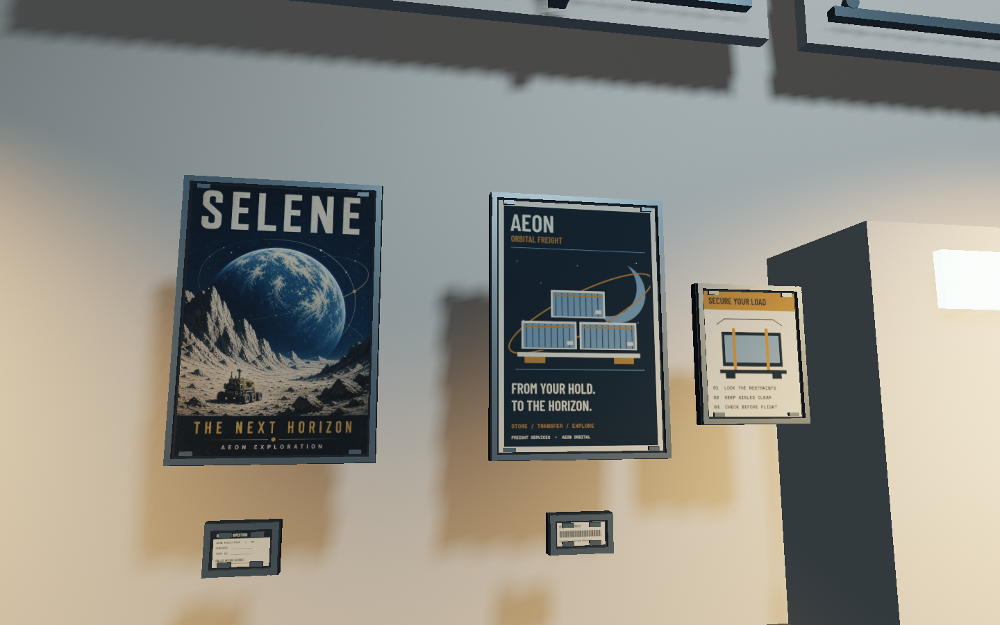
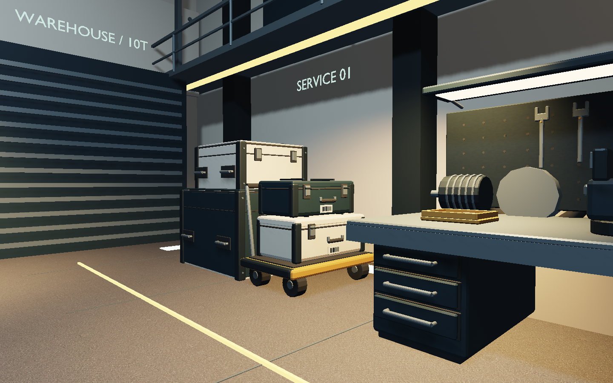
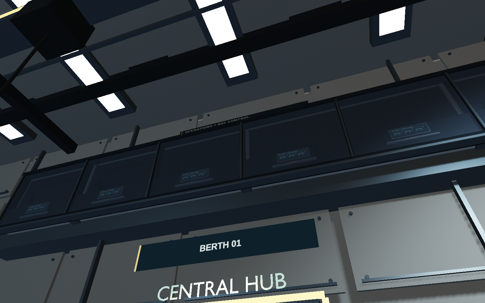

# Hangar service corner finish

The first finish pass adds manufactured equipment, distinct surface materials,
scene-lit printed graphics and task lighting around the cargo terminal, elevator
and adjoining workbench. PR #20 includes the art pack (#17), modular port (#16)
and Atlas (#14), reconciled with the playable opening and system travel from
`feat/visual-fidelity` at `029cae8`. A review candidate is not a deployment.

The three contributing agents owned materials, Blender props and printed graphics
separately. Root integrated the kit, task lights and gameplay verification.
The modular station hull retains the structural floor fix. The manager's separate
station hull refinement (#22) remains outside this integration.

## What is implemented

- Seven shared paint, steel, rubber and deck materials, plus a dim gallery backing
  and transparent observation glass. Missing hull UVs use
  mesh-local metre projection; native Three.js standard materials retain log depth.
  The deck uses a 1024-square WebP with mirrored sampling. Separate procedural
  roughness and microrelief avoid interpreting the generated image's light as depth.
- Nine Blender assemblies: latched freight cases on a wheeled dolly, strapped pallet,
  workbench drawers and tools, extinguisher cabinet, terminal hardware and elevator
  jamb trim, fitted skins for the two nearest original storage stacks and an
  operations-window gallery. The separate GLB has 36,232 triangles, eight opaque
  material batches plus one glass batch, and 2,564,192 bytes. Each assembly stays
  below 10,000 triangles. The dolly and pallet sit forward of the old storage
  boxes, correcting their previous overlap.
- Five physical prints: Selene exploration, freight services, cargo safety,
  inspection and serial identification. One 683×1024 WebP and one 1024-square
  canvas atlas; frames and backings use shared instanced batches. Exact safety and
  equipment copy is authored deterministically. Prints receive scene lighting.
  The same atlas now supplies the operations header, glazing stencils and six
  static console schematics without increasing texture dimensions or payload.
- A single four-spotlight rig follows the occupied bay. Only its broad service
  light casts a 1024-square local shadow; the other three illuminate task areas.
  General bay fill and the interior sun are reduced to preserve material contrast.
  The existing sun shadow frustum tightens to 90 m across in the occupied hangar
  and restores its original size and bias outside. Painted markings, printed
  letters and glass do not cast opaque shadows; equipment and frames still do.

The operations gallery is shallow decorative architecture: tinted panes, framing,
console silhouettes and seat backs. Its original emissive window strip becomes a
dim opaque rear surface. It is not a walkable control room or live traffic system.
Working light bars, navigation beacons and their animation remain unchanged.

Resources are created before the twenty pod instances are cloned. Geometry,
materials and textures remain shared; distant pods retain the existing batched
LOD and omit detailed props. The three surface textures account for approximately
6.75 MiB including mipmaps; that estimate excludes printed graphics, shadow maps
and existing game textures. Four local spotlights are not multiplied by twenty.

## Rebuild and integration pipeline

1. Read `docs/hangar-finish-plan.md`, the current manager ownership record, and the
   actual station collision dimensions before changing placements. Ground is the
   authored deck at game-local Y=-8; the structural slab must stay below it.
2. Run `blender --background --python blender/build_station_props.py` from the repo.
   Optional `-- --render docs/qa/hangar-props-corner.png` makes a labelled studio
   review artifact. The builder writes the standalone GLB and measured assembly
   bounds in `assets/station/props-manifest.json`. Do not overwrite the hull asset.
3. Attach the props scene at identity and add `createStationFinishGraphics()` to
   the hero template before the shared collision build and pod cloning. Apply
   `createStationFinishMaterials()` to hero and LOD templates. Runtime integration
   is in `src/station-complex.js`; material failure retains the original station.
4. Keep functional text, cargo capacities, interactions and elevator destinations
   in their existing runtime modules. Printed artwork is decoration. Keep service
   props in their manifest bounds and clear the side aisles, crosswalk and lift.
5. Use the source images in `assets/station/textures-source` and provenance in
   `assets/station/prompts.json`. Runtime derivatives live in `public/textures/station`.
   Palette tokens live in `src/style.css`. Inspect metre scale and grazing angles
   after any texture change, including the mirrored deck repetition.
6. Run `npm test` and `npm run test:browser -- -c scripts/hangar-finish.config.js`.
   The latter builds production assets, exercises functional services and Atlas,
   and captures six controlled views under `/tmp/star-agent-hangar-finish-evidence`.
   Inspect the images and console; a successful build alone is insufficient.
7. Run the combined opening, travel, services and fleet regression suite with
   `npm run test:browser -- -c scripts/hangar-merge.config.js`. The production
   capture harness is `scripts/hangar-integration-tour.mjs`; it records fixed
   world views, the opening at t=10, the cockpit and optional service detail.
   Keep machine-readable reports in `/tmp`; attach curated captures for review.
   Follow `QUALITY.md` for the independent visual review before merge.

## Validation and remaining work

`npm test`: **91 tests passed**, including actual combined-GLB aisle, elevator,
terminal screen, deck and Atlas flight-envelope checks. The production build
passes with the existing bundle-size advisory. Chromium gameplay checks pass for
Atlas unlock and all three lifts, inventory persistence, cargo Take all, physical
elevator entry, hub/berth 20/parked-ship return, and rotating-ring rendering.
The final visual test and missing-props/missing-poster fallback checks also pass.
The Nomad journey flies through the doors, docks, walks through the hatch and down
the ramp, reboards and launches; its desktop/390×844 phone layout checks pass too.
In total, seven browser tests passed across the gameplay run and final capture run.

Six in-game views were inspected at seed 7291, 1440×900, render scale 1, Chromium
151.0.7922.173 with ANGLE Vulkan SwiftShader. There were no console, page or shader
errors in the normal visual run. Scene totals for those views were 273–410 draws
and 399,166–460,822 triangles, including shadow passes. These are render counts,
not a hardware FPS claim. The views use controlled camera fixtures; they do not
exercise the newer playable opening. Machine-readable run evidence stays in `/tmp`.

Before, from the modular-port pass:

After, actual game renderer:

[The first finish pass](qa/hangar-finish-first-pass.png) is preserved for comparison
with the subsequent window, storage and shadow refinements.

[Terminal close view](qa/hangar-finish-terminal.png) and
[deck grazing-angle view](qa/hangar-finish-deck.png) are also saved. The separate
`docs/qa/hangar-props-corner.png` and `hangar-graphics-*` images are studio/atlas
reviews, not game screenshots.

This is the service-corner slice. More distant original block storage, wall and ceiling
construction, bright navigation boards, the hub counter and seating remain for
follow-up. The wider art target is not yet achieved. The preceding seven-test
result and images describe the original finish pass; combined integration evidence
is recorded separately in `docs/qa/hangar-integration.md`.

The integrated StationComplex preserves Station's opening direction/orientation
and controlled door methods. Physical player position selects the occupied berth;
the final cinematic camera origin controls rendering and LOD. The opening locks
its berth and starts outside the selected Nomad or Atlas hull. Fleet selection is
unavailable during that opening. System travel's keep-out centre stays fixed on
the complex instead of following its active berth. Current menu, map, controller
handoff and gesture-gated audio remain connected.
