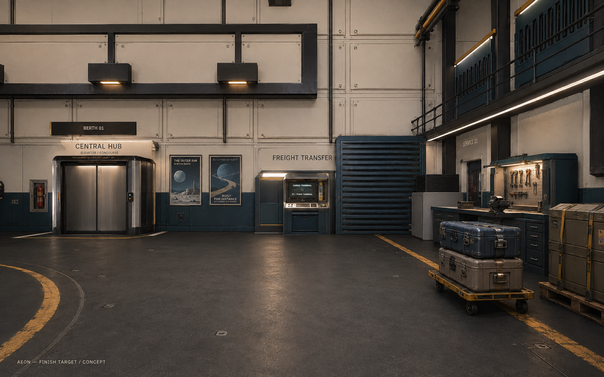

# From hangar blockout to finished environment

The original art review below was prepared against PR #16 at 431369b. The first
implementation now applies its materials, printed graphics, manufactured props
and local task lights to the cargo/elevator/workbench corner on `feat/hangar-finish`.
See [implementation and validation](hangar-finish-implementation.md) for actual
in-game screenshots, rebuild instructions and remaining work. The concept below
is still an art target, not an in-game screenshot. The rest of this document
records the initial review and proposed wider finish pass.

## What is still making it look like a blockout

The current hangar has sufficient large-scale structure. Its finish is weak:

- Most surfaces read as similar grey planes. The floor, wall panels and equipment
  do not separate clearly by material or reflectance. Fine generic noise is not
  supplying a coherent paint, metal, rubber and glass material system.
- Large flat faces and sharp box silhouettes dominate eye-level views. Drawers,
  seals, feet, handles, edge radii and recessed construction are missing from the
  desk, benches and terminal. More bolts on distant walls will not fix this.
- Broad lighting flattens the room. Recesses and contact points lack enough visual
  depth; fixtures do not create a strong hierarchy around the useful locations.
- Most graphics are oversized luminous labels on blank rectangles. There is little
  distinction between navigation, equipment labels, printed posters and screens.
- Props do not yet tell a specific story: freight being processed, a repair in
  progress, or a crew taking a break. Their scale and construction need to make
  them recognisable at walking distance.
- The hub counter and seating are especially visibly primitive. They need shaped
  assemblies and human-scale fittings rather than more material noise alone.

The target is a maintained, working orbital port: warm ivory upper walls, dark
petrol lower panels, charcoal floors, restrained ochre service markings, exposed
metal at hardware, and warm task lighting against cooler light from outside.
Wear should follow use: handles, case corners and wheel paths. Keep broad areas
quiet, with clean walking routes and no loose floor hoses.

## First finished area: cargo terminal, elevator and adjacent workbench

Finish this one view completely before repeating the kit across twenty bays.
The generated paintover preserves the broad layout but is an art target, not an
exact dimensional blueprint. Keep the game's measured walking and ship envelopes.

| Priority | Asset or pass | What makes it read as finished |
| --- | --- | --- |
| 1 | Shared surface kit | Painted ivory and petrol metal, charcoal non-slip deck, brushed steel, moulded rubber, glass, seat fabric. Distinct roughness and small-scale surface response. |
| 1 | Panel and door construction kit | Bevelled edges, inset panel joints, corner trim, bolted flanges, threshold recess, rubber door seals, believable attachment to the wall. |
| 1 | Lighting pass | Warm light at cargo/elevator/workbench; cool exterior fill; contact shadows under cases and furniture; visible detail in recesses without washing the whole wall white. |
| 2 | Cargo terminal | Chamfered housing, recessed screen, separate bezel, keyboard tray, card reader, service access panel and mounting bolts. Keep the screen legible and the F interaction unchanged. |
| 2 | Freight cases, 3 sizes | Rounded corner protectors, handles, positive latches, seams, shipping labels and restrained damage. Share one construction/material family. |
| 2 | Cargo dolly and strapped pallet | Wheels, axle, handle, fork pockets and readable straps. Park them beside the wall, never across the aisle. |
| 2 | Repair workbench | Drawer carcass, real handles, bench vice, tool board, task lamp, parts tray and one open service item. Tools should look placed for work. |
| 2 | Emergency/service cabinet | Recessed extinguisher cabinet, shutoff panel, readable pictograms. Mount flush or within the wall-side service zone. |
| 3 | Printed graphics pack | Selene expedition poster, station freight advert, cargo safety notice, small maintenance tags and shipping labels. Physical frames/clips and plausible paper or laminate finish. |
| 3 | Wear/decal pack | Small scuffs, rubbed paint at handles, wheel arcs, pallet contact marks, serial plates and restrained warning stripes. Place deliberately instead of uniformly dirtying everything. |

## Posters and graphics we actually need

- **Selene exploration poster:** a visual destination and colour accent at the
  elevator waiting point. First source generated below.
- **Aeon freight-services advert:** a second illustration near the cargo terminal,
  with original station branding. Proposed; not generated yet.
- **Cargo safety print:** simple load-restraint diagram and short copy such as
  “SECURE YOUR LOAD”. Author the diagram and final typography deterministically.
- **Maintenance labels:** inspection date fields, electrical isolation warning,
  small service IDs and crate handling icons. These should be readable vector or
  canvas elements, shared in a decal sheet rather than unique textures per prop.
- **Hub noticeboard:** shift notice, recruitment sheet, transit information and one
  community flyer. Use a restrained cluster at a waiting point, not every wall.

Keep functional berth numbers, elevator destinations and terminal text in the
runtime text system so they remain accurate. Printed posters should receive scene
lighting. Do not make all paper, labels and panels emissive.

## Hub follow-up

After the first hangar corner establishes the quality bar, reuse its materials
and trim on the hub. Replace block benches with seat shells, cushions, supports
and armrests. Replace the counter with a shaped desk, access panels and an inset
terminal. Add a coffee/water machine, waste/recycling unit, lockers and one crew
noticeboard beside seating. Model each as recognisable manufactured equipment.
Do not imply that decorative equipment has gameplay functionality.

## Image generation and material production

The built-in ChatGPT image generator produced three original images:

| Saved asset | Dimensions | Intended use and current status |
| --- | --- | --- |
| [Finish concept](../assets/station/art-direction/hangar-finish-target-v1.png) | 1586×992 | Lighting/material/prop target. Labelled CONCEPT. Not an in-game capture or a texture to project over the room. |
| [Selene poster](../assets/station/textures-source/selene-poster-v1.png) | 1024×1536 | Flat original print artwork. Text inspected: SELENE / THE NEXT HORIZON / AEON EXPLORATION. Needs a framed mesh and runtime material. |
| [Charcoal deck source](../assets/station/textures-source/charcoal-deck-basecolor-v1.png) | 1254×1254 | Base-colour candidate for a matte non-slip coating, intended coverage about 2 m square. Not a completed PBR set or a certified seamless runtime tile. |

Exact prompts, reference and tool provenance are in
[assets/station/prompts.json](../assets/station/prompts.json). Generation used the
built-in tool, not the API/CLI. Sources are outside public/ so they do not increase
the deployed game's payload before integration.

A generated colour texture is one input to a finished material. Author coherent
roughness, surface normals and material masks separately; use Blender geometry
and baking for bevels, seams, panel depth and hardware. Do not treat a colour
image converted to greyscale as automatically correct geometry or roughness.
Ask generated base colours for diffuse, even lighting: no baked reflections,
vignettes or room shadows. Print artwork can include illustrated lighting.

A concrete export issue was verified: **the station GLB contains 89 mesh
primitives and none has TEXCOORD_0**. The existing weather shader uses local
position sampling, so it does not establish UVs for ordinary image maps. Add UVs
to the Blender batch builder with consistent metres-per-tile, or deliberately
extend local-space projected sampling for the surface kit. Use explicit UVs for
posters, trim strips and labels. Do not stretch a single texture across every box.

Set colour/emissive images to the appropriate colour space; roughness and normal
maps are data textures. See the official
[Three.js colour-management guide](https://threejs.org/manual/en/color-management.html).
Keep shaders compatible with logarithmic depth and floating-origin rendering.
Share material instances and source textures across berths. Keep unique posters
in a small reusable set, and measure draw calls and texture memory in the finished
scene before deciding on higher resolutions or additional lights.

## Completion criteria for the implementation pass

1. Rebuild and inspect one finished corner at walking eye height and the opening
   camera, with neutral exposure and the game's actual renderer.
2. Check texture repetition over a large area, seams, mipmaps and grazing angles.
   The source floor edge probe measured mean RGB differences of 13.65 left/right,
   13.96 top/bottom versus 11.86 between two interior neighbouring columns (0–255).
   These numbers do not certify visual seamlessness; a repeated material preview
   and in-game inspection remain necessary.
3. Verify labels are readable, poster text is correct, and material scale is
   plausible beside a person, a door handle and a shipping case.
4. Confirm warm/cool material separation and useful contact shadows without losing
   detail in the darkest walkable area. Match a same-camera before/after image.
5. Run Nomad and Atlas docking/boarding/lift tests and walk both side aisles to the
   terminal and elevator. Surface decals must not create collision bumps.
6. Only then propagate the kit through the twenty shared pods and the hub. Compare
   render cost on recorded browser/GPU/resolution settings; no FPS promise from a
   generated concept image.

For this art-only deliverable, images were inspected, PNG headers/dimensions and
the actual GLB attributes were checked, and the floor source received the numeric
edge probe. Pillow was unavailable; image inspection/probing used the built-in
viewer, Python standard library and ImageMagick. Runtime shaders, UVs, models and
materials are unchanged, so no new gameplay test pass is claimed here.
