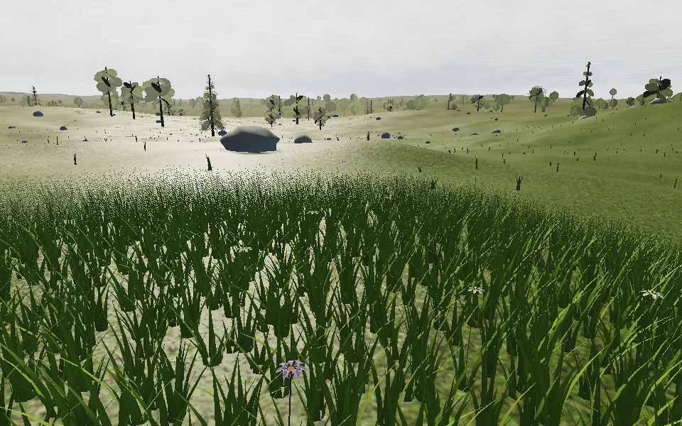
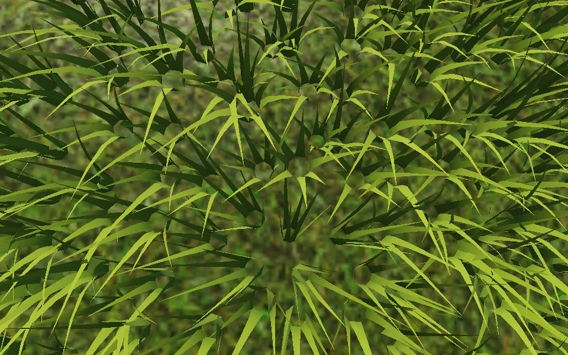
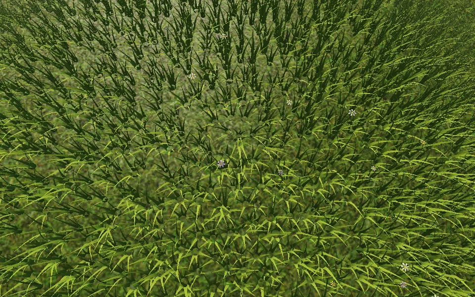

# Interactive meadow

A dense local meadow now surrounds the camera within 10 metres on Aeon's grassy land. Seven curved, segmented blades per tuft overlap into a sward; irregular patches of white, yellow and violet flowers rise above it. Moisture controls density, colour and height. Ocean, low shoreline, polar and high alpine terrain remain free of this layer.

Wind moves both blades and flower stems. Walking outdoors pushes plants aside, leaving up to eight recent contact samples that recover over 2.4 seconds. Low hovering and takeoff also drive a turbulent outward downwash from engine acceleration. The exhaust direction is projected onto canonical ground, with spread and strength falling off with height; inertial coasting produces no wash, and plants recover when thrust stops. This is an aggregate exhaust footprint rather than individual nozzle simulation. The existing ship landing clearing stays empty; plants at its outer edge bend away from the ship. This is temporary visual vegetation deformation, with no change to terrain or collision.

The layer uses two instanced draw calls, with at most 11,000 tufts and 1,800 flowers. A 12-metre buffer rebuilds after 1.5 metres of movement, independently of the forest's 40-metre rebuild. Cached, globally anchored cells preserve plant identity and canonical terrain heights across those rebuilds. Positions and contact samples stay in CPU doubles until the patch origin is subtracted. Stable per-cell wind phases avoid animation jumps when rebasing. Coverage fades from 6 to 10 metres using screen-space dithering; the existing distant ground cover continues beyond it.

Plants receive shadows but do not add shadow draws. Bending is an approximate vertex deformation, not a physical stem simulation; normals retain the undeformed ribbon orientation. This implementation uses procedural geometry and adds no downloads or dependencies.

## Reproduction and validation

Open the preview with `/?debug&seed=7291`, visit Verdant Meadows, land and walk beyond the ship clearing. Look down while walking to see plants bend and recover, and stand still to watch wind and flower motion. The screenshot location is latitude 15.74°, longitude 22.44°, with a 1.75-metre eye height.

- `npm test`: world, navigation and meadow invariants, including canonical root heights within 2 mm after Float32 storage, shared-cell stability, contact recovery, clearing restoration and thrust/direction/altitude gating.
- `npm run test:browser -- -c scripts/meadow.config.js`: production build and Chromium render; checks dense grass/flower populations, changing foreground pixels in a stationary wind view, walking contacts, origin rebasing, altitude culling, assisted-hover downwash, recovery after thrust stops and console/shader errors. Screenshots and environment details are written to `/tmp/star-agent-meadow`.
- The browser run uses Chromium 151.0.7922.173 with ANGLE SwiftShader at 960 × 600 and render scale 1 for captures. This is correctness and visual evidence, not a hardware performance benchmark.

