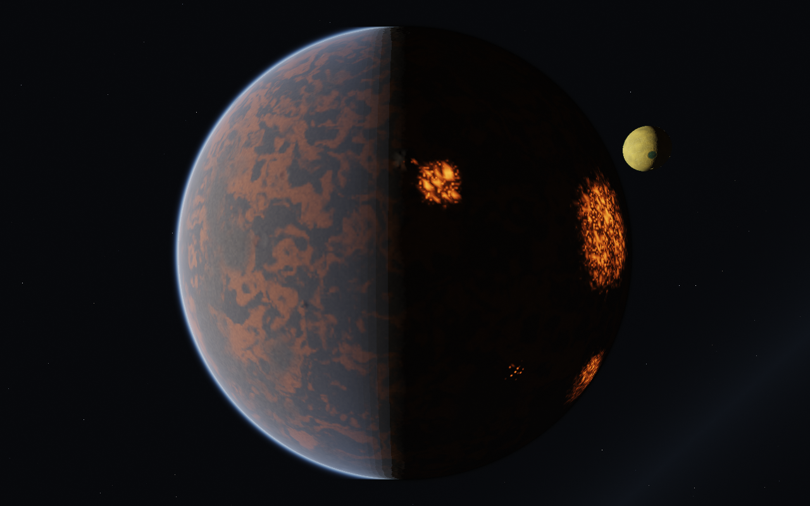
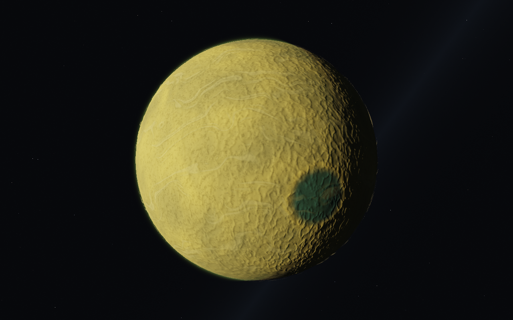
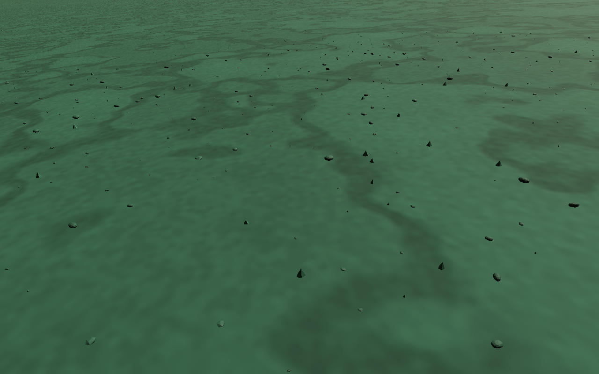
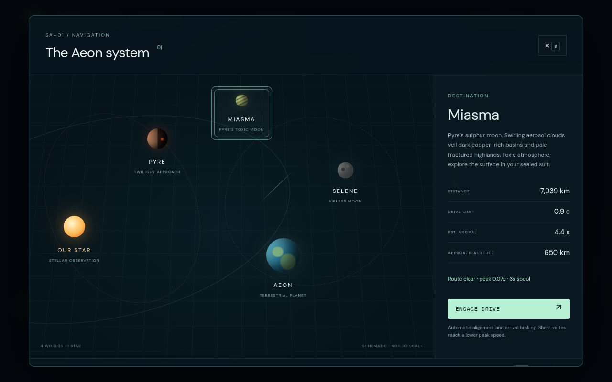
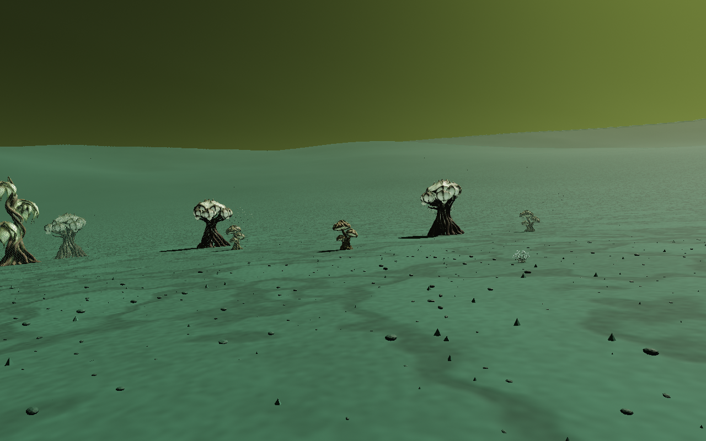

# Pyre twilight and Miasma

Pyre now occupies an authored quadrature position: the straight line from Aeon is tangent to its 10 million km stellar orbit. The camera uses orbital north for arrival roll, giving **light left, night right**. Both quick transit and the drive stop 1,800 km above Pyre's reference surface (quick transit adds the local terrain height). Arrivals from other parts of the system still use the safe near side of the destination, so their phase can differ. Regular travel remains continuous and rejects paths through planetary exclusion zones.

The scene freezes this orbital layout for each session. The epoch is the reference of the orbital helper, rather than a changing initial orbital phase. Pyre generator version 3 reflects its volcanoes and lava fields across body longitude to bring Cinder Throne, Nightfire Plain and Furnace Flows onto the Aeon-facing hemisphere. It retains the same canonical geology, resource sampling and terrain refinement.

**Miasma** is a 340 km radius satellite, placed 6,400 km from Pyre's centre on an inclined, frozen orbit. From the Pyre approach it hangs above the dark limb. Select it on the system map (**M**) or use **H → Quick transit → Miasma**. Arrival clearance is 650 km. Its gravity is 2.1 m/s² and its thin 18 km atmosphere has low flight drag and a narrow yellow-green aerosol rim. Surface density is 0.065 kg/m³; scattering falls off over 2.8 km (Rayleigh) and 1.4 km (aerosols).

Four named mineral basins cut through sulphur uplands: Vitriol Basin, The Pale Eye, Verdigris Sea and Brimstone Crown. Dark copper-rich deposits, pale rims, ridges, fractures, walking-scale grit and small mineral fragments give the moon a different surface from Pyre. The "seas" are solid mineral deposits. Their surface heights and sulphur/silicate/copper weights drive rendering, collision, landing, walking and the mineral survey.

Sparse animated aerosol wisps occupy a cloud shell 5.2 km above the reference sphere. The atmosphere composites from far to near so both worlds can appear in the same view. Rendering retains logarithmic depth; terrain and fragment positions subtract camera/patch origins in CPU doubles before Float32 storage. Workers use the shared Pyre quadtree, canonical surface-map baker and swept terrain contact, with parent fallback, skirts and geometry morphs intact. Fragment scatter is adapted from the earlier Selene surface-stones work and keeps a clear area around a landed ship.

Claude's existing `alien-tree-bulb`, `alien-tree-spire`, `giant-mushroom-cluster` and `puffball-plant` GLBs now populate mixed surface colonies. These are the local assets listed in `public/models/props/manifest.json`; no remote asset service is used at runtime. Plants load below 2.5 km, use bounded instanced batches, fade over 48–140 m depending on species, sway gently and add subtle luminescence to their mint details. Placement is deterministic on the canonical floor, rejects steep slopes and clears a 22 m area plus canopy radius around a landed ship. Plants are decorative, with no trunk collision or harvesting yet.

Toxic air is identified in the HUD, cockpit and map. Exploration assumes the existing sealed suit: this change does not add suit failures, oxygen consumption or acid damage. Small decorative fragments have no separate collision; the canonical terrain owns the walkable floor. Cloud motion and moon placement are authored visual effects, not atmospheric chemistry or an N-body simulation. No downloads, hosted APIs, dependencies or paid assets were added.

## Verification

- `npm test`: existing world, navigation, Pyre and star checks plus Miasma geography, resource consistency, local vertex precision, swept contact, travel separation and arrival orientation.
- `npm run test:browser -- -c scripts/miasma.config.js`: actual Chromium rendering from orbit through 5 km, 100 m and 8 m; mineral/toxicity HUD; map selection; continuous Aeon → Pyre → Miasma drive; physical landing, hatch exit, reboarding and launch; Aeon, Selene, Pyre and star visual regression checks.
- `npm run test:browser -- -c scripts/miasma-flora.config.js`: thinner orbit/descent atmosphere, all four authored species, ground wind, toxic HUD and landing clearance. Flora evidence is in `/tmp/star-agent-miasma-flora`.
- Artifacts and state reports: `/tmp/star-agent-miasma`. Chromium 151.0.7922.173 / ANGLE Vulkan SwiftShader; full browser/GPU details are recorded in `environment.json`. Screenshots use a 1280×800 viewport at render scale 1; streaming/movement checks use 0.4–0.5. SwiftShader is a rendering correctness check, not a hardware FPS benchmark.

