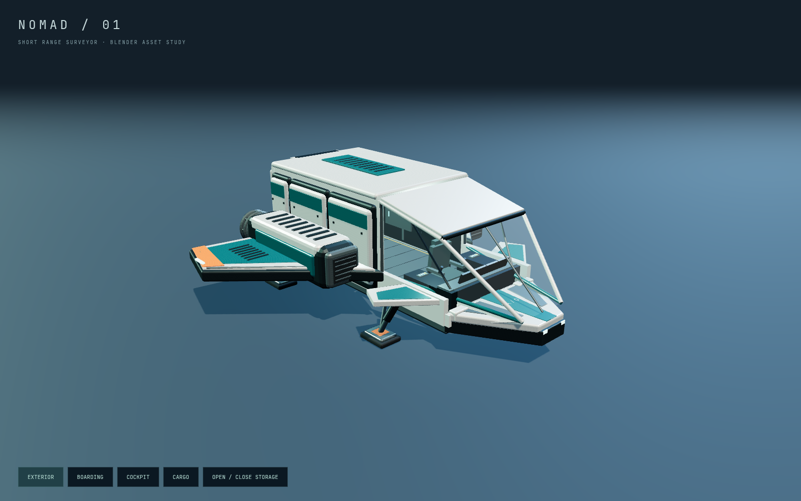
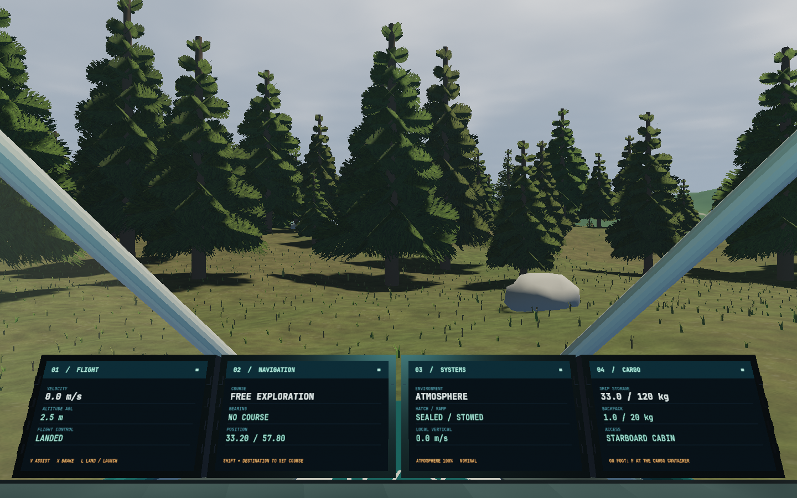
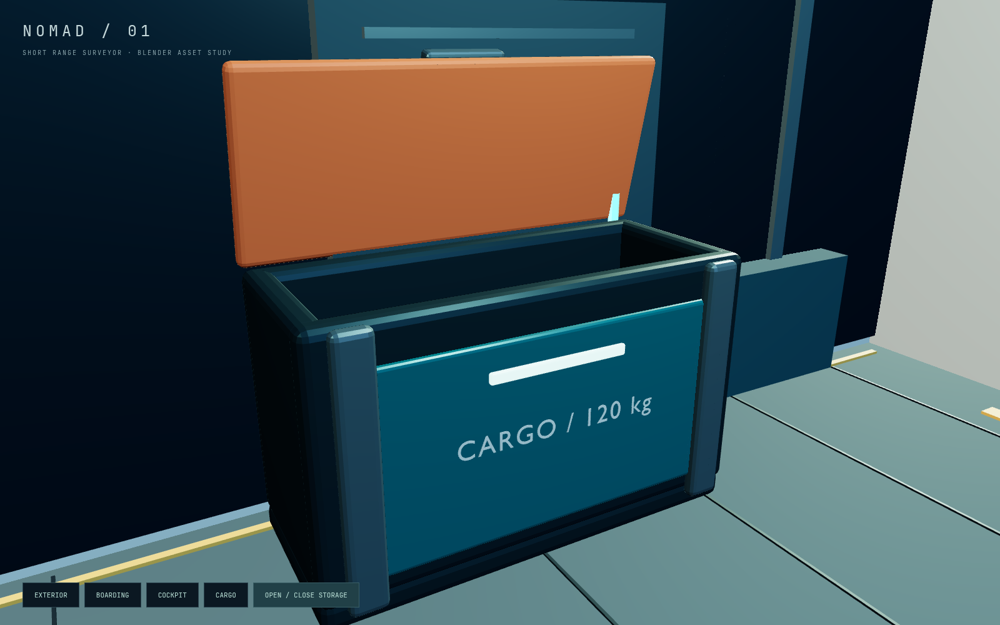
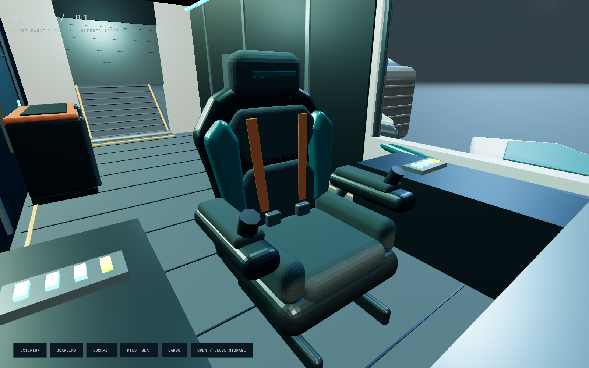

# Nomad surveyor

The boardable ship now uses an original Blender exterior: a raked panoramic
canopy, layered ceramic and petrol panels, swept wings, machined engine collars,
intakes, landing struts, registration lettering and a hinged cargo container.
The four rectangular cockpit screens are physical meshes with live canvas
textures, updated five times per second.

The cockpit refinement replaces the block chair with a Blender-authored bucket
seat, contoured back and shoulder supports, upholstered bolsters, harness straps,
rounded headrest and articulated padded armrests. The central windscreen strut is
removed, leaving the forward view and all four displays unobstructed. The seat
eye position and boarding dimensions are unchanged.

## Try it

Run `npm run dev`. Land with **L**, stand with **F**, then walk aft along the
centre aisle. Beside the orange container on the right (starboard), **F** opens
ship inventory. Take/stow buttons transfer one item between 120 kg ship storage
and a 20 kg backpack. **Escape** closes it. The manifest persists in this
browser's local storage across reloads and planet seeds. If browser storage is
unavailable, transfers still work for the session and the dialog says so.

Keep walking aft to operate the rear hatch with **F**. The original ramp, cabin
floor, pilot seat, landing/launch and station boarding remain physical.

The MFDs currently display:

- Flight: speed, altitude above terrain, and movement / assist mode.
- Navigation: selected course, relative bearing, and latitude / longitude.
- Systems: atmospheric regime, hatch/ramp state, and local vertical velocity.
- Cargo: ship/backpack mass and where to access the container.

Screen buttons are modeled bezels only; MFD page selection and touchscreen input
are not implemented. Cargo starts with expedition supplies; item consumption,
resource gathering and cargo mass affecting flight physics are not implemented.

## Asset authoring

`assets/ship/nomad.blend` is the editable Blender source. The deterministic
builder `assets/ship/build_ship.py` recreates it and the runtime
`public/models/nomad.glb` without external textures, downloads or add-ons:

```sh
blender --background --python assets/ship/build_ship.py
```

The GLB contains static batches by material, a separate `CargoLid` pivot, and a
`PilotChair` group with its own material batches. The runtime chair fallback hides
only after that group loads successfully.
Coordinates are metres, Y up and nose -Z. The builder translates to Blender's
Z-up coordinates and the glTF exporter translates back. Geometry remains local
to the ship. `src/boarding.js` owns the flight envelope and the cargo collision
box. The runtime cabin, hatch, ramp and MFDs stay in `src/ship-walkable.js` and
`src/ship-mfd.js`. The procedural exterior and a working cargo chest remain
available if the GLB cannot load.

The isolated studio is available at `/dev/ship.html` under the Vite **development
server**. Its exterior, boarding, cockpit and cargo views are useful for visual
review; this page imports source modules and is not a production game route.

## Verification

```sh
npm test
npm run build
npm run test:browser -- -c scripts/ship-studio.config.js
npm run test:browser -- -c scripts/ship.config.js
```

The ship tests cover conserved inventory transfers, persistence, corrupt saves,
capacity limits, cargo collision, asset bounds/pivot, live MFD data, input
isolation while the inventory dialog is open, physical boarding and GLB failure.
The browser checks use Chromium / ANGLE SwiftShader with 1440×900 game and
1600×1000 studio viewports; these are correctness checks, not GPU FPS claims.
Screenshots are saved as `/tmp/nomad-*.png`; generated reports stay outside Git.

Verified 2026-09-05 in the isolated ship checkout: **46 unit tests, production
build, both production ship browser tests, and the studio browser test passed**.
The combined controller/crash workspace also passed the ship journey and the
56-test unit suite before extracting this contribution. Browser page errors and
Three.js/WebGL shader errors were checked; none occurred in the passing runs.
Game movement checks used render scale 0.4 on the software GPU; the final cockpit
and exterior captures used scale 1.0.









## Reusable creation pipeline

For the complete workflow, architecture contracts, troubleshooting, verification
and manager delivery process, read [Ship creation pipeline memory](../SHIP-PIPELINE-MEMORY.md).

## Mesh budget refinement — 2026-09-06

The rebuilt Nomad contains **57,784 triangles / 3,783,616 bytes**, down from
70,624 triangles / 4,710,588 bytes. Manufactured bevels up to 0.04 m wide use two
segments; wider edges retain three. The pilot chair retains its explicit
six-segment bevels. UVs, materials, node names, parents and transforms are retained;
the overall ship bounds are unchanged. Individual mesh bounds differ by at most
1.990 mm from bevel sampling. No functional parts were removed.

The builder regenerates both the tracked `.blend` and GLB. Append
`-- --runtime-only` when intentionally exporting only the runtime GLB.
`node --test tests/ship-inventory.test.js tests/freighter.test.js tests/navigation.test.js`
passed after this refinement. The images above are historical captures from
before this mesh reduction; visual review of the new export is pending.
