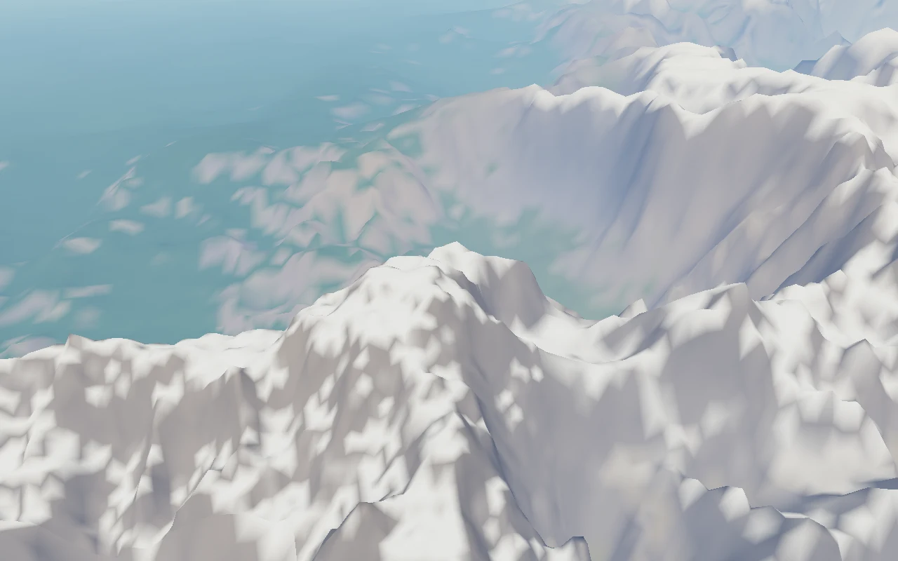
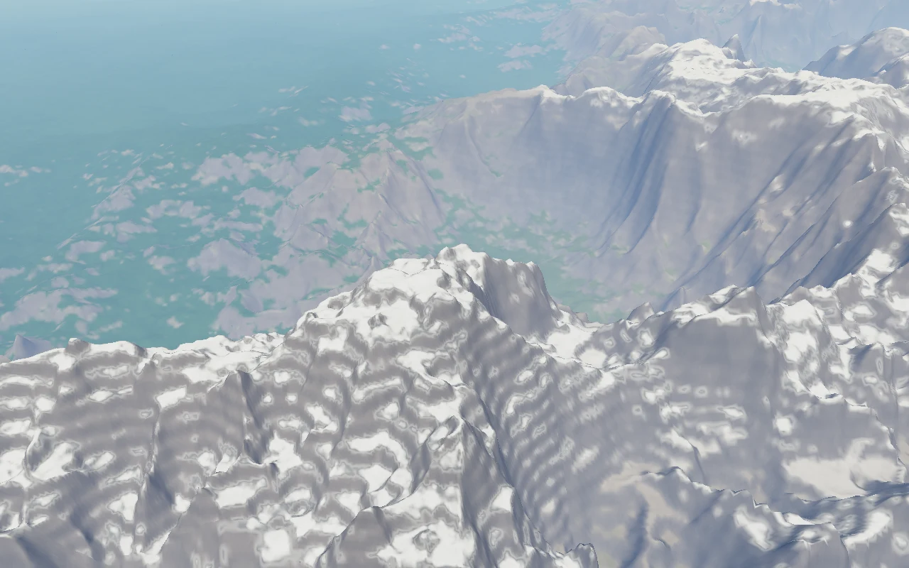
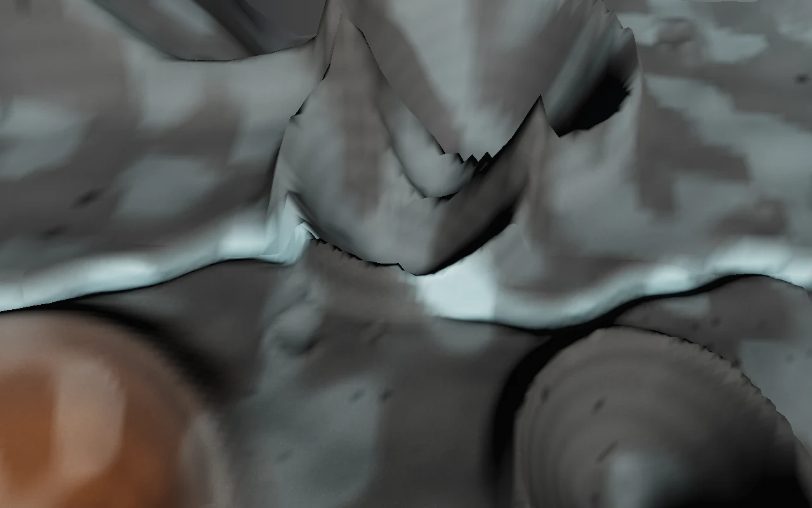
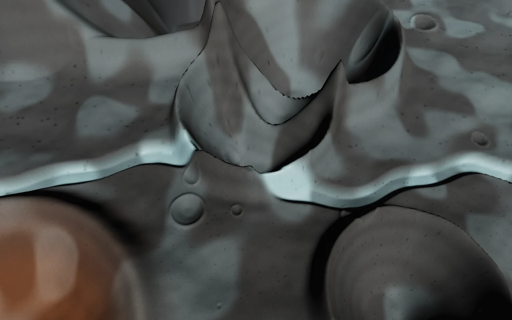
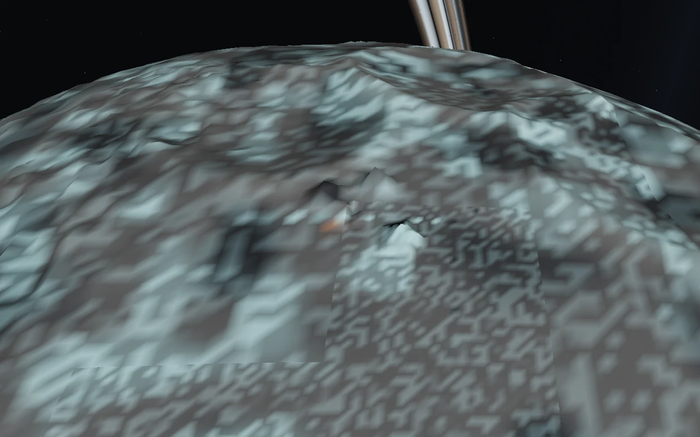
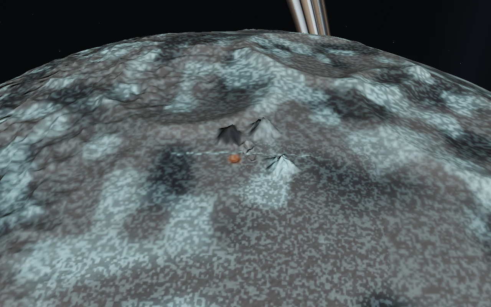
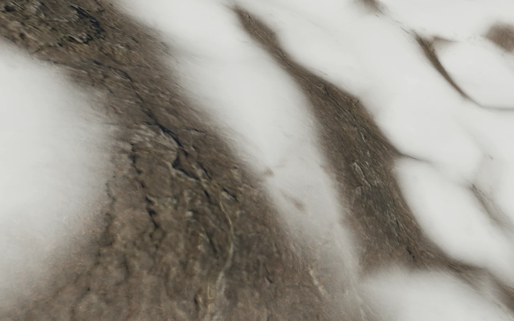
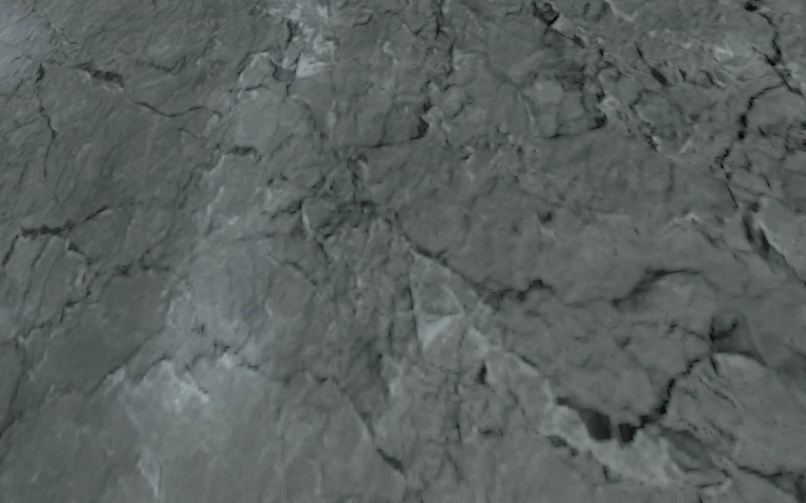
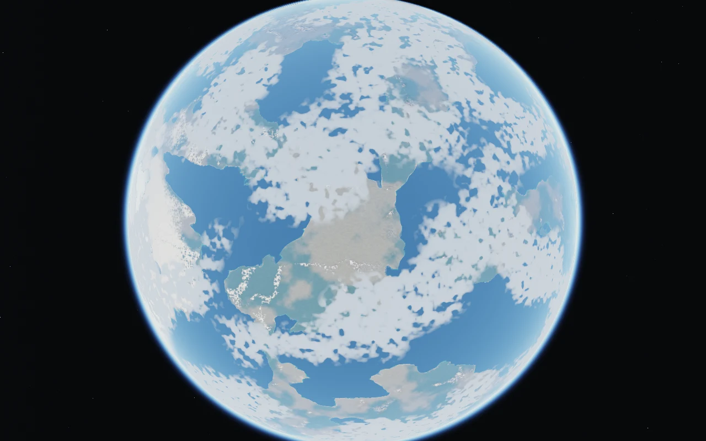
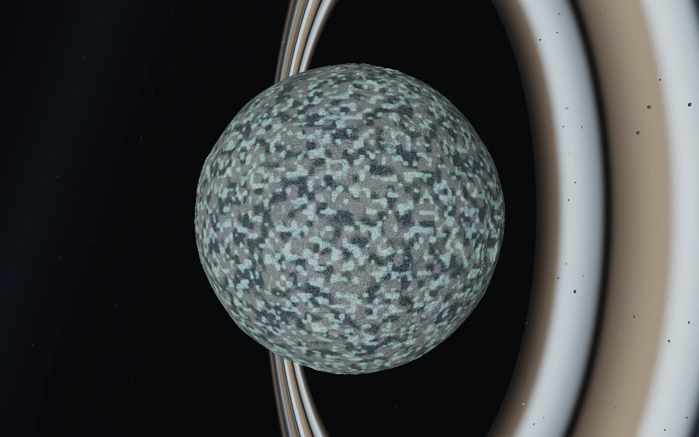

# Recognizable terrain from orbit to ground

At 5 km, the earlier material pass had already faded out Aeon's fine textures.
Snowfields and cliffs became broad, nearly uniform triangles. Selene's geological
colours were interpolated across coarse meshes, producing large angular patches
in orbital views. This change extends terrain detail across those viewing ranges.

The existing terrain generators still define every mountain, crater, coastline,
collision height and destination. This pass renders those features more finely;
it does not move landmarks or introduce a separate surface for walking.

## Rendering scales

| Range | Representation |
| --- | --- |
| Whole-body space views | Progressive equirectangular colour and measured-relief normal maps: Aeon 512 → 2048 → 4096 pixels wide; Selene 512 → 2048. |
| Regional and flight views | LOD 4–13 patches use 32×32 surface cells, plus 65×65 colour and object-space normal maps sampled from the canonical terrain with a one-cell halo. |
| Walking and close flight | Existing fine geometry and shared CC0 soil, moss, sand, rock and lunar grain materials. |

Slope-aware colour in both patch and orbital maps keeps exposed faces distinct
from snow. Regional rock variation and height-based strata continue beyond the
old 4.5 km material cutoff. Selene retains its blue ice, copper deposits, basalt
and crater ejecta colours. Nearby patch maps take priority over the lower-resolution
orbital maps; colour and normal layers blend over overlapping distance bands.

The colour maps use sRGB storage and sampling. Normal data stays linear. Patch UVs
address texel centres, including the skirts, and magnification uses linear
filtering. Regional texture coordinates derive from body directions; metre-scale
detail retains the existing 256 m phase so origin rebasing cannot move it.

## Streaming and cost

Aeon's existing workers generate its detailed geometry and maps. Selene now uses
two workers for detailed patches, retaining its initial globe synchronously. Both
bodies keep parents until all four children exist and retain horizon-culled siblings
that a visible parent needs. Planet cache eviction now retains those dependencies
as the lunar renderer already did. Skirts and logarithmic depth remain in use.

Each detailed patch owns its material and two textures while reusing compiled
shader programs. Eviction disposes all three. Orbital maps publish colour and
normal together, dispose replaced maps, and terminate their workers on completion
or disposal. Selene starts its orbital map worker only within twelve lunar radii.

Flight patches have four times as many surface triangles as the previous 16×16
grid. Their map pair occupies about 44 KiB including mipmaps. Final whole-body map
pairs use about 85.3 MiB for Aeon and 21.3 MiB for Selene; the existing CC0 arrays
add 10.67 MiB. These are texture storage estimates, excluding geometry, render
targets, existing assets, CPU buffers and temporary uploads. No dependency,
additional downloaded asset or hosted runtime service was added.

## Review and reproduction

Live development preview: <http://localhost:53740/>.

```sh
npm test
npm run test:browser -- -c scripts/orbit-ground.config.js --project=after
npm run test:browser -- -c scripts/moon.config.js -g 'Selene landing'
```

The altitude tour keeps the same target landmark during each descent: an Aeon
mountain peak and Selene's first local crater. Whole-body overviews aim at the
body centre. It records whole-body views, 80 km,
5 km, 500 m and 5 m on both bodies, plus 20 km on Aeon. It waits for selected
terrain to finish streaming and for final orbital map resolution, then captures
1280×800 at render scale 1. Streaming uses scale .5. PNGs, shader link results,
browser/GPU metadata and exact camera/target positions are written under
`/tmp/star-agent-orbit-ground/after/`.

Baseline images at `9bd1da5` use the same target poses. The initial combined tour
captured all five planet altitudes, then timed out on an overly strict lunar LOD
threshold. A corrected lunar baseline completed separately. Whole-body overview
shots were added afterward and have no baseline comparison.

Numerical coverage checks canonical heights, coarse/dense shared vertices,
skirts, colour encoding, measured normal direction, seed agreement, patch texture
boundaries, texture disposal and both worker protocols. Existing movement,
collision, navigation and physical boarding tests remain included.

Verified on 6 September 2026: **86 numerical tests pass**. The final production
altitude tour passes for both bodies, with five terrain shader variants linked
in each test and no console/page errors. Browser: Chromium 151.0.7922.173;
backend: ANGLE, Vulkan 1.3.0, SwiftShader Device (Subzero). Captures are 1280×800,
render scale 1. The separate whole-body framing check uses the same production
build. These images are direct browser captures, converted to WebP for review.

The physical lunar landing, ramp traversal, jump, reboarding and launch test also
passes without browser errors at 960×600, render scale .55. The first 1280×800
run exceeded its 90-second landing wait under SwiftShader; its final snapshot had
just reached the landed state. The smaller-viewport rerun completed the full
journey in 2.7 minutes. It used the same production build with a temporary preview
configuration on port 53745; the test's movement and collision assertions were
unchanged.

| View | Before (`9bd1da5`) | After |
| --- | --- | --- |
| Aeon at 5 km |  |  |
| Selene at 5 km |  |  |
| Selene at 80 km |  |  |

Ground material detail continues through the descent:




Whole-body overviews:




## Limits

Terrain geometry still changes discretely between quadtree levels; this does not
integrate the separate transition-morphing work in PR #8. Normal maps improve
lighting inside triangles but cannot change silhouettes or cast geometric detail
shadows. Atmospheric haze and clouds can obscure distant landmarks. This pass
does not add erosion simulation, new craters, caves or terrain deformation.
Software-rendered screenshots establish image correctness, not hardware FPS.
