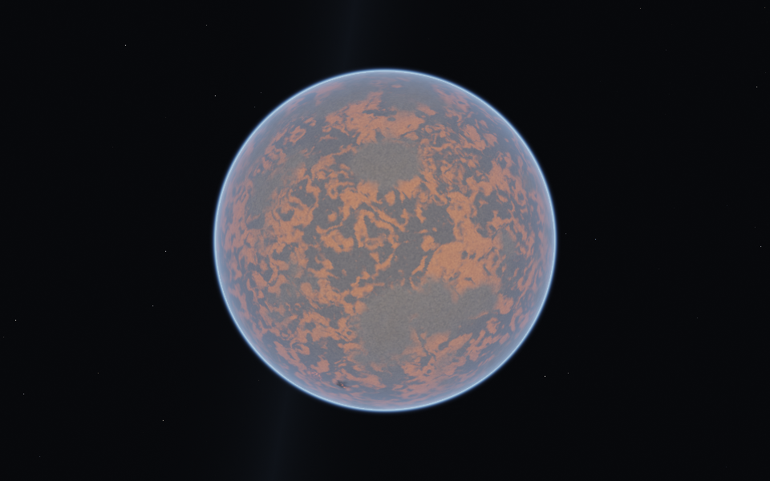
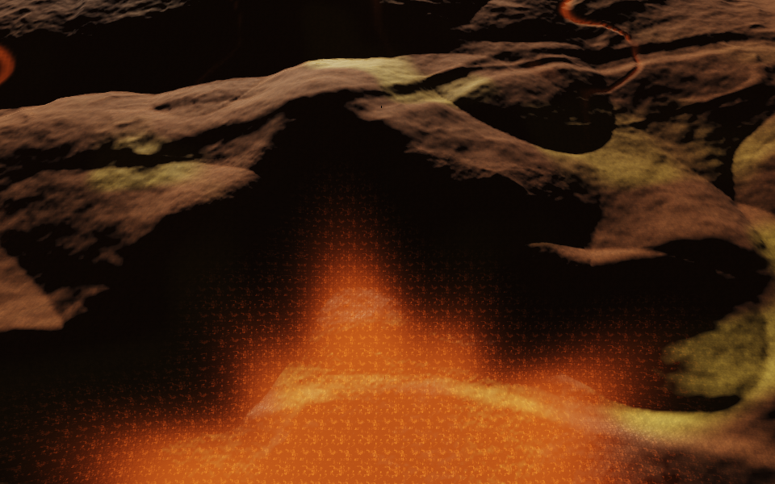
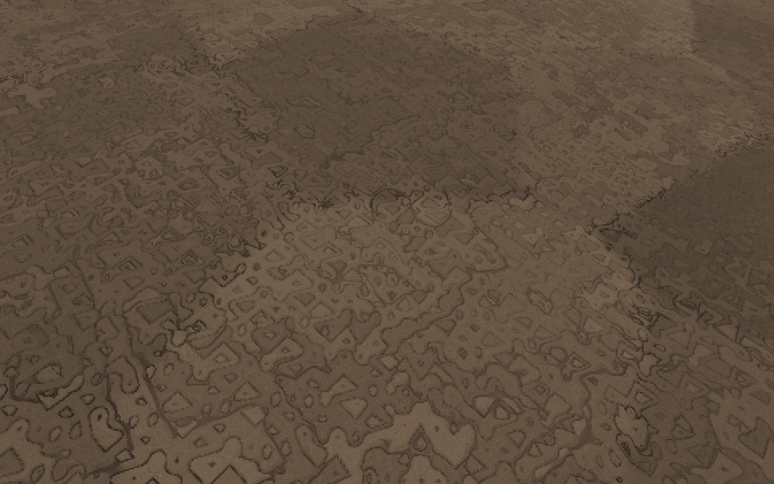
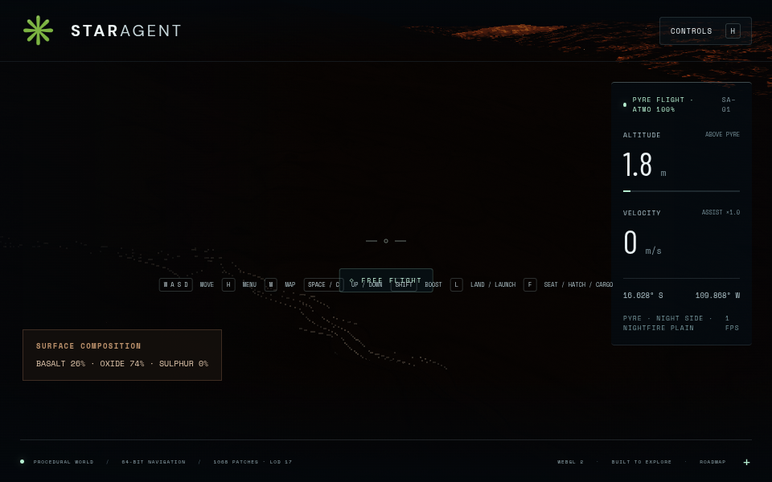

# Pyre: volcanic inner world

Pyre is a 1,200 km radius volcanic planet, 10 million km from the star, with 7.6 m/s² surface gravity and a thin 45 km atmosphere. Its circular orbit is evaluated when the page loads and stays fixed during that session. `?epoch=1788000000000` pins the position for reproduction. The body frame keeps the same hemisphere facing the star.

Open **Controls (H) → Quick transit → Pyre** for a 60 km arrival above the dusk terminator, or select Pyre in the **system map (M)** to use the travel drive. Normal descent crosses the atmosphere continuously. **L** lands, **F** leaves the chair or operates the hatch, and **W/S** walk along the cabin and ramp. Return to the chair with **F**, then **L** launches.

## Geography and appearance

Seven named shield volcanoes, six lava fields, impact craters, fault scarps, pressure ridges and rilles use one deterministic terrain function in `src/pyre-world.js`. This function supplies collision, walking, geometry, surface normals and composition. Caldera rims contain sulphur; cooled basalt, oxidised plains and fresh flows have distinct colours. Procedural crust, fine cracks and glowing fissures cover the approach and walking ranges.

The worker bakes orbital colour, relief-normal and activity maps from the same terrain. Flight patches use a 32-cell mesh with finer 65×65 colour/normal fields at levels 6–13; near the ground the mesh reaches level 17. Parent triangles remain visible while children stream, then children grow from their resident parent triangles over 0.6 seconds. Skirts and split/merge hysteresis cover the boundaries. Camera-relative geometry is constructed with subtraction in CPU doubles before Float32 storage.

## Resource layer

`pyreSurface(direction).resources` and `pyreResources(direction)` expose `{ids, weights, dominant, province}`. The normalized basalt/oxide/sulphur composition drives both colour and the local survey HUD. It is independent of camera altitude and terrain LOD. This follows Selene's shared geology contract, with Pyre-specific minerals. It does **not** yet expose mineable volumes, excavation, collected inventory or tools on Pyre. Hull heat is a visual warning; thermal damage is not implemented.

## Integration and provenance

This branch continues Fable's Pyre commit `a18cf81` and recovered working changes. It reuses the patch surface and resolution modules from the orbit-to-ground work (`d69b57e`), and the composable morph helper from terrain transitions (`fce612b`). It implements resource composition using the contract documented by the Selene expedition work (`c3ef10c`). These helpers are connected to Pyre here; the separate Aeon/Selene graphics, vegetation and mining PRs remain separate integrations.

Generator version 2 also replaces a correlated noise hash, warps mineral province boundaries to avoid a visible orbital lattice, and includes both sides of seed cells when sampling lava blisters so the collision floor stays continuous.

## Verification

- `npm test`: procedural, navigation, world precision, resource composition and resident-parent morph tests.
- `npm run test:browser -- -c scripts/pyre.config.js`: production build, night orbit, caldera at 5 km and 700 m, ground detail, mineral survey, daylight orbit and ground, physical landing/ramp/reboarding/launch, and Aeon/Selene rendering smoke checks.
- Browser evidence: Chromium 151.0.7922.173, ANGLE Vulkan SwiftShader, 960×600 viewport. Streaming uses 0.4–0.5 render scale and curated Pyre screenshots use 1.0. This is software-rendering correctness evidence, not a hardware FPS benchmark.
- Full run outputs and state reports are written to `/tmp/star-agent-pyre`; selected screenshots are checked in under `docs/images/pyre/`.

The night side is deliberately dark. Orbital maps have finite resolution, and material shading can still change during refinement even though geometry morphs. No claim is made that the separate Selene mining or Aeon graphics branches have been merged into this preview.

