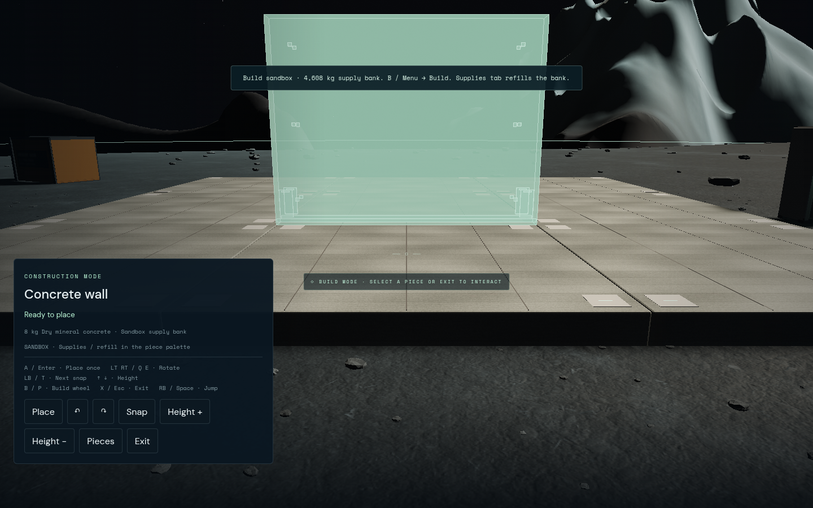
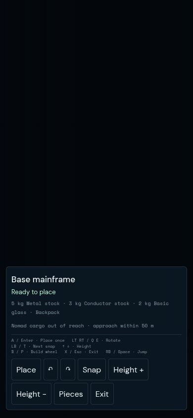

# Controller construction hotkeys — 2026-09-07

Follow-up to `43d4131` on `feat/base-building`, PR41. B now enters the radial
within the owned mainframe’s 64 m radius while outside on foot. The radius uses
the actual mainframe position and current planetary body; cabin, flight, EVA,
blocked storage and non-buildable contexts cannot enter through this shortcut.
Menu → Build remains available to establish a first mainframe.

| Context | Binding |
| --- | --- |
| Outside on foot near owned mainframe | B opens wheel |
| Wheel | Left stick points; A chooses; B closes |
| Placement | A places once; LT/RT rotate; LB cycles snap |
| Placement movement | Sticks move/look; RB jumps; D-pad up/down changes height |
| Placement exit | X |
| Flight | B brakes; triggers translate; bumpers roll |
| EVA | A/B rise/lower; LT brakes; RT fires held tool |

Shared Gamepad polling and neutral arming remain authoritative. A placement
consumes jump/fire actions; held A cannot repeatedly place or replay after a
modal, focus change or controller replacement. Opposing trigger edges cancel.
Keyboard/touch routes continue to invoke the same construction actions.
HUD hints now reflect cabin, flight, landed, foot and EVA contexts; the help
screen and controller contract document the same bindings.

## Verification

- Full unit suite: **546/546 pass**, 18.00 s.
- Focused input/state/hint checks: **24/24 pass**, including 63.9/64.1 m bounds.
- Shared UI Chromium checks: **8/8 pass**, 18.6 s. Analog wheel selection, A
  placement, trigger rotation, snap, B/X routes, held-input/modal/focus/reconnect
  suppression, flight/EVA/cabin passthrough, keyboard and actual touch events.
- Production sandbox journey retry: **1/1 pass**, 2.1 min, Chromium 151.0.7922.173,
  zero page errors. B proximity entry → analog wall selection → LT/RT rotation →
  A placement without jumping/firing → exact 8 kg debit (384 → 376 in first bin) →
  supplies/refill → backpack → reload → unchanged regular save.
- Production build passes, with the existing chunk-size advisory. Preview5296
  returns HTTP200 and its index matches `dist/index.html`, bundle `main-CV5ZUlyX.js`.
- Historical full-kit/ship-radius journey helpers use the new bindings; those
  longer routes were not rerun for this follow-up.

The UI fixture isolates input and layout; it does not establish physical gameplay.
Production acceptance injects only a standard Gamepad. Sandbox stock/site/spawn
come from the shipped sandbox, with no debug pose or inventory insertion.
Native Chromium uses ANGLE GL, 1440×900 and 390×844. Browser temporary files use
`TMPDIR=/home/cees/.cache/star-agent-browser-tmp` due to the previously documented
/tmp quota crash. No physical Xbox validation is claimed.

This input follow-up does not rescore the earlier kit review or resolve the
existing whole-world performance and independent revised UI acceptance gates.
PR41 remains a draft; no merge or public deployment.

The first production run completed gameplay assertions and wrote `journey.json`
with zero page errors, then failed in `browserContext.close` while writing test
artifacts (`EDQUOT`, error -122). That run is not counted as a test pass. The retry
also moves Playwright output to the home disk:

```sh
TMPDIR=/home/cees/.cache/star-agent-browser-tmp npm run test:browser -- -c scripts/build-sandbox.config.js --output=/home/cees/.cache/star-agent-hotkeys-results
```

Author inspected the production placement HUD at 1440×900 and isolated placement
HUD at 390×844: current hints and all touch actions fit within the viewport.
These are functional/layout evidence, not an independent visual score.



