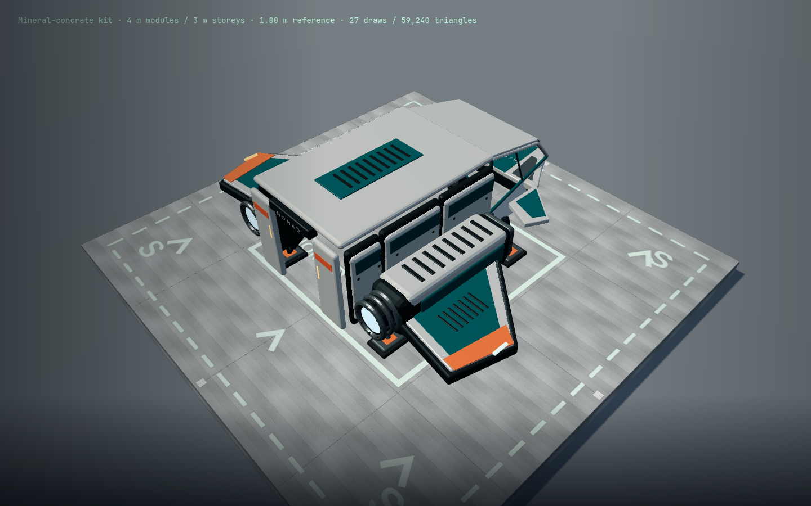
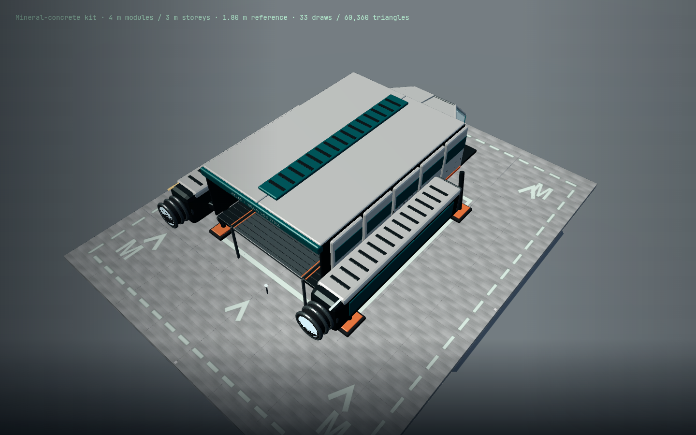
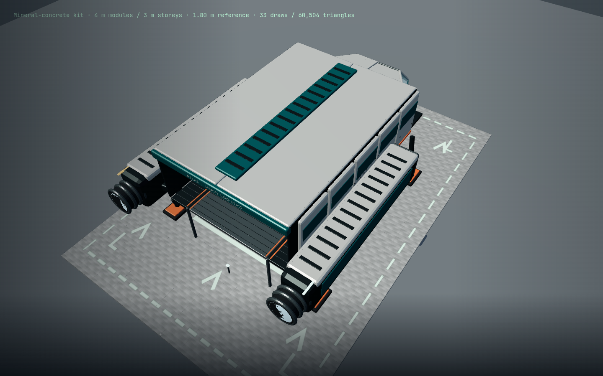

# Base kit expansion brief — 2026-09-07

Parent 36f3175, isolated feat/base-building / PR 41. Original deterministic Blender
source and existing concrete maps/material palette; no third-party asset source.
The first reviewable assembly is an open workshop: square/triangle/rounded deck,
curved glazing, one-wall roof with two-edge cantilever limit, stairs with accessible
storage behind, and a terminal accessing real site containers. LB/RB switches
menu tabs, with keyboard/touch equivalents and stable neutral-armed confirmation.

All game geometry is metres, Y up. Equilateral triangle sides 4 m; quarter-circle
radius 4 m with two 4 m straight edges; walls 3 m high; slabs0.6/0.18m thick. Polygon
footprints must be shared by model, placement, support, walking and selection.
New shapes use the existing bevelled cast concrete, steel edges, white mounting
shoes and mint status marks. Inspect walking distance, 30 m and desktop/phone UI.

Additional user scope: real rack storage, local inventory terminal, large sliding
hangar door, sloped approach foundation and a large foundation with persistent
landing-pad designation. User clarified ship-sized pads: Nomad, Atlas and a heavy ship at four times
Atlas footprint area (the working interpretation of “four times Atlas”). Storage rights/costs/save transactions stay
shared. No automatic docking/pressurization/vehicle simulation inferred.

Record failed checks and final assets/gameplay evidence below. Independent visual
acceptance and existing whole-world budgets remain draft integration gates.

## Implementation and evidence

The kit now contains 21 authored pieces. The new convex footprints govern
placement overlap, walking support/collision, selection rays and structural
sockets. Complete measured envelopes still guard claim and ship clearance;
vehicle sweeps remain conservative rather than mesh-exact. Existing saves retain
their original pieces and costs; all new transactions use the shared store.

Controller tabs have native focus and bumper shortcuts. A bumper+A edge changes
only the tab and then neutral-arms confirmation. Blocks keeps its eight familiar
positions; Shapes and Facilities have their own eight-position wheels. No second
Gamepad poll or keyboard synthesis is used.

The rack has eight physical bin fronts and eight stored box mounts (384 kg
minerals). A terminal opens any site container while the character is within 4 m
of that terminal. Opening storage keeps the game paused; leaving reach revokes
access. Mainframe and crate behavior share this path. The hangar’s 14.58 m-wide
curtain compresses into its header instead of occupying its neighbors’ walls.
Closing checks both character and parked-ship intersections.

Pads are S 16×16 m, M 32×40 m and L 48×72 m. Current Nomad/Atlas flying bounds are
12.1×11.1 m / 19×30 m. L uses a hypothetical 38×60 m heavy ship: twice Atlas linear
dimensions, four times footprint area. No new heavy ship was added. Size letters,
perimeter dashes and approach arrows remain visible with a parked ship. Pads
are aimed at their near edge; a large prefab’s centre need not be within 12 m.
A large pad expands its site radius to 96 m in the same paid save transaction,
with other-claim overlap protection; ordinary sites stay at 64 m. Deck support
piers extend 8 m down. No ground carving or terrain flattening is performed.

A saved pad designation enables marked-slab landing support. The adapter checks
the complete oriented ship footprint plus 1 m, a clear deck and the correct body,
then supplies surface point/normal to normal landing assist. It does not select a
remote destination or change ordinary planetary terrain queries. A real Navigation
simulation reaches landed mode with the ship origin on the slab; shifted wings
and an occupied deck reject pad support.

## Failures found and corrected

1. The first curved solid wall export exceeded the 10,000-triangle piece budget
   by 44 triangles. Simpler bevels on the curved segments and un-bevelled narrow
   trim keep the finished piece below budget; counts come from actual GLBs.
2. Prism side winding was corrected before the final capture; exported support
   rays now check the triangle, quarter-circle and sloped ramp surfaces, including
   genuinely empty polygon corners.
3. The studio’s first new ship reference used a bare import from a static public
   script and timed out. Moving its source to `src/build/studio.js` lets Vite
   resolve it. The subsequent full ten-view capture passes with zero errors.
4. The captured hangar motor covers had coplanar faces with the concrete posts.
   They now project beyond the concrete, with status strips in front of the covers.
5. The expanded production workshop route exposed proximity winning over aim:
   X opened a nearby rack while aiming at a terminal. Selection now prioritizes
   facing alignment, with an explicit regression for that arrangement.
6. Small-pad aiming at an unbuilt surface above terrain fell back to a nearby
   point and covered the placer. All pad sizes now anchor from their near edge.
7. The pad transaction regression initially tried to retry a quota failure without
   reloading. The store intentionally stays blocked after a failed write. The
   corrected regression verifies unchanged stock/radius, reloads, then places.

8. Walking diagonally off a slab corner could fall into its own side collider:
   four cardinal foot samples missed part of the support disk. Collision now
   tests the complete capsule disk against each support polygon; a regression
   retains the exact failing corner position.
9. Two controller route assumptions were corrected: terminal approach now uses
   the actual snapped position, and walking stops by horizontal distance so
   terrain elevation does not cause the test to walk past its destination.

## Validation status

- Full unit suite passed all 79 configured files after the first landing adapter;
  later focused transaction/input changes and final results are recorded below.
- Geometry checks include actual GLB budgets, material/vertex-color preservation,
  measured bounds, physical doorway/rails and new polygon support rays.
- UI suite passed 9/9 including actual touch/keyboard paths and bumper-tab recovery.
- Initial production controller routes passed 2/2 (3.7 m): ordinary sandbox and
  eight new placements/reload. The extended terminal/pad routes initially failed
  as described above; their corrected final results are recorded below.
- Ten asset views passed 1/1 in 8.7 s, Chromium 151 / AMD Radeon 860M ANGLE GL,
  1440×900, zero page/console errors. The isolated workshop measured 60 draws /
  22,570 triangles, not a whole-world frame-time result. Later captures include
  the corrected hangar surface and additional corner size markings.

Physical Xbox testing remains unavailable. Captures are author inspection, not
an independent visual score. The prior kit’s 4.0 review does not apply to these
new assets. Existing whole-world performance and fresh independent visual review
remain draft integration gates; no merge or public deployment.

## Final checkpoint verification

- `npm test`: **79/79 configured test files**, 33.36 s, zero failures.
- Shared build UI: **9/9**, 22.9 s, including controller tab changes/neutral arming,
  keyboard, touch and 390×844 phone layout.
- Production sandbox original entry/placement/debit/refill/reload/regular-save
  route passed in its latest full run (2.8 min). The two new routes subsequently
  passed separately: workshop/terminal/rack/shapes/reload **1/1, 1.7 min**;
  pad designation/hangar traversal/ramp/reload **1/1, 2.3 min**. Both inject only
  Gamepad input into the shipped sandbox; steering reads state but never sets
  actor pose or supplies inventory fixtures. Both report zero page errors.
- Final authored asset capture: **1/1, ten views, 11.5 s total**, Chromium
  151.0.7922.173, AMD Radeon 860M ANGLE OpenGL ES 3.2, 1440×900, zero diagnostics.
  Final hangar surfaces, all three pad scales/markings, rack/terminal, curved
  glazing and workshop were inspected. Isolated workshop: 60 draws / 22,570 tris.
- Final manifest: **21 GLBs, 45,904 triangles, 4,097,084 bytes**. Every piece is
  below 10,000 triangles and 1 MB; largest geometry is the existing stairs at
  5,616 triangles. Model bounds, smooth ramp surface and collision contracts pass.
- Production build: 162 modules; `main-Bx2Eb9mq.js`, with the existing chunk-size
  advisory. Preview HTTP 200 and served index matches the built dist index.
- Navigation simulation covers actual slab touchdown and rejects undersized or
  occupied decks. A production controller ship flight onto a pad remains
  untested; the new production route verifies construction and designation.

The production ramp capture also shows existing procedural ground pebbles above
parts of the low deck. This expansion does not remove local scatter or terraform
terrain; scatter exclusion is a remaining visual integration detail.

### Review captures

[Open workshop](expansion/workshop.png), [curved glazing](expansion/curved-window.png),
[storage rack](expansion/rack.png), [inventory terminal](expansion/terminal.png),
[open hangar with 1.8 m reference](expansion/hangar-open.png).

| Nomad / S | Atlas / M | Heavy scale reference / L |
| --- | --- | --- |
|  |  |  |

[Production terminal → eight-box rack inventory](expansion/terminal-rack.png),
[production marked pad and approach ramp](expansion/pad-ramp.png),
[phone facilities wheel](expansion/facilities-phone.png).

Reproduce with `scripts/build-sandbox.config.js`, `scripts/build-ui.config.js`,
and `scripts/build-expansion-assets.config.js`. On this Linux host, use
`TMPDIR=/home/cees/.cache/star-agent-browser-tmp` and a home-disk Playwright
output directory to avoid the documented temporary artifact quota failures.
