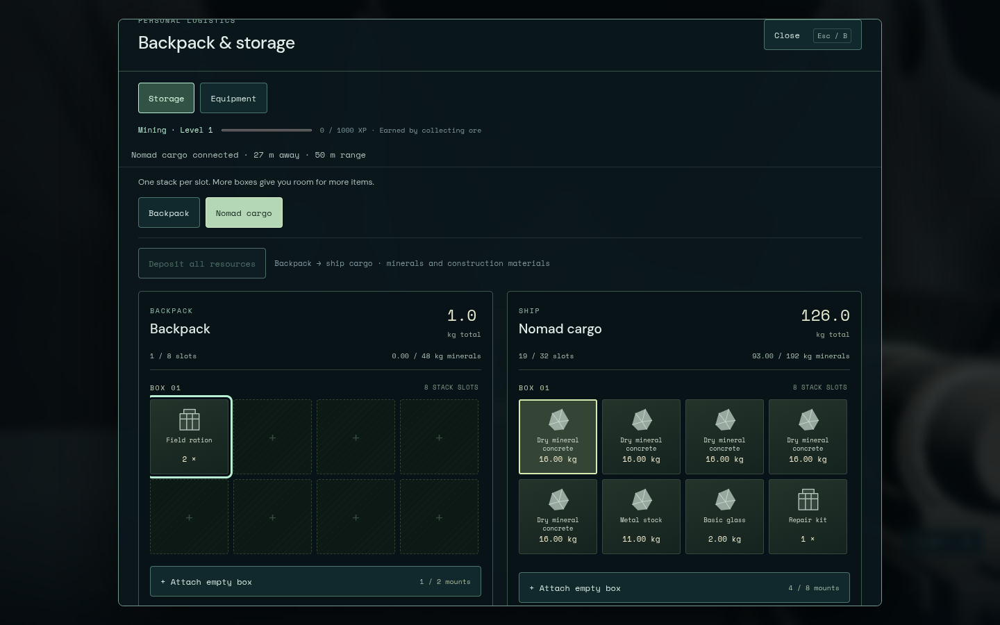
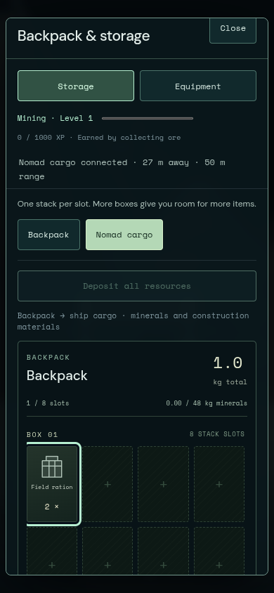
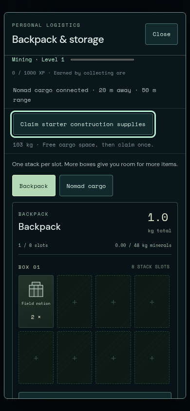
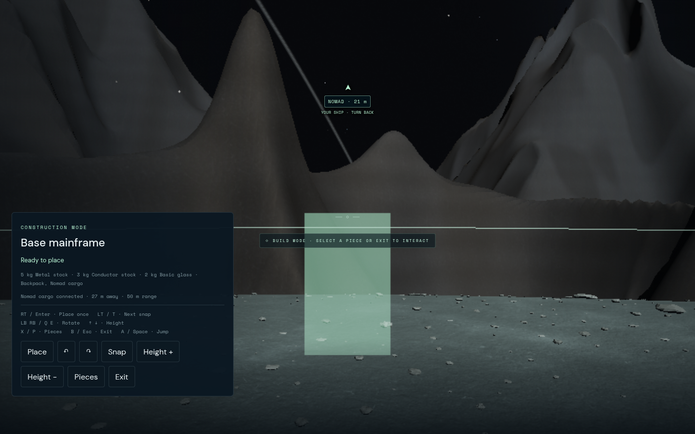

# One-time starter construction supply

The player explicitly requested ship supplies so the base kit can be tried
without mining first. The version-1 allocation is finite and goes only to ship
cargo: 80 kg concrete, 16 kg metal stock, 3 kg conductor and 4 kg glass, totaling
103 kg in eight mineral stacks. Existing cargo and equipment remain intact.

The exact bill of materials funds one mainframe, three foundations, two walls,
one doorway, one glazed wall, one staircase, one upper floor/roof and one crate.
This is a set of components, not automatic terrain preparation or placement.
The normal four-box ship has 192 kg mineral capacity and 32 shared stack slots.
The starter kit fits alongside its normal supplies; the backpack receives none.

`state.starterConstruction = {version:1, claimed:false}` defaults absent receipts
to pending. A successful `MiningStore.claimStarterConstruction()` commits all
components and `claimed:true` together in one save write. Calls after receipt
are no-ops, including after spending, transferring, depositing and reloading.
No mining XP is granted. A full ship retains the pending entitlement and cargo;
freeing capacity allows an explicit retry. Partial grants are never issued.

Startup integration calls this method only after the build/save validation stage,
not from the MiningStore constructor. This avoids rewriting an invalid build
extension before its owning validator has inspected it. The caller owns physical
access for a manual cargo retry. Missing receipt remains pending across reloads
even when no write is possible. Invalid receipt formats block the save and retain
the original bytes. There is no conversion or reset of existing material amounts,
cut fields, equipment, ammunition, economy or mining skill.

`tests/starter-construction.test.js` passed five tests: exact piece costs/default
ship fit; legacy pending migration with retained cargo/cuts/XP; full mass and full
slots retaining pending then successful retry; quota rollback and two-session
stale-claim rejection; malformed receipt retention. The final combined `npm test` run passed all 527 tests across 73 configured files
in 41.14 seconds. Production Vite build passed (155 modules, existing chunk-size
advisory). Independent review found no high-impact transaction/access defect.

`tests/ship-cargo-access.test.js` covers the inclusive 50 m boundary, vertical
separation, moving ship, EVA, paused dialogs, missing/malformed origins, large
world-coordinate precision, seated/cabin access and crash denial. Build-state
checks verify direct ship payment, mixed backpack/ship quota rollback and an
actor/ship range change between valid preview and activation.

The Chromium 151 controller-only journey uses fresh storage with no resource or
pose grants: normal kit, Selene transit, landing, physical hatch exit, mainframe
placement from ship with an empty material backpack, View→ship transfer and
Deposit all, physical movement to 52.82 m, missing ship inventory/source, rejected
placement with unchanged cargo, return inside 45 m and reload with no kit refill.
The outside ghost also had uneven-terrain rejection; this proves source exclusion
and no spend, while the focused build-state test isolates the range-only rejection.
Physical Xbox hardware remains untested.

The separate `ship-access-ui.config.js` Chromium fixture passes 2/2 in 8.2 s:
change ship position while cargo remains open, revoke target/access, restore range
and reselect by controller; reject a full-hold kit claim, free cargo in the fixture,
claim through the real controller router while holding A, and reload without a
second award. The pending button fits 390×844. These are disclosed synthetic
position/cargo fixtures, not substitutes for the production journey above. Final
edge checks have zero page/console errors or warnings. An earlier strict-console
run failed on the fixture's missing favicon; adding its data favicon corrected it.

Reviewed new desktop/390px phone captures show the range and cargo actions without
horizontal page overflow. The ship grid scrolls below the backpack on narrow
screens. These captures do not replace the prior Opus 3.5/5 visual review or its
remaining merge/performance gates.

READY FOR REVIEW: src/mining/starter-construction.js, src/mining/store.js,
tests/starter-construction.test.js, docs/qa/base-building/starter-construction.md
