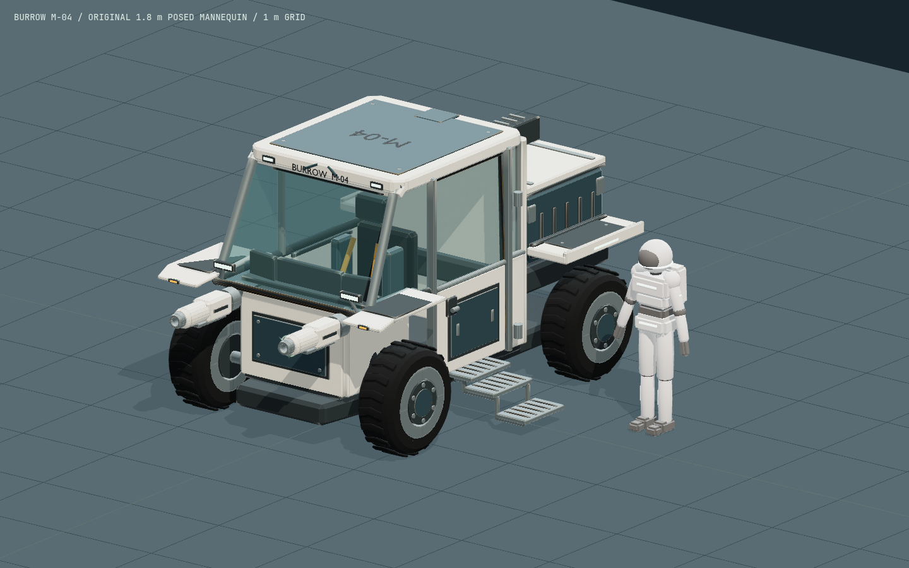
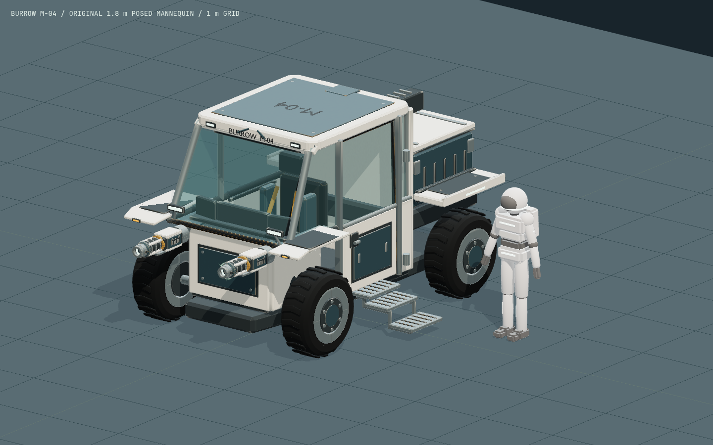
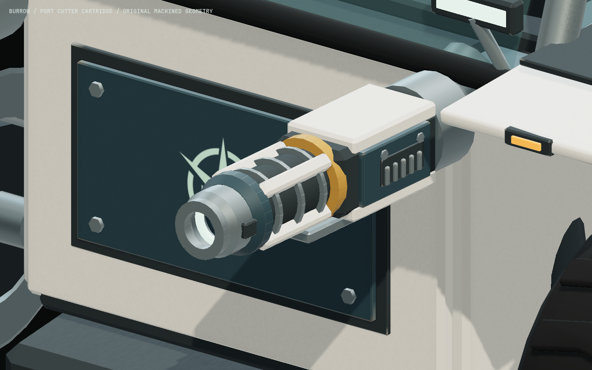
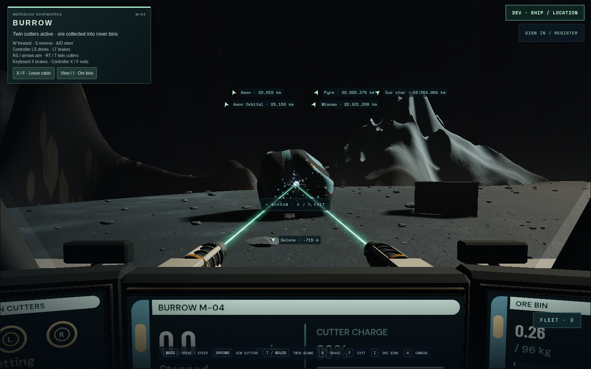
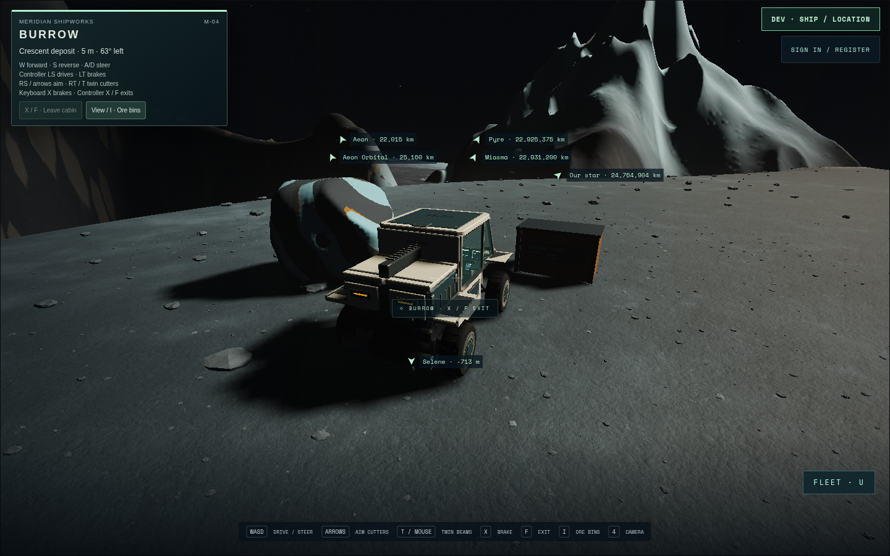
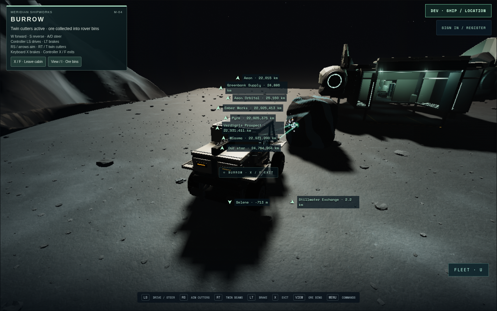
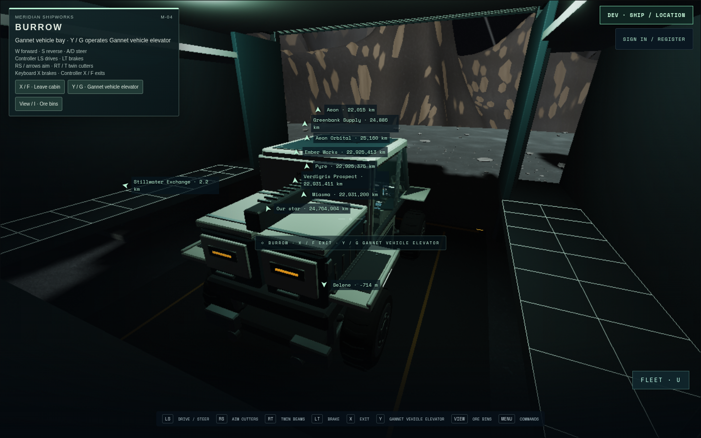

# Burrow cutter and reverse follow-up 13a

Cees reported simple cutter heads/beams and a rover that stayed on the brake
when reversing. This follow-up continues draft PR 92. The cabin checkpoint
[12e record](production-record.md) remains historical evidence for that export.
Current functional/integration results are recorded below; independent visual,
physical-controller and performance acceptance remain pending. No public release.

## Result

The two original Blender cartridges now have split ceramic armour, petrol service
cheeks, captive fasteners, separate cooling fins/collars, ochre locks, ceramic
collimator ribs and stepped open tungsten nozzles. The original moving roots,
barrel-end muzzle sockets and whole vehicle envelope remain intact.

`src/rover-cutting-beam.js` draws each actual muzzle ray as a fine hot core, soft
mint sheath and two moving filaments. Aperture glow stays at the physical bore;
the contact glow appears only at a real ray hit and follows its surface normal.
Existing rock chips/collection particles still follow actual mining. Effects do
not change range, extraction, energy, inventory or hit authority. Reduced motion
freezes the procedural flow. Logarithmic depth, depth testing and render-local
coordinates are retained, and all owned resources are disposed.

The reverse defect was reproduced in the actual `RockCollision.sweep`: a capsule
at 0.2505 m from a plane, radius 0.25 m, reported a hit for both a 0.0001 m move
toward the wall and a move away. Burrow rejects any hit, so it could remain stuck
at its last safe contact. The sweep now reports an obstruction only when motion
points into the contact; contact resolution and grounding still run. Exhausted
contact iterations remain a conservative stop. New tests retain inward and
through-wall blocking while checking separation and tangential travel.

The MFD and status message now distinguish **Drive blocked** from **Brake held**.
Hints explicitly identify keyboard **S** as reverse and keyboard **X** / controller
**LT** as the independent brake. Controller stick-back and touch reverse retain
their existing shared input routes; no controller remapping was introduced.
An optional question about Cees's exact input was unanswered during reproduction;
the contact defect is confirmed, without assuming it describes every possible stop.

## Source and identity

| Item | Current result |
| --- | --- |
| GLB SHA-256 | `85bfeaa96d5830e1aac752f154fcf37410ffdfd44c5e152dae4ae5cdc862224e` |
| Packed GLB | 2,611,096 bytes; 29,254 triangles; 44 primitives; 120 nodes; 9 materials |
| Previous 12e | 2,427,608 bytes; 24,902 triangles; SHA `5433c83744a21e6c4022dfd9b840f15069c96f95111b0518fbb851d2f8495bc1` |
| Layout, unchanged | SHA `2d3912564b0cd16d212ae47fa528d475cc93a2941dcbdce10cbbad3b1e231a38` |
| Textures | Existing three 1024² lossless WebP PBR swatches plus 512² RGBA Meridian emblem; no added maps |
| Beam cost | Six draws / 12 triangles for both heads while hitting; previous cylinders were two draws / 3,072 triangles |
| Instruments | Existing five faces / 10 triangles / one 1024×512 atlas; no added UI texture |

Rebuild with the [asset README](../../../assets/mining-rover/README.md) commands.
The additional source is `blender/rover_cutters.py`; editable geometry is retained
in `mining-rover.blend`. Blender 5.2.0 LTS, existing Python/Pillow 12.3.0 environment
and Node 26.7.0 were used. Original geometry and existing procedural PBR only;
no new generated art, paid services, external model or dependency.

## Checks and evidence

- The new contact regression fails on the previous implementation, then passes
  after the correction: `/tmp/burrow-reverse-before.log` and
  `/tmp/burrow-reverse-after.log`. The latter has 18 passing focused cases.
- `npm test`: all 148 normal test files pass at this feature checkpoint;
  `/tmp/burrow-cutters-full-unit.log`. Build passes, including the explicit dev
  launcher bundle; `/tmp/burrow-cutters-13a-production.log`.
- Actual GLB tests pass: carrying budget/bounds/muzzle positions, clear forward
  glazing, all five screen corners and the complete 125-sample entry-eye route.
  `/tmp/burrow-cutters-author13a/` records 18 cutter/lamp poses with no contacts or
  outgoing self-rays, and 24 wheel states with zero unexpected intersections.
- Nine native PBR author views pass with no browser diagnostics:
  `/tmp/burrow-cutters-native13a/`. The shared preview was not used for these.
- Actual keyboard game journey passes in 1.1 min. It physically exits/reboards,
  mines real ore, inspects inventory, tests held-input suppression, reverses
  directly from forward motion and then drives into an actual collision stop.
  Holding S then clears the obstruction and reaches -2.775 m/s, with brake input
  zero. Page/console diagnostics and request failures are empty.
- Keyboard mining sampled 498 draws / 1,234,968 triangles, 1440×900 viewport,
  1152×720 drawing buffer, Chromium 151.0.7922.173 / AMD Radeon 860M / ANGLE GL.
  These are scene counts, including existing renderer passes, not a hardware
  frame-time acceptance. The scene exceeds the cockpit triangle target; the
  small beam change does not certify the inherited surface scene budget.
- Repository checks initially rejected a misspelled task status. Correcting the
  metadata to the existing `active` enum passes. Suggested-plan checks ran.

## Retained failed attempts and limits

The first native launch request found the floodlight browser active; its guard
refused before launching. No Chromium startup failure or core dump occurred.

The first phone case reached real mining and inventory, then its second-finger
pager tap did not advance. Trusted down/up were recorded, without capture/click.
This also occurred in historical 12e attempts. A last-cut inventory rerender is
suspected; the test now waits for the real pending cut to publish before inspecting
the inventory. No inventory runtime change or confirmed pager defect/fix is claimed.
Original failure, native event history and videos remain at
`/tmp/burrow-cutters-panels13a/`; the keyboard case there passed.

The corrected phone case passes in 1.1 min at
`/tmp/burrow-cutters-phone13a02/`, with no application diagnostics or failed
requests. It includes the complete physical cabin route, real mining/inventory,
held-input suppression, direct forward-to-reverse and backing away from a real
collision. Controls are native Chromium touch contacts at 390×844.

An extra combined phone attempt subsequently failed at the pager even with
`mining.pending === false`: the native touch landed on `HEADER`, although the
prior DOM hit test reported the pager. That disproves the pending-cut wait as
an established fix. Its full receipt is retained at
`/tmp/burrow-cutters-union-phone13a/`. The fixture now captures the presented
dialog before locating/tapping and asserts where the native contact actually
lands. The final combined run **passes in 1.2 min**, with trusted down/capture/up
on the pager and the existing semantic click. No inventory runtime change or
general browser fix is claimed. Final receipt and video:
`/tmp/burrow-cutters-union-phone13a02/`; errors, warnings and failed requests are
empty. It retains an atomic snapshot of the real collision stop followed by
successful native reverse. Test diagnostics are committed as `f241817`.

| Previous native exterior | Updated native exterior |
| --- | --- |
|  |  |

Native comparisons use the same framing algorithm, lighting and backend as 12e;
minute GLB quantization differences can alter the fitted camera. The game view is
actual play, with visible controls and a changing mined surface. Original videos
are retained alongside the keyboard/phone receipts; still captures alone do not
certify every frame of motion.

The new asset has no independent rubric yet. Author inspection, finite collision
samples and injected browser controls do not establish physical-device support,
continuous swept clearance, structural strength or final concept-level art quality.

## Combined controller and local integration

The complete unchanged Gannet controller journey passes in 3.9 min on combined
runtime `180a461`: pilot exit, physical Burrow door/steps, elevator descent,
four wheels onto canonical terrain, actual steering/mining, inventory transfer,
reverse reloading, pilot return, loaded flight and landing. It transfers
0.692856 kg of actual basalt, conserves stock and passes dialog/native-focus,
disconnect, replacement and unsupported-mapping gates. Page/console diagnostics
and request failures are empty. This is injected standard Gamepad evidence,
not a physical controller. Source and served-asset hashes are stable, including
the new shader and corrected collision module. Originals and video:
`/tmp/burrow-cutters-gannet13a/`.

The combined branch passes all 152 normal test files, the production build
(4.63 s), repository and suggested-plan checks. Logs:
`/tmp/burrow-cutters-union-unit.log`, `/tmp/burrow-cutters-union-build.log`,
`/tmp/burrow-cutters-union-repo.log`, `/tmp/burrow-cutters-union-plan.log`.
The server imports `RockCollision` only for unchanged raycasting; no server,
inventory/schema or protocol change was introduced by this follow-up.

Feature runtime `03704e1` was integrated locally at **`b34bc69`**, 2026-09-08
17:16 UTC, preserving final HUD `9b629f2` and settlement `290f5ad`. The latter
merges add only metadata relative to tested runtime `180a461`. The guarded
fast-forward preserved the exact 56,247-byte unrelated HANDOFF suffix, SHA
`3bf320f09e28c4d384e811998fc68a7724ab0093d01fc486c0454eb91e7f9abe`.
Existing 5178/8087 health, launcher and changed module requests return HTTP 200;
the served GLB matches `85bfeaa9` byte-for-byte. Receipt:
`/tmp/burrow-integration-cutters-runtime/`. Burrow required no service restart;
no public deployment was performed. Final combined phone validation passes as
recorded above. Floodlight `1d4181c` subsequently retains the Burrow runtime;
its owner handled its separate catalogue/service update. Final metadata does
not change the checked Burrow runtime, model or input bindings.
