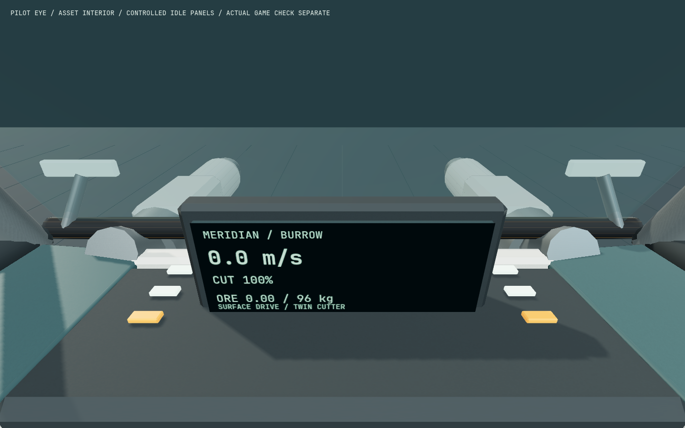
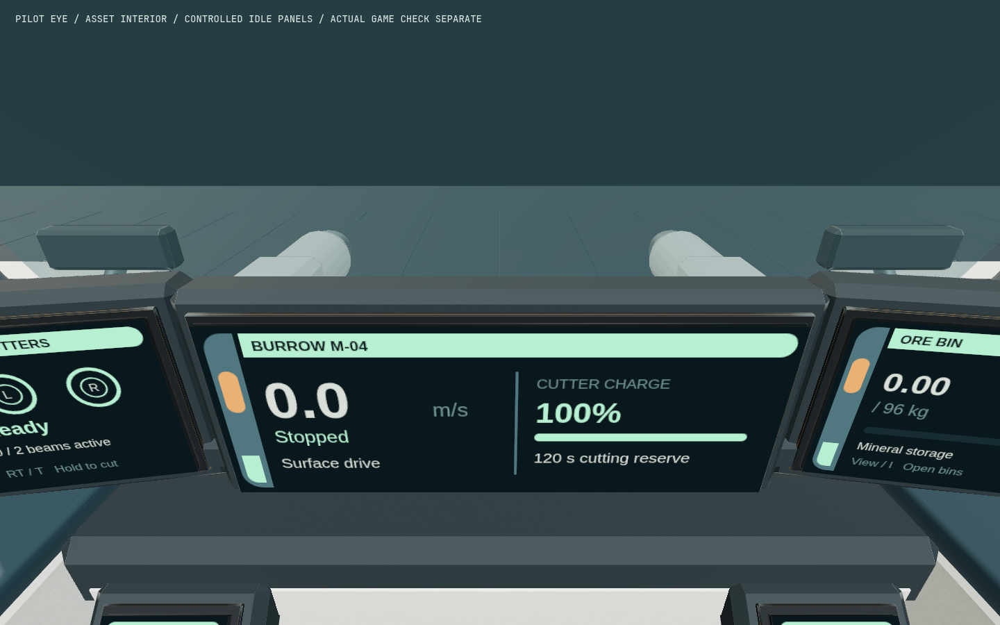
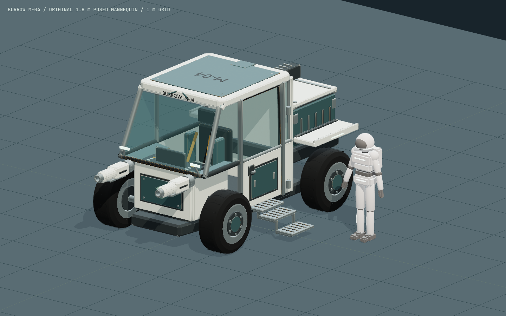
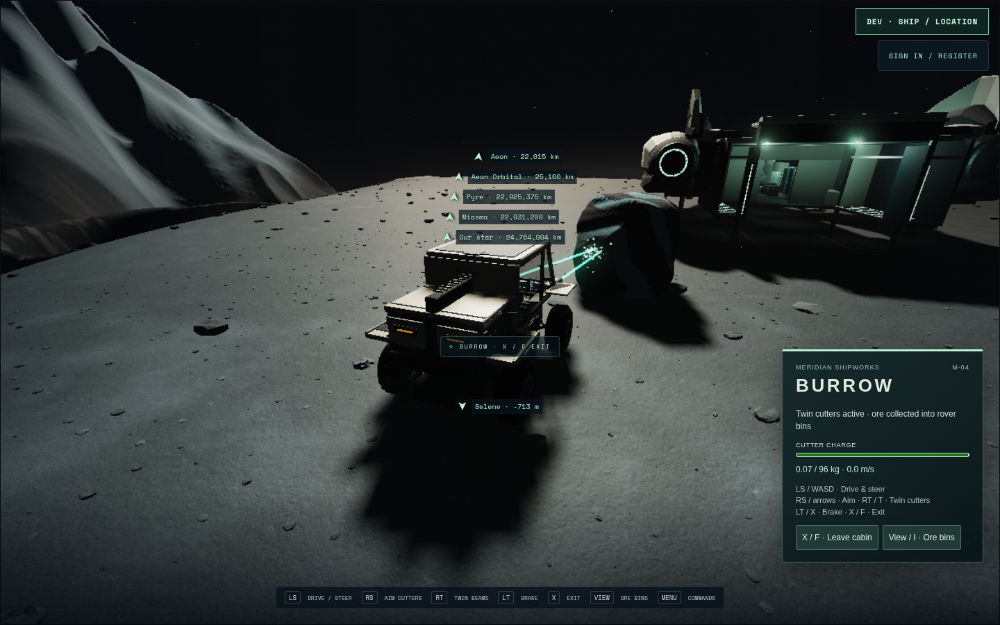
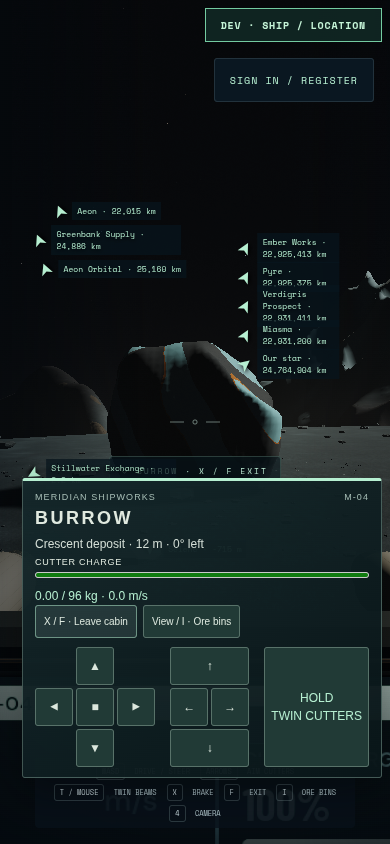
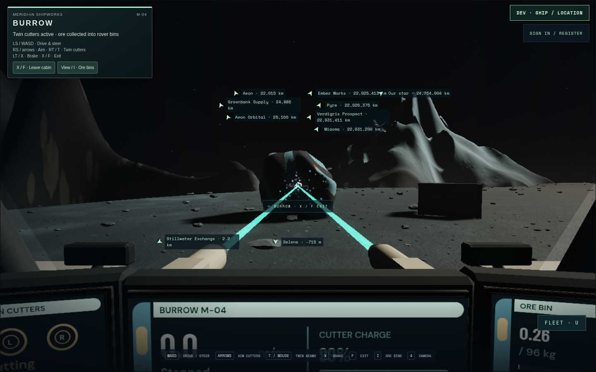
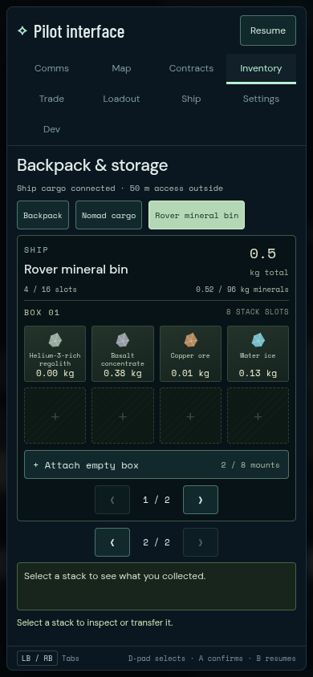

# Burrow concept checkpoint 12e

Status: locally integrated development checkpoint at `ab418ca` on 2026-09-08.
Native author inspection, complete controller carrier gameplay and final combined
keyboard/native-touch journeys pass. Independent functional/rubric acceptance, physical
controller testing and performance acceptance remain pending. Historical Burrow
scores do not approve this export. Nothing in this record authorizes a public release.

## Result and source

[Brief](../../briefs/burrow-concept-upgrade.md),
[editable source and reproduction](../../../assets/mining-rover/README.md),
[approved concepts and prompts](../../../assets/mining-rover/design/prompts.md).
Cees requested progress toward these concepts, replacing steering wheels and
joysticks with flat controls. “icars” is provisionally interpreted as LCARS.

The cabin now has three fitted instruments and two flat armrest pads, ivory liners,
recessed stowage, warm emissive coves, vents and seat welts. Exterior work adds
fuller tread, shallow front fenders, service covers and work-lamp housings. The
runtime panels show actual speed/direction, charge-derived cutting reserve, active
cutters, stored ore and applied drive input. The original physical steering column,
yoke and pedals are removed. Flat faces provide telemetry and input feedback;
driving still uses the shared keyboard, controller and visible phone controls.
There is no new ray-click driving system, pressure simulation or seated hand IK.

| Contract | Current measured result |
| --- | --- |
| GLB SHA-256 | `5433c83744a21e6c4022dfd9b840f15069c96f95111b0518fbb851d2f8495bc1` |
| Layout SHA-256, unchanged | `2d3912564b0cd16d212ae47fa528d475cc93a2941dcbdce10cbbad3b1e231a38` |
| Asset | 24,902 triangles; 2,427,608 bytes; 44 mesh primitives; 120 nodes; 9 materials; 4 embedded images |
| Runtime faces | 10 additional triangles, 5 faces, one shared material and 1024×512 canvas texture; no mipmaps; 10 Hz redraw |
| Resting envelope | 4.65 m long × 3.02 m wide × 2.50 m high; actual quantized bounds within 0.12 mm of the established box |
| Pilot eye | `[0, 1.78, -0.82]`, unchanged; continuous clear forward glazing |
| Access | Original pressure-door hinge, fixed port steps and physical waypoint route |
| Machinery | Four wheels, ±0.22 m suspension, original two cutter pivots and barrel muzzles |
| Gameplay | 120 s continuous twin cutting / 30 s recharge; 96 kg rover mineral bin; carrier and ground routes unchanged |

The source build used Blender 5.2.0 LTS and Python/Pillow 12.3.0. Reproduction uses
the three commands in the asset README. The final build log is
`/tmp/burrow-concept-build12e.log`. Colour maps are original procedural swatches;
the ChatGPT images inform shape/material direction and are not projected textures.
The approved existing Meridian emblem retains its separate provenance.

## Actual-asset checks

`tests/rover-asset.test.js` loads the delivered GLB and production display geometry:
four cases pass for dimensions/cost/muzzles, unobstructed forward rays, all five
display centres/corners, and the complete sampled entry-eye route. Three
`tests/rover-display.test.js` cases check real power consumption/recharge, canonical
mineral storage/capacity and applied drive/mode presentation. Both files are in
the normal test command. `npm test` passes all 148 test files on Node 26.7.0; this
runner reports files, not the number of individual cases. The pre-HUD production
build passes in 6.51 s; repository and suggested-plan checks also ran.

Author CPU receipts: `/tmp/burrow-concept-author12e/`. The exported geometry has
zero escapes from 762 lateral shell rays and 32 quarter-window rays. All 125
samples of the 0.12 m eye sphere clear the open-door entry route; the minimum is
0.143825 m. All 24 wheel states have zero unexpected intersections under the
existing narrow hub-mating allowance. Six stair/stringer contacts remain attached,
without protrusion above treads. Twelve nonzero door angles have no static shell
contacts; the closed angle contacts its seals. All 18 sampled cutter poses clear
lamp brackets and their own outgoing rays. These finite checks are not watertight,
structural-load or continuous motion certificates.

The existing seated-mannequin diagnostic records 529 triangle pairs, including
seat/harness and armrest-pad contacts. This hypothetical pose is a scale reference,
not evidence of implemented hand placement or full-body clearance. That acceptance
remains open; the eye-route and actual playable access are separately validated.

## Native comparison and game evidence

| Before | After |
| --- | --- |
|  |  |
|  |  |

These are isolated native Three.js PBR author captures, not concept renders or
gameplay. Cockpit position/target/FOV match exactly; exterior views share the same
framing algorithm and lighting, with minute bounds-dependent quantization shifts.
The previous model is frozen SHA `831b9569633efda11652e3827057d2f4bc3f47d20f23a47df152fa437cb29468`;
its historical runtime display is reproduced at the same controlled idle state.
Current runtime panel geometry/painting is used for the after fixture. Both eight
view sets have no console/page diagnostics. They use Chromium 151.0.7922.173,
AMD Radeon 860M / ANGLE GL, 1440×900 plus 390×844 framing. Source receipts and
original images: `/tmp/burrow-concept-before12e/`, `/tmp/burrow-concept-native12e/`.
The current native exterior reports 57 scene draws including the posed human,
floor and grid; this is not the asset primitive count or a frame-time claim.

The unchanged complete `scripts/gannet-gameplay.spec.js` passes through Gannet
pilot exit, physical Burrow entry, elevator lowering, all four wheels onto canonical
terrain, steering to a real outcrop, twin-beam collection, inventory transfer,
reverse reload, pilot return, loaded launch and landing. Dialog, real native
focus, controller disconnect/replacement/unsupported-device gates all require
release before cutters resume. It transfers 0.704307 kg of actual basalt from the
rover bin, preserving inventory conservation. Inputs are injected standard Gamepad;
there is no physical-device claim. Served asset and source hashes match before
and after. Errors, warnings and failed requests are empty.

Original controller receipts/video: `/tmp/burrow-concept-gannet12e/`. The final
renderer is AMD 860M ANGLE GL, viewport 1440×900, internal buffer 1152×720.
`scripts/burrow-concept/gameplay.config.js` reuses that journey with a private
production preview on 5630 and ephemeral memory API on 8630.

`scripts/burrow-concept/panels.spec.js` separately passes keyboard and 390×844
native-touch physical exit/reboard, real ore collection, held mining across cargo,
fresh-press resumption, forward/steer/brake/reverse and actual atlas colour/resource
checks. It uses the explicit developer surface start before those actions; the
carrier journey above supplies the longer entry route. Initial receipts are
`/tmp/burrow-concept-panels12e/` (2/2, 2.4 min). App errors/failed requests are empty.
Each initial case records one warning caused by the test repeatedly reading the
production canvas; the final fixture reads a CPU inspection copy instead.

Phone controls remain visible and usable; they cover much of the fitted console
at this narrow viewport. In the first desktop captures the old HUD covered the
ore MFD. The final occupied desktop CSS places actions and bindings at the upper
left and lets the physical instruments supply telemetry. Final union evidence
and integration disposition are recorded below.

## Failed iterations and remaining gates

- The first texture command used system Python without Pillow. Blender then ran
  with old maps. That attempt is retained in `/tmp/burrow-concept-build12.log`;
  the existing Pillow environment rebuilt the textures and asset correctly.
- Candidate 12's main-screen corners hit the shoulder shelf. Lowering the plinth
  and recessing that shelf cleared them. Candidate 12c's armrest lower corners
  hit a palm rest; raising the pads to Y1.145 cleared all five complete faces.
- Candidate 12d's low cabin cove left only 0.109744 m entry-eye clearance and four
  quantized side-jamb ray escapes. Candidate 12e raises the cove and overlaps the
  aft jamb by 15 mm; its checks pass. Original `/tmp/burrow-concept-author12d/`
  failures remain alongside the passing 12e output.
- The sandboxed production build hit read-only Vite cache access through the
  pre-existing dependency link. The approved escalated build passed. This is not
  an application defect; logs retain both results.
- A prior independent reviewer completed the frozen preproduction contract
  checklist at `/tmp/burrow-concept-independent/review-checklist.md`. Its later
  candidate-12 probes failed setup because their output was inside the fixture
  repository. They do not count as a candidate review. Current geometry/native/
  game evidence is author verification; independent functional and visual rubric
  review is pending. No historical score has been carried forward.

Remaining art work includes finer material/lighting polish toward the concept and
seated hand/body posing. The cabin is geometrically enclosed; emissive coves do not
constitute simulated life support or a new local lighting system. Broader terrain,
hardware controls, performance and multiplayer rover authority remain separate.

## Final combined validation and local integration

The private combined candidate `dd31cd6` passes **151 normal test files**,
production build **4.54 s**, repository checks and the suggested check plan.
It preserves the checked foundation, settlement, base-commerce and encounter
features. The normal-test command preserves every foundation entry and adds the
two Burrow files; the handoff conflict retains both histories. The first private
merge command ran before worktree creation had finished and stopped on its index
lock; after checkout completion the merge proceeded. No shared files were touched
by that setup failure.

The final desktop route passes in **1.0 min**, with the HUD clear of the ore
screen. Its original output is `/tmp/burrow-concept-union-panels12e/keyboard/`.
The same batch's phone case stopped at a non-hittable centre as inventory opened;
layout timing was suspected, and the fixture now observes three stable, hittable
frames before contact. Phone attempt02 then delivered a tap without advancing the
page; no application cause was established. Attempt03 completed every gameplay
action, with trusted native down/up/capture events, then failed an overbroad check
that also demanded the existing second-finger helper's semantic `.click()` be
trusted. That helper deliberately invokes the normal button handler. The final
assertion distinguishes real native contacts from those semantic clicks. All
three original attempts and videos remain in `/tmp/burrow-concept-union-*`.

Final phone attempt04 **passes in 1.1 min**, including held-input cargo paging,
release/repress, real ore, physical exit/reboard, steering, braking and reverse.
There are 48 trusted pointer/capture events. Both final desktop and phone receipts
have **zero app errors, warnings or failed requests**. Their runtime and asset
hashes match the production build; subsequent changes are review fixtures and
metadata only. Final phone output: `/tmp/burrow-concept-union-phone12e-04/`.

The checked candidate was combined with foundation's final `01a28df` metadata,
then fast-forwarded into local `dev/all-features` at **`ab418ca`**. The guard
preserved the exact **56,247-byte** uncommitted handoff suffix and retained the
existing preview/API processes. Direct and proxied API health, launcher, display
module, CSS and model all return HTTP200. The served GLB is byte-for-byte identical
to the reviewed `5433c837…` artifact. Receipts: `/tmp/burrow-integration-runtime/`.
No API, schema, protocol, account data or public deployment changed.

Test in the normal [local preview](http://127.0.0.1:5178/?dev=1&intro=0&start=rover-surface&debug=1&seed=7291),
or use F2 → Burrow mining — Selene surface. Select Gannet → Selene for physical
carrier entry. [Draft PR92](https://github.com/AvonMexicola/star-agent/pull/92) is
stacked on station-access PR88 / `1435008` to keep its changes bounded.
The source integration is complete; independent art acceptance remains pending.
