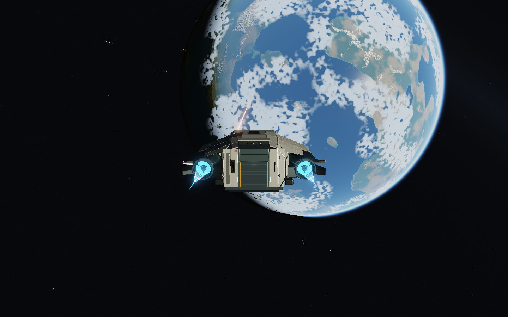
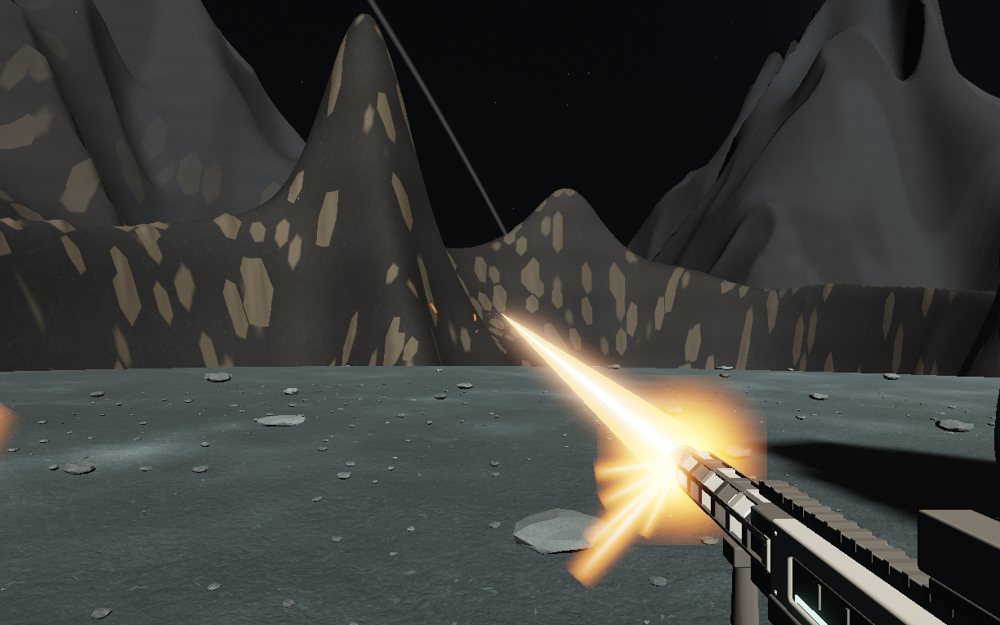
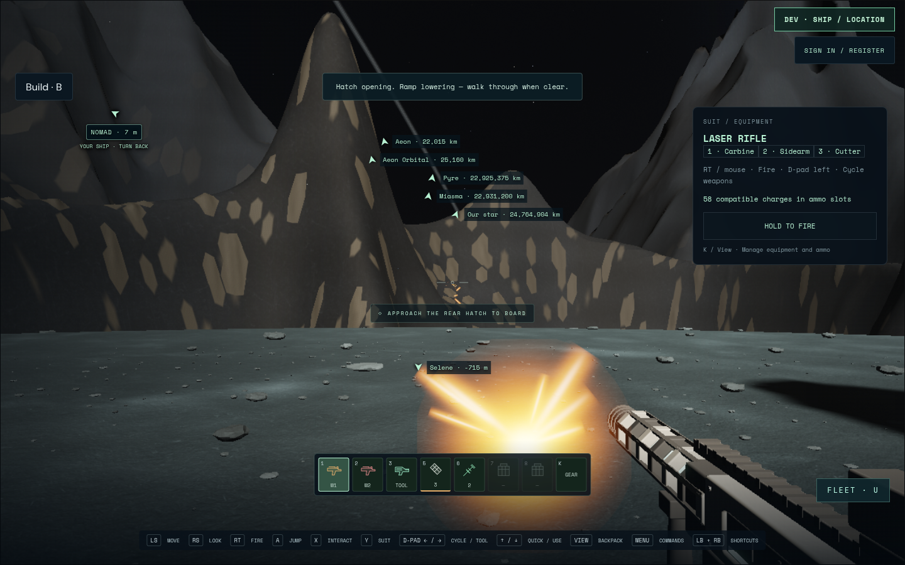
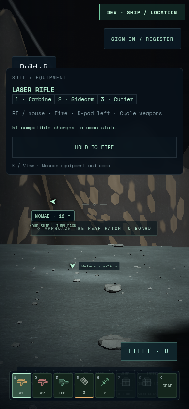
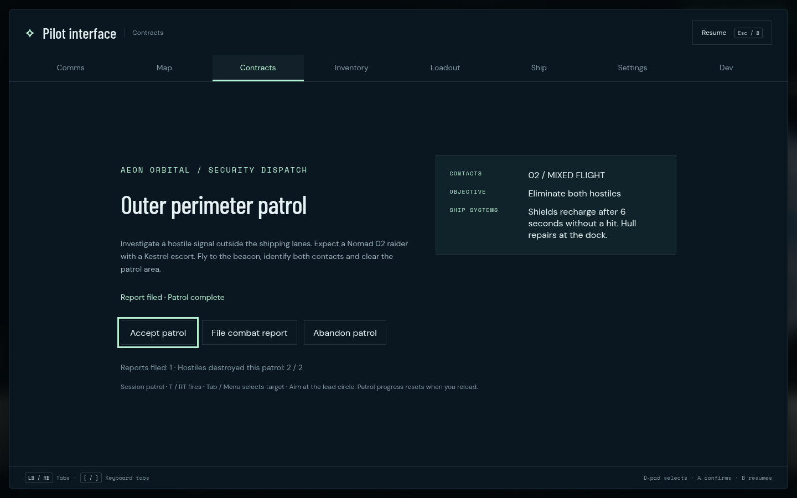

# Combat momentum and moving muzzles

2026-09-07 · SA-FLIGHT-001 · author verification; independent review pending.

## Scope and behavior

All flyable hulls use ship-local finite thrust/RCS authority. Default fly-by-wire
corrects drift and brakes on release; unlocked mode retains translational momentum
and rotational input. Hover/aerodynamic compensation remains an intentional assist
reserve. Full braking provides1.5× correction authority. Speed regime changes
cannot clamp away existing velocity. Explicit transit and physical contacts retain
their existing semantics; landing assist refuses speeds above 10 m/s.

Combat/cruise selection is independent of assist. Combat limits are 220/180/120 m/s
for Kestrel/Nomad/Atlas. Firing requires combat mode, actual speed within the cap,
no boost, no automation and fully retracted gear. The fitted gun pipeline, sizes,
local flashes and unavailable-kit interlock are preserved.

Laser pulses refresh their source from the current actual barrel for their brief
visible lifetime. Their original hit point and one-shot damage remain unchanged.
Pulses render at least once after a slow frame. Ballistic effects and combat shots
inherit the shooter’s velocity; lead and wall queries use the same trajectory.
All GPU positions remain camera-relative.

## Quantitative checks

Full nose-axis brake from 100 m/s in vacuum, 120 Hz integration, ending below 1 m/s:

| Hull | Distance | Time |
| --- | ---: | ---: |
| Kestrel |58.3 m|1.475 s|
| Nomad |96.7 m|2.400 s|
| Atlas |251.0 m|7.367 s|

These are controlled physics measurements, not frame-time or flight-skill claims.
The navigation regression pitches every hull down at 100 m/s: an early brake avoids
the floor, a 25 m late brake crashes, and landing assist cannot erase the dive.
Tests also cover 90° drift ,180° unlocked reversal, 30/60/120Hz convergence, inherited
projectile sweeps/tails and server-owned mode snapshots plus sustained braking.

## Validation log

- Initial source8811e6b:676 units passed;87 multiplayer passed, one PostgreSQL
  integration fixture skipped without its database setting; production build passed.
  Five Chromium browser journeys passed on the pre-fitted-gun base.
- Fitted-gun/RT/menu merge7b64320:694 units and production build passed.
- Landmark integrationf1efc01 plus additional regressions:702 unit tests passed;
  89 multiplayer passed, one database fixture skipped. No schema/data migration.
- Navigation integration78031fb:714 unit tests passed. The final flash fix6f8b195
  adds the pool-reuse regression:715 unit tests passed. Final multiplayer routing:
  90 passed, one PostgreSQL fixture skipped without its database setting.
- Chromium151.0.7922.173, ANGLE OpenGL ES3.2 on AMD Radeon860M/radeonsi ACO,
  desktop viewport1440×900 and phone390×844. The full moving-weapon controller
  route passed again after the flash fix (1.9m), with no page/console errors.
  Kestrel, Nomad and Atlas each passed the controlled braking/retreat browser check.
- Final Nomad controller patrol passed (1.6m;1.7m including startup) on the
  unchanged final runtime, with evasive stick input, two kills, combat report and
  return to play. No page/console errors. It used project-disk evidence/results
  after the quota failure. Browser fixture/output commit1911960; runtime6f8b195.
- Production builds passed throughout the focused browser runs; only the existing
  Vite chunk-size and NO_COLOR/FORCE_COLOR warnings remain. Repository checks pass.
- The integration steward SA-INT-002 already includes runtime6f8b195 in its combined
  candidate. Final shared preview promotion/restart is serialized by that steward;
  this record does not claim production deployment.

Initial browser attempts failed before useful gameplay verification: restricted
/tmp capacity caused resource/page/WebGL failures, and an overlong alternative
TMPDIR caused a Chromium Unix socket-path startup abort. A short on-disk TMPDIR
and approved host execution succeeded with the same ANGLE gl backend. No app
change or browser flag was used to mask those startup failures. The first route
fixture also used an obsolete rifle menu entry; the real D-pad equipment route
replaced it. Current fixtures use RT fire, LT braking and the real tabbed menu.
A server regression initially omitted the input envelope, then let its input lease
expire; the final fixture supplies sustained sequenced brake intent like a client.

Raw core evidence/logs remain in /tmp/star-agent-momentum-evidence and
/tmp/momentum-integrated-{unit,online,browser,build}.log. The final patrol record is
in /home/cees/projects/star-agent/test-results/momentum-patrol/nomad and
/home/cees/projects/star-agent/test-results/momentum-browser-final.log. Curated
captures follow.
The fitted-gun route first failed when the Dev launcher intentionally reloaded
and destroyed the old animation-frame callback. The fixture now waits for the
new URL and neutral controller state. A later patrol run lost while sitting still
through interruption checks under hostile fire; those checks now occur before
accepting the patrol, and the fight uses stick-controlled evasive motion. The next
run reached combat but failed saving engagement.png with EDQUOT(-122), concurrent
with the runner itself failing to create a /tmp mount. The obsolete owned temporary
checkout was removed and the final patrol outputs moved to the project disk.

## Captures

These are author-inspected game renders, at different poses; no pixel-diff or
performance acceptance is claimed. Canvas frames retain active render resolution.
The final rifle frame shows both the laser and its flash attached to the barrel.
The ship frame uses the fitted gun source, with its authored local flash retained.

Physical controller hardware, independent visual acceptance and FPS targets have
not been verified. Online ship combat and persistent patrols remain out of scope.

