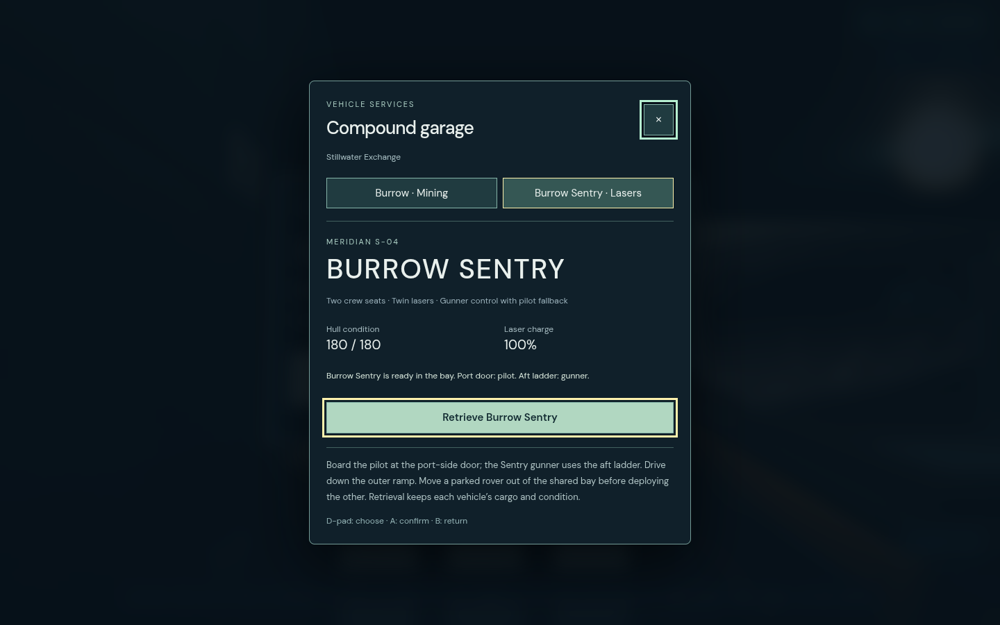
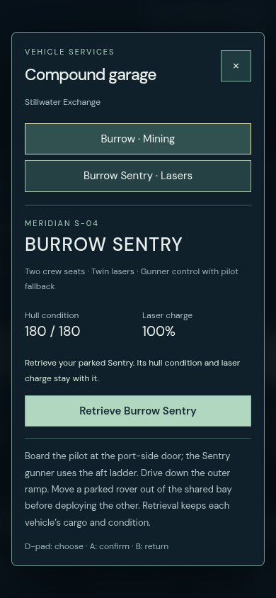

# Civilian garage vehicle choice — verification

The four civilian garage terminals now offer Burrow mining and Burrow Sentry
laser rovers. Only the existing empty, parked vehicle is retrieved. Cargo,
charge, hull condition and turret state survive. The shared bay rejects another
rover; delayed model loading rechecks the open dialog, terminal reach and bay.
Pirate compounds receive no garage service. This follows the existing solo
service scope; publishing the multiplayer build does not add online Burrow
mining or authoritative garage requests.

## Checks actually completed

- 37 vehicle/support/seat/carrier tests pass in5.48s. All four worlds traverse
  the actual garage ramps to canonical terrain. Cached rays match192 canonical
  kit queries; live gate changes remain effective. The Sentry's full4.02m
  envelope rejects a ceiling that the standard Burrow clears.
- Burrow01 full controller journey passes2.5min: land, walk, request, physically
  board, drive to terrain, ore inventory, focus/device/modal suppression and
  return. Keyboard entry and native390 retrieval preserve ore and cutter charge.
  This run precedes the cached collision change; final unit checks cover its
  unchanged default Burrow dimensions.
- Sentry03 final source passes2.7min (runner2.8min): actual controller landing,
  walking, selection, blocked second rover, both physical crew routes, drive from
  raised deck to terrain, aim/fire, backpack, held modal/focus/disconnect gates,
  return, keyboard entry and native390×844 retrieval. One Sentry remains.
- Production build, repository checker and suggested check planner pass.
  The complete release suites and final deployment are recorded separately.

Chromium151.0.7922.173, ANGLE OpenGL, AMD Radeon860M/radeonsi krackan1 ACO;
1440×900 desktop and390×844 phone, seed7291. Application errors and warnings
are empty. Tests inject a standard Gamepad and read navigation for steering;
there are no player/vehicle pose, damage or inventory writes. Physical hardware,
independent art scoring and controlled performance budgets were not tested.

## Retained failures and fixes

01 initially walked into the Sentry's rear corner: its origin is garage z4,
so the port path is site z1.6. The fixture was corrected without changing collision.
02 boarded and reached terrain but exceeded the drive-time bound. Uncached kit
ray generation in vehicle substeps was too expensive; cached exact short rays and
whole-body construction sweeps resolve it. The wheel solver retains the original
26cm floor/step allowance, while the full turret envelope still blocks roofs.
The four-world tests exposed false low suspension/foundation contacts and now
pass. A test used the nonexistent ceiling part instead of the actual floor/flat
roof and was corrected. The registry rejected an invalid in-progress enum and
was corrected to active. Original failures remain in ignored test-results.

Raw logs, state, video and before/after source hashes:
`.worktrees/compound-vehicle-choice/test-results/garage-choice-*`.
The [compact receipt](evidence.json) retains final hashes and precise scope.
The final frozen Sentry source hashes match before/after the browser journey.

