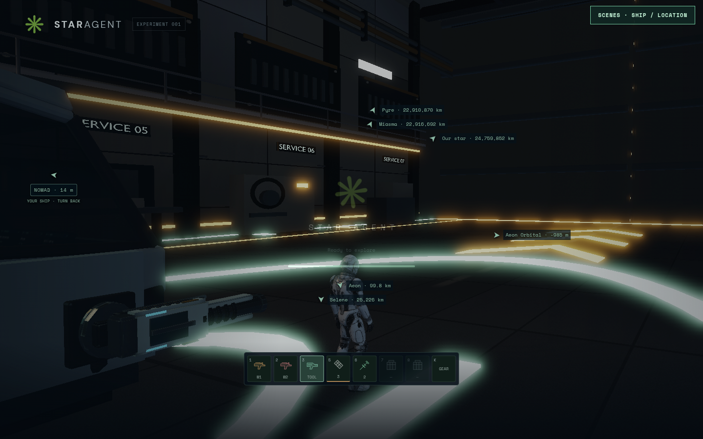
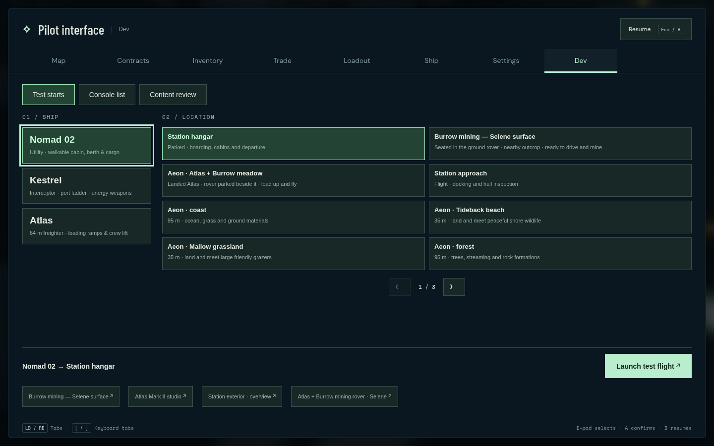

# Direct Nomad entry and model cache correction

The solo explorer and local development root now enter the Nomad hangar opening
after the initial asset/shader preload. The camera starts behind the character
while the doors open. F2, the scene button and controller Menu still open the
existing scene choices. Selecting and launching another scene intentionally loads
that scene; initial selection is no longer compulsory. Explicit ship/location
links, the Atlas meadow and ground mining presets keep their existing setup.
The temporary development session does not replace the regular browser save.

Gameplay model requests now carry a SHA-256 revision generated from each file's
content at build/start time. Three's default loading manager applies it to known
same-origin `/models/` resources, preserving other query parameters and fragments.
Changed assets get a new cache key; unchanged assets can still be reused. Embedded,
external, unknown and Vite-hashed assets retain their existing URLs. Standalone
studios, raw manifest fetches and maps outside `/models/` are outside this fix.
Restart Vite after changing model bytes to regenerate its development manifest.

The old-model investigation found current Nomad and hangar bytes on both live
origins, without a source rollback. Solo's unversioned model URLs allowed 24-hour
browser caching. An older Nomad lacks required interactive nodes and can trigger
the procedural fallback. This establishes a cache failure path, not proof of the
bytes in the user's browser. The current hangar removes the long floor hoses;
wall reels and overhead service cables remain authored details.

Validation on the combined source before the final import-order cleanup:

- All **1,024 normal tests passed**, zero skips, 41.8 seconds; focused startup,
  save, opening and cache cases **30 passed**. Solo build passed in 5.28 seconds.
- `scripts/direct-entry.spec.js` passed in **1.8 minutes**, Chromium
  151.0.7922.173, ANGLE/OpenGL, 1440×900. This is functional evidence, not an FPS
  benchmark. No physical controller was used.
- The ordinary URL produced exactly one document navigation and a ready authored
  Nomad, walking spawn, visible character, shoulder camera and opening doors.
  F2 and injected standard Gamepad Menu/B reopened/closed choices; a held trigger
  stayed gated. Left-stick movement entered play. An existing saved Atlas was
  unchanged. Only explicitly launching Kestrel caused a second document load.
- Actual browser model responses and query revisions matched Nomad
  `33a64aba2093e40768862fb130e81382b1900c11a8913080202efe9d89f204da`
  and hangar `59c4e38845f2ce6d93e25bc7e7f5ac2eb709591a06a1fdeac464ad2dde03863d`.
  No page/console errors or solo API/WebSocket requests occurred.
- Independent source review checked loader coverage and entry/save/online
  boundaries. Its import-order suggestion was applied: the cache hook is now
  literally the first gameplay import, before all potentially eager loaders.
  Cache tests and repository checks passed after that ordering-only cleanup.

Local full receipt/screenshots: `/tmp/star-agent-direct-entry/`; browser log:
`/tmp/star-agent-direct-entry-browser.log`. The initial screenshot catches the
existing loading overlay fading away. The first preload itself is still required.
No server, account schema, inventory persistence or multiplayer protocol changed.

