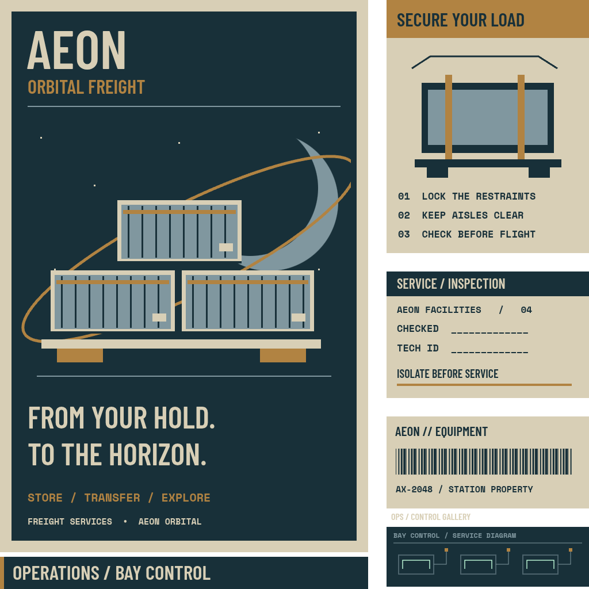
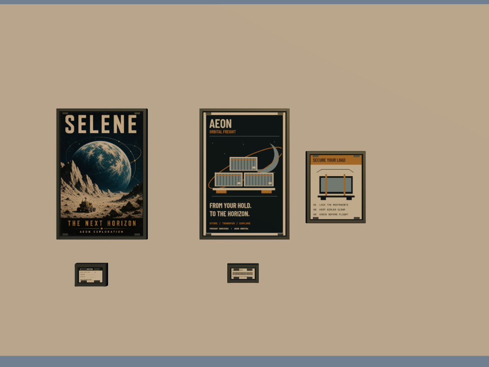

# Hangar printed graphics implementation

`createStationFinishGraphics()` in `src/station-finish-graphics.js` returns a
game-local `THREE.Group`. Add it to the station hero template before cloning.
The material and geometry cache is module-wide; clones reuse both texture sources
and all print materials. There are no custom shaders or emissive printed surfaces.
Await the returned group's `readyPromise` before marking station finish resources
ready. It resolves `true` when Selene loads, or `false` when the optional image is
unavailable. Until then and on failure, that frame displays the complete authored
freight print from the shared atlas. Rejections are handled and the promise lives
outside JSON-cloned `userData`. A Chromium check aborted the poster request and
confirmed the retained 1024-pixel atlas fallback, successful scene cloning, and no
unhandled page errors.

| Print | Centre in game-local metres | Print size |
| --- | --- | --- |
| Selene exploration | -5.1, -5.72, 25.15 | 1.12 × 1.68 m |
| Aeon orbital freight | -7.05, -5.72, 25.15 | 1.12 × 1.68 m |
| Cargo restraint safety | -8.3, -5.9, 25.15 | 0.70 × 0.875 m |
| Service inspection | -4.95, -7.10, 25.15 | 0.32 × 0.20 m |
| Equipment serial | -7.03, -7.08, 25.15 | 0.32 × 0.145 m |

All face -Z. Backplates, metal edge strips and retaining clips sit within 7 cm of
the poster plane. `Sign_`/`Detail` names exclude these visual fittings from the
station collision builder. They add no props on the floor or in the elevator path.

The existing image-generated Selene source becomes
`public/textures/station/poster-selene.webp`: 683 × 1024 pixels, 209,626 bytes.
ImageMagick resized, removed source metadata, and encoded WebP quality 85. The
original generated source remains in `assets/station/textures-source`.

The second poster is an original deterministic screen-print illustration: cargo
containers on an orbital transfer route. It shares one 1024 × 1024 canvas atlas
with a load-restraint diagram, inspection form and equipment label. Its exact
copy and diagram are authored in JavaScript. Font families come from existing
CSS tokens `--station-display` and `--mono`; physical print colours come from
`stationFinishPalette()`. The atlas redraws when optional fonts become ready and
works with local fallback fonts. No additional hosted service is required.

Both colour textures use sRGB. Prints have roughness 0.88, metalness 0 and no
emission; scene lighting provides their brightness. Shared frame/backing batches
use two instanced draws. All five prints plus their frames total seven meshes /
550 triangles, independent of station pod count. Additional near pods can still
add render calls because they are visible scene instances, not a merged station.

Validation: Node construction without `document` succeeded; a deep scene clone
retained the same geometry and material references. A Chromium headless render
at 1280 × 960 with ANGLE SwiftShader reported no JavaScript page errors. The
isolated fixture initially had eight draws and 562 triangles, including its one box wall.
This is a material/typography fixture, not an FPS benchmark or a claim about
the integrated hangar's lighting or walking tests.

## Upper operations gallery refinement

The former bright control-room strip now receives restrained equipment graphics
on the new physical gallery module. The same atlas supplies a non-emissive
`OPERATIONS / BAY CONTROL` header, six glazing stencils and six small console
schematics. No additional image, font or texture source was introduced. These
are static architectural markings and service diagrams, with no claimed live
occupancy or bay-status data.

- Header: centre `(0, 3.65, 23.73)`, 5.7 × 0.24 m, facing -Z.
- Console schematics: x `[-10,-6,-2,2,6,10]`, y `1.22`, z `23.905`, each
  1.12 × 0.34 m, behind the physical glazing at z `23.86`.
- Glazing identification stencils: same x positions, y `0.83`, z `23.825`, each
  0.50 × 0.07 m. Transparent alpha-tested ink, no emission.

The console material has an authored emission intensity of 0.14 before station
material preparation, with its diagram atlas also serving as the emission map.
It creates no light source. Consoles and stencils each use one instanced draw;
the header adds one ordinary draw. The entire graphics group now contains ten
meshes and 576 triangles, including the unchanged five framed posters. Cloned
pods continue to share the materials, geometries and texture sources.

The factory and `readyPromise` API are unchanged. `userData.prints.count` remains
five; `userData.operations` records one header, six consoles and six stencils.
Node creation, readiness, cloning and triangle count were rechecked after this
addition. The updated Chromium fixture reported no page errors, ten submitted
draws and 586 triangles; that count includes the wall and two gallery instance
batches whose collective bounds overlap the frustum. The poster-only fixture
below does not show the upper gallery.

## Integrated game image review

Reviewed the final actual-game `corner.png`, `gallery.png` and `props.png` in
`/tmp/star-agent-hangar-finish-evidence` after the physical gallery was integrated.
The header sits on its metal plaque without clipping. The six small console
schematics remain behind the glazing and within their mullion bays; they do not
spill onto frames or overpower the room. The former luminous white rectangle
now reads as a dark operations gallery with subdued equipment inside it.

The corner view preserves the existing posters and safety notice without cargo
cabinet occlusion. Printed art remains lit by the room rather than glowing. Tiny
glazing identification stencils are below comfortable letter-by-letter reading
size in these walking-camera captures; they are decorative identification, with
no functional or live-status information. No graphics source correction was
needed after this integrated review. This visual check is separate from the
parent's browser journey and collision tests.

