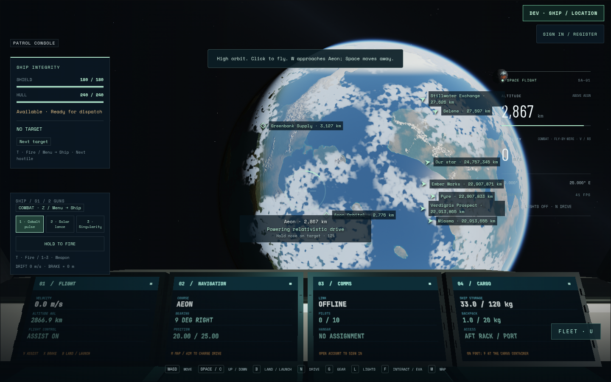
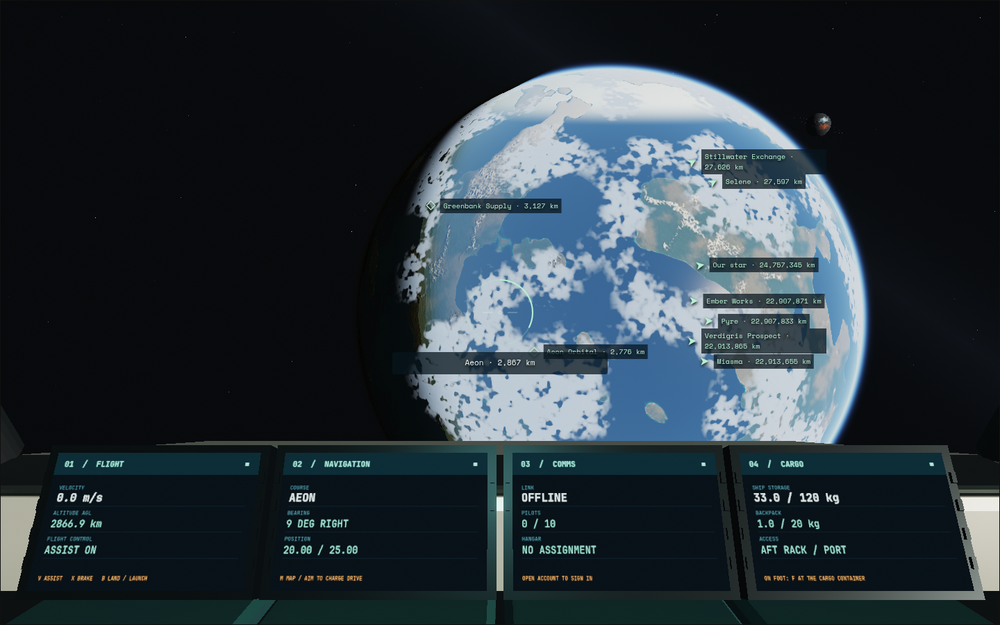
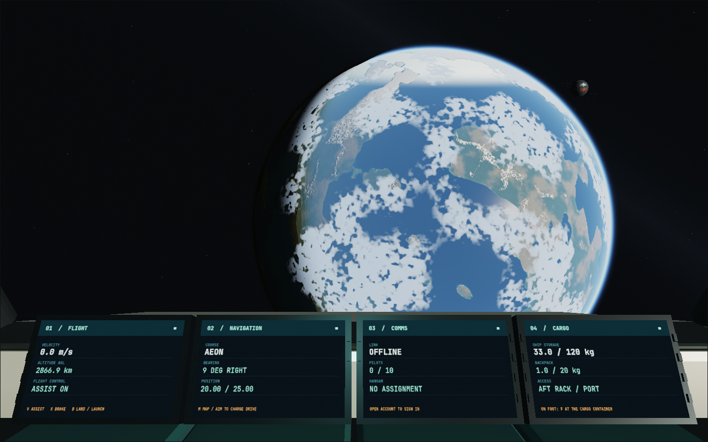
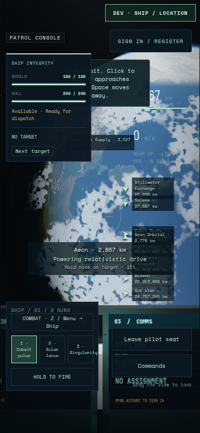
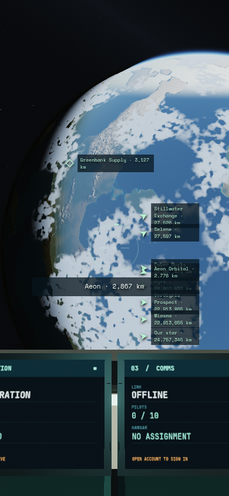
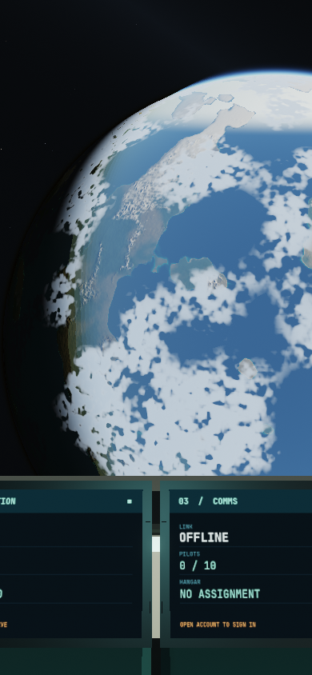

# HUD display — author validation

Runtime `ad32435`, test harness `9a3910d`, branch `feat/hud-display-modes`,
based on local development `01a28df`. No assets, dependencies, server or protocol
changes. Raw logs, videos and JSON receipts: `/tmp/star-agent-hud-qa`.

Tab and Settings → HUD cycle **Everything → Markers and reticle → No HUD**.
Everything preserves contextual panels and marker filters. Markers retains world,
ship-recovery and hostile/lead markers, the reticle and acquired-target ring/name.
No HUD clears screen overlays; physical cockpit instruments remain in the world.
Native menus, loading and recovery screens remain available. Each reload starts
with Everything. A two-finger canvas tap restores Everything on touch screens.
Next target / Menu → Ship retains hostile selection after removal of its conflicting
Tab shortcut.

## Actual checks

- `npm test`: **1,140 passed**, zero failures/skips,in the final runtime run (see `unit-final.log`). Focused gamepad/space-combat
  files also passed. HUD behavior is established by the browser journey below.
- `npm run build`: passed 347 modules, 4.60 s. Final runtime also built successfully
  for the production browser run. The inherited large-chunk warning remains.
- `npm run check:repo`: passed. Both required `plan:checks` against remote
  dev/all-features and a bounded plan against01a28df were inspected; remote dev
  lacks intervening local integration work, so its suggested scope is broader.
- `npm run test:browser -- -c scripts/hud-display.config.js`: **3/3 passed, 2.2 min**,
  final source ad32435 / harness9a3910d. Keyboard 44.2 s: held Tab advances once,
  all three views, native menu/text-field focus, return to play, leaving the pilot
  seat and cycling on foot. Injected standard controller 41.4 s: Menu → Settings,
  visible focus, all modes, B to play, held activation, heldRT through close,
  blur and disconnect/reconnect, then Menu and full-HUD recovery. Native phone
  touch 35.9 s: menu entry, both reduced modes, return to play and two-finger recovery.
- All three final browser receipts contain **zero page/console errors and warnings**.
  Harness warnings were NO_COLOR/FORCE_COLOR, isolated SMTP unavailable, external
  output directory retained, and the inherited large bundle warning.

Chromium 151.0.7922.173; AMD Radeon 860M, ANGLE/OpenGL ES3.2; desktop1440×900 and
native390×844. One automated browser job at a time, one worker, no retries.
The author inspected all three desktop/phone views, the walking reticle, and
Settings focus/layout. Existing dense phone marker-label packing is unchanged.
No hardware controller, active-combat browser rerun, FPS claim or independent
visual acceptance is represented by this focused interface check.

## Retained failures and corrections

Attempt01 reached the actual rendered game but ignored Tab: Navigation already
calls preventDefault for Tab to suppress browser focus movement. The HUD handler's
new defaultPrevented check incorrectly consumed the action; it was removed while
keeping modal, editable, focus and repeat guards. Attempt02 rendered all three
views but sent Tab before native Settings close cleanup restored navigation;
the fixture now awaits the real close/enabled state. No application workaround
was added for that timing. Both original logs, screenshots and videos remain in
`attempt-01` / `attempt-02`; final log is `run-03.log`.

## Captures

| Everything | Markers and reticle | No HUD |
| --- | --- | --- |
|  |  |  |
|  |  |  |

[Walking reticle](hud-display/walking-markers.png),
[controller Settings focus](hud-display/controller-settings.png),
[phone Settings](hud-display/phone-settings-none.png).

PR94 is stacked on foundation PR93 because remote dev/all-features is behind the
local development line. Local integration is pending the shared source slot;
no public deployment or independent review is claimed.
