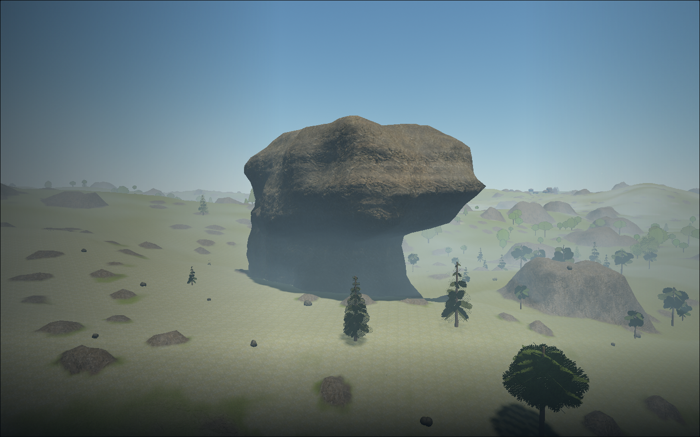
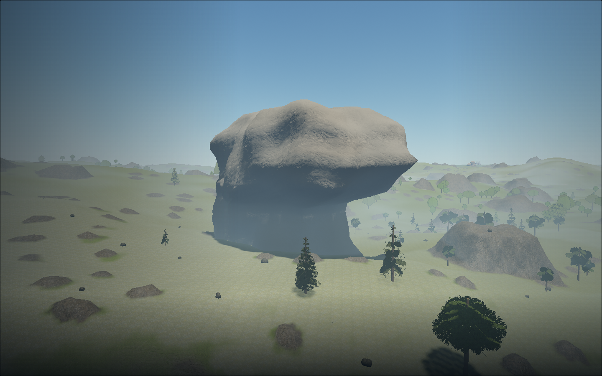
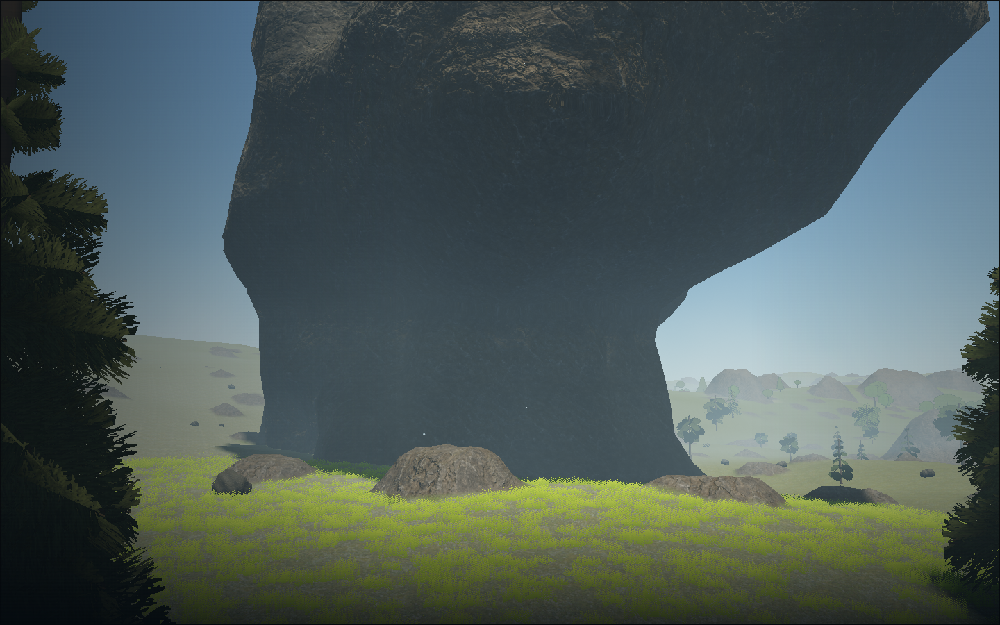
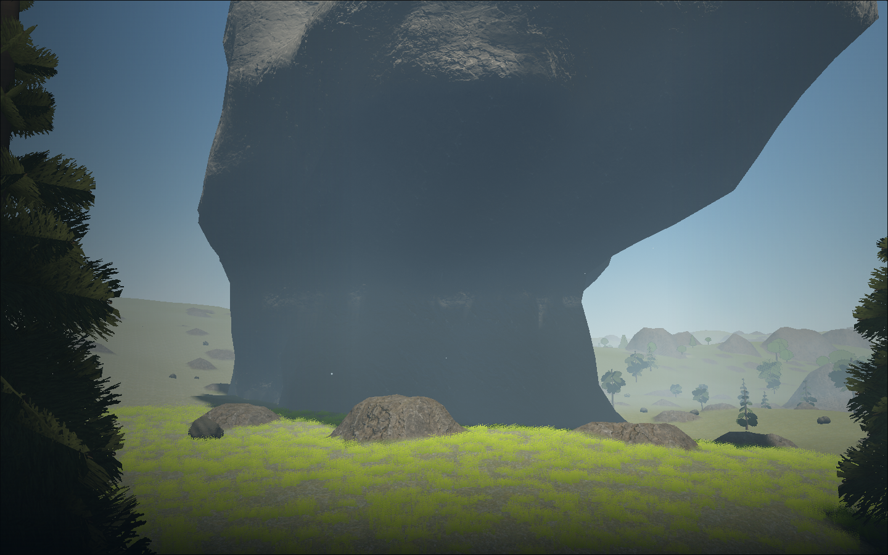
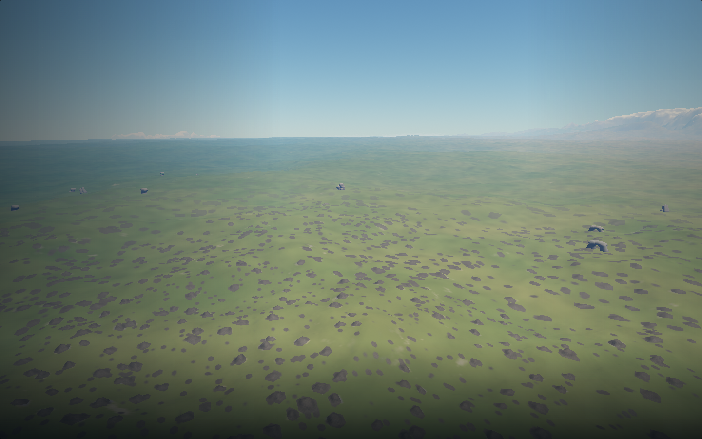

# Rarer Aeon landmarks and quieter stone

7 September 2026. Cees liked the silhouettes but found the formations too common
from 1 km, their shader too strong and frame rate low. This supersedes the
[first weathering pass](../landmark-weathering/README.md) as the current direction.
Builder inspection of the final game images is complete. Independent acceptance
and exclusive-hardware performance acceptance are not claimed.

Runtime `bb75c4c`, branch `art/landmark-restraint`, based on local dev
`219a584d7e9da5d2262c94829a69c9ca61ced247`. Only
`src/landmark-distribution.js` and `src/landmark-material.js` change at runtime.
The bounded PR63 equivalent is `28482be`. Capture correction `f992019` / `997e5cf`
changes the fixture only. Geometry, scale, terrain, lighting, controls and assets
are unchanged. Population revision 2 removes a deterministic subset of v1
landmarks; retained IDs, positions, rotations and geometry remain identical.

## Population and material

The existing cell gate falls from .13 to .026: 80% fewer candidates before
terrain rejection. It changes the canonical object field, not altitude-based
hiding. Client rendering, vegetation exclusion and authoritative collision all
read that gate. The [compatibility decision](../../decisions/0003-landmark-rocks.md)
requires client reload and API refresh together, with no database/save migration.

Counts within the same 4.2 km arrival queries:

| Seed / biome | Before | After |
| --- | ---: | ---: |
| 7291 coast | 64 | 14 |
| 7291 forest | 38 | 11 |
| 42 coast | 67 | 12 |
| 42 forest | 51 | 15 |
| 137 coast | 88 | 17 |
| 137 forest | 53 | 9 |

Polar arrivals remain empty; the sparsely populated mountain samples change
1→1, 1→0 and 2→1 respectively. The 9 km seed-7291 forest query falls from 202
formations to 47. Sampling variation explains why local percentages differ from
the 80% candidate-rate reduction.

The material keeps the shared CC0 Rock030 scan at an 8.5 m period with softer
contrast, restrained mineral colour and roughly half the former scanned-normal
strength. Synthetic fissures, the second grain layer and procedural bump relief
are removed. The weathering portion uses two 3D noise fields instead of eight,
and six scan texture reads instead of fifteen near the face. Normal relief fades
over 140–650 m; beyond it only three albedo reads remain. Constant matte roughness
replaces three roughness-map reads. Existing LOD coverage is tested before the
material samples. These are source-level costs, not a measured isolated GPU saving.

The rocks already use Three.js `InstancedMesh`, grouped by template and LOD.
They share twelve templates with three geometry LODs and a coarse streaming
fallback. The change does not introduce one mesh/material per formation or new
draws. Existing map residency stays about 16 MiB, shared with other stone layers;
no new texture/dependency is downloaded. Material source is 6,658 bytes / 2,291
gzip bytes, down from 8,846 / 2,978. The same accepted physical openings remain.

## Verification

- Nine landmark/server checks pass, including retained-transform fixtures,
  bounded population, removed-rock plant/collision clearance and exact near-mesh
  contact. Fourteen forest, mineable-stone and meadow checks pass.
- Production builds pass in the candidate, frozen baseline and bounded PR branch.
  All 23 focused checks also pass on the bounded PR branch. Repository/whitespace
  checks pass; the task's abbreviated base SHA and previous task-status overlap
  were corrected during those checks.
- Final actual-game capture: **1 passed in 1.8 minutes**, with no page/console
  errors, on runtime `bb75c4c` and fixture `2a40fed`. No new input or playable route is added;
  prior physical/controller geometry evidence remains in the original
  [landmark record](../landmark-rocks.md), with its exact historical source.

Build the candidate with `VITE_DEV_TOOLS=1 npm run build`. For the frozen baseline,
create sibling worktree `star-agent-rock-restraint-baseline` at `219a584`, install
the same lockfile dependencies and run the same build command. Then:

```sh
RESTRAINT_QA_OUTPUT=/path/outside/repository \
npm run test:browser -- -c scripts/landmark-restraint.config.js
```

The config owns production previews on 5383/5384. Only one game page exists at a
time, with the preceding context closed before the next. The fixture records
90+ asynchronous `EXT_disjoint_timer_query_webgl2` samples after 35 warm frames,
CPU callback time separately, 1440×900 at DPR 1 / render scale 1, seed 7291.
Available results only; disjoint/stale/invalid queries are discarded. No
`gl.finish` or forced timing synchronization is used. This is a bounded warm
observation, not a cold/traversal/lifecycle or exclusive-hardware FPS benchmark.

## Retained failed attempt and host contention

At the initial process check, two other automated game tests (fauna and rover)
were active alongside desktop Chromium. This establishes competing work at the
time of inspection, not the precise cause of the user's earlier slow frames.
Idle Vite servers themselves do not render the game.

The first owned comparison started at 18:10:13 UTC after cargo's explicit release;
no other Playwright job was active at launch or the later host checks. It captured
all three baseline views. Full-scene GPU medians were 8.01 ms in the original
steep 1 km view, 21.65 ms at low flight and 30.28 ms close up. These are baseline
observations, not isolated landmark shader timings or a candidate improvement.

The candidate loaded with no page/console errors but timed out after 90 seconds
waiting for the unchanged Aeon orbital-map worker, before shader preparation.
All recorded candidate requests returned 200. Both builds contain identical
orbital worker SHA-256
`97fc9638c27bf2c5e3ba4c2b1c04a14f0fa1293066c6c7b909a793dd602ae393`.
The exact cause of the slow map generation is unconfirmed; concurrent host CPU
work was present. This was neither a Chromium startup crash nor a passed shader
check. Source was left unchanged.

The correction closes the complete old renderer context, logs preload progress
and allows up to 180 seconds for the existing CPU map generation. It also widens
the 1 km camera toward the horizon: the initial steep view contained only three
landmarks and was a poor illustration of regional density. Raw failed baseline
images, timeout screenshot, trace and JSON are retained under
`~/.cache/star-agent-rock-restraint/captures/`; final evidence uses a separate
directory so the failed attempt cannot be mistaken for a pass.


## Final actual-game evidence

The candidate-only rerender started at **18:52:22 UTC** with no other Playwright
or headless GPU process active, after the queued social process exited. Its cold
boot completed in **40.01 seconds**, including full orbital maps; no application
source change or skipped startup stage was needed. The initial timeout remains
unexplained rather than being retrospectively called a shader fix.

The completed baseline low-flight and close captures from the first run were
reused. The fixture asserts identical eye and target coordinates for the paired
low-flight view; both close poses also use the same recorded fixture/coordinates.
The new 1 km view looks toward the horizon and has no matching before image.
Do not compare it to the earlier steep view as though only population changed.
To reproduce this candidate-only path, set `RESTRAINT_BASELINE_RECORD` to the
first run's retained `restraint.json`; omit it for a fresh full comparison.

Browser **Chromium 151.0.7922.173**, **AMD Radeon 860M** / ANGLE GL, OpenGL ES 3.2
(radeonsi krackan1 ACO), **1440×900**, DPR 1 and render scale 1. Each final pose has
92 valid GPU samples after warmup. Reported GPU times cover the whole scene,
including effects/shadows, rather than the landmark material in isolation.

| Pose | Visible landmarks | Landmark draws | Landmark triangles | Scene draws | Scene triangles | GPU median / p95 ms | CPU median / p95 ms |
| --- | ---: | ---: | ---: | ---: | ---: | ---: | ---: |
| before-low-flight | 57 | 14 | 36,672 | 632 | 1,096,406 | 21.65 / 24.01 | 19.85 / 25.10 |
| before-close-face | 60 | 14 | 38,304 | 715 | 1,229,054 | 30.28 / 33.71 | 23.65 / 28.00 |
| after-approach-1000m | 11 | 6 | 5,536 | 274 | 562,582 | 11.07 / 12.01 | 14.95 / 17.90 |
| after-low-flight | 14 | 8 | 12,512 | 626 | 1,072,246 | 21.61 / 23.35 | 18.90 / 23.00 |
| after-close-face | 16 | 8 | 13,632 | 709 | 1,204,382 | 27.96 / 30.12 | 21.60 / 26.50 |

The two paired scene-count differences equal their landmark-count differences:
other drawn geometry is consistent in those views. Low-flight landmark instances
fall **57→14** and batches **14→8**, but full-scene GPU time is essentially unchanged
(**21.65→21.61 ms**). The close sample improves modestly (**30.28→27.96 ms**).
These observations do **not** establish a large FPS gain or isolate the user's
background-contention effect. Overall frame time still needs further profiling;
the surface frame-time target is not accepted. Geometry counts meet the current
900-draw / 1.8M-triangle surface limits. No extra geometry or textures were added.

Six successive camera poses sample the relief fade and both existing LOD ranges
at 130, 300, 500, 650, 1,750 and 2,100 m: all report visible landmarks and zero
pending landmark work. The 500 m still shows the existing dither; the featured
rock is occluded by foreground terrain at the 1,750 m pose. Neither those sampled
poses nor this builder inspection establishes a scored continuous-motion review.
Raw transition stills and sample arrays remain in the final cache directory.

Builder inspection: the retained overhang has quieter, lighter mineral colouring
and less exaggerated relief, while scanned stone detail remains readable nearby.
The wide view has occasional distinct giant formations. The older medium rock
field and distant forest/terrain rendering remain busy and are outside this
large-landmark adjustment. All five images below and the two transition stills
were inspected; no new shader artifacts or shape changes were found.

Same low-flight pose:




Same close pose:




Additional current 1 km view (not a before/after pair):



This is a checked development checkpoint. Independent visual scoring,
physical-device testing and a broader frame-time/cold/traversal benchmark remain
pending. All owned capture browsers, previews and the queue watcher have exited.

## Local integration receipt

The checked source `92dadad` was merged with the current social/cargo runtime
`f861f8f` in isolated candidate `d992e52`. All 23 focused checks, the production
build and repository/whitespace checks passed on that combined candidate.
Bookkeeping merge `6e548ad` changed documentation only, and the shared
`dev/all-features` preview was fast-forwarded to it on 7 September 2026.

The persistent preview/API service restarted once at **19:09:44 UTC** so server
collision uses population revision 2. Refresh the client at
http://127.0.0.1:5178/ for the matching rendering and collision field. The served
material key and population constants match the checked source; frontend and
API health return 200. All three current screenshot URLs serve exact PNG bytes.
The existing database cluster is retained; this change adds no schema migration.
Current cargo, social, protocol and ordered migration handling are preserved.

The shared merge/restart window is released. No public deployment or additional
GPU job accompanies this receipt; the visual and performance limits above remain.
