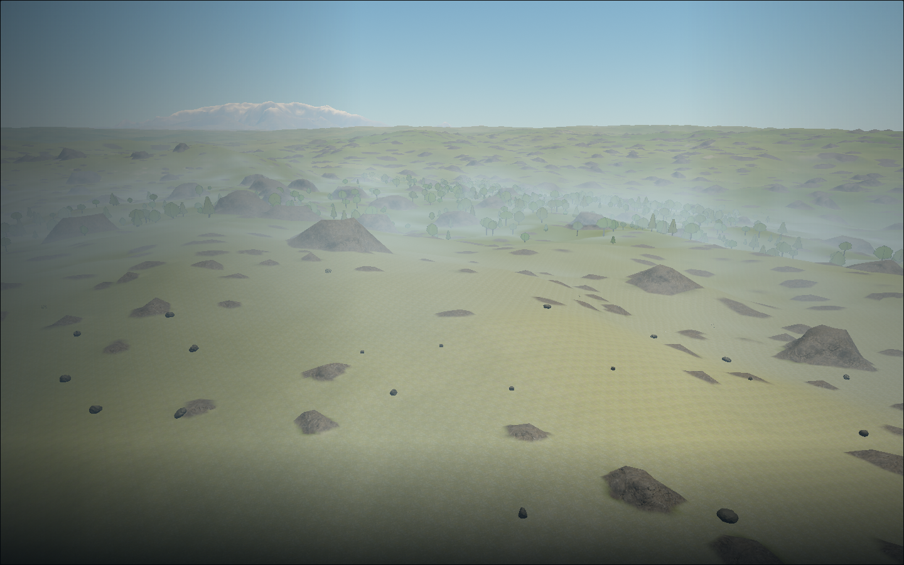
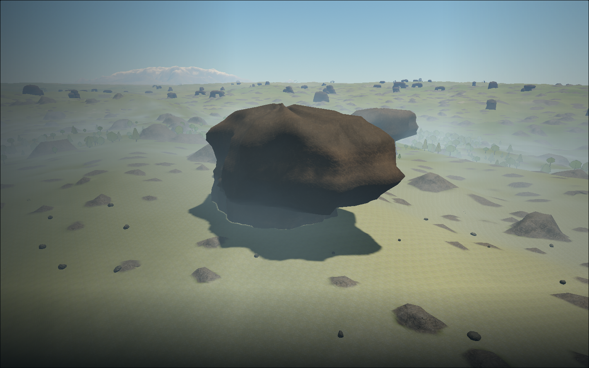
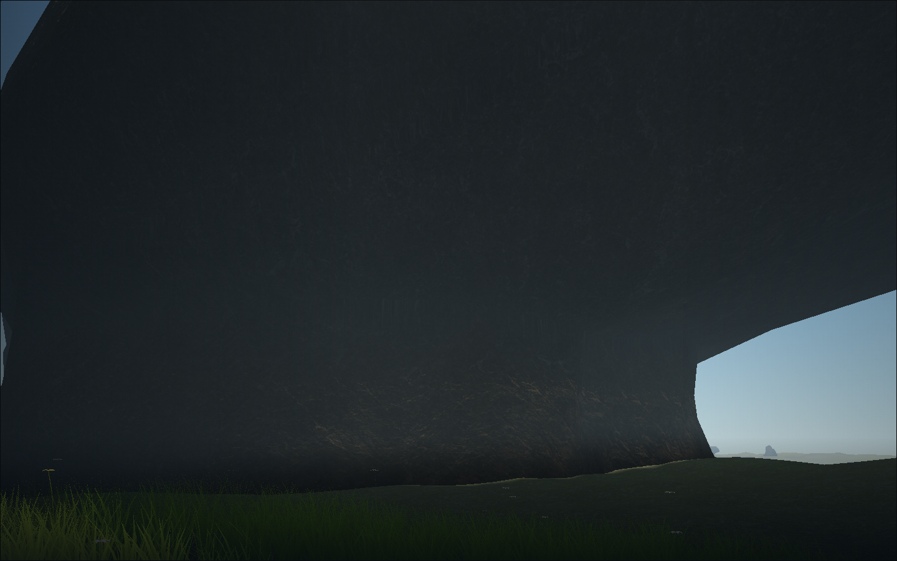
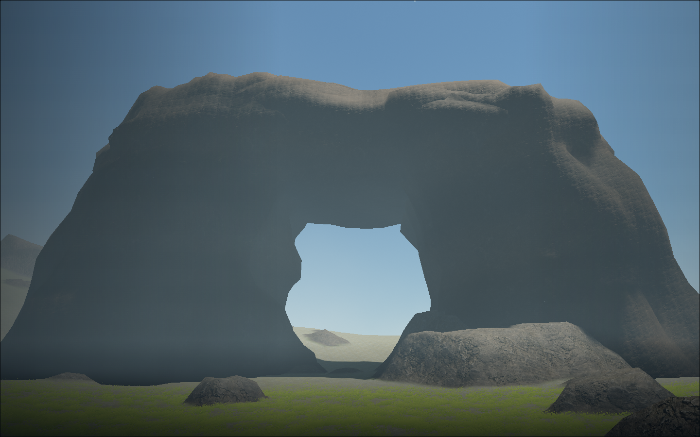
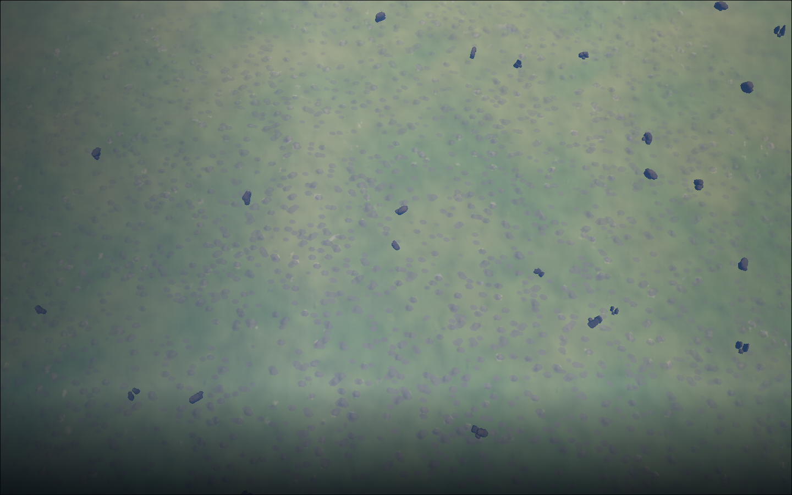
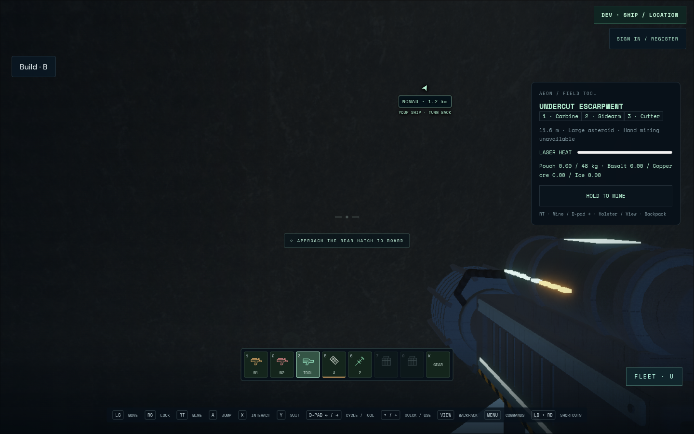
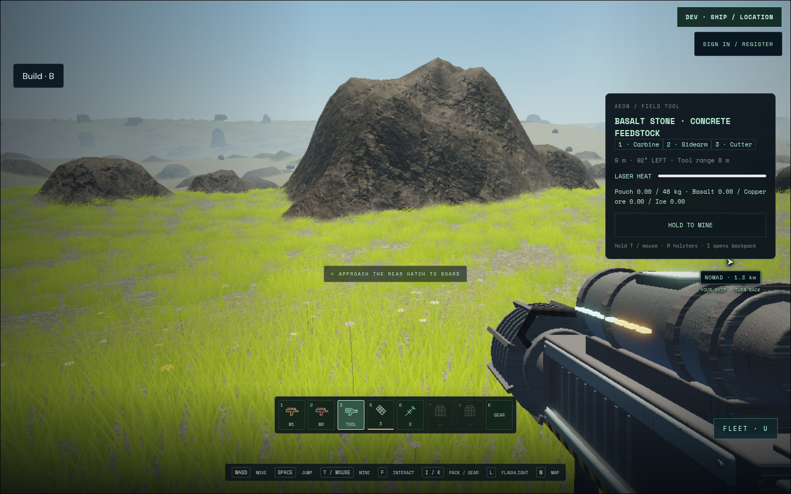

# Rare Aeon landmark rocks — development evidence

The subsequent [surface refinement and current material screenshots](landmark-weathering/README.md)
address Cees's texture-detail feedback while retaining these shapes and collision.
The original captures below remain the geometry checkpoint's historical evidence.

7 September 2026. Builder inspection by Codex; independent visual acceptance and
physical controller testing are pending. This is a local development checkpoint.

Local integration: `dev/all-features` fast-forwarded from `4d38827` to `f0077f6`.
The shared preview service was restarted once to load the authoritative collider;
5178 serves the new landmark wiring and API 8087 returns `{"ok":true}`. The existing
PostgreSQL directory and schema were retained. Eight focused geometry/server
checks pass on the integrated tree. Repository checks pass against both the local
pre-feature head and the bounded remote base. The final bounded production build
also passes, retaining Vite's existing large-chunk warning. This restart check does
not repeat or replace the account persistence tests in their own QA record.

## Result and source identity

Aeon gains rare, seeded bedrock formations above its existing terrain: undercut
escarpments, split leaning fins, weathered stone bridges, crowned monoliths,
shelter slabs and fractured tors. Twelve reusable variants have roughly 50–120 m
of exposed relief. Closed mesh undersides and the matching close-mesh collider
leave real space below ledges and bridge spans. Smaller mineable basalt remains.

The final rendered runtime is `72ec059`, controller fixture `11e2469`, on the
combined feature branch `feat/landmark-rocks`. It includes the current local menu,
RT controls, persistent-account runner and fitted weapons. The before captures
come from local `dev/all-features` at `4d38827`, with the same seed, camera pose,
resolution and render scale. No image diff or synchronized weather comparison is
claimed. `ff68a7a` subsequently changes only the cutter's oversized-target sentence
from “Large asteroid” to “Too large for the handheld cutter”; the retained
controller capture predates that wording correction.

The bounded PR branch is `feat/aeon-landmark-rocks`, based on remote
`dev/all-features` at `a748be101aad4ea672a157481044ce9ed6b03e35`. Its matching
runtime commits are `1a65872`, `09fb648`, `632f3ea`, and copy follow-up `289a0b5`;
the matching controller fixture is `1a00ea6`. This avoids including the unrelated
local PR 58–61 stack in the landmark review. Local integration uses the combined
feature branch, preserving those features.

Landmark generator and geometry versions start at 1. A 320 m candidate grid with
13% occupancy is about 0.25% of loose-stone candidate density before dryland/slope
rejection. This is rarity tuning, not a promise that exactly 1% of visible rocks
are landmarks. The forest test region retained 46 in a 4.5 km radius. Stable IDs
include the Aeon seed and cell; camera movement and LOD do not change them.
Forest layout version 3 only excludes trees that would intersect the new solids.

Canonical terrain heights, mining IDs/densities, inventory/save formats, account
schema, input bindings and dependencies are unchanged. Existing offline outposts
receive fixed clearings; online play uses the shared server field. Headless server
Navigation and shot occlusion use the same mesh collider. New construction's
general rock-intersection validation is outside this scenery change. Ship contact
uses a deliberately conservative sphere enclosing the active ship's bounds.

## Verification

| Check | Actual result |
| --- | --- |
| Combined `npm test` after collision/placement work | 693 passed, 0 skipped; 33.8 s |
| Final focused `node --test tests/landmark-rocks.test.js` | 7 passed |
| Bounded PR `npm test` after final shadow change | 675 passed, 0 skipped; 33.8 s |
| Server landmark, room, room-review and combat tests | 36 passed, 0 skipped |
| Production builds, combined and bounded branches | Passed |
| `npm run check:repo` and `git diff --check` | Passed |
| Final Chromium visual and controller job | 2 passed, 7.6 min, no page/console errors |

The focused unit cases cover seed reconstruction/variation, poles and longitude
wrap, canonical ground anchoring, LOD bounds and undersides, plants below open
shelters, collision before visual streaming, camera-relative matrices, active
ship bounds, old outpost clearings, online/offline transitions and per-pilot
headless contact. The server test constructs the actual world and checks that the
roof blocks walking/shot rays while the gap stays clear.

Final browser command, run from the combined feature worktree after
`VITE_DEV_TOOLS=1 npm run build`:

```sh
TMPDIR=/home/cees/.cache/star-agent-landmark-browser \
LANDMARK_QA_OUTPUT=/home/cees/.cache/star-agent-landmark-delivery \
MULTIPLAYER_SERVER=http://127.0.0.1:8087 \
npm run test:browser -- -c scripts/landmark-rocks.config.js
```

The comparison requires the pre-landmark build on 5178. For future candidate-only
checks set `LANDMARK_SKIP_BASELINE=1`; an already updated preview is not a valid
before image. Port 5381 is owned by this single-worker job and closes afterward.
No Chromium startup crash occurred. Stderr contains inherited `NO_COLOR` /
`FORCE_COLOR` warnings and Playwright's slow-file suggestion; parallel workers
remain disabled. The application pages loaded and rendered in every attempt.

Environment: Chromium **151.0.7922.173**, ANGLE OpenGL ES 3.2 on **AMD Radeon 860M
(radeonsi krackan1 ACO)**, 1440×900, DPR 1. Art fixtures use render scale 1; the
controller route retains the default 0.8 scale. Raw `render.json`, `controller.json`,
poses, screenshots and logs remain in the cache path above and the corresponding
`star-agent-landmark-delivery.log`. Other shared-machine browser jobs were observed;
these are draw/triangle observations, not isolated hardware FPS measurements.

## Actual views and physical route

The art tour uses controlled debug poses with HUD hidden: 65 m low flight,
1.8 m ground views, then 1.4 km and 5 km altitude. It waits for active terrain and
landmark streaming. Ten successive camera positions cross both LOD transitions
without reloading; the 500 m and 1750 m overlap captures were inspected. This is
scripted motion coverage, not a recorded human flight or an independent motion score.

The separate controller journey injects a standard Gamepad and reads debug state
only for steering. It selects Menu → DEV → Test starts → Forest, lands the Nomad,
walks through the cabin and down the opened ramp, then walks approximately 1.3 km
to `aeon-landmark-v1-7291-9733-2028`. Five waypoints cross underneath its eastern
ledge and out the other side. There are no direct pose writes in this journey.
Inventory exit with a held stick, blur/focus, disconnect/reconnect and neutral
release are checked before returning to play. Keyboard/pointer and touch pathways
were not separately replayed for this scenery checkpoint; no controls changed.

Before and after, with the same low-flight pose:




The roof, open shelter and stone bridge are actual game meshes:




The large silhouettes remain visible from 5 km:



Controller traversal evidence, with the HUD and equipped cutter visible:




Builder inspection found continuous planted roots, a readable overhang/bridge
opening, separate stone material and retained grass in the open shelter. Enlarging
the local shadow coverage removed the detached/clipped shadow seen in the earlier
low-flight capture. Dither remains visible in a still of the LOD overlap, and
distant terrain/tree detail still reflects the existing renderer. This checkpoint
does not establish full-scene art acceptance or eliminate those older limitations.

## Cost and provenance

| Scene | Scene draws | Scene triangles | Landmark draws | Landmark triangles |
| --- | ---: | ---: | ---: | ---: |
| Before, low flight | 402 | 802,454 | — | — |
| After, low flight | 512 | 922,914 | 14 | 40,608 |
| Ground shelter | 566 | 1,476,106 | 14 | 45,856 |
| Ground bridge | 545 | 1,503,904 | 14 | 37,536 |
| 1.4 km descent | 149 | 200,730 | 3 | 4,896 |
| 5 km descent | 82 | 183,534 | 10 | 14,560 |
| Controller return, scale 0.8 | 709 | 1,792,578 | 12 | 34,208 |

Scene counters include the rest of the game and are not an isolated incremental
cost. Surface fixtures stay within the declared 900-draw / 1.8M-triangle surface
targets; no frame-time acceptance claim is made.

All twelve templates at all three LODs total **12,483,072 bytes** of position,
normal and colour arrays, per CPU/GPU copy; instance-matrix capacity is at most
**786,432 bytes**. Individual templates range from 5,888–9,600 close triangles,
1,536–2,496 middle triangles, and 416–672 far triangles. One geometry worker
streams coarse-first; a coarse fallback remains until finer representations are
complete. Descriptors have a bounded cache, and collision works before rendering.
Geometry/instances dispose with the layer. Render range is 10 km, fading over
9–10 km; LOD blends span 420–580 m and 1,500–1,950 m.

Maps are the existing locally bundled **CC0 ambientCG Rock030** colour, OpenGL
normal and roughness set. No generated/downloaded bitmap, hosted dependency or new
texture payload is added. See the [existing manifest](../../public/materials/outcrops/manifest.json)
for original source, licence and hashes. The shared maps retain about 16 MiB with
mipmaps and reference-counted disposal. New geometry is deterministic code in
`src/landmark-geometry.js`, with no generation prompt or external model source.
Near landmarks expand the existing 2048² sun shadow coverage; no larger shadow
texture is allocated, at the cost of fewer close shadow texels per metre.

## Failed iterations retained

Initial unit checks caught an incorrect seed-helper import, excessive far-LOD
bound variation, and incomplete fallback LODs after synchronous collider creation;
all were corrected and rechecked. An early browser fixture assumed variant 0 was
near the destination; it now selects the retained escarpment family.

The first rendered distribution was too frequent and smooth. Occupancy fell from
52% to 13%, with stronger chipped profiles and localized overhangs. A later
controller fixture failed when launch reloaded the page. The next run rendered but
waited on an inactive forest queue at 5 km, then completed the physical walk but
failed to neutral-arm Inventory before attempting B to close it. Those test runs
are failures, not passes. The final two-case run corrects both fixture waits and
passes. Earlier artifacts remain in the sibling cache directories
`star-agent-landmark-results`, `star-agent-landmark-visual-2`,
`star-agent-landmark-final`, and `star-agent-landmark-verified`.

An earlier low-flight shadow looked detached although the CPU root was already
27–33 m below canonical terrain. Deeper roots alone did not resolve that image;
the final local shadow-coverage fix did. It is not recorded as a confirmed terrain
height or collision defect. Independent visual scoring, physical-device testing,
full multiplayer browser travel and an isolated performance benchmark remain open.
