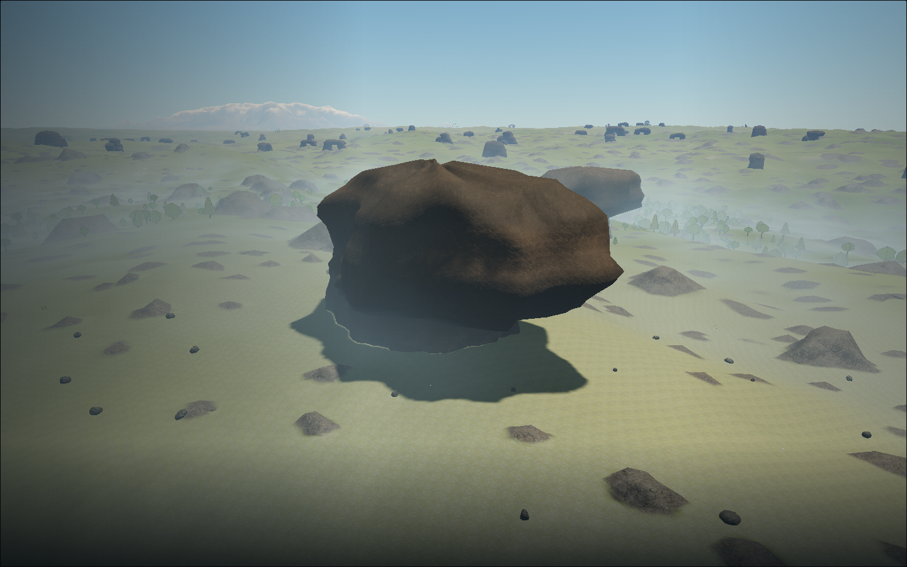
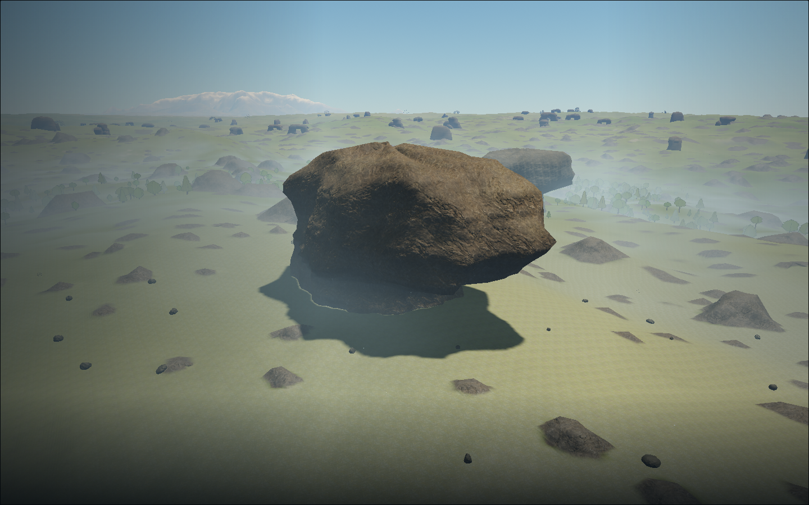
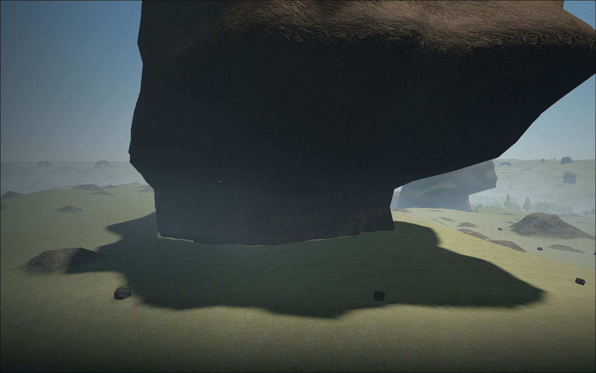
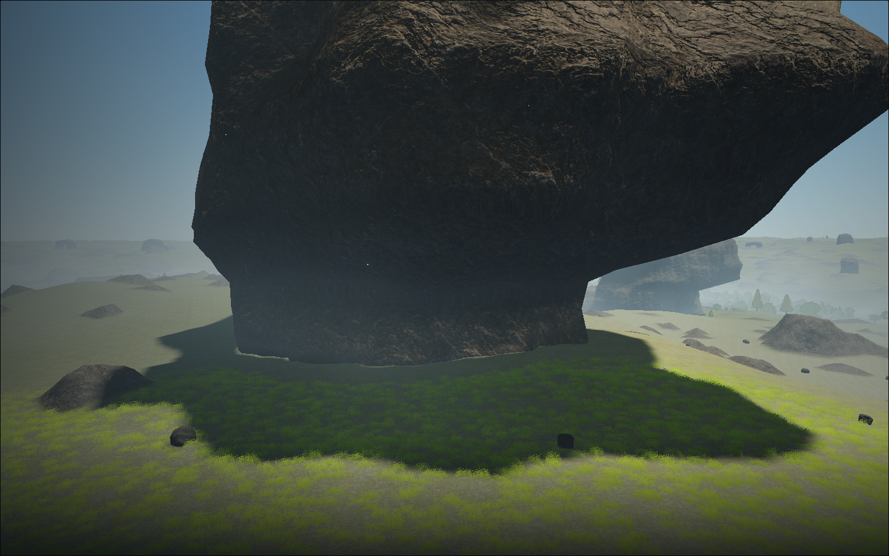
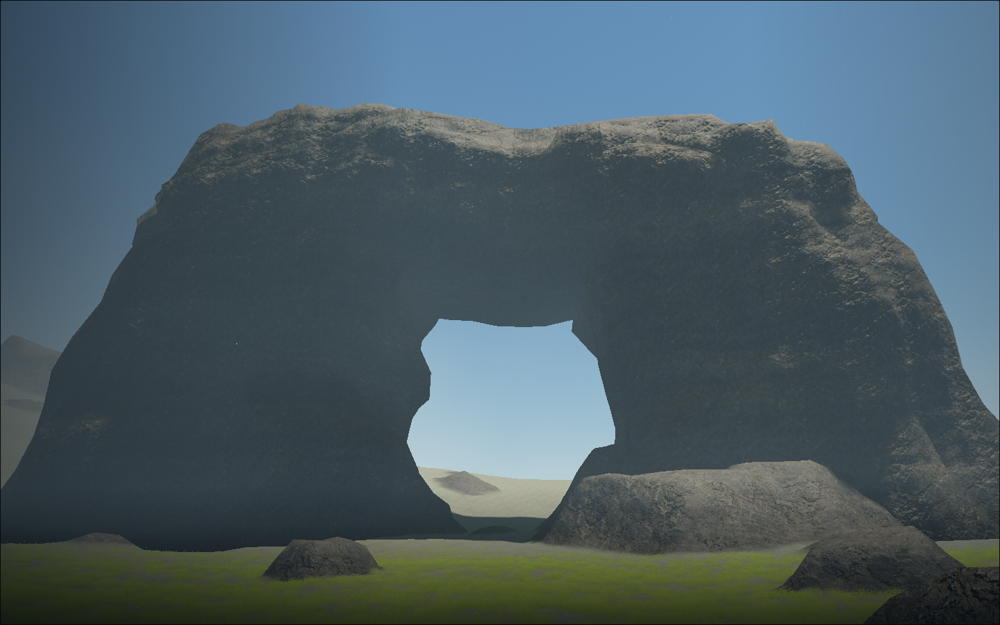
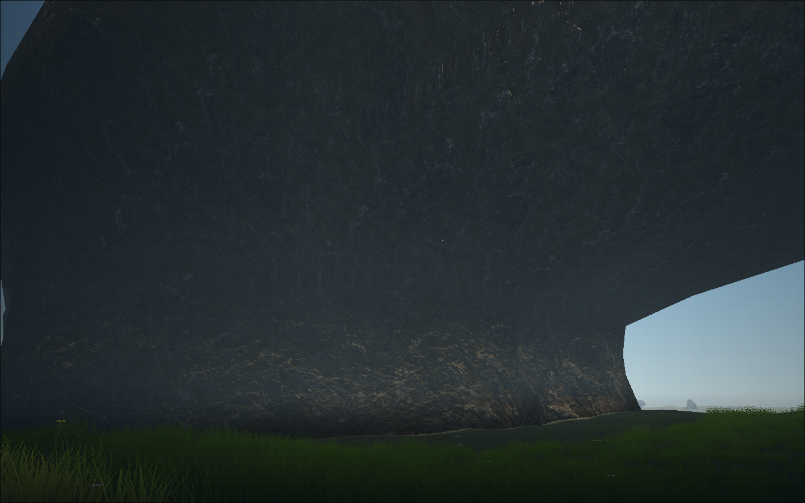

# Aeon landmark surface refinement

[Latest density and restrained-material follow-up](../landmark-restraint/README.md) records the subsequent reduction requested by Cees.

7 September 2026. Material-only development checkpoint following Cees's feedback:
the large shapes are good, but need more texture detail and variation. Builder
inspection is recorded below; independent visual acceptance remains pending.

Runtime: `80f83b8` plus final refinement `4f9d472`, branch
`art/landmark-weathering`, based on local dev `6d3abb0`. The bounded PR63 branch
contains matching changes in `44fd1a7` and `5d1d030`. Geometry, seeded placement,
collision, terrain, lighting, input, saves and bitmap assets have no diff from
that base. The only runtime edit is `src/landmark-material.js`.

## Material result

Scanned stone plates use an 8.5 m period with finer 1.1 m grain near the face.
Medium normal relief now remains readable during approach, fading over
400–1,500 m; fine grain fades over 35–160 m. Irregular local 3D fields add strata,
mineral patches, oxidation, sheltered/exposed weathering and short interrupted
joints. Surface-gradient relief uses metre derivatives rather than displacing
vertices. Roughness stays matte.

Seeded instance rotation/scale supplies each formation's stable colour and phase.
Camera-relative translations and time never seed that phase. Metre projection,
shared logarithmic depth and the existing LOD fades remain intact. This keeps the
accepted silhouettes and physical gaps while varying the stone surface.

All maps are the existing **CC0 ambientCG Rock030** albedo, OpenGL normal and
roughness set; see the [original provenance and hashes](../../../public/materials/outcrops/manifest.json).
No new image was generated, downloaded or baked. The existing loader, atomic
readiness, procedural fallback and reference-counted disposal remain in use.
Texture residency stays about 16 MiB shared with the other rock materials.
There are no added geometry bytes, draw calls, texture downloads or dependencies.
The material source is 8,846 bytes, 2,978 gzip bytes; additional fragment work
comes from the local geology fields and the second scale of normal sampling.

## Verification and reproduction

| Check | Result |
| --- | --- |
| Existing landmark and server landmark invariants | 8 passed, 0 skipped |
| Development-tools production build | Passed, including final `4f9d472` |
| Bounded PR production build | Passed for the material pass |
| Repository checks against local base and bounded PR base | Passed |
| Standalone GLSL syntax probe on the first material candidate | Vertex and fragment passed; supplementary only |
| Full actual-game before/after tour on `80f83b8` | 1 passed in 2.4 min, no page/console errors |
| Final candidate tour on `4f9d472` | 1 passed in 1.5 min, no page/console errors |

Both browser runs use **Chromium 151.0.7922.173**, AMD Radeon **860M** / ANGLE
OpenGL ES 3.2 (radeonsi krackan1 ACO), **1440×900**, DPR 1, render scale 1, seed
7291. The baseline is the existing material served by local dev 5178 before this
refinement. The candidate uses its production build on owned port 5383. No shader
or browser startup crash occurred. Node's inherited colour-environment warnings
and Vite's existing large-chunk warning remain in the logs.

```sh
VITE_DEV_TOOLS=1 npm run build
TMPDIR=/home/cees/.cache/star-agent-rock-weathering-browser \
WEATHERING_QA_OUTPUT=/home/cees/.cache/star-agent-rock-weathering-compare \
MULTIPLAYER_SERVER=http://127.0.0.1:8087 \
npm run test:browser -- -c scripts/landmark-weathering.config.js
```

After the baseline has been updated, use `WEATHERING_SKIP_BASELINE=1`, as in the
final rerender, or point `WEATHERING_BASELINE` at a preserved old build. Do not
label an updated preview a before image. Raw logs and `material.json` (camera
poses, backend, scene counts, streaming state and errors) stay in the matching
cache directories. Final files use `star-agent-rock-weathering-final`.

These are controlled debug art poses: 65 m low flight, a close face, 1.8 m shelter
and bridge views, and 1.4 km descent. Nine successive viewpoints cover both LOD
transitions; 500 m and 1,750 m overlaps were inspected. All report visible
landmarks and zero pending landmark work. No recorded physical flight, automated
image-diff score or independent motion score is claimed. The prior complete
[controller shelter traversal](../landmark-rocks.md) remains the unchanged
geometry/input evidence; this pass introduces no new playable route or controls.

## Inspected images

Same low-flight pose, before and after:




Same close pose, before and after:




Other final game views:




Builder inspection found clearer plate/grain relief, varied mineral colouring
between the two formations, and readable detail in the shaded shelter. Short
joints avoid the broad dark loops seen in the first material attempt. Shapes,
open spans and planted contact remain as before. Existing atmospheric contrast,
distant terrain/forest detail and visible still-frame LOD dithering remain.

## Cost observations and limits

| Final view | Scene draws | Scene triangles | Landmark draws | Landmark triangles |
| --- | ---: | ---: | ---: | ---: |
| Low flight | 512 | 922,914 | 14 | 40,608 |
| Close face | 605 | 1,000,650 | 14 | 46,592 |
| Shelter | 575 | 1,478,146 | 14 | 45,856 |
| Bridge | 546 | 1,711,964 | 14 | 37,536 |
| 1.4 km | 149 | 200,478 | 3 | 4,896 |

Landmark draw/triangle counts match the corresponding baseline views exactly;
low-flight total scene counts also match. Other total counts vary with surrounding
streamed scenery. These captures meet the 900-draw / 1.8M-triangle surface targets,
but do not establish a frame-time or FPS benchmark. Shared-machine contention
occurred elsewhere in the test queue; no hardware performance acceptance is claimed.
Physical-device testing and independent material scoring were not performed.

## Retained unsuccessful attempts

An initial run was immediately interrupted with exit 130 when another graphics
job restarted during the launch guard. It is not a pass or a browser startup
failure; its log/trace remain under `star-agent-rock-weathering-first`.

The first complete material tour passed its runtime checks, but builder inspection
rejected wide dark contour-like fissures on the bridge. `4f9d472` narrows them,
breaks their continuity and reduces their colour/normal strength. That candidate
was rebuilt and rendered again successfully. The rejected captures remain under
`star-agent-rock-weathering-compare`; the curated after images above are the final
rerender. No source geometry was changed to address that material finding.
