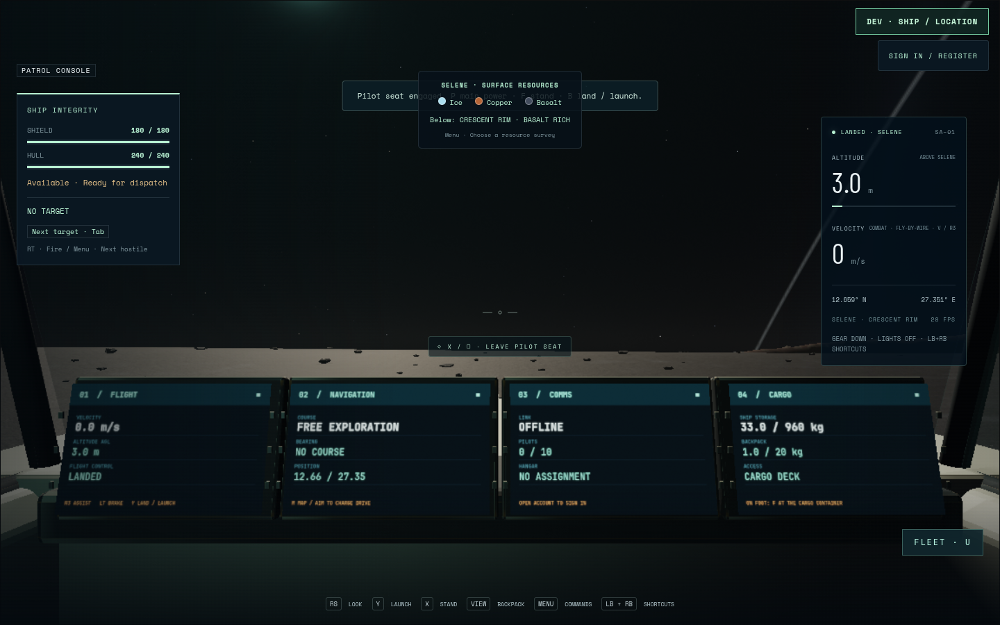
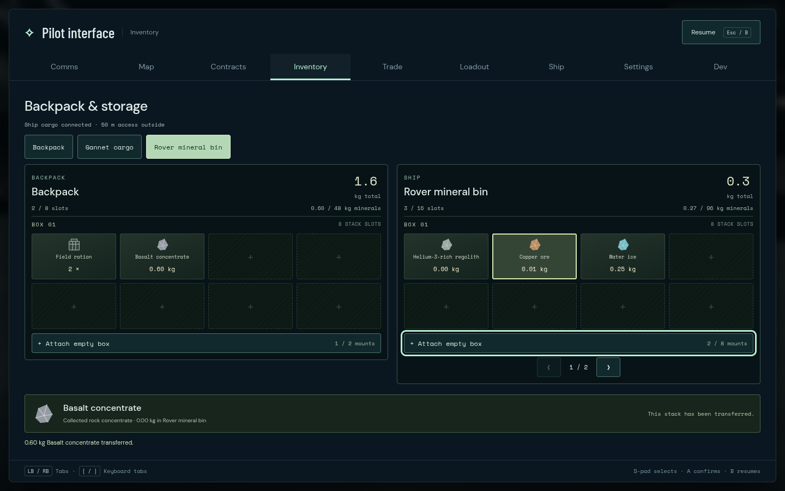
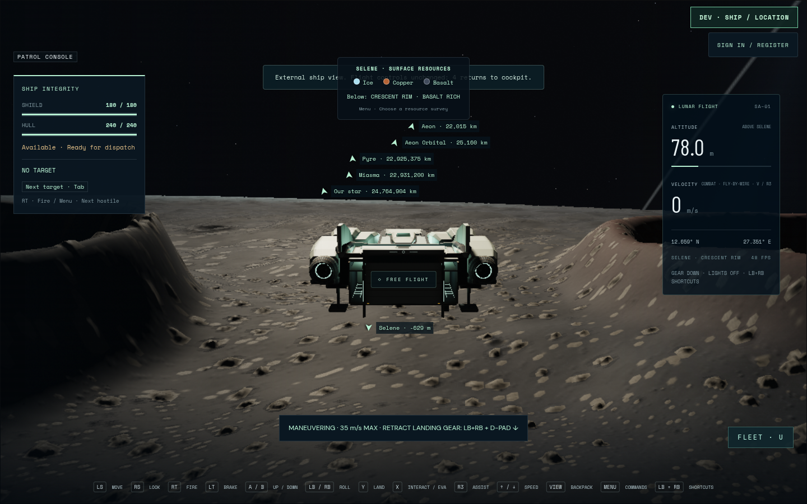

# Gannet controller journey 03

The complete physical Gannet/Burrow controller journey passes on 2026-09-08:
one case in 3.6 minutes, 3.7 minutes total. Source `f08fbc1`, runtime `4b80706`,
and Art11 `51f5578c…` use production build08 `main-CweJUU7V.js` (4.98-second
build). Burrow is the current clear-view `831b9569…` asset. Served geometry and
all recorded source hashes remain identical through the run.

Starting in the powered Gannet on Selene, actual controller input leaves the
pilot chair, walks the cabin, boards Burrow through its pressure door and steps,
opens the hatch and lowers the lift. All four wheels reach canonical terrain.
The rover follows a real steering arc to the existing Crescent outcrop, fires
both mining beams and commits ore to its bin while leaving the backpack unchanged.

The common inventory dialog transfers **0.603329820 kg of basalt**. The exact
backpack increase equals the bin decrease; ship supplies remain unchanged and
the accepted save has no warning. Dialog closure with a held trigger, trusted
native focus loss/return, controller disconnect/reconnect, replacement and an
unsupported layout all require neutral before a fresh trigger works.

The same rover reverses along its recorded outbound path, reaches the original
lift with all four supported wheels, rises and secures behind the hatch. Actual
pressure-door exit and cabin walking return to the pilot seat. Gannet launches,
climbs and brakes with the same rover held in its bay, retracts its gear, then
performs a real gear-deploying landing. Final mode is landed, power and controls
are enabled, the lift is at 1.4 m, the hatch is closed, and the rover remains
aboard with 0.482619252 kg of ore. Its local pose stays within 35 mm of the
recorded carried pose during launch and landing.





Root inspected these originals and the loaded touchdown. Cockpit MFDs remain
visible below the clear windscreen. The complete original screenshots, video,
input sequence, physical trajectory, inventory balances and interruption receipts
remain at `/home/cees/projects/.medium-ships-qa/gannet-controller-03`; log:
`/tmp/star-agent-gannet-controller-03.log`. Failed attempts01/02 are preserved.

Chromium151.0.7922.173 uses ANGLE/OpenGL ES3.2 on AMD Radeon860M at 1440×900,
with the automatic render scale at 0.8 (1152×720 buffer). There are no page errors,
console warnings or failed HTTP responses. This is injected standard Gamepad
input and trusted native focus, not physical controller hardware or an FPS
benchmark. The explicit development flight has isolated practice storage;
this route does not certify durable reload retention, multiplayer authority,
full freight scene cost or final art quality. Keyboard/native-touch routes and
independent visual review remain pending.

```sh
GANNET_URL=http://127.0.0.1:5582 \
GANNET_OUTPUT=/home/cees/projects/.medium-ships-qa/gannet-controller-03 \
npm run test:browser -- -c scripts/gannet-gameplay.config.js
```
