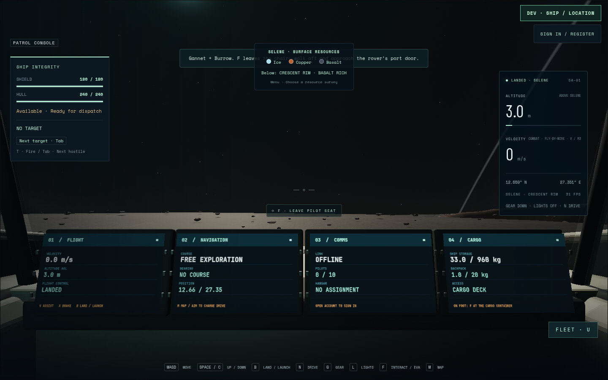
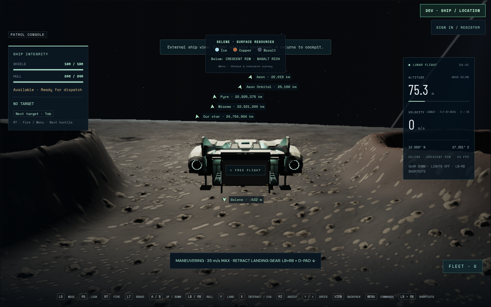

# Final Gannet Art13 in the main game

The unchanged complete injected-controller journey passes on final Art13:
one case in 3.6 minutes, 3.7 minutes total, runner exit 0, on 2026-09-08.
Captured runtime is `e727d8e`, production build15 `main-B5-qTCnz.js`, with Gannet
`8da0bc2e3da7c8c2a2db7b29957b226fab0ba30eb0155f98d82a3f82c3995e6f`
and clear Burrow `831b9569…`. Actual HTTP models match the source bytes.
All recorded runtime/model hashes remain stable; page errors, console warnings
and failed HTTP requests are empty.

The real route leaves Gannet's pilot chair, walks through the cabin and boards
Burrow through its pressure door and steps. The hatch opens, elevator lowers
and all four wheels reach canonical terrain. Controller steering reaches the
existing Crescent deposit; both rover beams cut it and accepted edits publish
ore to the rover bin. The actual inventory dialog transfers **0.543116091 kg
basalt**, conserving the bin/backpack balance and leaving ship supplies unchanged.
Held dialog closure, trusted native focus loss/return, disconnect/reconnect,
controller replacement and unsupported mapping all require fresh release.

The same rover reverses its recorded route onto the original lift, rises and
secures behind the hatch. Physical door exit and cabin walking return to the
pilot. Gannet launches with Burrow aboard, climbs, brakes, retracts gear, then
deploys the real gear and lands. Final lift height is 1.4 m, hatch is closed,
gear progress is 1 and Burrow remains aboard with 0.456426806 kg ore. Its final
local position is approximately [-0.300002,1.4,7.611687]; the existing 35 mm
carried-pose stability checks pass.




Chromium 151.0.7922.173 uses ANGLE/OpenGL ES 3.2 on AMD Radeon 860M, 1440×900,
DPR 1, render scale 0.8 and 1152×720 drawing buffer. The explicit development
start uses practice storage. This route does not establish physical controller
hardware, reload persistence, multiplayer authority, full freight scene cost or
FPS. The [studio art review](gannet-native-review-13.md),
[CPU loaded-payload measurement](gannet-payload-13.md) and bounded actual-game
visual review are separate evidence.

The [independent image review](gannet-game-review-final13.md) scores 3.86 and
requests a correction because the cargo MFD underreports
mined backpack materials: the actual transfer yields 1.5 kg total in the inventory
panel, while the returned pilot screen still reads the legacy 1.0 kg. Inventory
accounting is correct; display correction and new visual evidence are separate
from this functional route pass.

Eleven original PNGs, finalized video and complete input/trajectory/inventory
receipts remain at `/home/cees/projects/.medium-ships-qa/gannet-controller-final13`.
Log: `/tmp/star-agent-gannet-controller-final13.log`.
GPU released at 03:31:34 UTC. Earlier controller, keyboard and native-touch
journeys remain preserved at their original source/model versions.

```sh
GANNET_OUTPUT=/home/cees/projects/.medium-ships-qa/gannet-controller-final13 \
GANNET_URL=http://127.0.0.1:5582 \
npm run test:browser -- -c scripts/gannet-gameplay.config.js
```
