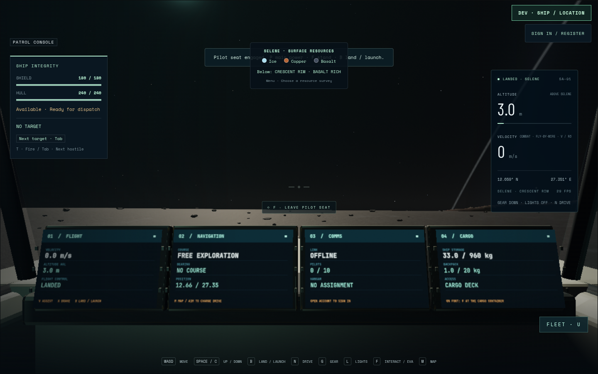
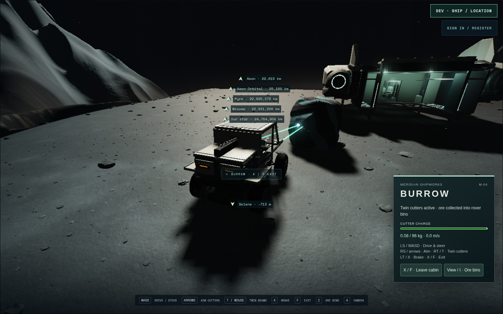
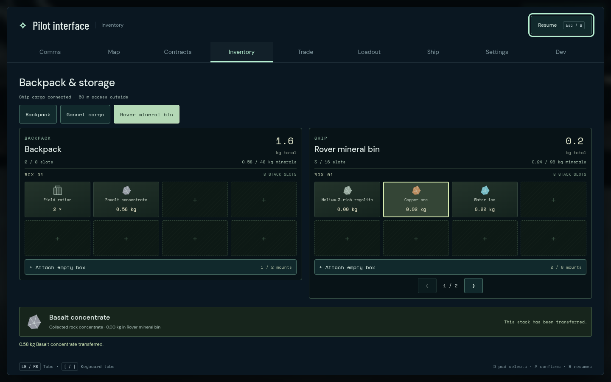

# Gannet keyboard journey 01

The full physical keyboard journey passes on 2026-09-08: one case in
3.9 minutes, 4.0 minutes total. Captured source is `19e4ab0`, production
build09 is `main-BQoDRjRm.js`, and the served assets are Gannet Art11
`51f5578c…` and clear-view Burrow `831b9569…`. Recorded source and fixture
identities remain stable throughout the run.

Native keyboard actions leave the pilot chair, walk to Burrow's port pressure
door, board through its steps, open the transport hatch and lower the elevator.
All four rover wheels reach canonical terrain. Digital steering follows a real
curve to the existing Crescent outcrop; both cutters extract ore into the rover
bin. The common inventory transfers **0.580632274 kg of basalt** through actual
Tab/Enter navigation. The backpack increase equals the bin decrease, and ship
supplies remain unchanged.

Closing the inventory with mining held and a trusted native tab blur/focus each
require a fresh release before cutting resumes. The rover reverses its outbound
trajectory, returns to the original lift, rises and secures behind the hatch.
The player physically exits its door, walks back to Gannet's pilot chair, and
launches with the same loaded rover aboard. Actual gear retraction, automatic
gear deployment and landing pass. No debug pose movement replaces these actions.





Root inspected those original images and the carried-flight image. There are no
page errors, console warnings or failed HTTP responses. Chromium151.0.7922.173
uses ANGLE/OpenGL ES3.2 on AMD Radeon860M at1440×900, DPR1, with the automatic
render scale at0.8 (1152×720 buffer). This is a correctness journey, not an FPS
measurement, physical controller test or full128-SBU freight performance check.
The development scenario uses practice-memory storage, so accepted saved bytes
do not establish persistence across reloads.

Original journey/input/access JSON, eleven PNGs and the complete Playwright video
remain under `/home/cees/projects/.medium-ships-qa/gannet-primary-01`.
The runner log is `/tmp/star-agent-gannet-keyboard-01.log`. Touch uses a separate
output root to preserve this run's video. Final art acceptance is separate;
Art11's failed independent review remains recorded.

```sh
GANNET_URL=http://127.0.0.1:5582 \
GANNET_PRIMARY_OUTPUT=/home/cees/projects/.medium-ships-qa/gannet-primary-01 \
npm run test:browser -- -c scripts/gannet-primary-inputs.config.js --project keyboard
```
