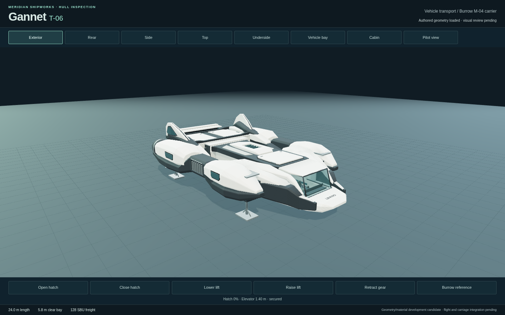
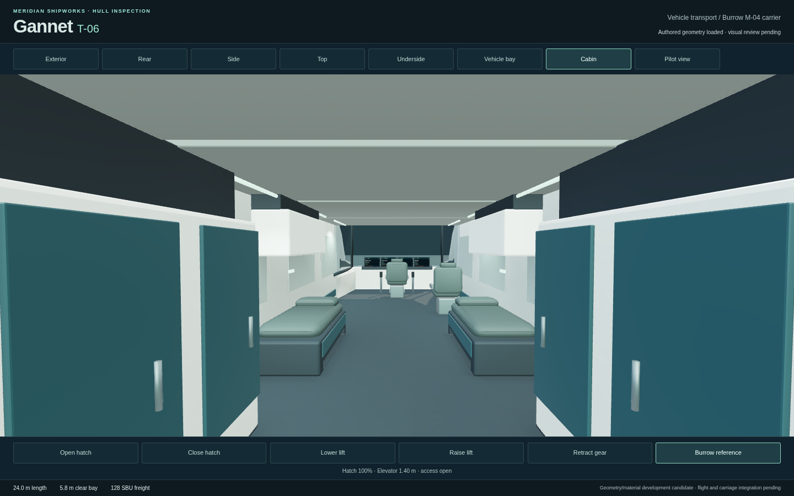

# Gannet Art13 native inspection

The exact Art13 studio inspection passes on 2026-09-08: one case in 32.0 seconds,
35.4 seconds total, runner exit 0. Captured source is `e727d8e`; Gannet is
`8da0bc2e3da7c8c2a2db7b29957b226fab0ba30eb0155f98d82a3f82c3995e6f`,
56,490 triangles / 3,169,484 bytes, with clear Burrow `831b9569…`.
Both studio 5581 and main-game 5582 HTTP assets match these source bytes.

All 21 original desktop/portrait views, both hatch directions, elevator travel
with Burrow and complete gear retraction/deployment pass. The fixed pilot eye,
60-degree lens, real MFD vertices and inspection controls outside the canvas
remain unchanged. Root inspected the original exterior and cabin images: the
previous bright floor lattice and shiny upholstery edges are visibly reduced.
Independent art scoring remains separate from this successful fixture result.

Chromium 151.0.7922.173 uses ANGLE/OpenGL ES 3.2 on AMD Radeon 860M, DPR 1,
1440×900 and a resized 390×844 page. This is pointer-operated studio inspection,
not native-touch gameplay. Page/console-error diagnostics are empty; this fixture
does not collect console warnings. Its final portrait counters are 13 calls and
48,734 triangles after culling, not complete scene cost or a performance result.

The combined final source passes 1,109 normal tests in 34.652 seconds, zero
failures/skips. Production build15 passes in 17.22 seconds during concurrent CPU
testing (`main-B5-qTCnz.js`); the isolated studio build passes in 1.07 seconds.
Both builds retain the existing Vite chunk-size advisory. The unchanged main
lamp helper passes nine actual fixture attachments and 19 occupied light paths
on final Stratum Art04 / Gannet Art13. That CPU check does not measure brightness.

Original PNGs, state/framing receipts, identity checks and full motion video:
`/tmp/star-agent-gannet-native-art13`. Log:
`/tmp/star-agent-gannet-native-art13.log`. GPU released at 03:22:03 UTC.
The [Art13 construction record](../gannet/art-revision-13.md) and
[failed Art12 review](gannet-native-review-12.md) preserve the preceding evidence.




```sh
TMPDIR=/home/cees/projects/.mdtmp \
GANNET_HARDWARE=1 GANNET_URL=http://127.0.0.1:5581 \
GANNET_EVIDENCE=/tmp/star-agent-gannet-native-art13/evidence \
GANNET_TEST_OUTPUT=/tmp/star-agent-gannet-native-art13/test-output \
npm run test:browser -- -c scripts/gannet.config.js
```
