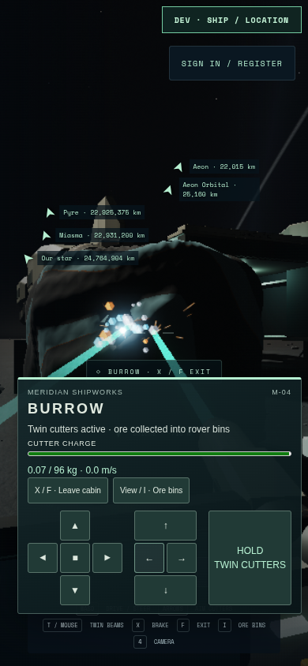
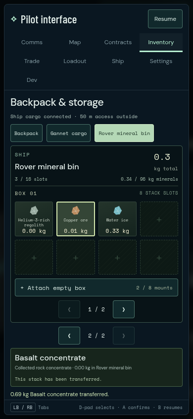

# Gannet touch journey 01

The full native-touch journey passes on 2026-09-08: one Playwright case in
4.3 minutes. Captured source is `19e4ab0`, production build09 is
`main-BQoDRjRm.js`, and the served Gannet/Burrow hashes are `51f5578c…` /
`831b9569…`. All recorded source and fixture identities remain stable.

Actual Chromium touch contacts operate the on-screen controls and drag the
view. The player leaves Gannet's seat, walks to Burrow's pressure door, boards
through the steps, and lowers the vehicle elevator. All four wheels reach
canonical terrain. The rover follows a real steering curve to the existing
outcrop and extracts ore with both cutters. The shared inventory visibly
transfers **0.691566087 kg of basalt**, with equal backpack increase and bin
decrease and an accepted practice save.

The same held touch contact survives opening/transferring/closing the inventory;
cutting stays suppressed until it is released and pressed afresh. A trusted
native tab blur/focus also requires fresh input. The rover reverses its outbound
path, returns to the original lift, rises and secures behind the hatch. Physical
door exit and cabin walking return to the pilot seat. Loaded takeoff, braking,
gear retraction, gear-deploying landing and continued carriage of the same rover
all pass. Final mode is landed, power/controls enabled, with0.408363678kg of ore
still aboard the rover.




Root inspected the forward pilot view, enclosed rover, mining, inventory and
loaded touchdown originals. The forward windscreen is clear. The390px portrait
lens does not contain all four MFDs in its forward image; this journey does not
certify per-display main-game readability. Existing floating HUD panels are
crowded at this width. The separately recorded studio MFD looks remain studio
evidence, not a substitute for a main-game look inspection.

Chromium151.0.7922.173 uses ANGLE/OpenGL ES3.2 on AMD Radeon860M at390×844,
DPR1, automatic scale0.8 (312×675 buffer). Page errors, console warnings and
failed HTTP responses are empty. This is injected native Chromium touch,
not physical phone hardware or an FPS/full-freight benchmark. Development uses
isolated practice-memory storage; no durable reload or online authority claim
is made. Independent Art11 review remains failed while Art12 is in progress.

Original input/journey/access JSON, eleven PNGs and finalized videos are under
`/home/cees/projects/.medium-ships-qa/gannet-primary-touch-01`. Log:
`/tmp/star-agent-gannet-touch-01.log`. The full Playwright log reports1passed
and the completed receipt reportsPASS. The host command session subsequently
returned exit143; no cause is established for that wrapper status, and it is
not recorded as exit0. No automation browser remained at release.

The fresh output root preserves every keyboard01 file, including its original
Playwright videos.

```sh
GANNET_URL=http://127.0.0.1:5582 \
GANNET_PRIMARY_OUTPUT=/home/cees/projects/.medium-ships-qa/gannet-primary-touch-01 \
npm run test:browser -- -c scripts/gannet-primary-inputs.config.js --project touch
```
