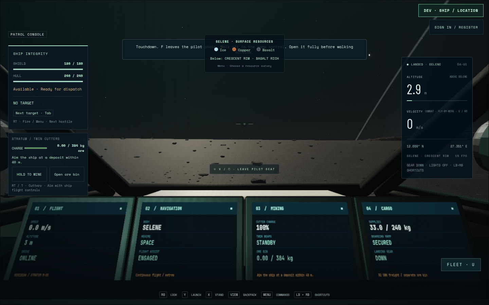
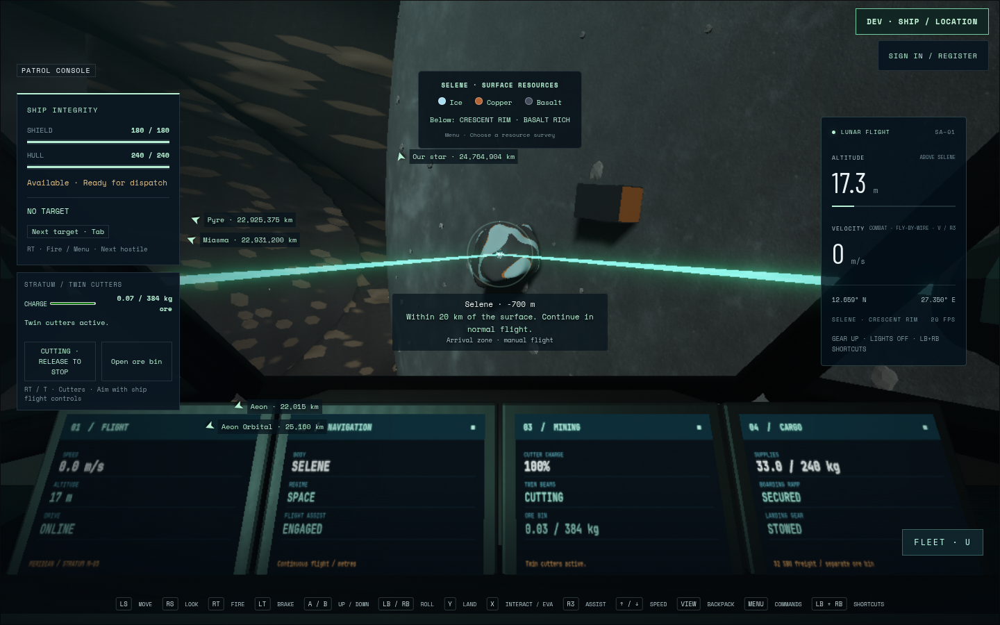
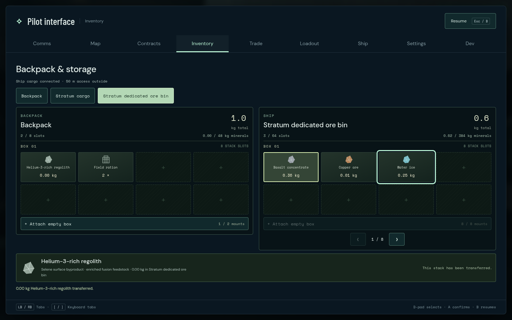

# Stratum controller journey

The complete injected standard-Gamepad journey passes on source `4b80706`,
production build07 `main-C2Axz7bX.js`, with Stratum Art02 `b2660a8e`. The test
ran in2.6 minutes on Chromium151.0.7922.173, ANGLE/AMD Radeon860M,1440×900
viewport. Automatic render scale was0.8 (1152×720 buffer). This is application
input validation, not physical-controller or performance acceptance.

The controller performs a real180m Selene approach and Y landing; walks the
whole aisle and deployed ramp to canonical terrain and back; secures the ramp
and pilot chair; relaunches, retracts gear and flies to the existing outcrop.
Both actual articulated GLB barrel tips match the live beam starts exactly.
Direction errors are below5e-16 and both unobstructed rays hit the same Crescent
deposit at21.6936m. The actual voxel revision and384kg dedicated-bin contents
advance together; backpack and separate supplies are unchanged by extraction.
The controller then uses the common inventory dialog to transfer a real item
from the ore bin to the backpack, with equal removed and added quantities.

The debug-only save receipt reads the actual committed practice Map bytes.
An independent read-only MiningStore reparses those bytes before/after mining
and transfer. This proves accepted serialization within this development
session; development flights deliberately do not retain that Map across reload.
It does not certify ordinary browser-localStorage durability.

Held RT is suppressed across the inventory dialog, trusted browser blur/focus,
disconnect, replacement and unsupported mapping. Each actual release and first
fresh press resumes correctly, followed by a powered, secured return to normal
pilot control. All five interruption gates pass. Source/asset hashes remain
stable; page errors, console warnings and failed HTTP responses are empty.
The original01 wrong-store failure and02 reconnect runtime failure remain
retained with their original videos and receipts.







Reproduce against the isolated production preview with a fresh evidence folder:

```sh
STRATUM_URL=http://127.0.0.1:5582 STRATUM_OUTPUT=/tmp/stratum-controller-fresh npm run test:browser -- -c scripts/stratum-gameplay.config.js
```

Original complete receipt, screenshots, input/physical path samples and videos:
`/home/cees/projects/.medium-ships-qa/stratum-controller-03`. Native keyboard/touch,
final art, online authority and sustained hardware performance remain separate
acceptance work. The latest normal unit suite passes1076/1076 in34.214 seconds.
