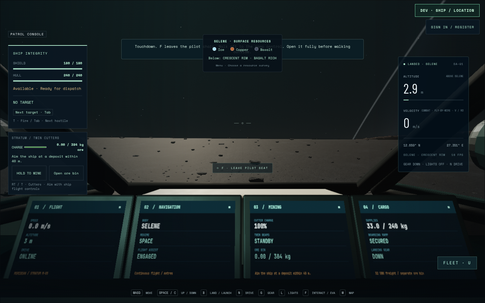
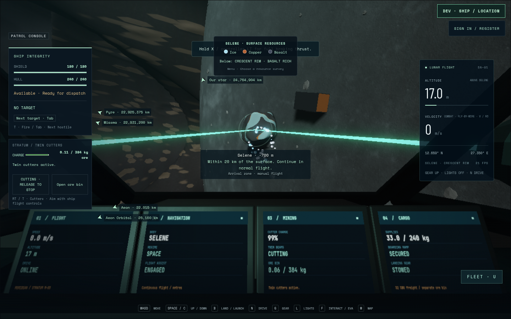
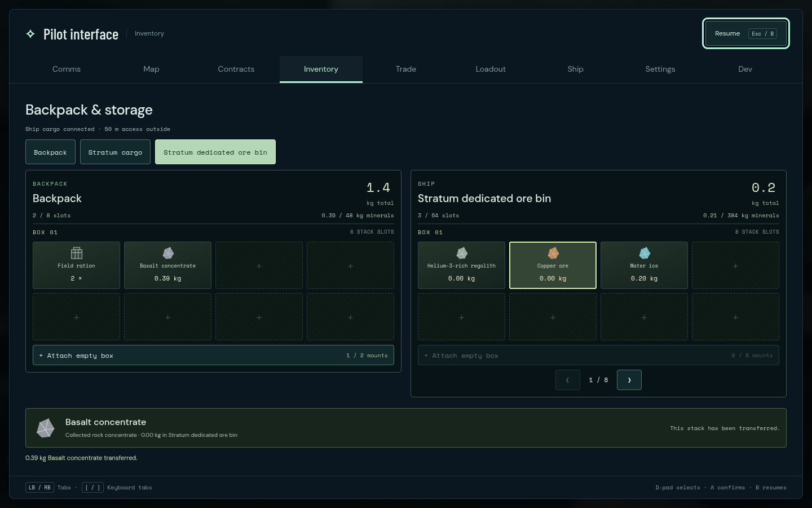

# Stratum keyboard journey 02

The full physical keyboard journey passes on2026-09-08: one case in1.9minutes,
2.0minutes total, runner exit0. Captured source is `9610187`, main build10 is
`main-DA6sz98Z.js`, and the actual Stratum Art03 model is
`22bbf0296e349e24f1a9bd636745511bf31b9291f1a305814f13d4a45cac4d08`.
All recorded source and fixture identities remain stable.

Native keyboard input lands on real gear, leaves the pilot chair, opens the
rear ramp, walks onto canonical terrain and returns through the same ramp.
After securing it and physically returning to the pilot chair, the player
launches, stows the actual gear, turns and uses short thrust pulses to approach
the existing Crescent outcrop. Both actual GLB muzzle beams hit that rock and
commit voxel cuts and ore to the dedicated384kg bin. Tab/Enter navigation in
the common inventory transfers **0.392757425kg of basalt** into the backpack;
the bin decrease and pack increase agree, while ship supplies remain unchanged.

The held-input inventory close and trusted native tab blur/focus each require a
fresh release before cutting resumes. The journey finishes in enabled, powered
flight at the real pilot position, with cutters released and the ramp secured.
There is no debug pose movement or injected ore transaction.





The original01 failure is preserved under `stratum-primary-01`: a fixed75cm
per-render-frame assertion incorrectly rejected normal uphill walking during a
166.6ms render interval. The independently reviewed
[canonical support and elapsed-time correction](stratum-access-continuity-review.md)
now checks every recorded position, slope, footprint and transition without
changing gameplay or the native route. This run records93 outbound and57 return
samples, with maximum steps0.148134m and0.721426m. Both directions pass with no
support, movement or world/local consistency offenders; maximum support error
is below1.9nanometres. These are the stationary Selene ramp route's receipts,
not a general movement or terrain certificate.

Root inspected the original pilot, mining, external-beam and inventory images.
There are no page errors, console warnings or failed HTTP responses. Browser is
Chromium151.0.7922.173, ANGLE/OpenGL ES3.2 on AMD Radeon860M,1440×900, DPR1,
with an automatically selected1152×720 render buffer. No FPS or hardware-device
claim is made. The selected practice-memory adapter's actual serialized bytes
are parsed by the production MiningStore, but this does not prove reload
persistence. Art03's separate failed art review remains open; this is gameplay
acceptance, not final art or multiplayer acceptance.

Original journey/input/access JSON, nine PNGs and finalized Playwright video:
`/home/cees/projects/.medium-ships-qa/stratum-primary-02/keyboard`.
Runner log: `/tmp/star-agent-stratum-keyboard-02.log`.

```sh
STRATUM_URL=http://127.0.0.1:5582 \
STRATUM_PRIMARY_OUTPUT=/home/cees/projects/.medium-ships-qa/stratum-primary-02 \
npm run test:browser -- -c scripts/stratum-primary-inputs.config.js --project keyboard
```
