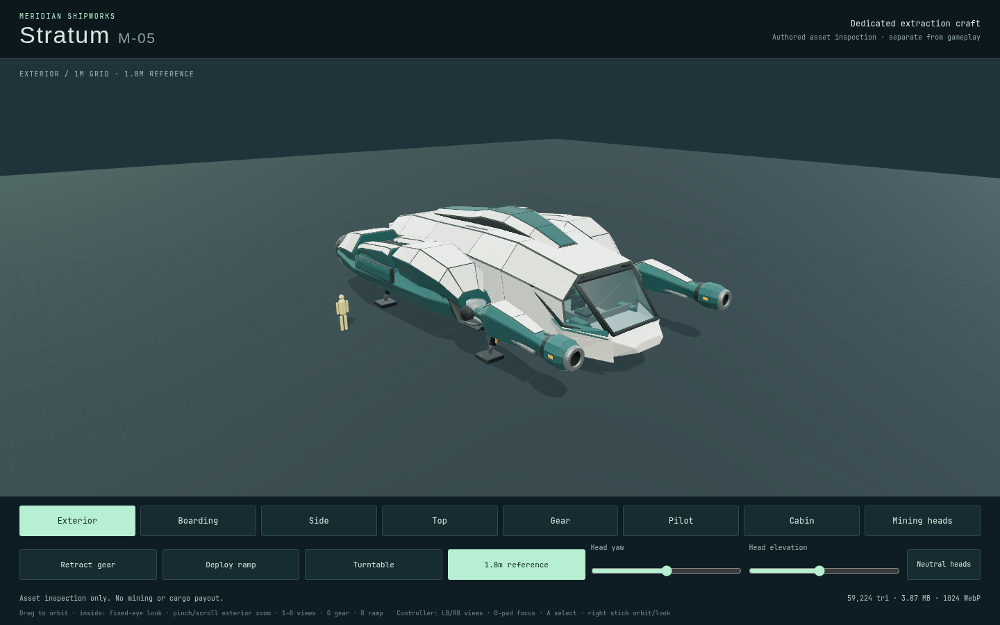
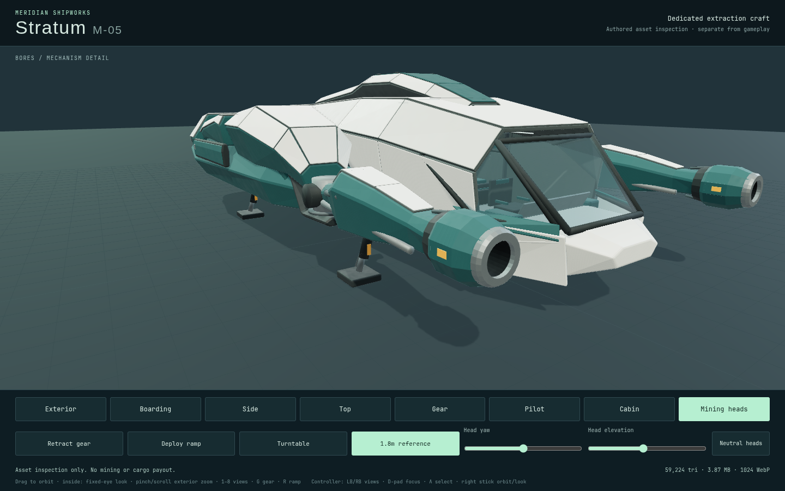

# Stratum Art04 native inspection

The exact Art04 candidate passes the unchanged desktop and native-touch studio
inspection on2026-09-08: two cases in52.5seconds total (25.4desktop,23.7phone),
runner exit0. Captured source is `1c07b8f`, importing the verified10-file asset
commit `cec332a`. GLB SHA256:
`1f5cae2a4901a2618d7cff36f1713a19777b45d586022614b9bc5449560cb75b`,
59,224triangles /3,867,188bytes. The stricter per-asset budget is unchanged.

The tapered mining booms and connected shoulder/drive profile replace the
former slender rods and repeated blocks. Cabinet construction, ceiling contact
sampling and joint hierarchy are revised. Source textures remain byte-identical;
lossless static tuple compaction and neutral-color omission recover byte budget.
[The CPU closure](stratum-art04-cpu.md) records the actual geometry/packing
checks, protected optical surfaces and inherited Art03 bore obstruction now
corrected. The rejected04a budget export is retained.




Both native cases complete gear and ramp opening/closing, full mirrored head
yaw±0.20 and pitch−0.12..+0.14, and neutral return. Every one of the four MFDs is
inspected from the fixed authored pilot eye with the unchanged72° studio lens.
The actual production geometry is rendered without page errors or console
warnings; failed HTTP responses are included in the fixture's error channel.
Root inspected the exterior, side, cabin and mining-head originals. Independent
Art04 visual scoring is pending; native render/control success is not that score.

Browser is Chromium151.0.7922.173, ANGLE/OpenGL ES3.2 on AMD Radeon860M;
1440×900 desktop and390×844 phone, DPR1. Desktop uses native pointer input;
phone uses actual touch contacts. This is studio inspection, not another full
gameplay journey, hardware-device test or FPS measurement. The six full input
journeys are separately documented at their earlier exact runtime/model hashes.
The studio cameras/global lighting remain unchanged for comparison with Art03.

Before capture, main build14 passes4.96seconds and the studio build passes.
The73 focused actual asset, mining, medium, continuity and capture cases pass
in4.008seconds, zero skips/failures. The unchanged main lamp geometry probe
passes nine emitters and19 occupied paths; it does not measure brightness/FPS.

All50 original PNGs, both finalized videos and actual mechanism/camera/input
receipts remain in `/tmp/star-agent-stratum-native-art04`, with runner log
`/tmp/star-agent-stratum-native-art04.log`. The owned browser closed and GPU
was released at03:06:53UTC. No shared preview/user tab/API/database/deployment
was changed.

```sh
STRATUM_URL=http://127.0.0.1:5580 \
STRATUM_QA_OUTPUT=/tmp/star-agent-stratum-native-art04 \
npm run test:browser -- -c scripts/stratum-studio.config.js
```
