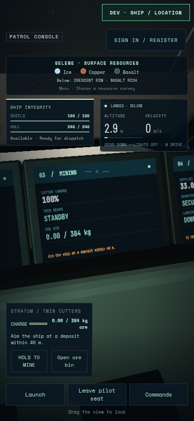
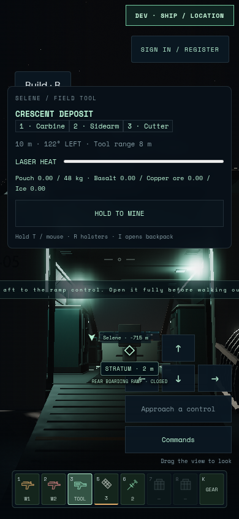
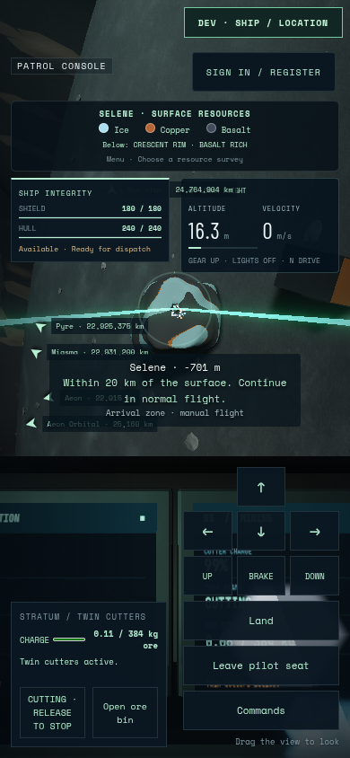
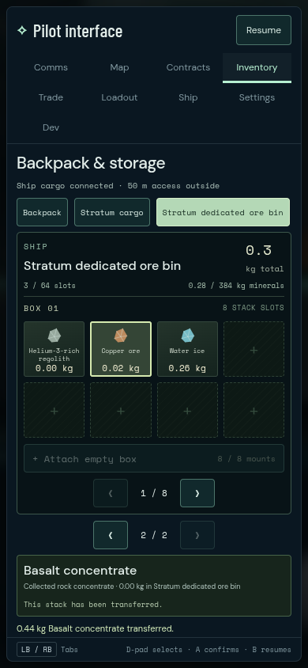

# Stratum native-touch journey 03

The complete native-touch journey passes on2026-09-08: one case in3.0minutes,
3.1minutes total, runner exit0. Captured source is `60bdd67`, runtime capture
fix `e7beff9`, build13 `main-S4E53Kmz.js`, with Stratum Art03 `22bbf029…`.
All source, model and fixture identities remain stable.

Actual touch input lands on real gear and looks at each of the four physical
cockpit displays without moving the pilot eye or changing the lens. Every
inspected display centre clears the actual phone HUD. The player leaves the
chair, opens the rear ramp, walks onto canonical terrain, turns using a clear
canvas lane, returns through the same ramp and secures it. After physically
returning to the chair, touch controls launch, stow the gear, aim and apply
short thrust pulses toward the existing Crescent outcrop. Both real muzzle
rays cut that rock and commit ore to the384kg Stratum bin.

The visible common inventory transfers **0.436672854kg of basalt** into the
backpack, preserving the matching bin decrease and unchanged ship supplies.
Mining held through inventory closure and trusted native tab blur/focus each
require a fresh release. The journey returns to enabled, powered flight with
cutters released and ramp secured. There are no keyboard/gamepad input events,
debug pose writes, injected ore transactions or pointer-lock transitions.
The595 outbound and402 return samples pass canonical support, elapsed-time
movement and world/local continuity checks with no offenders.






The [independent presentation review](stratum-touch-review-03.md) inspects all13
original PNGs and five preserved02 comparisons. The four landed display looks
and walking-control clearance are closed. The expanded flight pad still covers
part of physical MFD3; the left mining HUD exposes its charge, ore and cutting
state. This is not an unobstructed four-MFD flight-view certificate. The legacy
on-foot instruction strip is clipped, and transient instructions retain some
keyboard/controller labels. Those presentation limits remain recorded.

Browser: Chromium151.0.7922.173, ANGLE/OpenGL ES3.2 on AMD Radeon860M,390×844,
DPR1; final render buffer390×844. Page errors, console warnings and failed HTTP
responses are empty. Native CDP touch contacts exercise the browser input path;
this is not a physical touchscreen or FPS measurement. Actual practice-memory
adapter bytes are parsed by the production store, not evidence of persistence
across reloads. No multiplayer or final-art acceptance is claimed.

Original failed01 retains the accidental mouse capture;02 retains the fixture's
upper-only drag search failure. The [capture correction](touch-capture-fix.md)
and expanded actual-canvas search close those causes without hiding UI or
writing navigation state. Original03 screenshots, finalized videos and complete
journey/input/access receipts are retained under
`/home/cees/projects/.medium-ships-qa/stratum-primary-touch-03`;
runner log `/tmp/star-agent-stratum-touch-03.log`.

```sh
STRATUM_URL=http://127.0.0.1:5582 \
STRATUM_PRIMARY_OUTPUT=/home/cees/projects/.medium-ships-qa/stratum-primary-touch-03 \
npm run test:browser -- -c scripts/stratum-primary-inputs.config.js --project touch
```
