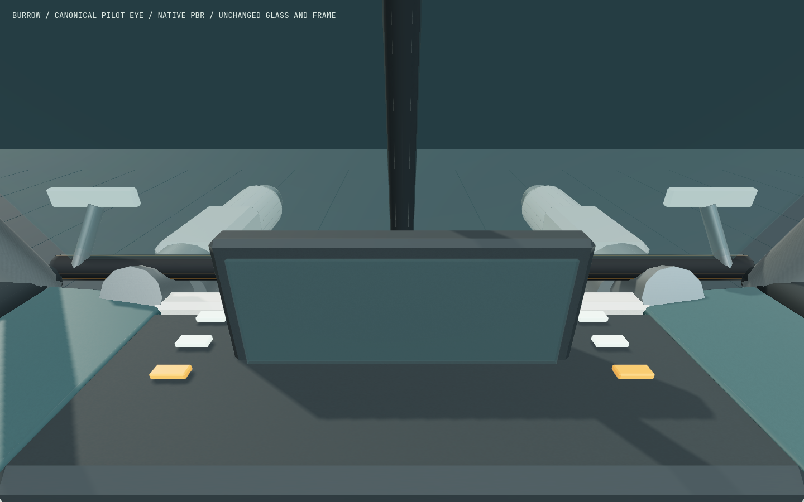
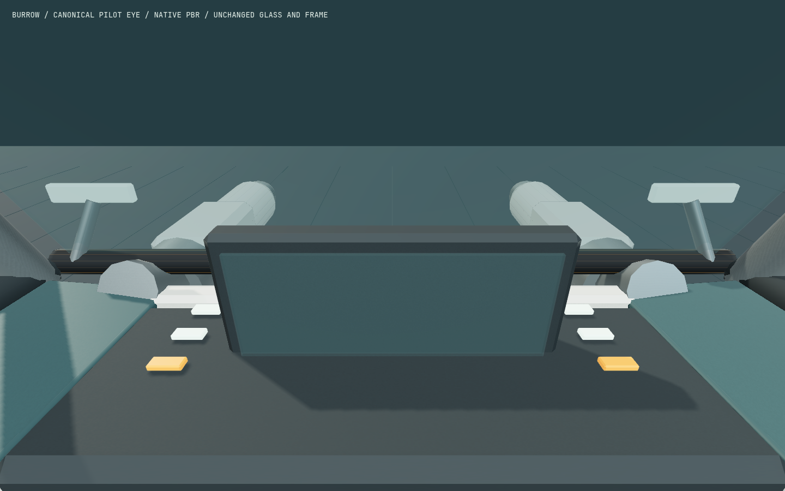

# Burrow uninterrupted forward windscreen

Cees requested removal of the central windshield strut. Correction 11 removes the
separate opaque rod from the authored Blender source. The existing single glass
pane, outer frame, work lamps, dimensions, anchors and mechanisms remain intact.
The standing design preference is an unobstructed main forward driver sightline.

Base: `641d5179a8aa72c2bf0e361c44fe2656c883c57b`. Source assets are limited to
`blender/build_mining_rover.py`, the editable blend, manifest and runtime GLB.
No runtime, controls, physics, inventory, service, protocol or save change.

| Identity | Before, candidate 10 | After, correction 11 |
| --- | --- | --- |
| SHA256 | `88448d9dd48e0a0acdb2397465302e8ab41335b8ffaab6234050d136bf6cc78f` | `831b9569633efda11652e3827057d2f4bc3f47d20f23a47df152fa437cb29468` |
| Triangles | 21,570 | 21,526 |
| GLB bytes | 2,177,260 | 2,175,556 |

## CPU verification

Blender 5.2.0 LTS rebuilt the source successfully; the existing geometry/WebP packer
completed with the existing Pillow authoring environment. The first pack attempt
with system Python failed because Pillow was absent; no packages were installed.
A first geometry-probe launch also failed on a missing node_modules link in the
new checkout. Pointing the staging dependency link at the existing installation
resolved that runner setup; no asset change was made to satisfy either failure.

The [exact geometry diagnostic](geometry-check.mjs) passed: all 21,526 retained
triangles and their decoded position/normal/UV attributes are identical, with
exactly 44 removed triangles inside the central strut and zero added triangles.
All 308 pressure-glazing triangles, every named node/TRS/extras, canonical layout,
materials, texture bindings and all four embedded WebP payloads are identical.
The complete rest bounds are identical. Twenty central rays from the canonical
pilot eye previously hit the opaque strut; all 20 now pass through retained glass.

Existing probes on exact correction 11 also completed:

- `header.mjs`: 762 side-shell rays, zero escapes.
- `cabin.mjs`: 125 boarding-eye samples, zero failures; minimum clearance 0.149987 m
  for the 0.12 m eye sphere; all 32 forward-quarter rays remain sealed.
- `lamps.mjs`: both lamp supports attached; all 18 cutter aim states have zero
  bracket contacts and no self-blocked muzzle ray.

The generic seated mannequin still reports 811 contacts with harness/seat/yoke
geometry. That inherited diagnostic is not an all-body clearance pass or seated
IK claim. Exact retained geometry/rig identity is the bounded preservation proof.

Raw receipts are retained externally under
`/tmp/star-agent-rover-windscreen-qa/`: `build-11.log`, `pack-11.log`,
`delta-11.log` (failed dependency launch), `delta-11-retry.log`, `header-11.log`,
`cabin-11.log`, `lamps-11.log`, and `geometry-11/windscreen-delta.json`.
Baseline GLB/layout/source copies are in its `before/` directory.

## Native comparison verified

[native-comparison.mjs](native-comparison.mjs) uses the existing native fixture's
unaltered scene, PBR materials, lights and shadows at the canonical pilot eye.
One Chromium launch captured the frozen baseline and new GLB in two 1440×900
frames, with equal camera, target, rest bounds and shadow-frustum assertions.
The root inspected both images: the centre strut is gone; the glass, side frames,
dashboard, lights and cutter positions retain their original appearance.

| Before: candidate 10 | After: correction 11 |
| --- | --- |
|  |  |

Run on 2026-09-08 local time from source `d2f7eb0`, with only these QA files and
documentation uncommitted. Chromium **151.0.7922.173**, ANGLE **AMD Radeon 860M
Graphics (radeonsi krackan1 ACO), OpenGL ES 3.2**. Both frames are 1440×900;
canonical eye `[0, 1.78, -0.82]`, target `[0, 1.37, -1.67]`. The runner completed
in **4.104 seconds**, `complete: true`, with no page/console diagnostics. The
original fixture displays no live MFD; this is an isolated cockpit comparison.
The two PNGs here are byte-identical copies of the native originals.

Actual command, after reserving the shared GPU and isolated port 5583:

```sh
ROVER_REVIEW_PORT=5583 ROVER_REVIEW_OUT=/tmp/star-agent-rover-windscreen-native-11 ROVER_BEFORE_GLB=/tmp/star-agent-rover-windscreen-qa/before/mining-rover.glb node docs/qa/mining-rover/windscreen-open/native-comparison.mjs
```

Original `capture.json`, PNGs and log remain under
`/tmp/star-agent-rover-windscreen-native-11` and its sibling `.log`. The comparison
serves the retained baseline only through its own QA page. No production model
was temporarily replaced. The owned browser and server closed after capture.

The existing focused runtime, storage and physics checks pass **28/28** (3.676 s).
The user preview owner applied the correction on local port 5596 as `f8415cc`;
HTTP model retrieval matched the after SHA above. No user tab was reloaded by
the root. Candidate 10 reviews and failed iterations remain historical records;
this correction does not assign a new independent art score, repeat a complete
gameplay journey, establish frame rate, or claim public merge/deployment.
