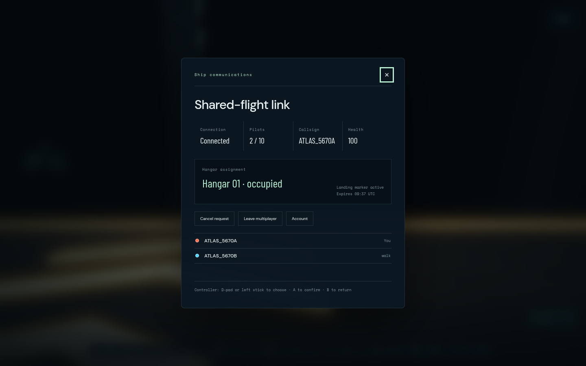
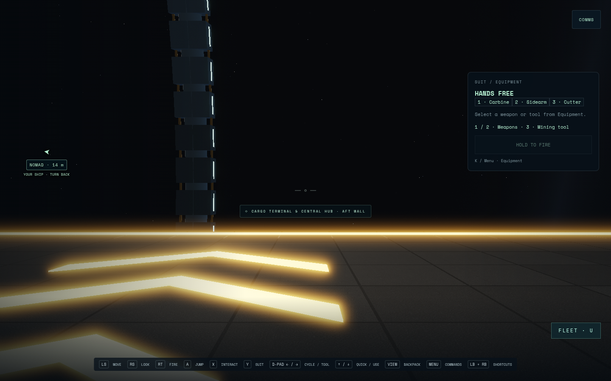
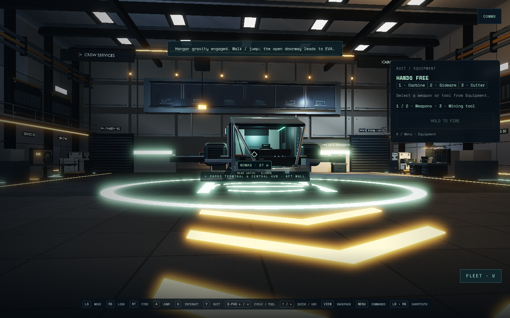

# Multiplayer hangar spawn and gravity

Validated 7 September 2026 on `fix/multiplayer-hangar-gravity`, based on
`feat/multiplayer-ten`. The server previously spawned every pilot in flight
400 metres outside a bay without a reservation. On-foot deck support depended
on the pilot's ship being docked, so EVA entry stayed weightless.

The server now reserves a distinct berth before admission, then spawns the pilot
standing beside the parked Nomad. Reconnect and respawn use the same allocation;
failed writes release or restore reservations without orphaning leases. Berth
allocation is independent of suit colour slots.

Authored hangar volumes define stationary local gravity at 9.81 m/s². A suit
entering from EVA settles onto the local deck; crossing its open edge returns to
EVA continuously. Ship docking/storage authorization remains separate. All bays
participate in suit collision. Snapshot frame IDs/up vectors, remote characters,
the local camera, item drops and server hit capsules use that same local up.
Protocol version 2 requires coordinated frontend/server updates. Nested moving
ship grids and visits to another player's cabin remain outside this change.

## Verification

- `npm test`: passed (66 test files in the final run).
- `npm run test:multiplayer`: 87 passed, one PostgreSQL integration test skipped
  because no test database was configured. Includes ten real authenticated
  sockets, concurrent admission, slot reuse, inventory persistence, failed join
  and respawn writes, disconnect during respawn, and lease cleanup.
- Server navigation tests physically walk around the hull, open the hatch, board,
  launch, depart and dock again using protocol controls. Additional checks cover
  jumping, respawn, continuous EVA entry/exit, another pilot's berth and closed
  versus open doors in an unassigned bay.
- `npm run build`: passed. The existing large-chunk advisory remains.
- Production browser suite: both account-entry and two-pilot journeys passed.
  The extended two-pilot test passed again with held movement across menu close,
  blur/focus and controller disconnect/reconnect. Injected standard Gamepad input
  drives Join, COMMS, cargo transfers, jump, doorway exit, EVA turn/brake and
  return to gravity. Debug state is read for steering/assertions only. Desktop
  registration, second-pilot keyboard movement and phone account access are also
  checked. No physical controller was used.

The browser observed Hangars 1 and 2 as occupied, both pilots in `walk`, with eye
clearance 1.75 m and distinct `hangar:1` / `hangar:2` frame IDs. Browser errors: none.
Chromium 151.0.7922.173, ANGLE/OpenGL ES 3.2 on AMD Radeon 860M, 1440×900 at DPR 1
for the captures; phone layout 390×844. These checks make no FPS claim.

Earlier browser attempts failed before initialization with temporary-allocation
errors and Chromium aborts. `/tmp` has user quotas; a test log also reported
write errno 122 (quota exceeded). Retrying with test temporary files and evidence
on the project disk completed successfully. No desktop/system settings changed.

