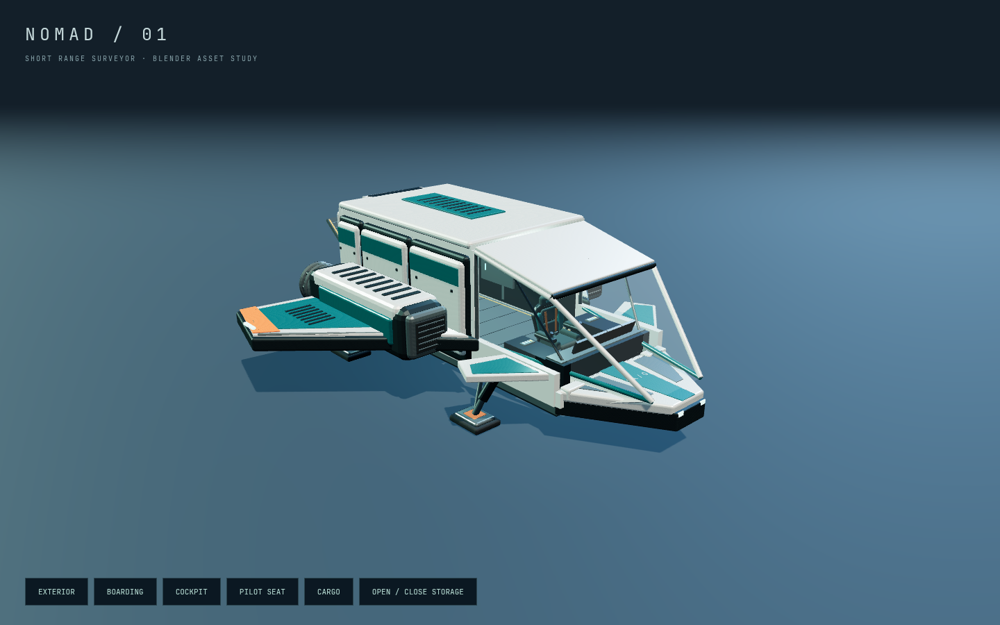
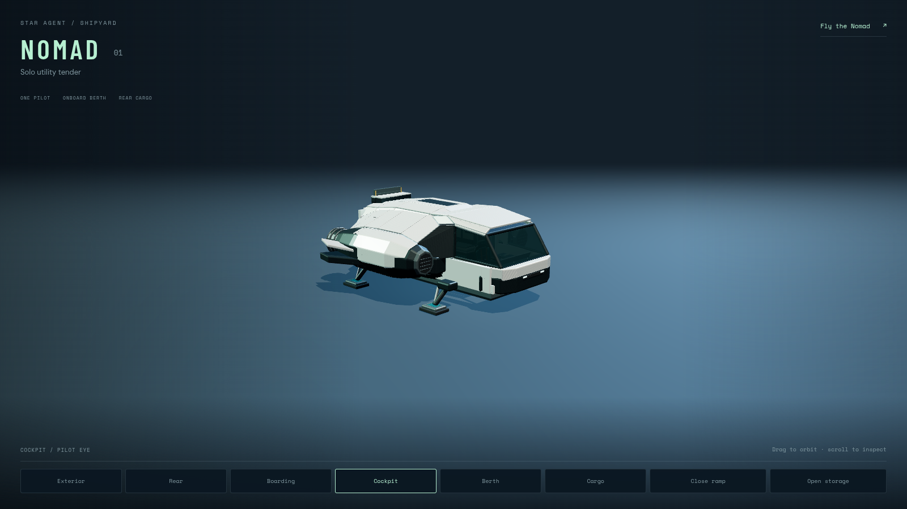
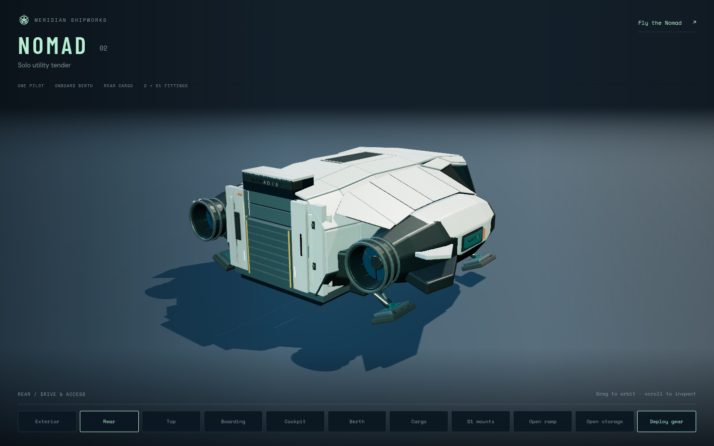
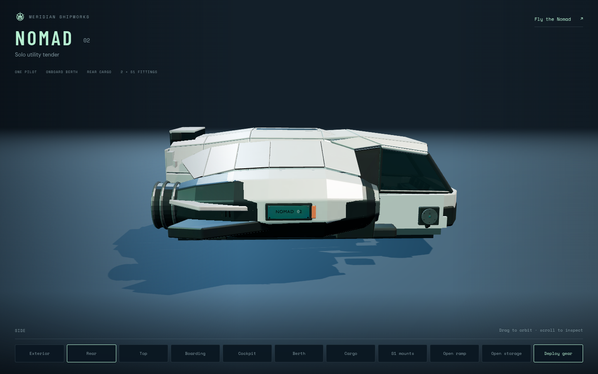
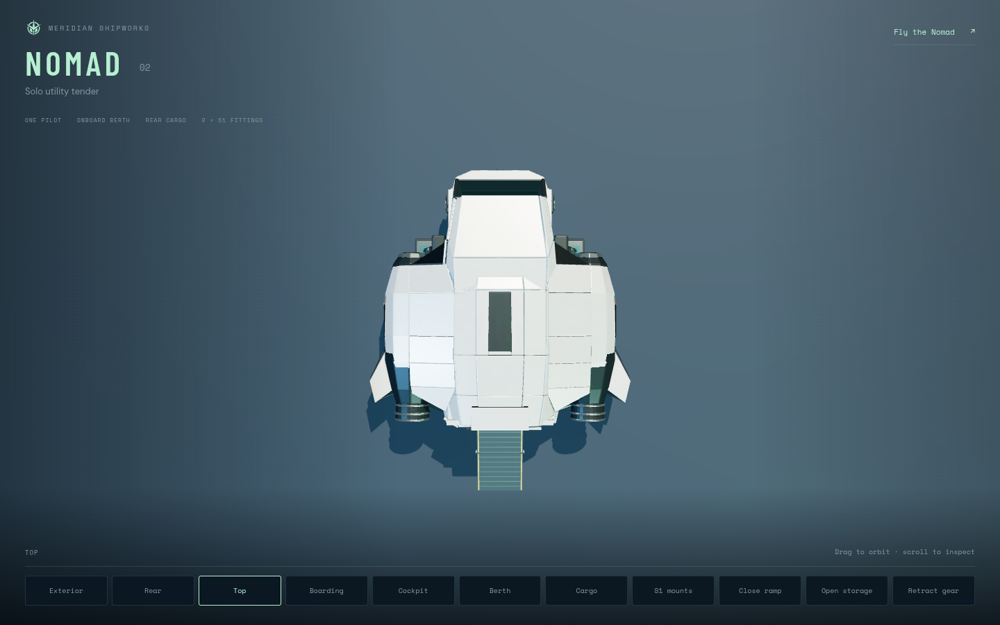
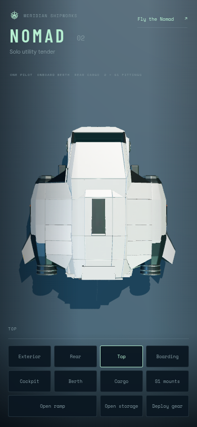
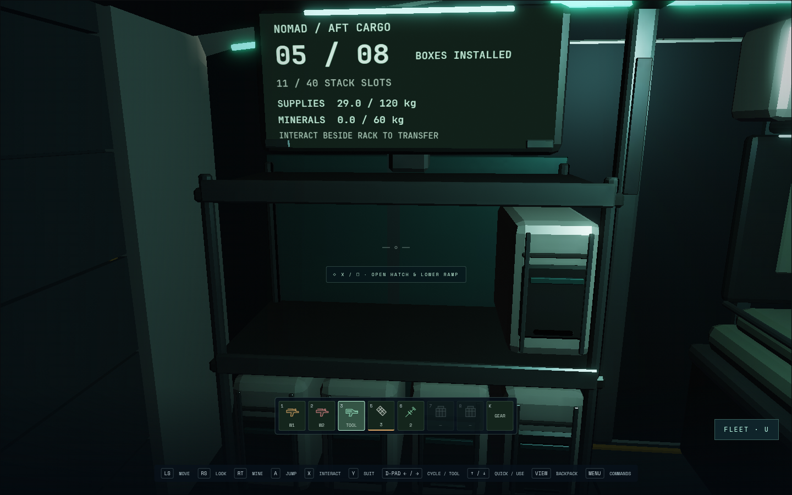
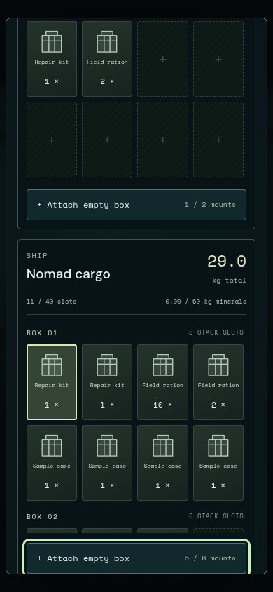

# Nomad 02 — draft review evidence

This record separates the accepted primary shape, the working gameplay, and the
still-pending final material/visual gate. It is not merge approval.

## Primary shape

The independent Astra reviewer rejected [v1](silhouette-v1.md) at 3.4/5 and
[v2](silhouette-v2.md) at 4.1/5. The rebuilt habitation, armored nose, fitted
drive roots and compact rear collar passed [v3](silhouette-v3.md) at **4.5/5**.
That gate preceded the final mechanisms and materials.

The before image records the original asset. Its camera/lens metadata was not
retained. The later [matched exterior and rear comparison](comparison/README.md)
records both versions with identical camera, lens, exposure and canvas settings.

## Working assembly

`scripts/nomad-studio.config.js` checks the complete loaded asset plus runtime
hatch, ramp, displays and cargo. The second pass completed in 14.5 seconds with
zero browser errors, warnings or failed requests. This is test duration, not a
frame-rate measurement.

The first pass measured a 70 mm axle intrusion at the ramp throat. Replacing the
full-width bar with outboard pin bearings preserved the ramp pivot and removed
that unsupported step. The second pass measured:

- Twenty-one sampled gear states inside the declared closed flight envelope.
- Twenty-one folding-ramp states below the actual sign/cassette face.
- 243 actual visible floor-triangle intersections across the central walking
  route and the two capsule-radius offsets, within 35 mm of the shared floor.
- **59,224 visible ship triangles with all eight cargo boxes**, including the
  runtime mechanisms. The GLB alone is 57,628 triangles and 3,413,568 bytes.

These pre-Meshy assembly images identify GLB
`33a64aba2093e40768862fb130e81382b1900c11a8913080202efe9d89f204da`.
Their current hardware was Chromium 151.0.7922.173, AMD Radeon 860M through
ANGLE/OpenGL ES 3.2, DPR 1, 1440×900 and 390×844. The studio uses ACES exposure 1.1;
it is not a substitute for game lighting. Three.js counters at the final desktop
studio side view were 81 draws/59,226 triangles, including the two floor triangles.
The studio retains Three.js's default counter reset, so those side-view counts
exclude its shadow pass. The complete 59,224-triangle ship cost above is measured
from visible meshes directly.

## Gameplay and remaining gates

Keyboard and touch have passed physical cabin/rest/cargo/return journeys. The
independent controller reviewer has passing desktop and phone parked journeys,
plus assisted and rotating inertial moving-berth journeys on the same frozen
runtime. Its [complete report](controller-review.md) retains the earlier harness
failures, exact candidate identities, actual input route and device limitations.
Injected Gamepad and Chromium touch events do not establish physical-device QA.

The later production utility run passed keyboard, assisted berth, fallback and
phone touch; its shader fixture passed a targeted retry after correcting a test
that watched stellar heat instead of re-entry heat. The malformed-GLB fixture
emitted its expected loader warning. Local source review found the need to
validate every cabin root before adoption. A new valid-GLB/missing-`CargoBox_8`
fixture covers that case. Both malformed and partial-model physical fallback
journeys then passed (1.9 minutes
combined), with only their expected loader warning. Other browser checks had no
diagnostics. This intake guard follows the historical frozen controller run.
Latest units: 471 tests in 63 files passed. The cargo MFD's PORT label and the
contextual HUD legend were corrected after the frozen controller report; these
text changes do not retroactively change that report's source identities.

The [six fixed production world views](world/README.md) record the actual game
lighting and scene counts. They completed with clean diagnostics; the inherited
orbit fixture exceeds the 300-draw target. They do not certify whole-world
performance or replace the final material review.

The [independent CPU pipeline audit](pipeline-review.md) closed seven source
findings and independently passed all 17 contract tests. It proves painting UV
reproducibility and the tested material/rig preservation, with explicit limits
for the no-bake probes and future generated-source attribution.

The final generated finish has not been imported: Chromium blocked its Meshy
download, and the manual supplied GLB is still needed. The final six-item visual
rubric (average ≥4.2, every item ≥4), final finish screenshots and clean performance
acceptance remain pending. The user's Kestrel preview was left open during the
later functional checks; those runs make no hardware FPS claim.

See [the delivery record](../../nomad-utility.md) and
[the player/source guide](../../nomad-ship.md) for the supported behavior,
dependency on integration PR 34, material provenance and reproduction commands.
