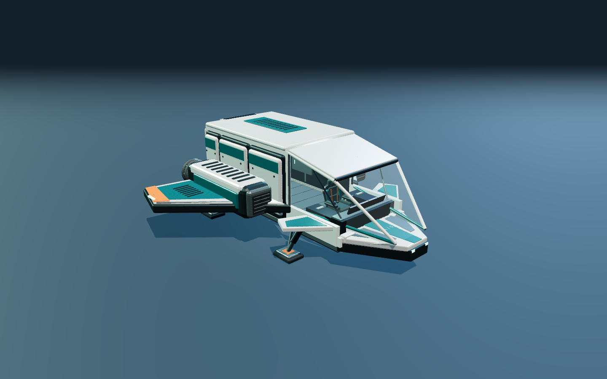
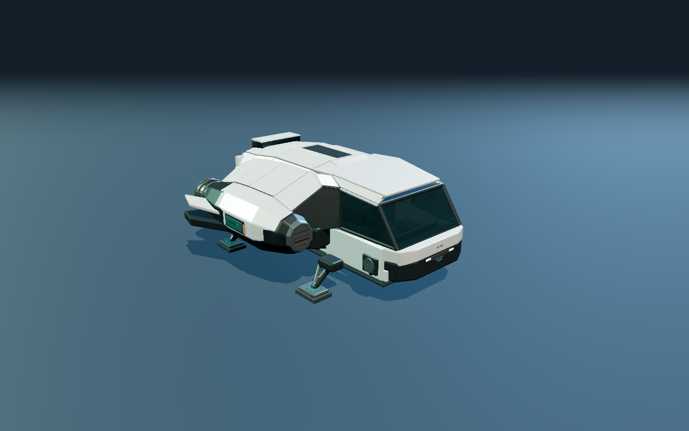
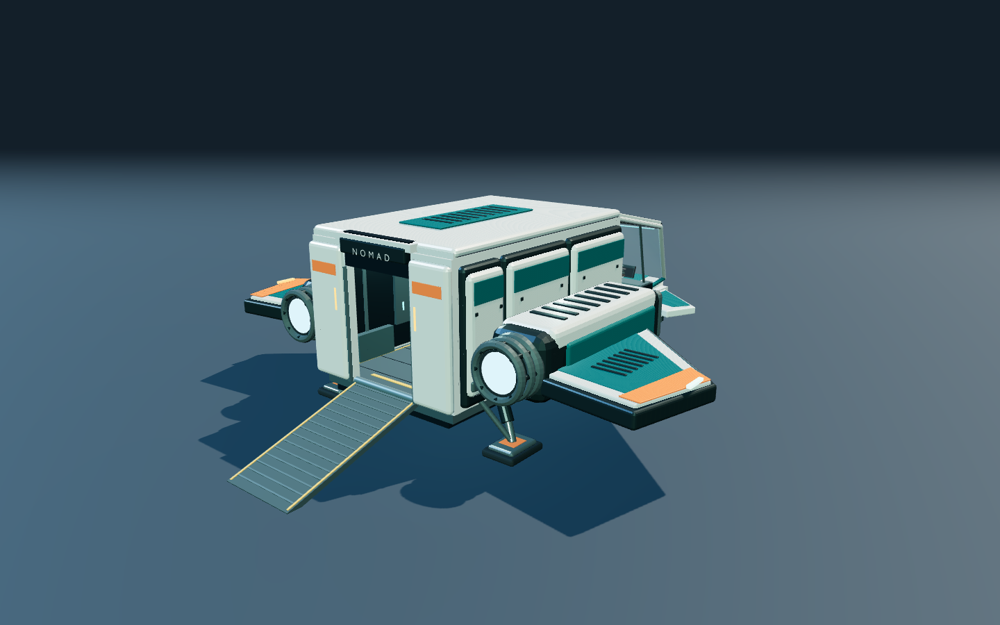
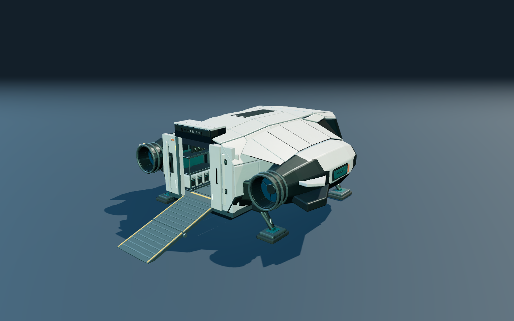

# Original Nomad / Nomad 02 matched views

These producer captures use the original integration `6f80fc0` studio and the
current Nomad 02 studio. Chromium fetched and recorded each actual GLB response;
the baseline checkout was not edited. Both studios' HTML and CSS pseudo-overlays
were hidden for the comparison. The test exposed read-only camera/renderer
diagnostics in the baseline module; it changed no ship or lighting parameters.

| Setting | Both captures |
|---|---|
| Browser | Chromium 151.0.7922.173 |
| Backend | AMD Radeon 860M, ANGLE / OpenGL ES 3.2 |
| Viewport / drawing buffer | 1440 × 900, DPR 1 |
| Vertical FOV / ACES exposure | 44° / 1.1 |
| Exterior camera → target | `[13, 9, -15]` → `[0, 1.65, -0.6]` |
| Rear camera → target | `[11, 7, 14]` → `[0, 1.8, 0.3]` |
| Ramp / gear | Open / deployed |

Camera, target, FOV, exposure, viewport, DPR and drawing-buffer values were
asserted equal. Hemisphere/key/fill/rim positions, intensities and colors match.
The current studio's key-shadow acne correction remains active: bias −0.00015
and normal bias 0.025, compared with −0.0002 and 0 in the original. This is a
matched-camera comparison of the actual versions, not a pixel-identical renderer
fixture or final material acceptance.

| Original | Nomad 02, before imported finish |
|---|---|
|  |  |
|  |  |

The original GLB is 3,783,616 bytes, SHA-256
`827953567b33d2046e94e7b6269b49d3a9e25b2f4e0f96dbe47afc15ab46722a`.
Nomad 02 is 3,413,568 bytes, SHA-256
`33a64aba2093e40768862fb130e81382b1900c11a8913080202efe9d89f204da`.

The final comparison passed in 6.6 seconds, with zero page errors, console
warnings or failed requests. This is test duration; no FPS claim is made while
the user's Kestrel preview remains open. All four images were inspected. The
earlier 9.2-second capture retained the new studio's CSS vignette and is archived
separately; it is not used in this pair.

The source harness is `scripts/nomad-comparison.{config,spec}.js`. Start the
original checkout and candidate with separate Vite caches; `NOMAD_BEFORE_URL`
and `NOMAD_AFTER_URL` select their studio URLs. As with the other Nomad configs,
`NOMAD_HARDWARE=1` selects ANGLE GL. The final raw capture/metadata archive is
`/tmp/star-agent-nomad-comparison/`; the overlaid first attempt is at
`/tmp/star-agent-nomad-comparison-with-studio-overlay/`. Generated JSON reports
are not committed.
