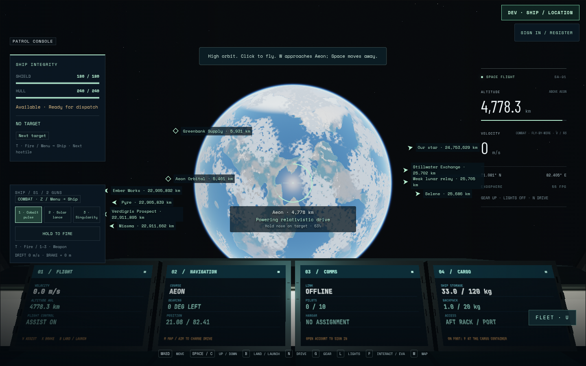
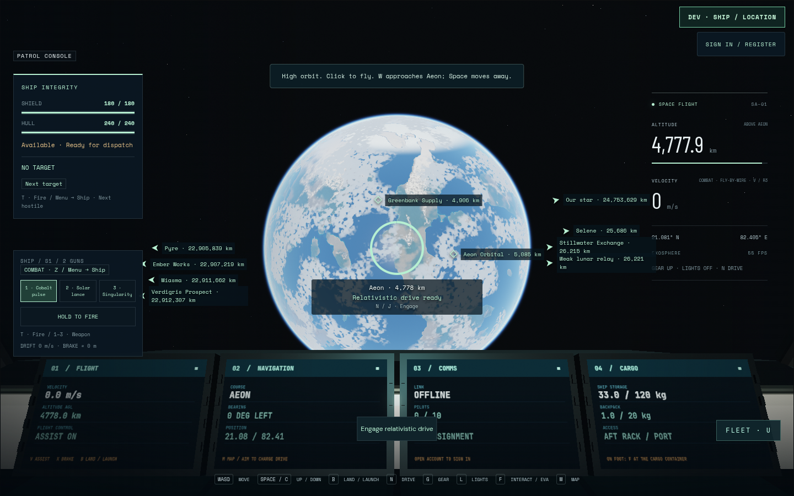
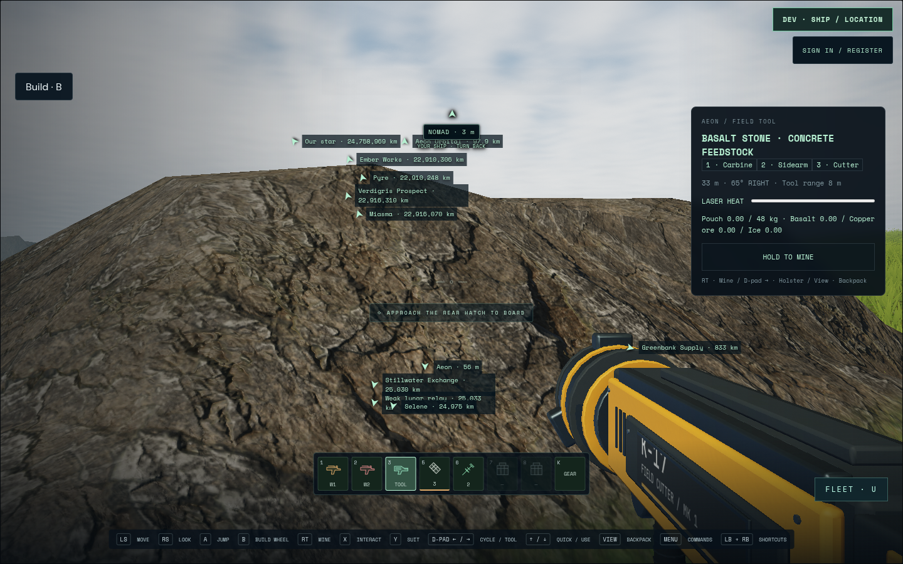
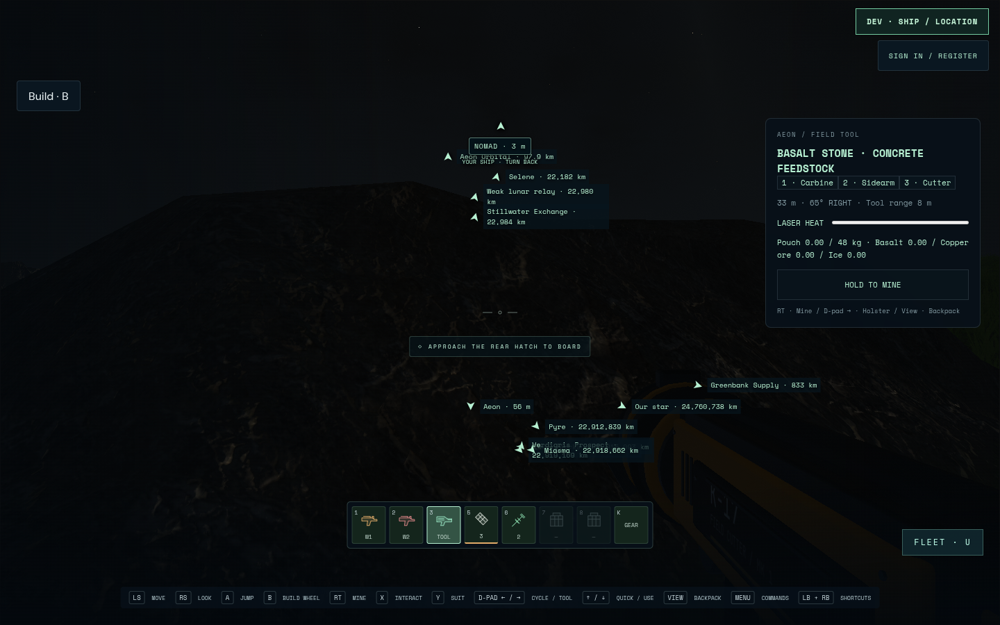

# Planetary rotation — development evidence

SA-WORLD-004, isolated `.worktrees/planet-rotation`, `feat/planet-rotation` from
`f1ef821`. Implementation is present; final combined validation and integration
are in progress. No independent acceptance, physical-device test or deployment
is claimed. [Decision](../../decisions/planet-rotation.md).

## Checks and limits

- Nine numerical invariants cover disjoint domains, terrain/save anchors through
  a day on all worlds, double precision, moving arrivals with/without spool,
  frame position/attitude/momentum, inertial flight and render-root boundaries.
- Eight authoritative regressions cover cross-frame hitscan, continuous swept hull
  contact, polar reconciliation, protected station rams, parked-hull EVA access,
  boundary boarding and carried cabin collision. Actual
  room snapshots also synchronize two skewed client clocks through a complete
  day while preserving station/parked-hull anchors.
- Freight authority and isolated PostgreSQL persistence pass at a deterministic
  clear departure phase. Real wall-clock phases can correctly block the direct
  line through a planet; this fixture does not certify a physical freight journey.
- Latest source passes all 1,217 normal tests across 160 files (63.5 seconds),
  plus 204 multiplayer cases with two existing opt-in skips (100.4 seconds).
  Focused boundary/navigation/travel checks pass all 118 cases. Parked cabins
  retain their hull frame while an EVA character crosses the domain; boarding
  preserves physical attitude and inherited velocity, and collision correction
  keeps a moving cabin and its carried eye in the same coordinate chart.
- The update-time target lock uses the same rotation phase as engage; 23 focused
  rotation/targeting/travel cases pass, including the actual foreign bearing at a
  quarter-turn. Final combined browser verification follows.
- Initial draft PR104 hosted checks at3180064 pass all five jobs, including
  isolated PostgreSQL persistence. They predate the final cabin boundary fixes.

The first production orbital inspection passed all four worlds in 57 seconds,
with eight PNGs and no application errors. Chromium 151.0.7922.173, ANGLE OpenGL,
AMD Radeon 860M (radeonsi, krackan1, ACO), 1440x900 at scale1. Orbital poses were
explicit debug fixtures. Images show moving geography and stable inertial sky;
LOD streaming was still settling, so this is not performance or maximum-LOD
acceptance. Combined browser04 repeats the orbital inspection successfully (1.2 minutes) and
completes the full injected-controller ground journey (1.3 minutes): land, stand,
hatch, walk, half-day change, inventory, held-input suppression on modal exit and
device reconnect, return, board and launch. No pose writes; only the clock is
accelerated. The surface sun dot changes from 0.6417 to -0.4580; ground drift stays
under 0.1m and the parked hull under 0.00001m. Application errors are empty.

Shared-clock and corrected targeted-drive verification remain pending.

## Failure ledger

| Attempt | Actual result and correction |
| --- | --- |
| Initial frame tests | Eight-radius overlap assumption failed; disjoint three-radius domains introduced. |
| Initial repository check | Invalid task status/area corrected to active/flight. |
| Normal suite01 | 1182 pass / 18 failures (including parent cases): borrowed Navigation.update fixtures lacked updateLocal; wrapper now calls the prototype method. Focused 28-case mining regression then passed. |
| Multiplayer01 | 198 pass / 1 failure / 2 existing opt-in skips. Freight fixture aimed at the old fixed bearing. Updated to observed bearing, inertial plan comparison and fixed clear phase; original logs retained. |
| Browser01 | Four-world orbital renderer check passed; no controller claim. |
| Browser02 | Landing, hatch, ground/day-night and inventory reached; final seat wait stopped outside actual chair reach. Interrupted after trace diagnosis; fixture now waits for the actual seat interaction. Day/night contact checks and PNGs passed. |
| Room clock07 | New fixture asserted before the actual 15 Hz publication tick; corrected to advance both 30 Hz room ticks. All six authoritative rotation cases then passed. |
| Browser05 | Two-client setup selected the floating sign-in control hidden on the entry screen; the visible header ACCOUNT control is the correct route. No account was created and drive case did not run. Corrected only fixture, added stage receipts; original trace retained. |
| Browser04 | Orbital and complete controller cases pass. Two-client fixture fails before auth because it assumed the account dialog opened automatically; corrected to use the normal sign-in button. Original trace and screenshots retained. |
| Browser03 | Cancelled during build to honor another queued GPU job; no browser acceptance. Playwright reused the output directory, so the earlier02 trace may have been erased. Surviving logs/PNGs are the retained evidence, not an asserted archived trace. Subsequent attempts use unique directories. |

Raw local receipts are ignored under `test-results/planet-rotation/`. Only curated
final PNGs and this handoff belong in Git. No public recordings or test accounts
are retained. Physical-controller testing, independent domain/art review and
release performance acceptance remain separate from injected controller checks.
