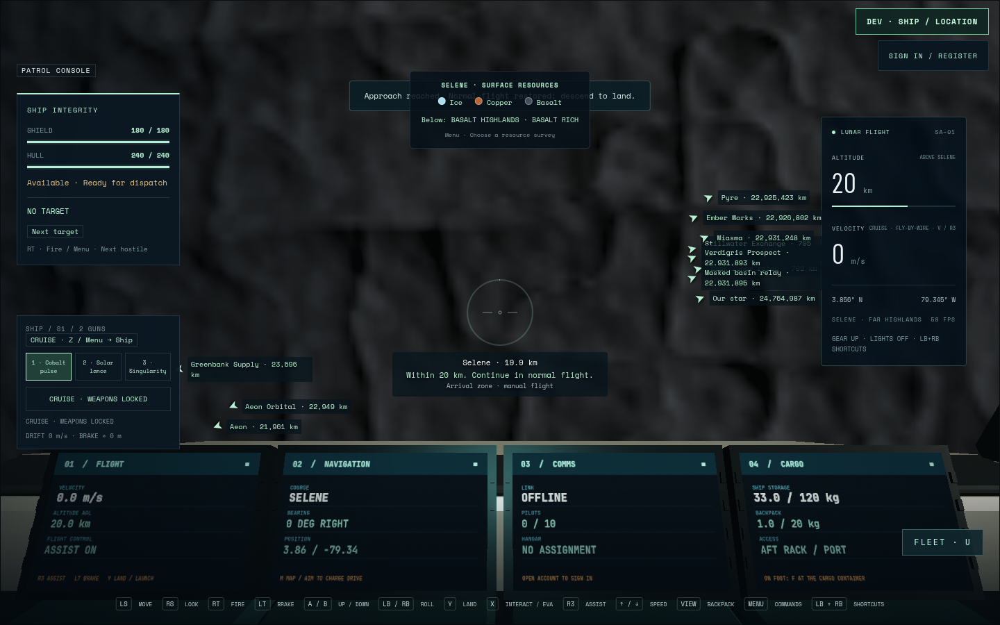
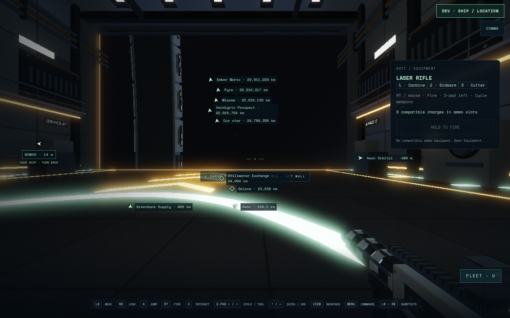

# Planetary rotation — local development evidence

SA-WORLD-004 is implemented, validated and locally integrated at `8f819ac` on
2026-09-09. The paired 5178/API8087 preview serves protocol 9. This checkpoint
preserves checked faction/vacuum-base delivery `2a6e405`. Independent domain/art
review, physical devices and release performance acceptance remain pending;
no public deployment is claimed. [Handoff](handoff.md),
[decision](../../decisions/planet-rotation.md), [curated receipt](evidence.json).

## Checks and limits

- Nine numerical invariants cover disjoint domains, terrain/save anchors through
  a day on all worlds, double precision, moving arrivals with/without spool,
  frame position/attitude/momentum, inertial flight and render-root boundaries.
- Eight authoritative regressions cover cross-frame hitscan, swept hull contact,
  polar reconciliation, station rams, parked-hull EVA, boundary boarding and
  carried-cabin collision. Actual room snapshots synchronize two skewed clocks
  through a full day while preserving station and parked-hull anchors.
- Combined runtime `7c6169c` / delivery `8f819ac`: all **1,233 normal cases** across
  162 files pass (31.05s); **204 multiplayer cases pass**, with two existing opt-in
  skips (37.59s), including isolated PostgreSQL freight persistence. Production
  build passes 20.21s; repository, suggested-plan and diff checks pass.
- Composition preserves Miasma's canonical camera, parked-hull transform and new
  canonical construction-claims argument, plus both normal test inventories.
  No server/navigation/client source changed during that composition.
- Hosted run34289735420 passes all five checks on pre-composition runtime
  `a4d07d4`. The new combined branch's hosted result is tracked separately; the
  preceding pass is not represented as a later-head pass.
- Freight authority fixtures use a deterministic clear departure phase. Other
  phases can correctly block a straight route through a planet. This does not
  certify every physical freight journey or add curved/moving-obstacle routing.

## Production browser evidence

Chromium 151.0.7922.173, ANGLE OpenGL, AMD Radeon 860M (radeonsi krackan1 ACO),
1440×900 scale 1, seed 7291. Application page/console error arrays are empty in
all passed cases. Physical controller hardware was not tested.

Browser04 passes all four worlds at two phases and the complete controller
ground journey. Orbital poses are explicit inspection fixtures; geography turns
against the stable inertial sky. LOD is still streaming in these captures, so
this is shader/render evidence, not maximum-detail or performance acceptance.

Browser06 repeats the complete injected-standard-Gamepad ground journey on
runtime `a4d07d4` in 1.4 min: land, stand, hatch, walk, half-day change, inventory,
held-input suppression across modal exit and device reconnect, return, board and
launch. No pose writes; only the clock is accelerated. Sun dot changes
**0.6470→−0.4635**, ground drift is 0.00361m, and parked-hull drift is exactly 0m.
The final mode is flight. Navigation and ground-control bytes remain unchanged
in the subsequent faction composition.

Browser09 passes both final cases on combined `8f819ac` in 2.7 min:

- **Visible-moon controller drive,50.4s:** actual sticks acquire Selene, the
  shoulder chord engages travel, and129 recorded frames include113 active-drive
  samples across Aeon→inertial→Selene. Arrival altitude is 20,000.016m, with normal
  flight restored. The preflight Aeon Orbital marker agrees with its transformed
  distance. The arrival image captures the normal LOD fallback while detail streams.
- **Two authenticated clients,1.7min:** the second OS clock is deliberately
  seven minutes ahead. Server synchronization meets the0.5s comparison bound;
  controller walking covers 2.796m, deck clearance stays 1.75m, and the peer render
  position converges within 0.15m. Subsequent standing drift is 7.04e-9m while the
  inertial position moves 9,338.98m with the world. Account credentials are typed;
  controller B resumes the actual joined Pilot interface. Context closure prints
  a Vite websocket ECONNRESET during teardown; application errors remain empty.

Use the dedicated `scripts/planet-rotation.config.js` with a unique
`ROTATION_QA_RUN`, private5682/API8682, and a short disk-backed TMPDIR. Read the
live HANDOFF and reserve the shared browser slot first. The config retains one
worker/no retries and checks actual Node and controlled-Chromium processes.

## Failure ledger

| Attempt | Actual result and correction |
| --- | --- |
| Composition repo06 | Checked Pirate003 source arrived before its integrated task status. Consumed actual parent delivery 2a6e405; repository checks then pass without taking an active claim. |
| Served probe | Initial assertions guessed two export/launcher names. Read actual MULTIPLAYER_VERSION=9 and pirate-veil declarations, corrected only the probe; all nine routes then pass. Initial receipt retained. |
| Initial frame tests | Eight-radius overlap assumption failed; disjoint three-radius domains introduced. |
| Initial repository check | Invalid task status/area corrected to active/flight. |
| Normal suite01 | 1182 pass / 18 failures (including parent cases): borrowed Navigation.update fixtures lacked updateLocal; wrapper now calls the prototype method. Focused 28-case mining regression then passed. |
| Multiplayer01 | 198 pass / 1 failure / 2 existing opt-in skips. Freight fixture aimed at the old fixed bearing. Updated to observed bearing, inertial plan comparison and fixed clear phase; original logs retained. |
| Browser01 | Four-world orbital renderer check passed; no controller claim. |
| Browser02 | Landing, hatch, ground/day-night and inventory reached; final seat wait stopped outside actual chair reach. Interrupted after trace diagnosis; fixture now waits for the actual seat interaction. Day/night contact checks and PNGs passed. |
| Room clock07 | New fixture asserted before the actual 15 Hz publication tick; corrected to advance both 30 Hz room ticks. All six authoritative rotation cases then passed. |
| Browser08 | Interrupted with owned CLI SIGINT after another queued job launched five seconds later. Our guard had observed 45 seconds idle; the peer guard did not recognize the `@playwright/test/cli.js` spelling. No browser acceptance or source change. Subsequent launch uses the common `.bin/playwright` path after the earlier queued jobs finish. Unique logs/trace retained. |
| Browser07 | The joined account remains the open Pilot interface dialog; only its original close button is hidden. Corrected the overly broad hidden-dialog assertion to visible, then actual controller B/neutral resume. Both attempts have zero app errors before setup failure. Drive is now declared first so its independent acceptance runs before shared setup. |
| Browser06 | Final runtime ground controller journey passes. First online client authenticates and joins successfully with no app errors; joining moves the Account into Pilot interface and hides its standalone close button. The fixture must resume with controller B. Drive case did not run. Unique trace, stages and screenshots retained. |
| Browser05 | Two-client setup selected the floating sign-in control hidden on the entry screen; the visible header ACCOUNT control is the correct route. No account was created and drive case did not run. Corrected only fixture, added stage receipts; original trace retained. |
| Browser04 | Orbital and complete controller cases pass. Two-client fixture fails before auth because it assumed the account dialog opened automatically; corrected to use the normal sign-in button. Original trace and screenshots retained. |
| Browser03 | Cancelled during build to honor another queued GPU job; no browser acceptance. Playwright reused the output directory, so the earlier02 trace may have been erased. Surviving logs/PNGs are the retained evidence, not an asserted archived trace. Subsequent attempts use unique directories. |

Raw local receipts are ignored under `test-results/planet-rotation/`. Curated images, the receipt and written
records belong in Git. No public recordings or test accounts
are retained. Physical-controller testing, independent domain/art review and
release performance acceptance remain separate from injected controller checks.
