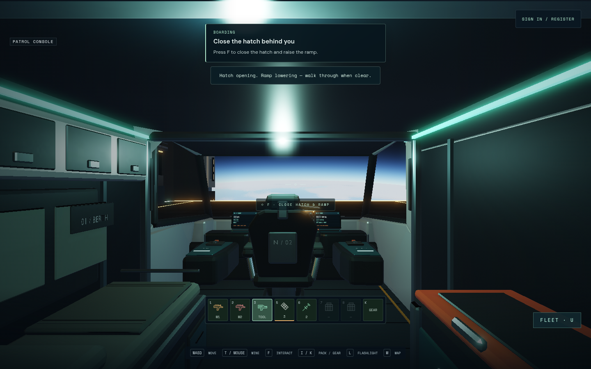
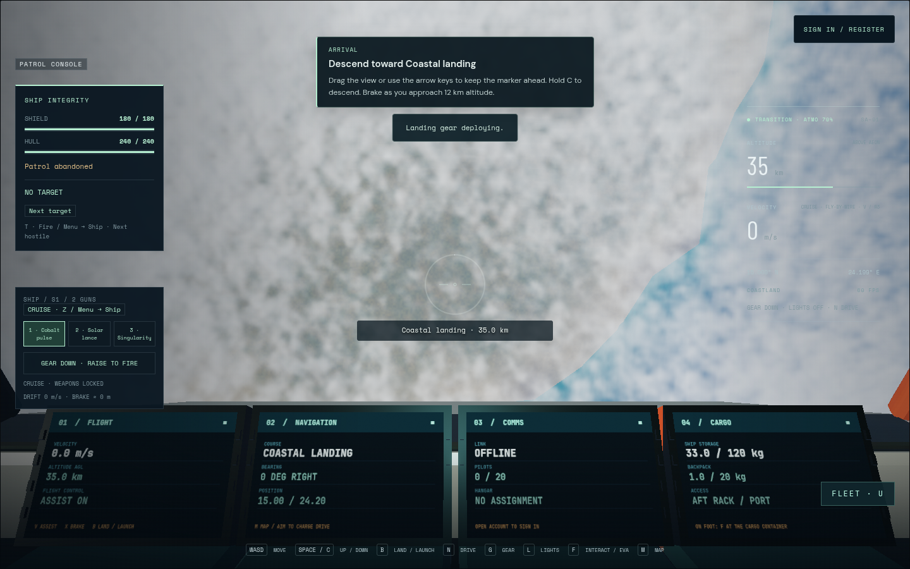

# Continuous player guide

The reported departure prompt offered docking immediately after the Nomad lifted
from its pad. The Flight guide now follows observed hatch, cabin, chair, launch,
gear, target and contract state. It stays on one action until that action happens.
It does not move the player, select a destination or accept a contract.

Runtime `981852a` includes the guide over local station collision `8a2a12f`.
Plain Tab opens Contracts in gameplay; Shift+Tab cycles HUD visibility. Native
Tab/Shift+Tab focus remains available in dialogs. Menu → Settings → Flight guide
is an optional, locally saved toggle. Keyboard, standard controller and touch
have appropriate labels; the existing Nomad touch panel now exposes launch,
forward/side thrust, vertical thrust and brake actions.

Guidance continues through selected-target acquisition and charge, drive travel,
arrival gear/descent/braking/landing, disembarkation/reboarding, and patrol combat,
reinforcements and report filing. Other ships retain their access hints; rover
and construction controls retain their own panels. Shared routes that cannot use
targeted drive receive manual-flight guidance. Touch travel waits for automatic
arrival; suit thrusters require keyboard/controller in the existing interface.

## Validation

- The combined guide/station source passed all 166 normal test files in 33.79 s.
  The final guide-only regression run also passes after the airless-descent and
  touch-travel text correction. Cases cover observed opening progression, the
  departure/docking regression, return/reboarding, route charge/engagement,
  atmospheric/airless arrival, patrol/report, unsupported shared routes, input
  labels and native HUD shortcut guards.
- Production build passed in 4.15 s, retaining the existing large-chunk advisory.
  Repository checks and both upstream and local-base check planners passed.
  The planner's broad integration/package suggestions do not imply a new server,
  schema, protocol, asset or SQL change; this feature changes client guidance,
  controls and QA shortcuts.
- Keyboard05 PASS 1.8 min; controller04 PASS 1.9 min. Keyboard covers the
  final arrival-card correction; the controller journey also covers held input
  across native focus, dialog and disconnect/reconnect transitions.
  Chromium 151, AMD Radeon 860M through ANGLE GL, one worker and no automatic
  retries. Tests use actual opening/boarding/flight input and read-only state
  assertions, never teleporting the player or setting a gameplay state.

## Retained failed checks

Raw runs remain under `/tmp/star-agent-player-guide-{01,02,03,04,05}`. An
independent pirate browser overlapped run04; no performance/FPS claim is made.
Outer process inspection confirmed guide05 was the only Playwright job at
09:19:45 UTC.
Run01 walked too far to the port side of the cabin: F opened the adjacent cargo
locker while the guide correctly requested a return to the hatch control. The
fixture now stays in the centre aisle and checks the actual Close hatch prompt.
Run02 assumed a newly selected site required aiming, although the ship already
faced it and correctly needed station clearance. The assertion now follows the
observed route state. Run03 toggled the guide off successfully, then tried to
reopen Settings before native dialog close cleanup had restored navigation; the
fixture now waits for the real enabled state. No application change masks these
fixture failures. Run04 passed the keyboard and controller journeys, including
native focus and Gamepad disconnection gates, but its phone fixture assumed gear
was on the first Ship menu page. It now operates the real next-page control. The
phone instructions also mention the page arrows. Original screenshots, videos,
logs and failure states remain.

Visual review of run04 arrival found the legacy drive card asking to retract gear
while the guide taught landing. The correction hides its drive instructions during
arrival and initial destination choice, retaining the beacon name and distance.
Run05 verifies the arrival correction on keyboard. Its phone walker again
reached the adjacent cargo rack; a touch-only fixture now centres in the aisle
with short native contacts and requires the visible Close hatch button. That
remaining rerun is queued behind other GPU owners, so the complete phone route
is not claimed as passed. Phone04 did physically board and launch before stopping
at the paged-gear fixture assumption. Transient
notifications are layered above telemetry so their text remains readable.

Earlier screenshot harnesses were migrated from Tab to Shift+Tab where they mean
HUD cycling. Those entire historical suites were not rerun. Native modal Tab
navigation remains unchanged. Physical controller/phone hardware, full patrol
combat completion, every ship/contract variant and a complete surface landing/
walk/return browser journey are not claimed. Later landing/report transitions
are covered by source state regressions. No public release is part of this task.

## Local integration and public request

Runtime `981852a` is integrated locally at `5347648`; eight served modules match
the checked source and both API health routes pass. All 551,736 existing HANDOFF
bytes were preserved exactly. The preview and persistent database were retained,
with no service restart. The user explicitly requested play and multiplayer
promotion on 9 September after local delivery. The frozen promotion candidate,
artifacts and repository gate status are recorded separately.

