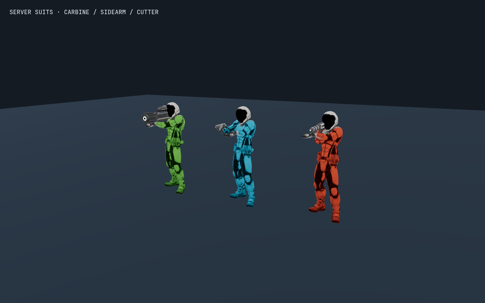

# Remote player verification

`node --test tests/remote-players.test.js` parses the actual player-male GLB,
its skeleton and animation clips, all three actual held-item meshes, and the
Nomad/Atlas meshes. The Node harness omits image textures because it has no
image decoder or WebGL context.

The checks cover:

- Independent animation bones and suit materials across cloned players.
- Skin-weight color masking that preserves head, neck and bare hands.
- Correct right-hand sockets, scale compensation for the authored 0.01 rig,
  forward muzzle alignment and support-wrist distance below 6 cm for both
  two-handed items.
- Planetary body up remaining upright while the weapon aims up.
- Camera-relative placement retaining a 25 cm offset at 25 billion metres.
- Actual Atlas landing assemblies and ship pose placement.
- Nine remote players plus self, full-snapshot removals, asynchronous disconnects,
  and resource ownership across shared geometry and textures.

`poseHeldEquipment` runs after the character animation mixer. It brings a
two-handed weapon's support grip inside the left arm's reach by rotating the
right arm, then solves the support wrist. It does not stretch bones, move the
character root, or create damage/hit authority.

Browser rendering is a separate required check: these Node checks alone do not
prove that the suit shader compiles or that the final textured pose looks right.

## Browser evidence

The isolated browser bench rendered the actual textured models at 1440 × 900
using Chromium 151 and ANGLE Vulkan / SwiftShader (Subzero). All three weapons
were attached to their hand sockets, and seven shader programs compiled with
zero browser console errors or uncaught exceptions. The screenshot was visually
inspected. It covers the standard logarithmic-depth suit material, including
its masked emissive texture, and is not an FPS measurement or an end-to-end
network gameplay test.
