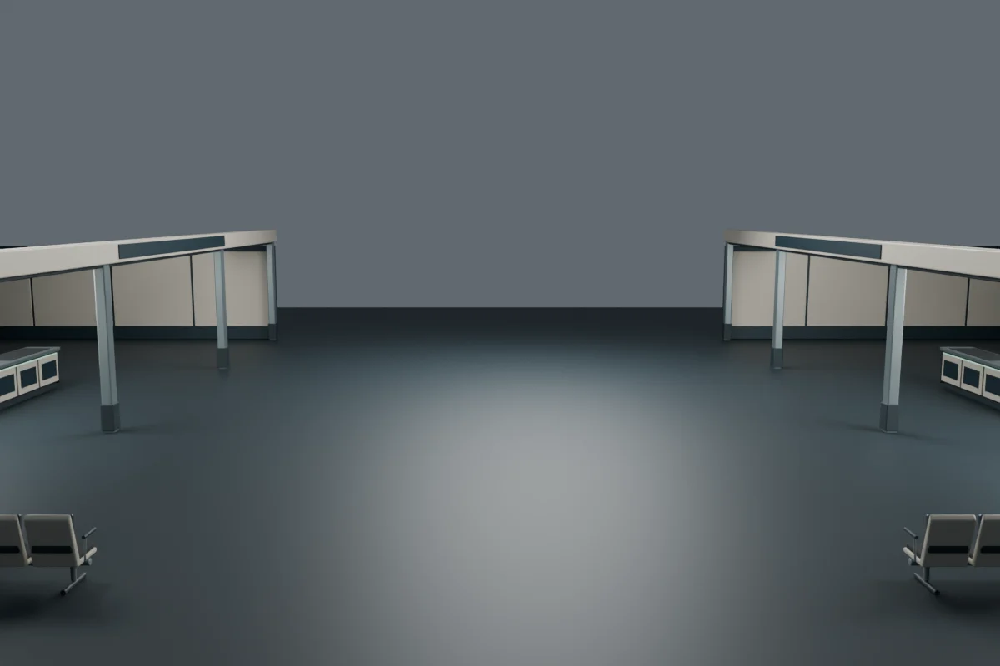
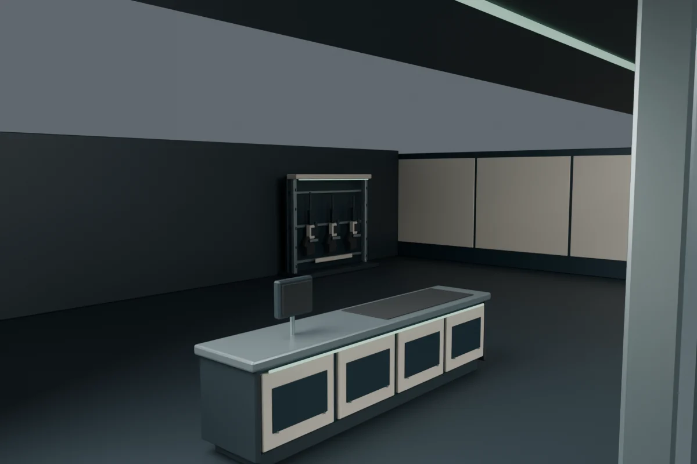
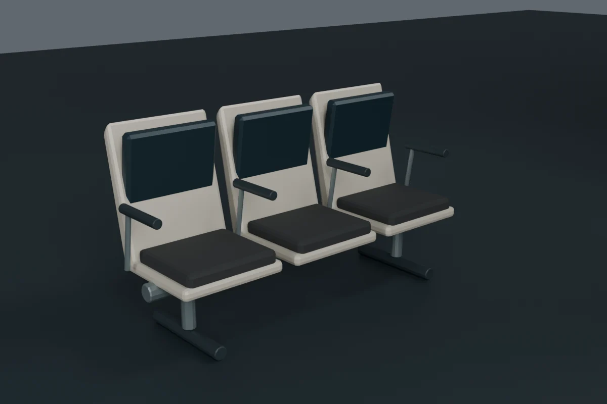
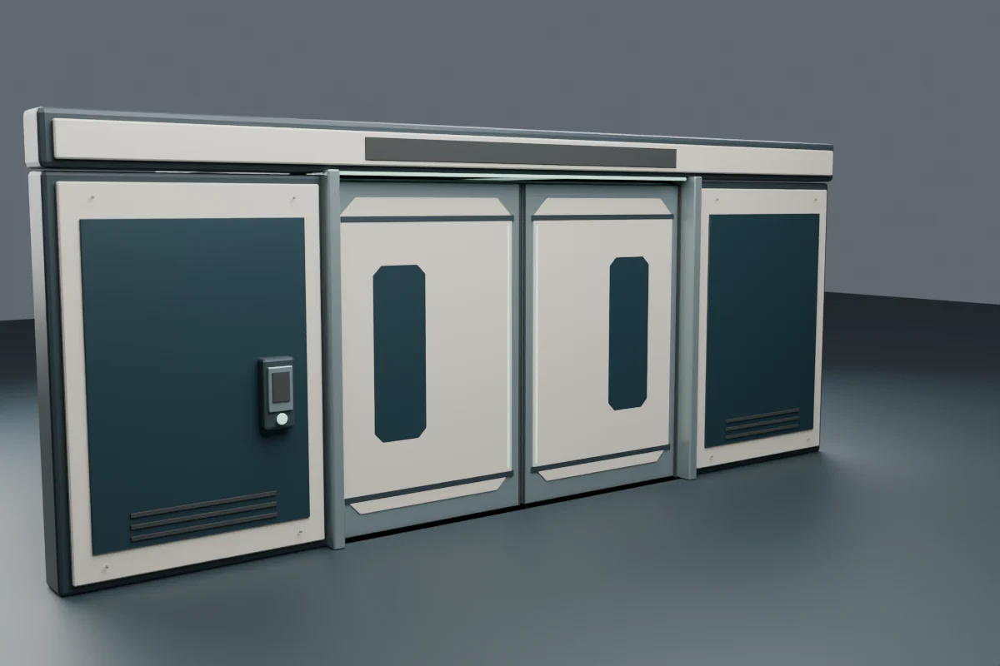
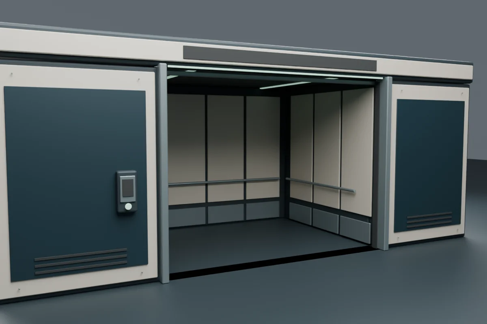

# Concourse shop and passenger elevator assets

Candidate authored on 2026-09-06 in `feat/station-concourse` worktree
`/tmp/star-agent-concourse-work`, starting from `056d20b`. This record covers
the Blender kit, its collision contracts and studio review. In-game lighting,
shop UI, production journeys and the independent visual rubric require the
integrated candidate's separate review; these images do not establish those gates.

The kit replaces oversized bench blocks with three-place manufactured seating,
adds two distinct shop interiors, and replaces bare elevator leaves with a
pressure-door surround, pockets, lined cabin, handrails and controls. Shop stock
uses original inert rifle silhouettes, filter canisters, avionics modules and a
drive assembly. The GLBs contain no external geometry or embedded imagery;
runtime graphics and their provenance are documented separately.

The final merchandising pass adds a third rack in each shop at Z=-1.0 and two
slim directory pylons at X=±5.5, Z=-12. The studio images below predate this
additional stock and the pylons; final in-game review remains pending.

The subsequent retail-branding pass starts from `abacfdc`: WATCHKEEP ARMORY
retains petrol/ivory finishes while KESTREL SHIPWORKS gains ochre/dark accents.
It adds six replaceable poster frames, two suspended cloth-banner mounts and
four tilted A5 brochure pockets with paper stacks. Print artwork remains
runtime-owned. This pass changes only the concourse GLB; the praised elevator
export remains byte-for-byte unchanged.

Following the independent review of `435f116`, which identified open-looking
upper shops and repetitive display stock, the next candidate adds sealed low
shop ceilings and distinct rack contents. Each roof has a continuous upper
skin, replaceable underside panels, return vents, cross beams and end-wall
downstands. The ceilings are authored geometry, not a background image. This
candidate still requires its own integrated visual review; the earlier images
below do not establish acceptance of these revisions.

## Rebuild and inspect

Blender **5.2.0 LTS**, build `fbe6228777e7`. Run from the repository root:

```sh
env ALSOFT_DRIVERS=null blender --background --factory-startup -noaudio --python-exit-code 1 --python blender/build_station_concourse.py
env ALSOFT_DRIVERS=null blender --background --factory-startup -noaudio --python-exit-code 1 --python blender/build_station_concourse.py -- --render-dir /tmp/star-agent-concourse-studio
node --test --test-isolation=none --test-reporter=tap tests/station-concourse.test.js
```

The optional `--only-elevator` argument limits rebuilding and studio rendering
to that asset; `--only-concourse` leaves the elevator binary untouched. The
merchandising pass used `-- --only-concourse` and verified the elevator SHA-256
remained unchanged. Source geometry is authored in game metres and transformed once
from Blender Z-up to glTF Y-up. Materials read the established CSS colour tokens,
convert sRGB to scene-linear, and use bevels and weighted normals. The station
finish decorator maps `FinishIvory`, `FinishPetrol`, `FinishSteel`, `FinishDark`
and `FinishRubber`; `FinishMint` keeps its modest authored emission. The branding
pass adds shared `FinishOchre` paint and `FinishPaper` (metalness 0, roughness .92),
both from existing CSS tokens. These two physical finishes increase static
concourse batches from six to eight, rather than adding materials per printed item.

The builder exports actual standalone GLBs to temporary directories to measure
each assembly's bytes, including its own material/JSON overhead. It then batches
static geometry by material, with independent material batches for each moving
leaf. The aggregate buffer is not charged repeatedly to every prop.

## Export manifest

| Asset | Actual GLB bytes | Actual triangles | Mesh primitives | Static collision boxes |
|---|---:|---:|---:|---:|
| `station-concourse.glb` | 3,801,048 | 51,888 | 8 | 77 |
| `station-elevator.glb` | 364,380 | 4,724 | 18 | 45 |

The concourse is an aggregate of twenty-seven separately measured assemblies. Every
assembly passes the 10,000-triangle and 1,000,000-byte prop limits. The two assets
use 26 mesh primitives together, below the kit's 60-draw limit; these are asset
counts, not measured total scene draw calls or frame timings.

| Assembly | Triangles | Standalone GLB bytes |
|---|---:|---:|
| Armory architecture | 1,640 | 136,764 |
| Armory ceiling | 2,068 | 182,320 |
| Armory counter | 2,056 | 171,228 |
| Components architecture | 1,640 | 136,848 |
| Components ceiling | 2,068 | 182,456 |
| Components counter | 2,056 | 171,328 |
| Armory rack 0 | 2,256 | 189,028 |
| Components rack 0 | 4,792 | 355,036 |
| Armory rack 1 | 5,328 | 437,108 |
| Components rack 1 | 2,932 | 237,144 |
| Armory rack 2 | 4,376 | 360,596 |
| Components rack 2 | 4,664 | 380,788 |
| Drive module display | 2,100 | 153,408 |
| Waiting seat bank 0 | 2,240 | 160,700 |
| Waiting seat bank 1 | 2,240 | 160,680 |
| North directory pylon | 848 | 64,936 |
| South directory pylon | 848 | 64,932 |
| WATCHKEEP end poster frame | 536 | 47,004 |
| WATCHKEEP rack-gap frame 0 | 720 | 61,548 |
| WATCHKEEP rack-gap frame 1 | 720 | 61,540 |
| WATCHKEEP banner hardware | 836 | 63,276 |
| WATCHKEEP brochure holders | 1,056 | 95,556 |
| KESTREL end poster frame | 536 | 46,972 |
| KESTREL rack-gap frame 0 | 720 | 61,508 |
| KESTREL rack-gap frame 1 | 720 | 61,500 |
| KESTREL banner hardware | 836 | 63,244 |
| KESTREL brochure holders | 1,056 | 95,480 |
| Elevator surround | 2,048 | 170,548 |
| Elevator cabin | 2,060 | 171,052 |
| Elevator left leaf | 308 | 26,220 |
| Elevator right leaf | 308 | 26,228 |

GLB SHA-256 for this reviewed export:

```text
station-concourse.glb 953054d5cf34e246b4a0e3b43c5181d3e64e5ff5c4cbb18c44fa53e064975378
station-elevator.glb  981a229de511ed34ea99a1d35cc639bb05651e4f8c8829d8ba987dbfc5b9f5c2
```

## Placement and collision API

The concourse attaches at identity, with its floor at Y=-8. Its measured bounds
are approximately `[-19.95,-8,-12.22]` to `[19.95,-4.02,10.8761]`. Counters are
centred at X=±12, Z=0; customer reach points are X=±10.7, Z=0. Seating banks at
X=±6, Z=10.5 have a measured cushion surface 0.46 m above the floor.
Directory pylons have 0.88 × 0.44 m footprints and stand 2.45 m tall. Their
`DirectoryNorth` / `DirectorySouth` display anchors are at
`[-5.5,-6.59,-11.792]` / `[5.5,-6.59,-11.792]`, facing +Z. The portrait inset is
0.58 × 1.64 m; labels and actual station directions are runtime-owned.

Each ceiling spans |X|=8.10–19.95, with its continuous skin covering
Z=-11.10–8.60. End downstands extend 25 mm beyond those Z edges to overlap the
wall thickness. Roof top Y=-4.32, underside panels Y=-4.50, cross-beam bottoms
Y=-4.63, and end downstands Y=-4.68. The minimum resulting headroom is 3.32 m.
Runtime fixtures must remain below these surfaces; light placement and tuning
are owned by `src/station-concourse.js`.

Rack indices and printed category locations retain their original centres:

| Rack index / Z | WATCHKEEP ARMORY | KESTREL SHIPWORKS |
|---|---|---|
| 0 / -7.1 | Two long rifles | Five differently sized filter canisters |
| 1 / +5.1 | Three compact sidearms and two accessory cases | Three avionics modules and a scanner |
| 2 / -1.0 | Three field cases and torches | Three repair cases and machined couplers |

Sidearms have short slides, angled grips, open trigger guards and independent
mounting tiles. Their actual widths/heights/lengths fit 5–6 cm × 21–26 cm ×
25–31 cm envelopes; they are not scaled-down rifle meshes. Closed cases have
separate lids, gaskets, corner protection, latches and recessed handles.
All merchandise is inert display geometry; the modal catalog owns purchases
and inventory, and its stock counts are not inferred from these displays.

The elevator attaches at `[0,floor,doorZ]`. Its local bounds are approximately
`[-4.39,-0.024,-0.37]` to `[4.39,3.585,3.4]`. The threshold is flush with the floor.
Named groups `ElevatorLeafLeft` and `ElevatorLeafRight` have origins
`[-1.04,1.55,0]` and `[1.04,1.55,0]`. Each leaf occupies 2.04 × 3.1 × 0.13 m and
moves 2.05 m outward along X. The groups remain independent when cloned.
The usable cabin is approximately 3.0 m deep. Its rear lining and handrail sit
0.30 m forward of the initial export, ahead of the original hangar vestibule wall
at doorZ+3.1. The rear rail is centred at local Z=2.88; the side rails end at 2.77.
The outer roof and side-shell depth remain 3.4 m. Door leaves and surround are
unchanged, and this elevator-only correction leaves the concourse GLB untouched.

Both loaded `gltf.scene.userData` objects directly contain:

- `assetManifest`: JSON string array of `{name,bounds:{min,max},triangles,standaloneBytes}`.
- `collisionBoxes`: JSON string array of `{name,min,max}`, in game-local Y-up metres.
- `coordinates` and `builder`: provenance strings.

The concourse additionally carries `stockManifest`, a JSON string array of
`{kind,rack,bounds:{min,max}}` for the measured rifles, sidearms, equipment cases,
filter canisters and avionics modules. Decorative torches, scanner and couplers
are included in their rack's main assembly budget.

Shop architecture, surround and cabin supply individual physical-piece boxes;
their broad enclosing bounds must not be used as a solid wall across the interior.
Compact counters, racks and seats use individual assembly footprints. Moving
leaves are excluded from the static boxes and use the runtime's moving bounds.

Shop sign anchors face the central aisle along ±X, including `ArmoryScreen` and
`ComponentsScreen`. Elevator header and call-screen anchors face -Z; the internal
screen faces -X. Runtime code owns the displayed names, stock and interactions.

For retail print anchors, `side=-1` means WATCHKEEP (west), `side=+1` means
KESTREL (east). The prefix below is `Watchkeep` or `Kestrel`:

| Anchor suffix | Game-local centre | Print width × height | Face |
|---|---|---|---|
| `PosterEnd` | `[side*14.2,-6.35,-10.927]` | 1.20 × 1.70 m | +Z, yaw 0 |
| `PosterGap0/1` | `[side*19.675,-6.45,-4.05/2.05]` | 1.15 × 1.60 m | inward, yaw `-side*π/2` |
| `Banner` | `[side*8.318,-5.32,5.9]` | 1.25 × 1.30 m | inward, yaw `-side*π/2` |
| `Brochure0/1` | `[side*11.8166713,-6.7449184,-1.50/-.95]` | .148 × .210 m (A5) | authored quaternion |

Brochure anchors carry their full orientation: right `[0,0,side]`, up
`[side*sin(18°),cos(18°),0]`, normal `[-side*cos(18°),sin(18°),0]`. Attach the
cover with zero additional local rotation. Paper faces stand 1.5 mm behind their
anchors; all four cover corners remain exposed within the manufactured holder.
The banner backing is 16 mm behind its anchor face; cloth ripples must stay
within that clearance. Its lowest rolled-rail cap is 1.982 m above the floor,
82 mm above the current walking-body top. Above-counter brochure assemblies and
banner cloth do not add collision boxes; real-triangle sweeps also verify that
the hardware does not obstruct the walking route beneath either banner.

## Validation and studio review

Eight focused Node tests passed against the real GLBs with Node 26.7.0. They check
the index count against the manifest, vertex containment, individual budget rows,
the central corridor, both counter approaches, passage around counters, directory
footprints and front-facing display anchors, blocked
counter/seat volumes, seat height, visible cabin walls, cloned leaf independence,
and collision agreement in closed, partially open, open and closed-again poses.
They exercise door Z=14.3 and Z=22.3 at floor=-8, plus a translated floor=-11.25
to catch fixed-height assumptions. Both exported models loaded successfully.
Branding checks cover all print-anchor backing rays, A5 quaternion and corner
rays, the two additional shared finishes and actual triangle sweeps below banners.
Ceiling checks cast vertical rays across both shop footprints, upward viewing
rays from the customer aisle, and a ray through the former end-wall daylight
slot. Actual triangle sweeps retain the Z=4 crosswalk below the roof. Stock tests
check compact sidearm scale and visible slide geometry in front of mounting
tiles, two longarms, separate rack categories and varying filter dimensions.
The additional overlay test loads the original `station.glb` together with the
new cabin and verifies that both rear lining and handrail are the first visible
ray hits, ahead of the inherited vestibule. Two previous clear-path endpoints
were shortened to local Z=2.5 so the full walking body clears the relocated rail;
the unchanged deeper endpoints correctly reported collisions after the fix.

CPU studio inspection corrected a 5 cm seat-height excess, doubled shared
armrests and door cassettes initially hidden behind the structural slab. Final
inspection confirms separate cushions, stable metal supports, layered door
faces, pocket travel and the lined open cabin. The wide kit-only view deliberately
lacks the runtime room shell, floor graphics and shop labels; the complete hub
still needs in-game review.

Blender printed existing optional `cattrs` and MeshOptimizer availability errors
at startup/export. All builds exited zero; the assets use ordinary uncompressed
glTF and require neither optional component. Raw audit/build logs remain in `/tmp`.

These five images are **historical Blender CPU studio renders before the final
merchandising, rear-cabin fit, retail-branding, ceiling and stock-variety passes**,
1200×800, Cycles with 24
samples and denoising, using studio area lights. They are not game screenshots or
performance evidence. Review copies preserve dimensions and use WebP quality 86:

```sh
magick /tmp/star-agent-concourse-studio/seating.png -quality 86 docs/qa/station-concourse/seating.webp
```

The same encoding command was used for the other four named views.










