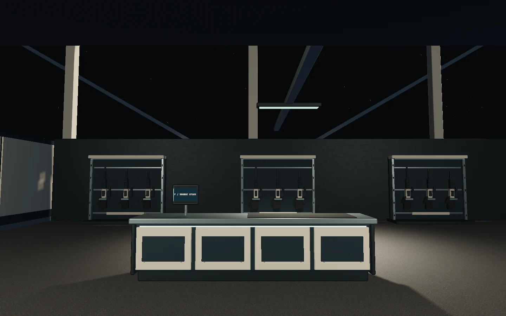
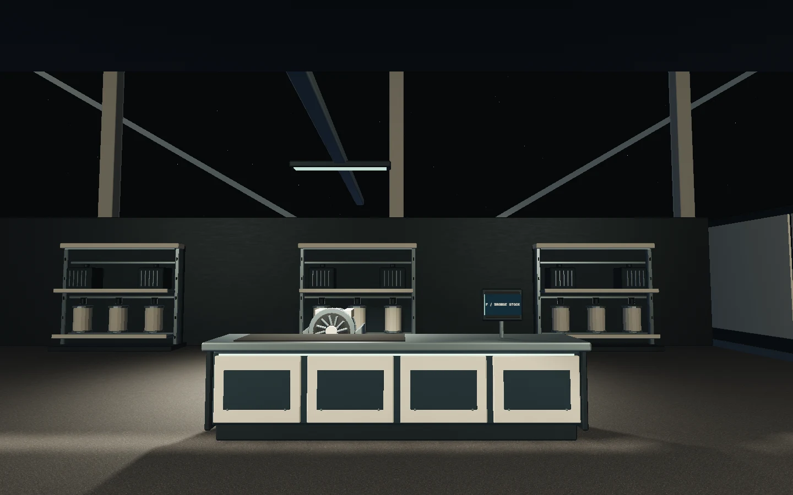
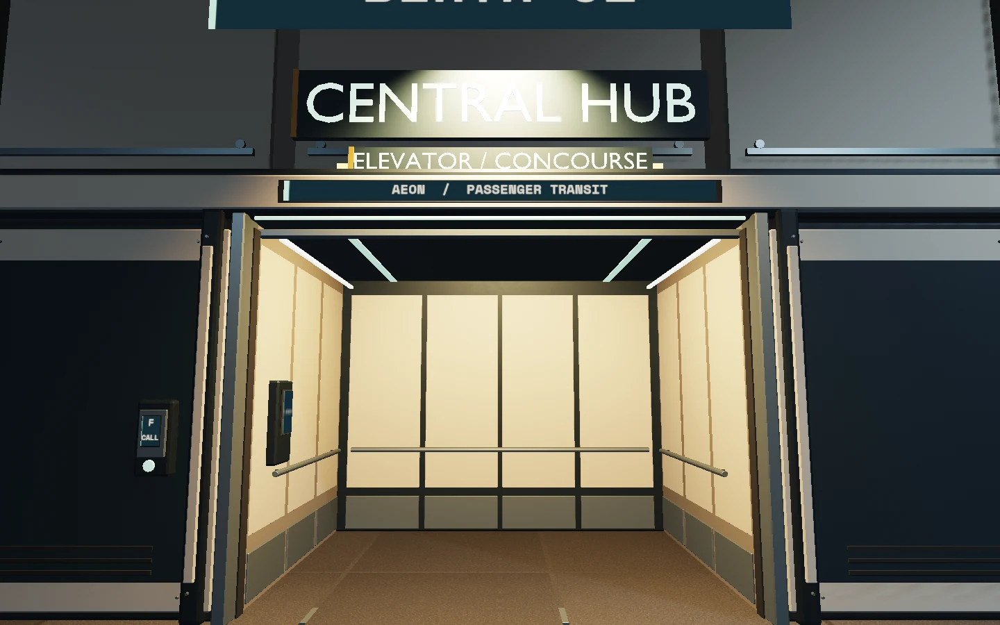
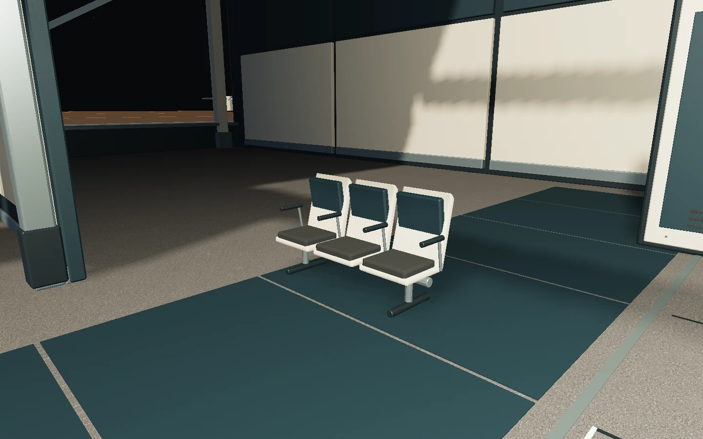
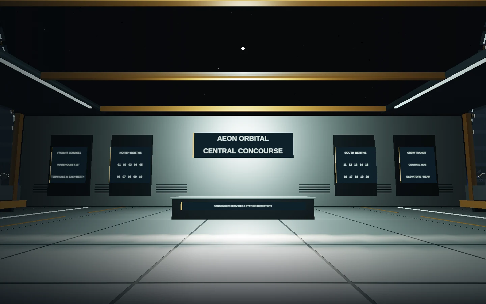
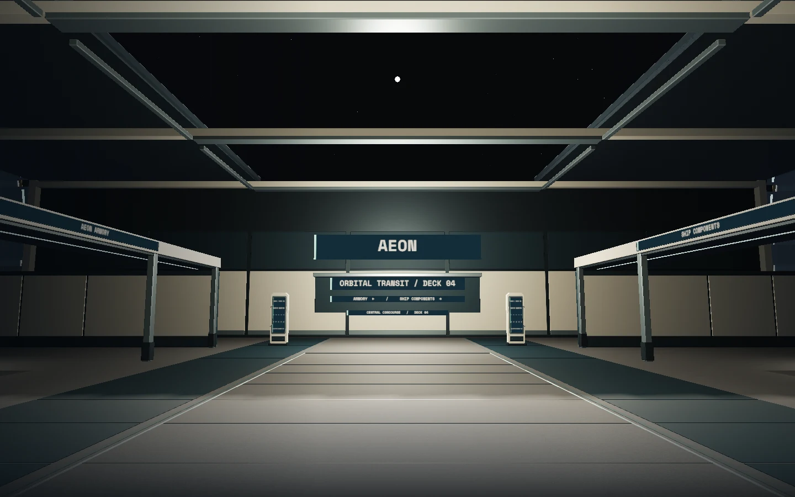

# Concourse, passenger elevator and station shops

This is the continuation of the [hangar production record](hangar-production-record.md), following Cees's review that the hangar improved but the elevator, empty hub and oversized furniture still looked unfinished and ran too slowly. It follows the [asset production standard](../asset-production-standard.md). A working candidate and its validation do not substitute for the independent visual acceptance required by QUALITY.md.

Runtime commit: `9e5a713` (the following documentation commit does not change the served game).

## Baseline and ownership

Work began from `056d20b94a3280c7e9d63a3606599d0b02aa2119`, the unmerged PR #20 head, in `/tmp/star-agent-concourse-work` on `feat/station-concourse`. The existing production preview on port 5249 stayed unchanged. A separate production build is served on port 5260. The shared checkout remains on its other agents' branch; unrelated gear, controller and Atlas Mark II files were neither imported nor overwritten.

The bounded player experience is a physical walk into a better passenger elevator, travel to a furnished concourse, visit two shops and buy stored cargo. The model does not add combat, weapon equipping, component installation, an income loop, shared multiplayer stock or server persistence.

Ownership was explicit: the props lane authored and measured the Blender kit; the shop lane owned the inventory migration, catalogue, modal, controller controls and purchase tests; the graphics lane measured actual hardware timings and optimized unchanged door/LOD updates. Root owned the room architecture, model loading, collision/interaction integration, modal guards, final build and proceedings. Shared-module edits were restricted to agreed methods.

## Original Blender kit and integration contract

`blender/build_station_concourse.py` builds `station-concourse.glb` and `station-elevator.glb` from original procedural geometry. Materials read the station CSS palette and convert sRGB tokens into linear Blender material values. No downloaded Star Citizen meshes or proprietary assets are bundled. Bevels, weighted normals, display stock, counter construction and human-scale seats are authored geometry.

The concourse uses six static material batches: 36,932 triangles and 2,676,356 bytes. It includes armory and equipment storefronts, counters, secured rifle racks, shelf-mounted components, an engine-module display two three-place seat banks and two directory pylons. A third rack was added to each shop after the first in-game image showed overly sparse wall stock. A seat is 0.46 m high with approximately 0.55 m per place, replacing the previous four-metre-deep block benches. The elevator is 4,724 triangles and 364,380 bytes in 18 draws, with independently moving leaves, receiving pockets, seals, a flush threshold, lined cabin, handrails and mounted controls. Every individual assembly is below 10k triangles and 1 MB using actual standalone GLB exports, rather than charging an aggregate shared buffer to each prop.

The GLTF scene extras contain JSON strings `assetManifest` and `collisionBoxes`. Shop/cabin architecture uses separate physical-piece bounds, avoiding a single enclosing box that would fill the room. Compact furniture uses its own footprint. Root adds those local double-precision boxes to the walking sweep and keeps moving door boxes independent.

Hub floor is game Y = -8; the central aisle |X| < 4 stays clear. Armory and component reach points are [-10.7, -6.25, 0] and [10.7, -6.25, 0]. Elevator assets are local to the doorway floor and attach at [0, -8, 22.3] in a hangar and[0,-8,14.3] in the hub. `ElevatorLeafLeft` and `ElevatorLeafRight` pivots remain [-1.04, 1.55, 0] and [1.04, 1.55, 0], with 2.04 × 3.1 × 0.13 m leaves travelling 2.05 m sideways. A caller must physically enter the cabin before choosing a destination; passenger transit leaves the parked ship in its berth.

`src/station-concourse.js` builds the room shell in compatible local-metre geometry batches, with glazed roof/windows, structural ribs, floor joints and directory graphics. Two mounted shop lamps use 512² shadow maps for counter and stock contact shadows, active only in the occupied hub. `src/station-elevator.js` loads the authored moving groups. Materials reuse the hangar's existing physical surface kit; signs use station palette tokens and runtime text.

## Purchases and save compatibility

The two shops deliver to station warehouse storage. A first-use/legacy-save migration grants 1,500 credits once, with finite catalogue stock and no resale. Existing cargo remains under the original `star-agent.nomad-inventory.v1` key, whose manifest schema advances to version 3. Version 1/2 validation still uses the original four item IDs; new IDs start at zero. Ship selection, capacity and the surface-landing/return-to-station Atlas unlock are preserved.

One purchase validates catalogue, stock, credits and warehouse capacity, then commits all containers, money and stock in one storage write before changing memory. A failed write delivers nothing and spends nothing. An already changed saved manifest is rejected until reload; this is a stale-session check, not multi-tab locking. Malformed/future saves are retained without replacing them with starter money. Existing cargo transfers retain their prior session behavior when browser storage is unavailable.

The native shop modal supports keyboard, touch and standard gamepad D-pad/left-stick selection, A activation and B/Menu close. Controller entry/refocus requires neutral controls. Navigation remains paused under the modal and the scene uses the existing generic modal render skip. Purchased sidearms, rifles and replacement components are stored cargo, with their current use limitations visible before purchase.

## Findings and corrections retained

1. The old hub rendered 625 draws despite only 226,278 triangles. Many separate floor tiles and grille strips also appeared in the sun shadow pass. The new room and shop kit batch compatible static geometry rather than stripping detail.
2. All twenty pods repeatedly traversed hidden hero hierarchies to rebuild unchanged door bounds, and 26 LOD batches rewrote 520 instance matrices per frame. Door bounds now cache local geometry/pose; LOD matrices update only for changed visibility, berth transform or door pose. Tests cover cinematic/mixer motion, geometry versions, reload and astronomical origin changes.
3. The first integrated hardware image exposed a legacy `weatherShip` pass still applied over the hub's physical materials and signage. It also reset all opaque meshes to shadow casters. The main integration now uses that legacy treatment only when the finish kit is unavailable. New room UVs are generated in metres rather than stretching a cube's 0–1 UVs across a 44 m floor.
4. Early studio inspection caught a double armrest between adjacent seats and a door face cassette buried behind the structural slab. Both were corrected and the affected assets re-exported/re-rendered. Screen text was also turned to face the actual ±X counter screen, and canvas labels sized to their available field.
5. Independent integration review caught the old fixed-width sign helper allocating 1024 × 1609 and 1024 × 1556 textures for tiny portrait elevator screens, repeated in 21 cabins. Signs now cap their longer axis at 1024 pixels, scale allocation to physical size and share identical text/palette materials. The production browser audit verifies three shared textures across all 21 cabins, bounded dimensions, metre-scale floor UVs and the absence of the old weather shader.
6. Starting the separate preview initially failed because `/usr/bin/npm` does not exist on this machine. The user service now launches the installed Node executable and Vite directly; a failed command was not treated as a running preview.

7. The final hangar close-up showed the inherited vestibule rear wall at world-local Z 25.4000015 hiding the new rear lining/handrail. The elevator-only rebuild moves rear surfaces forward 0.30 m and shortens the side rails, retaining the leaves, front surround, triangle/draw counts and outer roof depth. Usable cabin depth is now about 3.0 m. A new test overlays the actual station and elevator GLBs and requires the new lining and rail to be the first visible ray hits. The affected walking sweeps still preserve entry, while correctly stopping a 0.5 m body before the moved rear rail.

8. The rear-fit journey rerun passed cargo/elevator travel and touch purchasing but caught a fast first D-pad press arriving before the new shop controller's first neutral animation-frame poll. The modal now samples current input synchronously after opening/resetting, then schedules its normal polling. A neutral controller is ready immediately; a held control remains unarmed until release. The test deliberately keeps the immediate first press, rather than hiding the race behind a sleep.

## Validation status

Initial full unit run: 169 tests passed. Final full run: all 23 unit-test files passed, including the five exported-geometry/layout tests; production build passed. Blender studio views were actually inspected, and their manifest/budget/collision evidence is in [the asset record](station-concourse-assets.md). Initial integrated hardware comparison and raw-evidence hashes are in [the performance record](station-performance.md). Twelve distinct affected production browser cases pass across the full run and focused rerun. The initial combined run passed 11/12 in 4.9 minutes; the new physical shop test timed out on its second hub walking leg, while the player's interaction already read AEON ARMORY. An unchanged diagnostic rerun passed in 42.8 seconds, so the original failed position is not reconstructed as fact. Measured release speeds were 3.68–4.50 m/s, followed by 0.277–0.338 m of real coasting. The helper now waits until velocity is below 0.01 m/s before turning; it does not set position/velocity or widen the 0.35 m stopping disk. Both shop cases then passed together in 1.0 minute (physical 50.5 s, touch 8.7 s). This supports residual movement between legs as the cause, without pretending the original stall was exactly replayed.

Coverage includes the Atlas unlock, belly elevator and both cargo lifts, storage and launch; asset fallback; finished hangar and optional-finish fallback; cargo Take all and physical passenger travel to the hub, berth 20 and parked-ship return; ring motion; opening, controller movement and physical Nomad boarding; clear floor under camera rebasing; all 21 elevator sign budgets/sharing and floor UV/material invariants; controller purchases, warehouse-to-ship transfer and save reload; and 390×844 touch purchasing, overflow, sticky close and visible feedback. The mobile test's first earlier run also needed to wait for the native dialog close event before asserting navigation restoration; that test correction is retained in the proceedings.

After the rear-wall adjustment, the cargo/hub/berth-return journey passed again in 35.7 seconds and mobile purchasing in 19.0 seconds; the first controller press exposed the initialization race described above. After that runtime correction, both shop cases passed together in 53.5 seconds (physical 43.5 s, phone 7.1 s). The latest full unit run passed all 23 files after the final cabin export; the two inventory/shop unit files also passed after the controller initialization change. The final build passed, with the existing Vite chunk-size warning. Chromium's runner prints its inherited NO_COLOR/FORCE_COLOR warning; this is distinct from browser shader/console warnings.

Final corrected-material performance and independent visual acceptance are recorded separately below; no merge is implied by these functional passes.


## Reproduce the integrated checks

```sh
npm test
npm run test:browser -- -c scripts/concourse.config.js
STATION_REVIEW_URL=http://127.0.0.1:5260 STATION_HARDWARE=1 npm run test:browser -- -c scripts/concourse.config.js
node scripts/concourse-review.mjs --url http://127.0.0.1:5260 --out /tmp/aeon-concourse-review
node scripts/station-performance-check.mjs --url http://127.0.0.1:5260 --out /tmp/aeon-concourse-performance
```

The first browser command starts its own production build on port 5261 using
SwiftShader for functional checks. The second uses the existing preview and
hardware ANGLE GL. Neither functional-test duration nor software-rendered RAF
intervals establish GPU performance. Run browser jobs sequentially.

The released production bundle is `assets/index-CZiHAmcD.js`, SHA-256
`b573bb26f62707ed1e2708f2c93f5e9a37be7906245b998d8f387bbca08ca68b`. The earlier corrected-material bundle was `index-CikZUQaL.js`; it preceded the immediate neutral-controller sample.
The reusable suite config includes the twelve affected production cases; raw
reports remain under `/tmp`.


## Release images and performance

Root captured and inspected all eight actual-game views at 1440×900, render
scale 1, on AMD Radeon 860M / Chromium 151 / ANGLE OpenGL ES 3.2. The run completed
with zero browser errors or warnings. The eight controlled camera fixtures cover
the overview, both shops, seating and open/closed elevators in both the hub and
hangar; they do not replace the separate physical journeys. The final hangar
image visibly confirms the rear lining and rail are now ahead of the old wall.

Thirteen compact WebP images in `docs/qa/station-concourse-game/` retain those
eight views, three desktop/mobile shop images and a matched-view hub before/after.
The original PNGs and raw evidence remain in
`/tmp/star-agent-concourse-release-views`; the paired measured views are in
`/tmp/star-agent-station-performance-before` and `-final`.













Final matched-view performance: hub 625→259 draws and CPU callback median
12.600→5.300 ms, while GPU median 3.039→4.205 ms reflects added detail and shadows.
The hangar uses 505 draws, GPU median 8.198 ms / p95 8.596 ms, CPU median 6.800 ms /
p95 7.600 ms. Both final views have 16.7 ms median and p95 RAF intervals, about 60
observed frames/s in this run. These are overlapping measurements, never summed
or treated as a general minimum-FPS guarantee. No rendering resolution was reduced.
The [performance report](station-performance.md) preserves full baseline, first
integration and final tables, diagnostic attribution and raw-evidence hashes.

## Review and playable handoff

The release runtime is committed as 9e5a713. The new Opus request returned a
[session-limit error before any review](station-concourse-opus-attempt.md); no
new visual score exists. PR #20 is being updated with this continuation, but remains
unmerged pending its independent visual gate. The previous 3.67 review and
incomplete attempts remain in the history; no Cees waiver is assumed.

Latest playable preview: http://127.0.0.1:5260/ . Press W to take control, use F
to call the passenger elevator, walk inside and select Central hub. The armory
is west/left and ship components east/right; approach a counter and press F.
Purchases go to station storage, then the cargo terminal loads them aboard.

The transient user service `star-agent-concourse-preview.service` serves
`/tmp/star-agent-concourse-build` from the isolated worktree. The old 5249 preview
remains the prior candidate for comparison. Curated images can also be opened
from the new preview's `/review/` directory. This is a local playable preview,
not a production deployment or manager read receipt.
