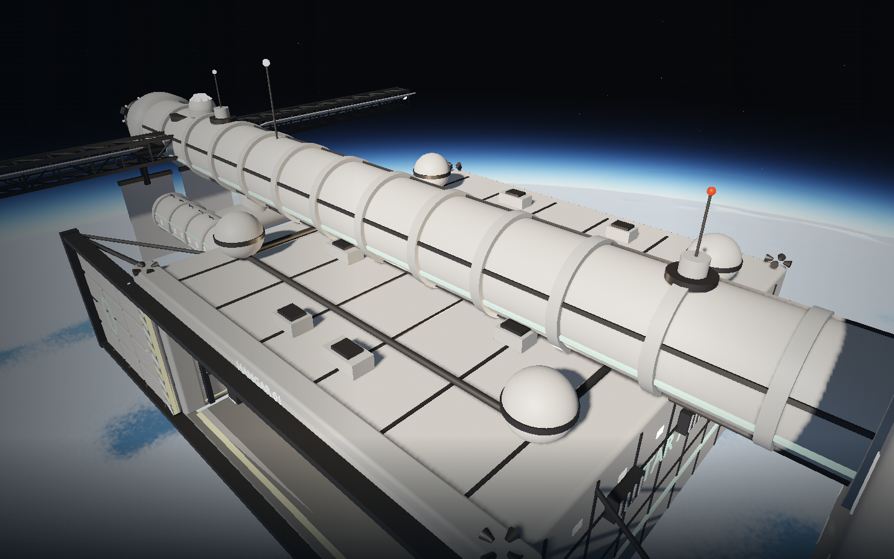
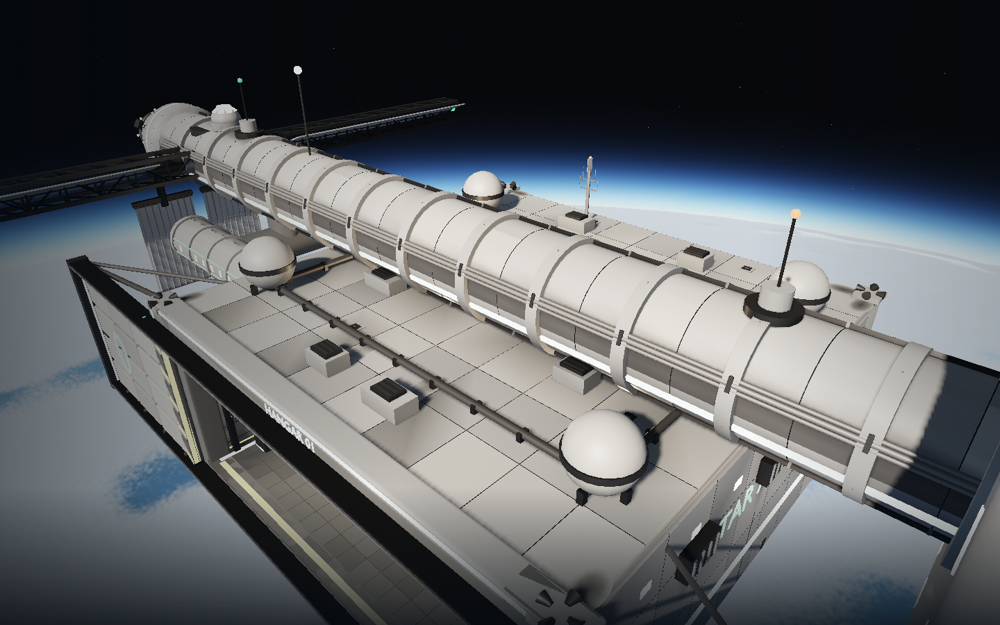
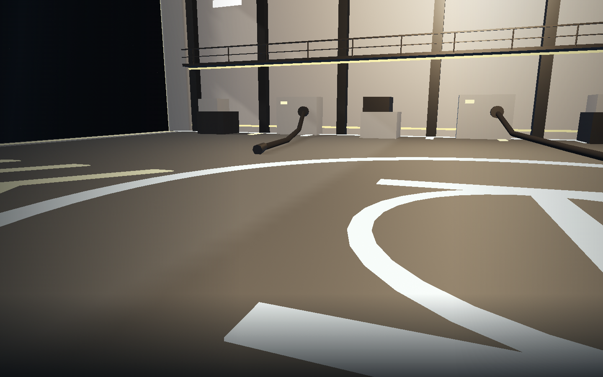
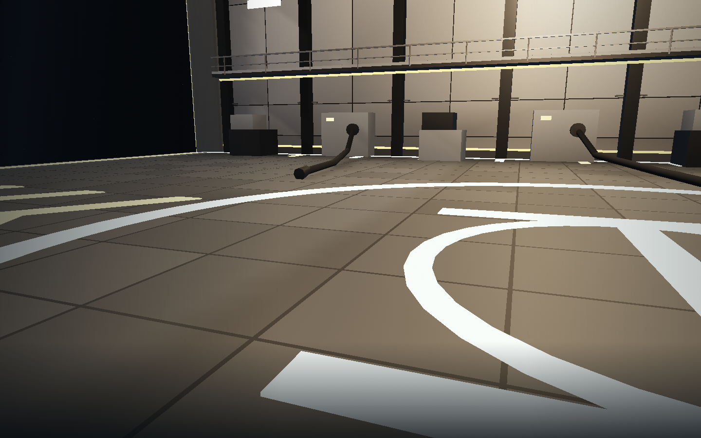
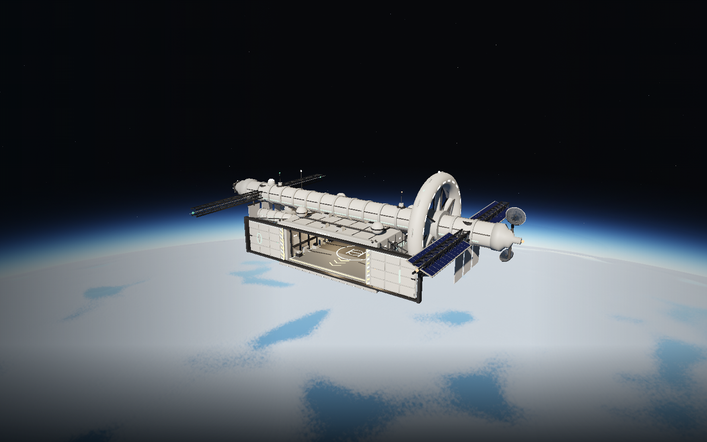
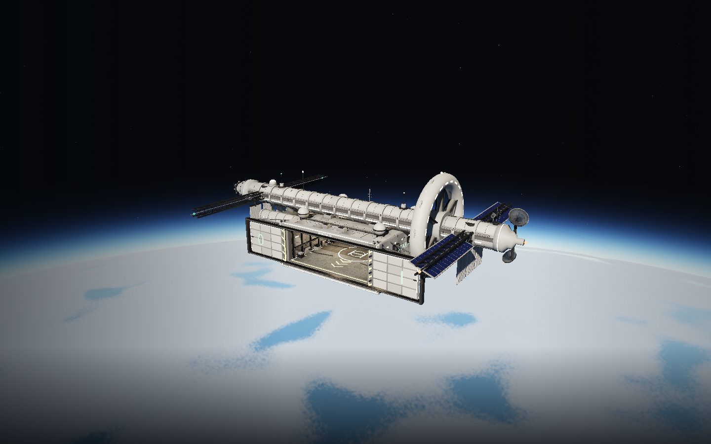

# Station hull renderer review — 2026-09-06

**Functional checks passed; independent Opus visual review pending.** The review
attempt returned HTTP 429 with a session-limit reset at 13:50 Europe/Amsterdam.
No rubric score, merge approval or deployment is claimed. This is the recovered
Fable hull slice; the parallel hangar finish remains a separate branch.

## Checks actually run

- Hero rebuilt with Blender 5.2, Cycles CPU AO, 24 samples. Its local extension
  startup emitted a missing-`cattrs` traceback; mesh creation, bake and GLB export
  completed, and the exported asset loaded successfully in Three.js/Chromium.
- `npm test`: **124/124** passed, including the revised plate/seam/hull-clearance
  regression and existing station, navigation and physical boarding contracts.
- `npm run build`: passed; existing Vite bundle-size advisory remains.
- `npm run test:browser -- -c scripts/hull.config.js`: **4/4** passed in 6.3 minutes.
  This covers cinematic input handoff, controller boot, physical ramp boarding
  and launch, moving-camera floor clearance at render scales 1 and .55, and a
  complete fly-in/dock/deck walk/reboard/launch/depart journey plus phone controls.
- Both model versions captured through the same production renderer and camera
  fixtures. Six world viewpoints captured separately; all captures have **zero
  page errors, console errors or console warnings**. No custom shader was added.

Evidence: [before](before/evidence.json), [after](after/evidence.json),
[world tour](tour/evidence.json). Environment: Chromium **151.0.7922.173**, ANGLE
Vulkan **SwiftShader**, **1440×900**, render scale **1**, seed **7291**. These are
software-rendered images and resource counts, not laptop GPU/FPS certification.

## Before and after

| Integration model | Recovered detail model |
|---|---|
|  |  |
|  |  |
|  |  |

[Opening with human and ship scale](after/hangar-opening.png).
[Moving floor: start](floor-1-0.png) / [end](floor-1-7.png).
The start/end floor images remain clear of the previous dense overlapping-floor
speckle. Small distant seams and silhouette edges still alias. New recessed roof
panels, clamps and vent wear are visible; the bay still contains the integration
branch's plain service props and bright painted markings.

## Renderer cost

| View | Before draws / triangles | After draws / triangles |
|---|---:|---:|
| Exterior | 238 / 166,598 | 299 / 199,390 |
| Roof | 249 / 173,534 | 309 / 205,890 |
| Approach | 222 / 157,070 | 284 / 190,310 |
| Deck | 235 / 161,150 | 290 / 198,398 |
| Opening | 302 / 284,264 | 356 / 317,000 |

The new hull fits the hangar budget of 600 draws / 900k triangles at these
fixtures. Software RAF cadence was approximately 797–1,650 ms per frame during
the detailed hull capture, with other browser work running concurrently. This
cannot establish the 10 ms hardware GPU budget. Asset/collision costs and
multi-pod integration notes are in [the implementation record](../../station-hull-detail.md).

## World tour and remaining review items

[Orbit](tour/orbit.png), [coast 95 m](tour/coast.png),
[forest 95 m](tour/forest.png), [highlands 700 m](tour/highlands.png),
[hangar after the reveal](tour/hangar-opening.png), [cockpit](tour/cockpit.png).

1. Independent Opus review remains required by `QUALITY.md` before merge.
2. Roof AO creates broad gradients on some large plates. Assess their strength
   and combined exposure when the other branch's material/light decorators land.
3. Fine panel edges still alias at distance. No antialiasing or global shadow
   overhaul is included in this asset recovery.
4. The unchanged orbit fixture is 477 draws / 304,642 triangles, above the 300-draw
   orbit budget (the preceding map tour recorded the same counts). Terrain/cloud
   faceting, the mostly flat land-facing coast fixture, and abrupt forest LOD
   differences remain visible. This branch does not resolve those world defects.
5. The model has not been validated as twenty decorated pods together. Share
   geometry/materials, preserve vertex colours on grouped parts, and review the
   increased collision data before integration with the station complex.

The tour cockpit is a reproducible seated camera fixture, not evidence of
boarding by itself. Physical boarding is exercised separately by the four
passing browser cases above. No generated Playwright report or build output is
included here; the images and metadata are the curated visual review evidence.
